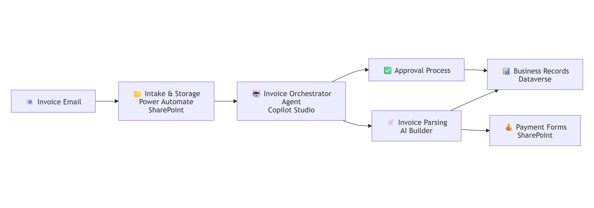

# Autonomous Invoice Orchestration Agent - Overview

## Scenario Overview

| Property | Value |
|----------|-------|
| **Scenario Type** | Invoice Orchestration|
| **Agent Type** | Autonomous |
| **Primary Tools** | Copilot Studio, Dynamics 365 F&O, Power Automate, Outlook, Sharepoint |
| **LLM** | Claude Sonnet 4.6 |
| **Complexity** | Intermediate |
| **Status** | Draft |

## Problem Statement
Many companies currently rely on a largely manual process to receive invoices by email, review invoice details, prepare payment request forms, and route them for approval. This approach can be time-consuming, error-prone, and difficult to scale, especially when invoice data must be re-entered across systems and validated before payment. Delays in extracting invoice information, generating payment forms, and identifying the correct approver can slow processing and increase operational overhead. This agent addresses this problem by testing whether a Copilot Studio-based agent and supporting flows can automate invoice intake, extract structured data using AI, generate a pre-filled payment request form, and support a human-in-the-loop approval process before final submission. 

## Solution Summary
The Invoice Automation Solution is a Copilot Studio–based agent designed to streamline the end-to-end lifecycle of invoice processing. At its core, the Invoice Orchestrator Agent coordinates a series of integrated flows to ingest invoice emails, store supporting attachments, extract structured data using AI, generate pre-populated payment request forms, and route submissions through a human approval workflow.

## How It Works

This agent acts as an invoice orchestration solution built in Copilot Studio that automates the flow from invoice intake to approval. It monitors incoming invoice emails, saves the invoice attachment to SharePoint, and records the file link in Dataverse. From there, a parsing flow uses AI to extract invoice details into structured JSON, which is then used to generate a pre-filled payment request form. Before anything is finalized, the process includes a human-in-the-loop approval step, where the sender’s manager reviews and approves the request. Once approved, the system updates the transaction record in Dataverse and notifies the appropriate payments or accounts team. In short, the agent coordinates multiple child flows to reduce manual handling, improve consistency, and keep invoice processing traceable end to end.
The solution leverages Dataverse to manage structured invoice data, while SharePoint serves as the centralized repository for invoice documents and generated artifacts, ensuring traceability and auditability. By combining intelligent data extraction, document generation, and workflow orchestration, the solution reduces manual effort and accelerates processing times, while maintaining human oversight for final validation and decision-making.

## Business Outcomes – Invoice Orchestration Agent

| **Outcome** | **Description** |
|------------|-----------------|
| ✅ Reduced Manual Invoice Processing Effort | Automates ingestion of invoice emails, extraction of invoice data, and form generation, minimizing manual data entry and handling. |
| ⚡ Faster Invoice-to-Approval Cycle | Accelerates the end-to-end workflow—from invoice receipt to payment request creation and approval—through orchestrated automation flows. |
| 🤖 Intelligent Data Extraction | Uses AI/LLM-based parsing to convert unstructured invoice documents into structured JSON data for downstream processing. |
| 📄 Automated Payment Form Generation | Generates pre-filled payment request forms from extracted data, reducing errors and improving consistency in submission formats. |
| 👤 Human-in-the-Loop Control | Maintains governance by routing payment requests through manager approval workflows before final submission. |
| 🔗 End-to-End Traceability | Stores invoice files, generated forms, and processing metadata (including approvals) across SharePoint and Dataverse for audit and tracking. |
| 📊 Centralized Data Management | Consolidates transactional data, approval status, and document references in structured Dataverse tables for reporting and extensibility. |
| 🔄 Orchestrated Workflow Automation | Uses a Copilot Studio agent to coordinate multiple child flows (intake, parsing, form generation, approval), enabling scalable process automation. |

## Target Users

| **User Group** | **Description** |
|---------------|-----------------|
| 📩 Invoice Submitters (Employees / Vendors) | Send invoices via email, triggering the automated intake and processing workflow. |
| 👩‍💼 Managers / Approvers | Review generated payment requests and provide approval or rejection within the human-in-the-loop workflow. |
| 💰 Accounts Payable / Finance Team | Receive approved payment requests and proceed with downstream payment processing activities. |
| 🛠️ System Administrators / Power Platform Engineers | Configure, maintain, and monitor the Copilot agent, child flows, Dataverse tables, and integrations. |
| 📊 Finance Operations / Reporting Team | Access structured invoice and approval data stored in Dataverse for reporting, auditing, and analysis. |
| 🧪 Solution Owners / Business Stakeholders | Evaluate PoC outcomes, validate feasibility, and guide the transition to a production-grade implementation. |

### ✅ In Scope
- An autonomous Copilot agent that orchestrates multiple child flows to enable end-to-end invoice processing.
- Automatically retrieves invoice attachments from email, stores them in SharePoint, and logs document references in Dataverse.  
- Uses an LLM to extract and structure invoice data into JSON format, which is persisted in Dataverse for downstream processing.  
- Generates a pre-populated HTML payment request form from the extracted invoice data and stores it in SharePoint.  
- Enables human-in-the-loop approval by routing requests to managers, capturing approval status, and notifying the payments team via email.  
- Maintains comprehensive transaction records, including invoice data, approval details, and links to supporting documents across SharePoint and Dataverse.  
- Leverages a reference table containing GL codes and cost centers to enrich line-item details prior to payment form generation.  

### ❌ Out of Scope
- Embedding the Copilot agent into a portal experience
- Production deployment and enterprise-grade monitoring capabilities  
- SLA-backed uptime and reliability guarantees  
- Enhanced UI/UX design and user experience improvements  

## Related Resources

| Resource | Link |
|----------|------|
| **Architecture** | [2.Architecture.md](2.Architecture.md) |
| **Step-by-Step Runbook** | [3.Runbook.md](3.Runbook.md) | |
| **Sample Prompts** | [4.Sample-prompts.md](4.Sample-prompts.md) |
| **Copilot Studio Documentation** | [Microsoft Learn](https://learn.microsoft.com/en-us/copilot) |
| **Application Insights Documentation** | [Microsoft Learn](https://learn.microsoft.com/en-us/troubleshoot/azure/azure-monitor/welcome-azure-monitor) |
