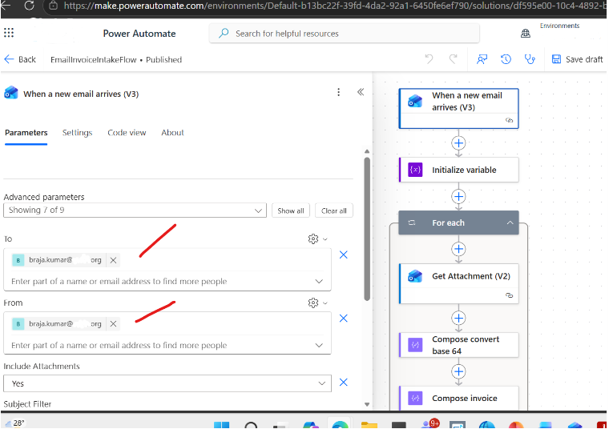
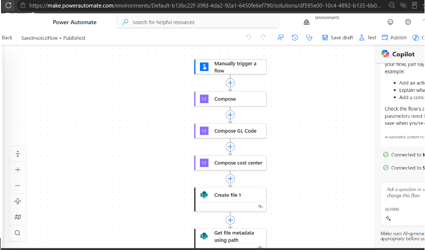
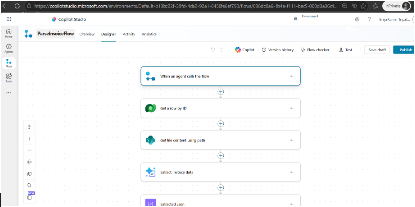
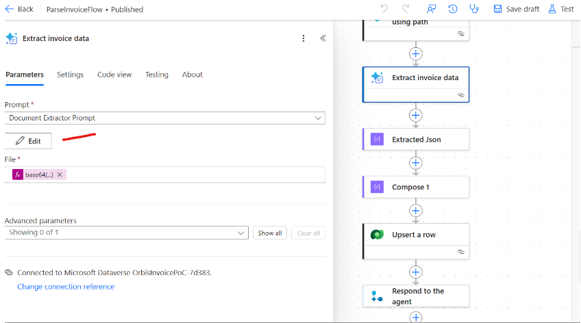
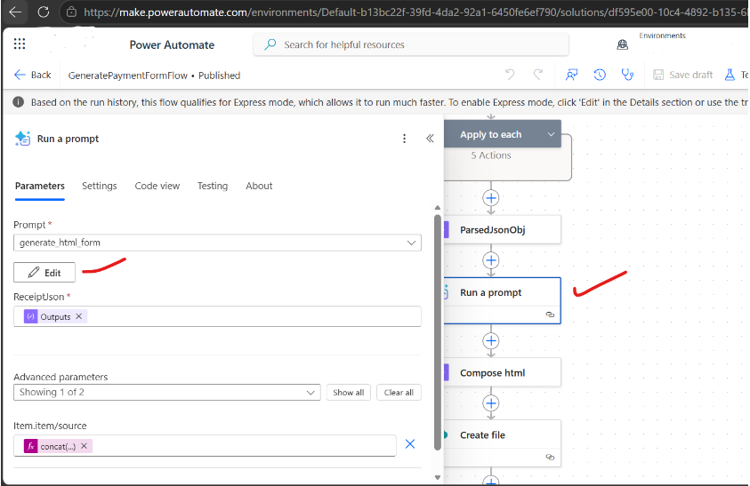
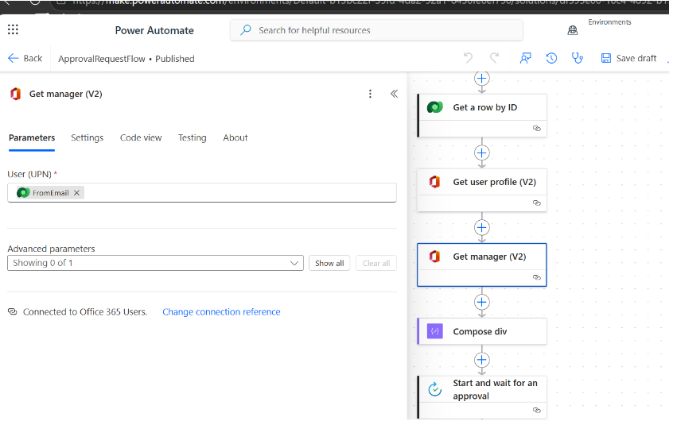
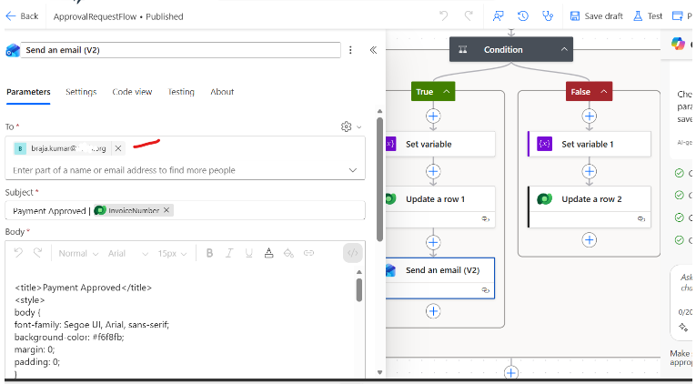
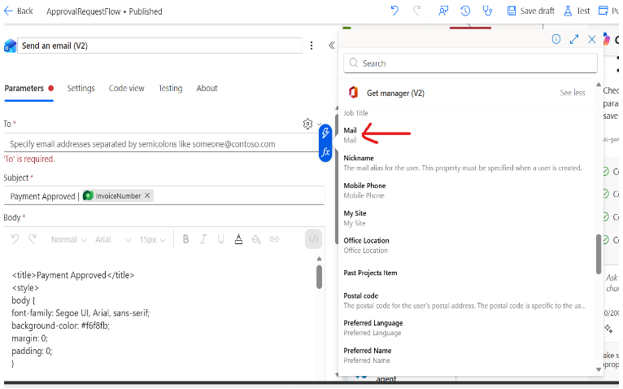

# Step-by-Step Guide — Autonomous Invoice Orchestration Agent

> **Scenario**:  Invoice Processing and Approval <br>
> **Platform**: Microsoft Copilot Studio, Power Platform  
> **Target Readers**: Delivery engineer  
> **Last Updated**: June 16, 2026

---

## Overview
This agent helps users by taking a manual, email-based invoice process and turning it into a faster, more structured workflow. It automatically picks up invoice attachments from email, extracts the key invoice details using AI, generates a pre-filled payment request form, and routes it for manager approval. This reduces repetitive manual work, improves consistency, and helps users move invoices through review and payment more efficiently while still keeping a human in the loop for final approval.

 | Location | Portal URL | Task |
|---|---|---|
| Power Platform admin center | https://admin.powerplatform.microsoft.com | Manage tenant settings and your Dynamics 365 and Dataverse environments |
| Copilot Studio | https://copilotstudio.microsoft.com | Customize, test, and publish the agent |
| Microsoft 365 admin center | https://admin.microsoft.com | Manage user license assignments and settings |

---

## Prerequisites

Before starting, confirm the following are in place.

### Core Environment Requirements

| Requirement                | Description                                                                                                                  |
| -------------------------- | ---------------------------------------------------------------------------------------------------------------------------- |
| Allowed MCP clients        | **Copilot Studio** registered under **System Administration → Setup → Allowed MCP clients**                                  |
| Power Platform environment | A Power Platform environment (same tenant as F&O) available to host the Copilot Studio agent                                 |
| Anthropic models           | Anthropic Claude Sonnet 4.6 enabled in the tenant via Power Platform Admin Center                                            |


### License Requirements

**Administrator and Author License Requirements**

   | Requirement | Description |
   |---|---|
   | Dynamics 365 or Power Platform License | A license for the platform you are monitoring is required so you can configure telemetry export. |
   | Copilot Studio User License | Anyone who builds, edits, or publishes agents must have this license. More information on Copilot Studio licensing can be found here:  <br> <https://learn.microsoft.com/en-us/microsoft-copilot-studio/billing-licensing> |

**End-user License Requirements** 
Users interacting with the agent need access to wherever the agent is published (Microsoft 365 Copilot, Teams etc.)

   | Requirement | Description |
   |---|---|
   | Microsoft 365 license | Microsoft 365 license (E3/E5 etc.) is required if the agent is published to Teams |
   | Microsoft 365 Copilot license | Microsoft 365 Copilot license is required if the agent is published to Microsoft 365 Copilot |

### Access and Permissions

   | Requirement | Description |
   |---|---|
   | Dataverse and Dynamics 365 environments | User account with the **Power Platform Administrator** role or **Dynamics 365 Administrator** role assigned in the Microsoft 365 admin center is required so you can manage your Dataverse and Dynamics 365 environments. |
   | Telemetry source platform | Admin role required to configure telemetry export varies by platform.  |
   | Azure subscription | User account with the **Owner** or **Contributor** role on an Azure subscription so you can create and manage the Application Insights instance and storage account. |
   | Microsoft 365 admin center | User account with the ability to adjust settings in the Microsoft 365 admin center. |


# Step by step Instructions
Go to Copilot Studios and create a new "blank" agent. Do the following:
1) Set the model to "Claude Sonnet 4.6"
2) Add the following instructions to your agent:

## Configuring your Power Automate Flows

3) Go to the "Tools" tab, you will need to configure 5 power automate flows in this section: the invoice intake flow, the invoice saving flow, the invoice parser flow, the payment request generator flow, and the payment request approval flow. 

4) Configure the email intake flow as seen below, be sure to use the email address you want invoices to be sent to:
    

5) Please see the configuration for the save invoice flow:
   
   

6) Please see the configuration for the flow to parse the invoices below. For the "Document Extraction Prompt" that is inserted into this flow, you will need to create a prompt in your Tool tab with the following instructions and a GPT 4.1 model:

``` Extract the relevant information from the requirements:
   - Return only valid JSON.
   - Return only the content of extractedData if extractedData is present.
   - Do not include explanations, markdown, comments, or additional text.
   - Remove all currency symbols from numeric values.
   - Keep numeric values as plain numbers or numberic stings.
   - Do not output nested objects.
   - Any tables must be returned as an array of objects.
   - JSON attribute names must contain only alphanumeric characters.
   ```
   
   


7) For the flow to generate the payment form you will to create a prompt in the Tools tab with the following instructions, this prompt will use GPT 4.1 as it's model:

```
You are a senior frontend engineer and an award-winning UX/UI designer.
Convert the following invoice JSON in to a BEAUTIFUL, MODERN, RESPONSIVE HTML payment form page using:
- Pure HTML 5
- Modern CSS3
- Optional lightweight Javascript only if needed
- No frameworks

Design Requirements:
- Professional Apple Style Clean UI
- Elegant typography
```

Configure the prompt to your flow as seen below:
 

8) Configure the flow  to get the manager of the requestor's email address 



9) Send an email action with condition to configure the manager id


10) Click on settings-> Dynamic Content à Get Manager V2, email 


## Channels
This agent is autonomous and can be triggered by an email coming into the designated inbox but you can also involve specific individual pieces of the entire agent flow via copilot studios


### Related Resources

| Resource | Link |
|---|---|
| Overview | [1.Overview.md](/1.Overview.md) |
| Architecture | [2.Architecture.md](/2.Architecture.md) |
| Sample Prompts | [4.Sample-prompts.md](/4.Sample-prompts.md) |
| Copilot Studio | https://copilotstudio.microsoft.com |
| Power Platform Admin Center | https://admin.powerplatform.microsoft.com |
| Microsoft 365 Admin Center | https://admin.microsoft.com |

