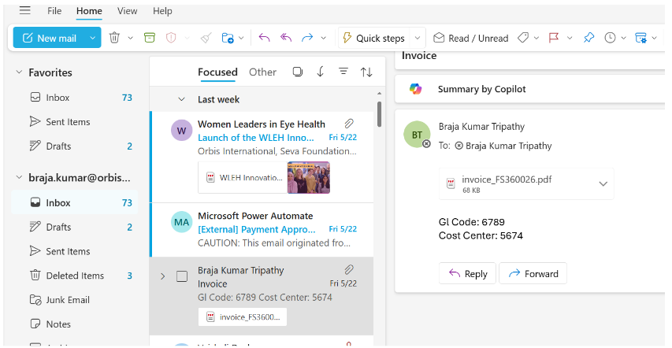
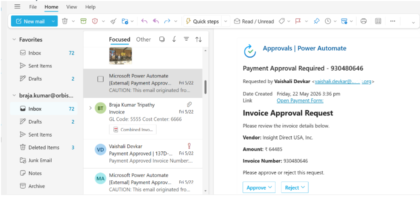
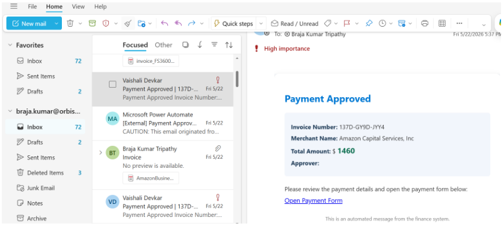
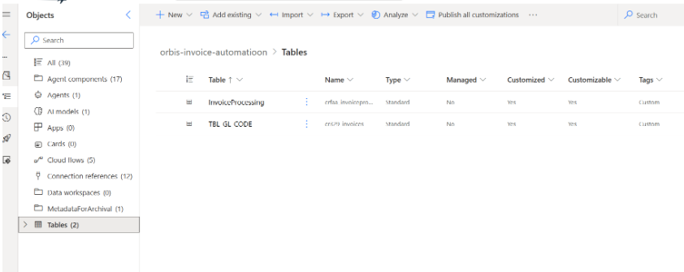
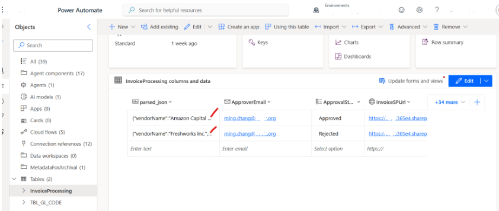

# Sample Prompts
> use the [Sample Invoice Document](0.Resources/Sample_Invoice.pdf) to explore the following functionality of the autonomous invoice orchestration agent

| User Goal | Sample Prompt | What the Agent Does |
|-----------|---------------|---------------------|
| Start invoice processing | Please process the invoice I sent by email and create the payment request form. | The agent retrieves the invoice attachment, saves it to SharePoint, extracts invoice details, and generates a payment request form. |
| Process an invoice with accounting details | Please process this invoice and use GL Code \<GL code\> and Cost Center \<Cost Center\> for the payment form. | The agent applies the provided GL code and cost center while preparing the generated payment form. |
| Create only the payment form | Generate the payment request form from the extracted invoice details. | The agent uses the extracted invoice data to create the payment request form and stores the form output. |
| Send for approval | Send this payment request for manager approval. | The agent starts the human-in-the-loop approval process and routes the payment request to the appropriate manager. |
| Check invoice status | Can you check the status of my latest invoice request? | The agent helps identify where the invoice is in the process, such as intake, extraction, payment form generation, or approval. |
| Review extracted invoice details | Show me the key details extracted from the latest invoice. | The agent summarizes available invoice details such as vendor, invoice number, invoice date, due date, amount, and line items. |
| Ask what to do next | What information do you need from me to process this invoice? | The agent guides the user on required inputs, such as providing the invoice attachment and optionally supplying GL code and cost center information. |
| Confirm approval outcome | Has the payment request been approved? | The agent helps confirm whether the approval status has been captured and whether the payments team notification has been sent. |

## Example Interactions
In this interaction, a user asks the agent to process an invoice that has already been sent via email. As you can see the agent finds the invoice, creates the payment request form and sends the form to the user's manager for payment approval.

User:  
Hi Invoice Orchestrator, please process the invoice I emailed today and create the payment request form. Use GL Code 6100 and Cost Center CC-204.  
Agent: 
I found the invoice attachment from your email and saved it to SharePoint. I extracted the invoice details, including vendor name, invoice number, invoice date, due date, total amount, and line items.
I also applied GL Code 6100 and Cost Center CC-204 to the payment request form.
The payment request form has been generated and is ready for manager approval. Would you like me to send it for approval now?  
User: 
Yes, send it for approval. 
Agent: 
The payment request has been routed to the appropriate manager for review and approval. I will capture the approval status and notify the payments team once a decision is made.

## Outputs
These are the expected outputs of the flows:

Sent an email with an attachment of receipt  

The approval request will look like this in the manager's inbox:

The approved request back in the user's inbox

The entry into the dataverse

All of the transaction data will be accessible via the Sharepoint

## Related Resources

| Resource | Link |
|---|---|
| Scenario Overview | [1.Overview.md](/1.Overview.md) |
| Architecture | [2.Architecture.md](/2.Architecture.md) |
| Step-by-Step Runbook | [3.Runbook.md](/3.Runbook.md) |
