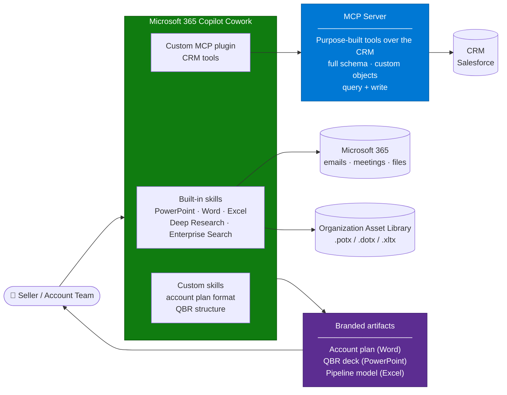

# CRM Account Planning Cowork Agent — Overview

## Scenario Overview

**Scenario Type**: Sales Productivity / Revenue Operations
**Agent Type**: Microsoft 365 Copilot Cowork with a custom MCP plugin
**Primary Tools**: Copilot Cowork, MCP server fronting Salesforce, Organization Asset Library templates
**Complexity**: Advanced
**Status**: ✅ Available

Sellers and account teams spend hours every quarter assembling the same artifacts: an account
plan, a QBR deck, a pipeline review, an executive summary of a territory. The raw material is
all in the CRM. The work is retrieval, synthesis, and formatting — and it is done by hand,
repeatedly, by expensive people.

This scenario connects Copilot Cowork to the CRM through a purpose-built **MCP server**, and
lets Cowork produce the finished Office artifact: a branded PowerPoint deck, a Word account
plan, an Excel pipeline model.

The pattern has been delivered for a cybersecurity software vendor and a healthcare technology
provider, and the shape is the same both times. It is recurring because the alternative —
out-of-the-box CRM connectors — is not deep enough for real sales work.

---

## Problem Statement

### Why the out-of-the-box connector is not enough

The first attempt on this scenario is almost always a standard CRM connector or a first-party
sales agent. It reliably fails for enterprise CRM estates, for four specific reasons observed
across a year of testing at one customer:

| Limitation | Consequence |
|---|---|
| Only basic standard fields are exposed (name, email, phone) | Everything that makes the CRM *theirs* is invisible |
| No access to custom objects or custom fields | Enterprise CRMs are mostly custom objects. This is disqualifying |
| No ability to fully query or aggregate records | Cannot compose a complete account or pipeline context |
| No write capability | Cannot update an opportunity, log a next step, or push a plan back |

The result is an integration that demos well and cannot support a single real sales workflow.
Account planning, deal tracking, and pipeline management all need the full schema and, usually,
write access.

### And the artifact problem

Even with perfect data, the output has to be a document someone can send. Sales artifacts are
brand-governed: approved templates, approved fonts, approved logos. A beautifully reasoned deck
in the wrong theme gets rebuilt by hand, and the time saving evaporates.

---

## Solution Summary

Three components, each doing one job:

| Component | Responsibility |
|---|---|
| **MCP server** | Exposes the CRM as a small set of well-described, task-shaped tools. Owns the schema knowledge, the query composition, and the write operations |
| **Cowork** | Orchestrates: calls the tools, pulls in Microsoft 365 context (meetings, emails, files), reasons over it, and produces the artifact |
| **Custom skills + OAL templates** | Define what an account plan or QBR deck looks like at this organization, and enforce the branding |

The important design decision is that **the MCP server is not a generic CRM API wrapper**. It
exposes tools shaped like the questions sellers actually ask — `get_account_360`,
`get_pipeline_for_territory`, `get_opportunity_history` — not `soql_query`. This matters for
both quality and cost, and the reasons are in [2.Architecture.md](2.Architecture.md).

---

## Key Capabilities

| Capability | Description |
|---|---|
| 📋 Account 360 | Pulls the full account picture — including custom objects — into one context |
| 📊 Pipeline synthesis | Aggregates opportunities across a territory, segment, or rep |
| 🗂️ Cross-source context | Combines CRM data with meeting notes, emails, and documents from Microsoft 365 |
| 📑 Branded artifact generation | Produces PowerPoint, Word, and Excel outputs using the organization's approved templates |
| ✍️ Write-back (optional) | Updates opportunities, logs next steps, or writes the plan summary back to the CRM |
| ⏰ Scheduled and event-driven runs | Weekly pipeline digest, or an account plan refresh triggered by a stage change |
| ✅ Human approval gates | Cowork pauses before sending, posting, or writing anything back |

---

## Business Outcomes

| Outcome | Description |
|---|---|
| ⏱️ Hours back per seller per quarter | Account plans and QBR decks stop being a manual assembly job |
| 📐 Consistent artifacts | Every account plan follows the same structure and the same brand |
| 🔗 Context sellers never had time to gather | Meeting history and email threads folded into the plan automatically |
| 📈 Better CRM hygiene | When the agent can write back, next steps and notes actually get logged |
| 🎯 A concrete Copilot use case for the revenue org | Sales leadership can see the value without a philosophical discussion |

---

## In Scope / Out of Scope

### ✅ In Scope

- MCP server design and deployment fronting the CRM
- Cowork plugin registration and admin deployment
- Custom skills defining account plan and QBR structure
- Organization Asset Library template preparation for brand compliance
- Approval gates for write and send actions
- Evaluation across a representative set of accounts

### ❌ Out of Scope

- Replacing the CRM's own reporting and dashboards
- Forecast calculation or any number the finance team must certify — the agent synthesises,
  it does not become a system of record
- Bulk data migration into Microsoft 365
- Customer-facing (external) delivery of generated artifacts without human review

---

## Target Users

| Persona | Role in This Scenario |
|---|---|
| **Account Executive / Seller** | Primary user — asks for the plan, the deck, the pipeline view |
| **Sales Manager** | Territory and team-level pipeline synthesis |
| **Revenue Operations** | Owns the CRM schema, decides what the MCP server exposes |
| **Brand / Communications** | Owns the templates in the Organization Asset Library |
| **M365 Admin** | Deploys the plugin org-wide, manages Cowork availability and spend |
| **Delivery Engineer** | Builds the MCP server, designs the tools, writes the skills |

---

## Qualification Checklist

Every item below has materially changed the shape of a delivery.

| Question | Why it matters |
|---|---|
| Is Cowork available and licensed for the target users? | Cowork consumption is billed separately from the Microsoft 365 Copilot licence. Broad enablement has a cost conversation attached |
| Who builds and hosts the MCP server? | It is a real service with a real lifecycle. Someone owns it after go-live |
| Read-only or read-write? | Write access changes the security review, the approval design, and the testing burden entirely |
| How does the CRM authenticate users? | Per-user identity is the hard part. See the authentication section in [2.Architecture.md](2.Architecture.md) |
| Do approved Office templates exist, and are they in an Organization Asset Library? | If not, add template preparation to the plan — it is a workstream, not a step |
| How many tools will the plugin expose? | Response quality degrades past roughly 10 tools. Tool design is a real design activity |
| Is the organization in a competitive evaluation? | Common on this scenario. Changes the pilot into a measurable comparison |
| What is the compliance position on agent-generated artifacts? | Autonomous document creation and sending is discoverable data. Involve compliance early |

---

## What Actually Goes Wrong

| Symptom | Root cause | Where it is handled |
|---|---|---|
| Agent returns shallow or incomplete CRM data | Standard connector rather than a purpose-built MCP server | [2.Architecture.md](2.Architecture.md) — why MCP |
| Tool calls partially complete; unclear which step failed | Multi-step tool orchestration with weak error surfacing | [3.Runbook.md](3.Runbook.md) — Phase 3 |
| Wrong tool selected, or tools ignored | Too many tools, or descriptions that do not differentiate | Phase 2, tool design |
| Deck generated without the corporate template | Template not in the Organization Asset Library, or an entry point / model that bypasses it | [Branded Office Artifact Generation](../../02-patterns/Branded-Office-Artifact-Generation/Branded-Office-Artifact-Generation.md) |
| Actions execute as a service identity, not the seller | Identity passthrough not designed for | Phase 1, authentication |
| Session failures and instability during the pilot | Platform maturity in early-access programmes | Phase 4 — pilot design |
| Generated artifacts fall outside data classification | Some output formats are not covered by sensitivity labelling | Phase 5 — compliance |

---

## Related Patterns

- [MCP Server Integration for Copilot](../../02-patterns/MCP-Server-Integration/MCP-Server-Integration.md) — how to design, secure, and operate the MCP server
- [Branded Office Artifact Generation](../../02-patterns/Branded-Office-Artifact-Generation/Branded-Office-Artifact-Generation.md) — getting the output on-brand and reviewable
- [Agent Governance & Rollout Control Plane](../../02-patterns/Agent-Governance-and-Rollout-Control-Plane/Agent-Governance-and-Rollout-Control-Plane.md)
- [Copilot Credits & Cost Control](../../02-patterns/Copilot-Credits-Cost-Control/Copilot-Credits-Cost-Control.md)

---

## Next

→ [2.Architecture.md](2.Architecture.md)
