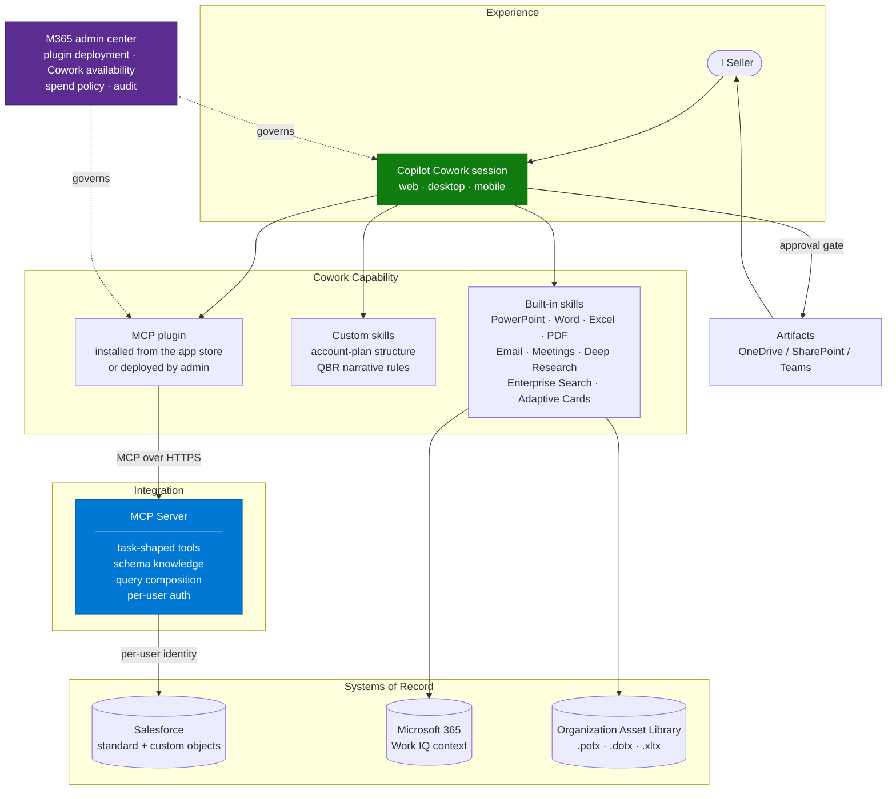

# Architecture — CRM Account Planning Cowork Agent

> **Platform**: Microsoft 365 Copilot Cowork · MCP server · Organization Asset Library
> **Last Updated**: August 2026

---

## Solution Architecture

---

## Why MCP and Not a Connector

There are three ways to get CRM data into a Copilot experience. They are not interchangeable.

| Approach | What you get | Where it breaks for this scenario |
|---|---|---|
| **Copilot connector (synced)** | CRM records indexed into Microsoft Graph, searchable, permission-trimmed | Read-only, index-based, and limited to what the connector schema exposes. No aggregation, no write |
| **Power Platform connector** | Operations against the CRM inside a Copilot Studio agent | Works, but constrains you to Copilot Studio, and standard-object coverage is often the gap |
| **MCP server** | Whatever you choose to expose, as tools, with your own auth and your own query composition | You have to build and operate it |

For enterprise account planning, MCP wins for a specific reason: **the value is in the custom
objects**. A CRM that has been in place for a decade has custom objects for renewals, product
usage, security posture, health scores, and the account team's own planning fields. If the
integration cannot reach those, it cannot produce an account plan anyone would use.

The trade-off is real: an MCP server is a service you own, deploy, monitor, patch, and secure.
Do not choose it because it is fashionable. Choose it when the connector demonstrably cannot
carry the scenario — and be able to show which of the four limitations in
[1.Overview.md](1.Overview.md) applies.

---

## Tool Design — The Highest-Leverage Decision

The instinct is to expose the CRM API. Resist it. Design tools shaped like the work.

### Do this

| Tool | Returns |
|---|---|
| `get_account_360` | One account: firmographics, open opportunities, renewal dates, product usage, key contacts, recent activity — assembled server-side |
| `get_pipeline` | Opportunities for a territory, segment, or owner, with stage, value, close date, and risk fields |
| `get_opportunity_detail` | One opportunity with its full history and custom fields |
| `get_account_relationships` | Parent/child accounts, partners, competitive displacements |
| `update_opportunity_next_step` | A single, narrow write |

### Not this

| Anti-pattern | Why it fails |
|---|---|
| `run_soql_query(query)` | Pushes schema knowledge into the model. It will write wrong queries, confidently |
| One tool per CRM object (40+ tools) | Tool selection degrades and the token budget disappears |
| `get_everything_about(account)` returning raw JSON | Blows the token window; the useful fields get truncated |
| Generic `crud(object, operation, payload)` | Impossible to describe, impossible to govern, impossible to audit |

### Hard constraints to design within

These come from how Copilot handles plugins, and they are not negotiable:

- A declarative agent with **up to five plugins** injects all of them into the prompt. Beyond
  five, plugin selection uses **semantic matching on the plugin description** — not on the
  individual tools. Your plugin description is doing real work; write it carefully.
- **All tools of a matched plugin are returned**, even when one matched. Response quality
  degrades beyond roughly **10 tools**.
- The **token window truncates large content** in both directions. Return summarised,
  field-selected payloads, not raw records.

Practical rule: **aim for 5–8 tools, each returning a shaped, bounded payload.** If you need
more surface than that, split into a second plugin along a clean domain boundary, or do more
composition server-side.

---

## Dynamic Tool Discovery

MCP plugins resolve the server's tools **dynamically at runtime** by default. Two consequences:

- **Good:** you can ship a new tool without repackaging and republishing the agent.
- **Careful:** a change on your server changes agent behaviour immediately, with no
  release gate. Treat MCP server deployments as production changes to the agent, and re-run the
  evaluation set after each one.

You can pin a fixed tool set in the plugin manifest instead. Pin when the agent is in a
regulated workflow or when you need a change-control boundary; keep dynamic discovery when
iteration speed matters more.

---

## Authentication and Identity

This is the part that most often forces a redesign late. Decide it first.

| Requirement | Implication |
|---|---|
| CRM record visibility must follow the seller's own CRM permissions | You need per-user identity at the CRM, not a service account |
| Writes must be attributable to the seller in the CRM audit trail | Same |
| Users should not re-authenticate constantly | Token caching and refresh design on the MCP server |

The pattern to aim for is: user authenticates once to the MCP server via OAuth, the server
exchanges for a CRM token scoped to that user, and every tool call runs under it.

Known friction to design around rather than discover:

- **Identity passthrough is not guaranteed end to end.** When agents are surfaced through
  Microsoft 365 Copilot and Teams, the user's OAuth token is not always propagated to the
  downstream service; the MCP server can end up seeing only a managed identity. Validate the
  exact identity your MCP server receives, in the exact surface you will publish to, before
  building on the assumption.
- **MCP protocol version matters for authentication.** Newer three-legged OAuth flows and URL
  elicitation depend on later protocol revisions than some hosts implement. Confirm the
  protocol version the host supports against what your server and any gateway require. Version
  mismatch presents as an authentication failure, not as a version error, which makes it
  expensive to diagnose.
- **Gateways add a version and a hop.** MCP gateway products in front of your servers are a
  reasonable pattern for a portfolio of integrations, but they add their own protocol-version
  and auth-flow constraints. Prototype the full chain, not just your server.

Fallback if per-user identity cannot be achieved in the project window: run read-only under a
scoped service identity, restrict the plugin audience to a group whose CRM access is uniform,
and defer write-back. Document it as a deliberate limitation.

---

## Cowork Capability Model

Cowork brings capabilities you do not have to build. Use them.

| Cowork capability | Use in this scenario |
|---|---|
| **PowerPoint / Word / Excel / PDF skills** | Produce the artifact. You are not writing OOXML |
| **Enterprise Search** | Pull related documents from SharePoint and OneDrive into the plan |
| **Deep Research** | Multi-source synthesis for the account narrative |
| **Meetings and Email** | Fold recent customer interactions into the account context |
| **Custom skills** | Encode *your* account plan structure. Up to 50; discovered at the start of each session |
| **Scheduled prompts** | Weekly pipeline digest without anyone asking for it |
| **Event-driven tasks** | Refresh a plan when something changes |
| **Approval gates** | Cowork pauses before sending, posting, or other medium/high-risk actions |

**Custom skills are where the organization's opinion lives.** The MCP server says what the data
is; the custom skill says what an account plan *is here* — sections, order, tone, what belongs
on slide one, what is never included.

---

## Artifact and Branding Path

The generated artifact must land on-brand or the time saving is lost to rework.

| Element | Where it comes from |
|---|---|
| PowerPoint template | `.potx` in an Organization Asset Library designated as `OfficeTemplateLibrary` |
| Word template | `.dotx`, same library |
| Excel template | `.xltx`, same library |
| Approved imagery and logos | An Organization Asset Library designated as `ImageDocumentLibrary` |

Constraints worth knowing before you promise brand compliance:

- All organization asset libraries must live on **the same site**, and you can have up to 30.
- Templates take **up to 24 hours** to appear to users.
- Desktop apps need Microsoft 365 Apps 2002 or later; PowerPoint on the web requires an
  Office 365 E3 or E5 licence for the library to appear.
- The feature is **not available** for 21Vianet or US Government plans.
- Template adherence is **not uniform across every Copilot entry point or model**. Verify in the
  exact surface and with the exact model your users will use.

See [Branded Office Artifact Generation](../../02-patterns/Branded-Office-Artifact-Generation/Branded-Office-Artifact-Generation.md).

---

## Governance, Compliance, and Cost

| Concern | Position to establish before pilot |
|---|---|
| **Plugin distribution** | Admin-deployed org-wide, or user-installed from the app store? Admin deployment is the governed path |
| **Spend** | Cowork consumption is billed separately from the Microsoft 365 Copilot licence. Agree who pays and what the cap is |
| **Audit** | Autonomous actions — documents created, emails sent, records updated — are discoverable data. Confirm what is logged and retained before broad rollout, not after |
| **Sensitivity labelling** | Not every output format is covered by labelling. If the agent produces formats outside the labelled set, constrain the output formats or accept a documented gap |
| **Protected source content** | Rights-protected documents are not consistently accessible across every Copilot surface. Test with real protected content if it is in scope |
| **Write-back blast radius** | Cap the number of records a single request can modify. Require confirmation on every write |

---

## Non-Functional Considerations

| Concern | Guidance |
|---|---|
| **Latency** | Multi-step artifact generation takes minutes, not seconds. Set the expectation; this is a "go get a coffee" workflow, not a chat turn |
| **Long-running calls** | Keep individual tool calls fast. If a CRM query takes minutes, pre-compute it server-side or return a job handle rather than blocking |
| **Reliability** | Session stability in early-access programmes has been a genuine pilot blocker. Build a re-run path and do not design a business process that assumes first-attempt success |
| **Discoverability** | Users have reported inconsistent visibility of Cowork and of installed plugins. Verify for the whole pilot group, not just the pilot lead |
| **MCP server SLO** | It is now in the critical path of a sales workflow. Monitor it like a production service |

---

## Next

→ [3.Runbook.md](3.Runbook.md)
