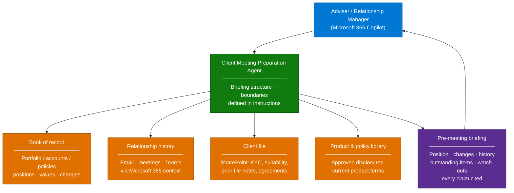

# Client Meeting Preparation Agent — Overview

## Scenario Overview

**Scenario Type**: Client Advisory / Relationship Management
**Agent Type**: Declarative agent in Microsoft 365 Copilot, or Copilot Studio agent where write-back is needed
**Primary Tools**: Microsoft 365 Copilot, SharePoint, Copilot connectors or MCP server over the book-of-record
**Complexity**: Advanced — the technology is moderate, the compliance envelope is not
**Status**: ✅ Available

An adviser has forty minutes before a client meeting. The client's position sits in the
portfolio system, the last twelve months of correspondence sit in Outlook, the meeting notes sit
in OneNote and Teams, the KYC file sits in SharePoint, and the product disclosures sit somewhere
in a compliance library. Assembling that into a coherent picture is thirty of the forty minutes.

This agent does the assembly. The adviser gets a briefing: what the client holds, what changed,
what they said last time, what is outstanding, and what to be careful about.

Delivered with financial institutions in **Australia** and **Canada** for investor and wealth
client meetings. The shape generalises well beyond financial services — it applies to any
organisation whose customers need periodic guidance on something they hold.

---

## The Generalised Pattern

The scenario is "prepare a person for a conversation with a customer about the thing that
customer holds with us". The domain changes; the structure does not.

| Sector | The "holding" | The meeting | Who prepares |
|---|---|---|---|
| Wealth & investments | Portfolio, funds, positions | Portfolio review, investor update | Adviser, relationship manager |
| Retail & commercial banking | Accounts, lending, facilities | Annual review, credit conversation | Relationship manager |
| Insurance | Policies, cover, claims history | Renewal, cover review | Broker, account manager |
| Telco & subscription business | Plans, usage, contract term | Renewal, upgrade conversation | Account manager |
| Equipment, automotive, industrials | Durable assets, service history, warranty | Service review, fleet planning | Field service, account manager |
| Utilities & energy | Supply contracts, consumption | Contract renewal, efficiency review | Account manager |
| Professional services | Engagements, deliverables, spend | Quarterly business review | Engagement lead |

Everything in this runbook applies to all of these. Where it says "portfolio", read "the thing
the customer holds". The compliance requirements vary in severity but not in kind — every one of
these conversations is recorded, regulated, or both.

---

## Problem Statement

- **Preparation time is the job's biggest tax.** Advisers spend a large share of pre-meeting time
  assembling context that already exists, scattered across five systems.
- **Institutional memory lives in individual inboxes.** When an adviser leaves or a client is
  reassigned, the relationship history goes with them.
- **Inconsistent preparation quality.** The best advisers prepare thoroughly; everyone else
  prepares to the level time allows, and the client experiences the difference.
- **Missed signals.** A life event mentioned in an email eleven months ago is exactly the thing
  that should shape today's conversation, and nobody remembers it.
- **Post-meeting notes are worse than the preparation.** Structured file notes are a regulatory
  expectation and the last thing anyone wants to write at 6pm.

---

## Solution Summary

### Key Capabilities

| Capability | Description |
|---|---|
| 📋 Position summary | What the client holds, current value, and what changed since the last meeting |
| 🕰️ Relationship recall | Life events, stated preferences, and commitments surfaced from correspondence and meeting history |
| 📌 Outstanding items | Open actions, unreturned documents, unanswered questions from the last conversation |
| ⚠️ Watch-outs | Items requiring care — vulnerability indicators, complaints history, restricted topics |
| 📄 Approved material | Points to the current approved disclosure or product document, never a summary of it |
| 📝 Post-meeting file note | Structured note in the firm's required format, drafted for the adviser to review and file |
| 🔗 Full citation | Every statement traceable to a source the adviser can open |

---

## Business Outcomes

| Outcome | Description |
|---|---|
| ⏱️ Preparation time reduced | The measurable one. Baseline it before you start |
| 📈 Consistent client experience | Every client gets thorough preparation, not just the ones with time in the diary |
| 🧠 Institutional memory retained | Relationship context survives adviser change and client reassignment |
| 🎯 Better conversations | Advisers arrive knowing what matters to this client |
| 📑 Faster, better file notes | A regulatory obligation becomes a review task instead of a writing task |
| 🛡️ Auditable preparation | Citations mean a supervisor can see what the adviser was told |

---

## In Scope / Out of Scope

### ✅ In Scope

- Pre-meeting briefing assembly from the book of record, relationship history, and client file
- Surfacing life events, preferences, and commitments from correspondence
- Outstanding action tracking
- Post-meeting file note drafting in the firm's required structure
- Citation of every factual claim

### ❌ Out of Scope — and these are hard boundaries

- **Advice.** The agent does not recommend, suggest, or opine on what the client should do.
  It assembles facts. A human gives advice.
- **Suitability determinations.** Never generated.
- **Performance projections or forward-looking returns.**
- **Any statement that could constitute a financial promotion or a personal recommendation.**
- **Client-facing output.** Everything the agent produces is internal preparation material.
- Automated communication to the client without human review.

These are not conservative defaults to be relaxed later. In most jurisdictions they are the
line between a productivity tool and a regulated activity.

---

## Target Users

| Persona | Role in This Scenario |
|---|---|
| **Adviser / Relationship Manager** | Primary user — asks for the briefing, reviews the file note |
| **Team leader / Supervisor** | Reviews preparation quality; may use the same agent across a book |
| **Compliance** | Defines the boundaries, signs off the instructions, reviews output |
| **Risk** | Owns information barriers and access segmentation |
| **Data / Platform team** | Owns the connection to the book of record |
| **Delivery Engineer** | Builds the agent, writes the boundary instructions, runs evaluation |

---

## Qualification Checklist

This scenario is qualified on compliance, not on technology. Work through every row.

| Question | Why it matters |
|---|---|
| Are **information barriers** in force between business units? | Research and banking, or advisory and trading, frequently must not interface. Agent sharing does not always respect segment boundaries — this can be a hard blocker |
| What is the record-keeping obligation for meeting preparation and file notes? | Determines retention, audit, and whether agent output is itself a record |
| Is client PII in scope, and under what data residency rules? | AU and CA both have specific expectations; confirm the processing boundary |
| Where is the book of record, and can it be reached without exposing it? | Drives the integration pattern — see [2.Architecture.md](2.Architecture.md) |
| Who owns the definition of "advice" for this firm? | You need a named compliance owner to sign the boundary instructions |
| Are there vulnerable-customer obligations? | Changes what the agent must surface and how |
| Does the firm require file notes in a prescribed structure? | That structure becomes the agent instruction |
| Will external participants join meetings? | Affects interpretation and recording features, and licence assumptions |
| Which business units first? | Start where the compliance envelope is best understood |

---

## What Actually Goes Wrong

| Symptom | Root cause | Where it is handled |
|---|---|---|
| Responsible AI filters block legitimate prompts | Financial and personal-circumstance content triggers safety classifiers more readily in agent contexts than in base Copilot chat | [3.Runbook.md](3.Runbook.md) — Phase 3 |
| Agent produces something that reads like advice | Boundary instructions too weak or too abstract | Phase 3, boundary block |
| Briefing quality varies between advisers | Different data access, different client file hygiene | Phase 4, cross-user testing |
| Agent surfaces a client the adviser should not see | Information barrier not enforced at the data layer | Phase 1 |
| Answers cite the wrong client's document | Near-identical file naming across client folders | [Grounding & Response Quality Remediation](../../02-patterns/Grounding-and-Response-Quality-Remediation/Grounding-and-Response-Quality-Remediation.md) |
| Position data is stale or wrong | Book-of-record integration depth or crawl lag | [2.Architecture.md](2.Architecture.md) |
| Compliance withholds sign-off late | Boundaries agreed verbally, never written down | Phase 0 |

---

## Related Patterns

- [MCP Server Integration](../../02-patterns/MCP-Server-Integration/MCP-Server-Integration.md) — reaching the book of record, including on-premises and gateway-mediated topologies
- [Copilot Connector Knowledge Onboarding](../../02-patterns/Copilot-Connector-Knowledge-Onboarding/Copilot-Connector-Knowledge-Onboarding.md)
- [Grounding & Response Quality Remediation](../../02-patterns/Grounding-and-Response-Quality-Remediation/Grounding-and-Response-Quality-Remediation.md)
- [Agent Governance & Rollout Control Plane](../../02-patterns/Agent-Governance-and-Rollout-Control-Plane/Agent-Governance-and-Rollout-Control-Plane.md)
- [Branded Office Artifact Generation](../../02-patterns/Branded-Office-Artifact-Generation/Branded-Office-Artifact-Generation.md) — where the briefing is produced as a document

---

## Next

→ [2.Architecture.md](2.Architecture.md)
