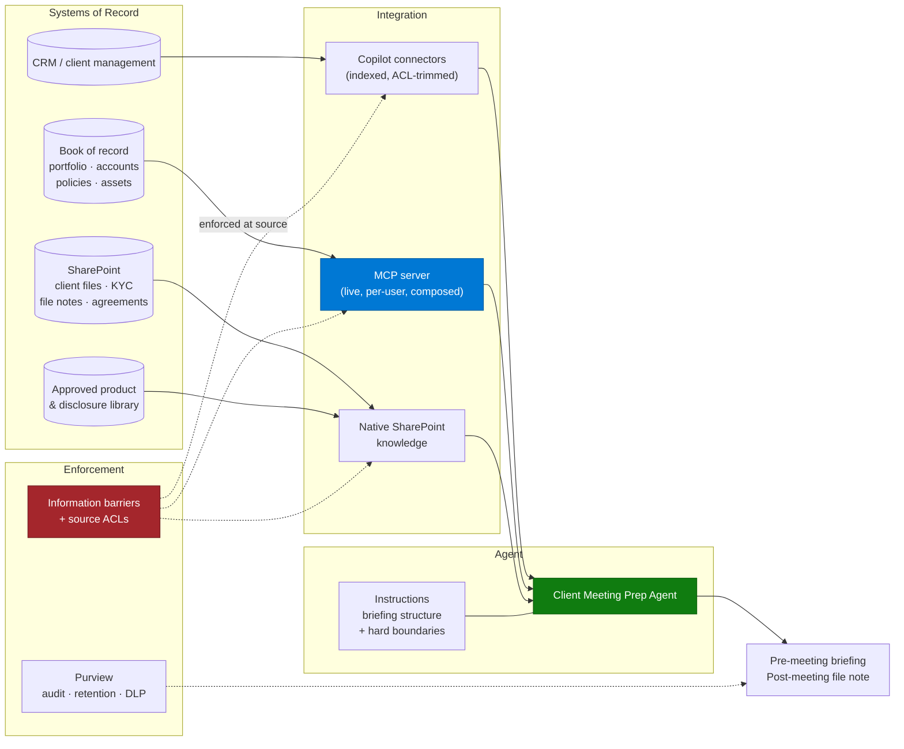

# Architecture — Client Meeting Preparation Agent

> **Platform**: Microsoft 365 Copilot · Copilot connectors or MCP server · SharePoint
> **Last Updated**: August 2026

---

## Solution Architecture

---

## Reaching the Book of Record

The book of record is usually the hardest integration in this scenario — frequently a core
platform, often partly on-premises, always heavily permissioned.

| Option | When it fits | Watch out for |
|---|---|---|
| **Copilot connector (synced)** | The data is document-like or record-like, changes slowly, and read-only is enough | Crawl lag on positions and valuations. Stale numbers in a client meeting are worse than no numbers |
| **MCP server** | You need live positions, composed views across products, or custom objects | You own the service. See the topology options below |
| **Power Platform connector in a Copilot Studio agent** | The connector covers the objects, and you want flow control | Constrains you to Copilot Studio |
| **Curated extract into SharePoint or Dataverse** | The core platform genuinely cannot be reached in the project window | Introduces a copy of regulated data. Get that decision made deliberately, not by default |

**Freshness rule:** if the briefing includes a valuation or a balance, it must carry an
"as at" timestamp, and the adviser must be told the refresh cadence. An undated number in a
client conversation is a compliance problem, not a UX nit.

For on-premises core systems and for gateway-mediated access, see the deployment topologies
section in
[MCP Server Integration](../../02-patterns/MCP-Server-Integration/MCP-Server-Integration.md).
This is a very common shape in this scenario: the core platform is on-premises or in a private
network, and the agent reaches it through a mediation layer that never exposes the backend
directly.

---

## Information Barriers — Design This First

In regulated firms, the requirement is not "users see their own clients". It is "these
populations must not interface at all", and it is enforced by regulation rather than
convenience.

Three things to establish before building:

1. **Where is the barrier enforced?** It must be at the data layer — source ACLs, connector
   permission trimming, and MCP server per-user identity. Never in agent instructions.
2. **What happens when someone changes segment?** Advisers move teams. Access must follow, and
   shared agents do not always re-evaluate segment membership the way people assume. Test this
   explicitly: move a test user between segments and re-run the access tests.
3. **What is the sharing scope of the agent itself?** A broadly shared agent that reaches
   segmented data is a control question even when retrieval is trimmed correctly. Some firms
   cap the number of users an agent can be shared with precisely for this reason.

Record the answers and have risk sign them. This is the single most likely reason a
well-built agent does not go live in this sector.

---

## The Advice Boundary

The architectural expression of "the agent does not give advice" is a **retrieval-only design**:

| Design choice | Why |
|---|---|
| No calculation of returns, projections, or scenarios | A projection is a forward-looking statement. Do not generate one |
| No comparison of products on suitability | Comparison implies recommendation |
| No summarisation of approved disclosures | Point to the current approved document. A summary is a new, unapproved communication |
| No client-facing output | Everything is internal preparation material |
| Ungrounded responses disallowed | The agent should say "not recorded" rather than reason from general knowledge |

The last row matters more here than in any other scenario in this repository. A general-purpose
model reasoning about a client's finances from its own training data is exactly what the
boundary exists to prevent.

---

## Responsible AI Behaviour — Expect Friction

Content describing personal circumstances, health events, family situations, and financial
transactions sits close to several safety classifier categories. Two effects are commonly seen
in this scenario:

- Prompts that work in base Copilot chat can trigger safety filters more readily inside an
  agent.
- The same prompt can succeed and fail across sessions, which reads to users as
  unreliability.

Practical responses:

| Approach | Effect |
|---|---|
| Structure the request as fact extraction from named sources, rather than as characterisation of a person | Reduces filter sensitivity considerably |
| Avoid asking the model to infer or profile — ask it to retrieve and cite | Aligns with the advice boundary as well |
| Split a single very broad prompt into narrower ones | Fewer sensitive dimensions in one request |
| Keep a documented example set of blocked-then-reworded prompts | Turns a recurring surprise into a known workaround |

Do not treat filter behaviour as a bug to be escalated before you have tried restructuring the
prompt as retrieval. Most of the time, the reworded version works and is also the more
compliant formulation.

---

## Data Residency and Sovereignty

Both Australia and Canada raise this consistently, and both have supported Power Platform
region pairs if the solution extends into Copilot Studio:

| Power Platform region | Paired Azure regions |
|---|---|
| Australia | `australiasoutheast`, `australiaeast` |
| Canada | `canadacentral`, `canadaeast` |

Confirm, in writing and per capability, where prompts, responses, and any cached client context
are processed and stored. Bring legal in at qualification, not at security review.

---

## Compliance Instrumentation

| Requirement | Where it is served |
|---|---|
| Audit of what the adviser was shown | Purview audit of prompts and responses |
| Retention of file notes | The file note is filed to the governed location, and the record is the filed note — not the chat |
| Supervision | Citations make the briefing reviewable by a supervisor |
| DLP | Applied to the output location and formats in use |
| Evidence of access control | The permission test matrix from the runbook |

One design decision worth making explicitly: **the agent's chat transcript is not the record.**
The record is the file note the adviser reviews and files. Say so in the design document, or
you will end up in a conversation about retaining every draft.

---

## Non-Functional Considerations

| Concern | Guidance |
|---|---|
| **Freshness** | Positions and valuations must carry an "as at" timestamp |
| **Latency** | Briefing assembly is a pre-meeting task; a minute is acceptable, ten is not |
| **Availability** | Advisers use this in a narrow window before meetings. Degraded service at 8:45am is a visible failure |
| **Client file hygiene** | Briefing quality tracks file quality. Expect a data-quality workstream |
| **Volume** | A book of 200 clients reviewed quarterly is a predictable, plannable load |

---

## Next

→ [3.Runbook.md](3.Runbook.md)
