# Setup Guide — Compliance Self-Inspection Agent

**Scenario**: Employee-initiated compliance self-inspection of personal OneDrive documents and Outlook mail

**Platform**: Microsoft Copilot Studio + Power Platform (Power Automate, Dataverse, SharePoint, Excel Online, OneDrive, Outlook)

**Target Readers**: Solution Architect / Delivery Engineer / Power Platform Administrator / Copilot Studio Maker / Legal program owner

**Estimated Effort**: Intermediate — solution import and configuration, plus a governance decision workshop with Legal and IT

**Outcome:** An authorized employee can run a self-inspection against their own Outlook mail and OneDrive files, receive result links, and leave completion metadata in the compliance team's history workbook.

**Who is needed:** A SharePoint owner, a Power Platform administrator, an agent maker, and an ordinary employee for testing.

Follow Steps 1–7 in order. Complete governance and connection settings before using employee data.

## Resources

All deployment files and samples are in [0.Resources](0.Resources).

| Resource | Use |
|---|---|
| [Solution ZIP](0.Resources/ComplianceSelfInspectionAgent_1_0_0_7.zip) | Import into the Production environment |
| [self-inspection-result-template.xlsx](0.Resources/self-inspection-result-template.xlsx) | Upload to the private SharePoint site; copied to each employee's OneDrive |
| [self-inspection-history.xlsx](0.Resources/self-inspection-history.xlsx) | Upload to the same site; stores execution history |
| [Outlook_samples](0.Resources/Outlook_samples) | Four email attachments: DOCX, PPTX, XLSX, PDF |
| [OneDrive_samples](0.Resources/OneDrive_samples) | Four files to upload to the test user's OneDrive |
| [expected_scores.csv](0.Resources/expected_scores.csv) | Open in Excel to compare keywords, category counts, and numeric scores |

### Workbook structure

| Workbook | Sheet / table | Contents |
|---|---|---|
| Result template | `Sheet1` / `Table1` | `id`, `document`, `documentType`, 15 category-count columns, `riskScore`, `sourceURL` |
| History | `Sheet1` / `scanHistory` | `id`, `userEmail`, `userName`, `startedAt`, `completedAt`, `emailBody`, `emailAttachments`, `onedriveFiles` |

The result template calculates **numeric scores only**: High keyword count × 3, Medium × 2, Low × 1, across all five categories. Preserve its formula row: `A2` numbers result rows and `S2` calculates `riskScore`. The history workbook has an empty data row ready for use.

The two sample XLSX files contain a `Sample` sheet with four observations each. They are test documents, not deployment templates.

## 1. Prepare SharePoint and OneDrive

**Owner: SharePoint owner / maker**

1. In SharePoint, select **Create site → Team site → Private**. In the current UI, site creation may appear under **Build → Site → Standard team → Use template**. Add the compliance owners and the account that will provide the shared flow connections. Do not add all employees.
2. In **Documents → Upload → Files** (or **Create or upload → Files upload**), upload **`self-inspection-result-template.xlsx`** and **`self-inspection-history.xlsx`** from `0.Resources`. Keep these filenames and the existing Excel tables.
3. Open each workbook and confirm the table names above. Preserve the result template's formula row, then save and close the files.
4. Confirm the shared connection account can read the template and edit the history workbook. An ordinary employee should not be able to browse this site.
5. Choose an output-folder path, such as `/Self-Inspection Results`, inside each employee's OneDrive. Creating this folder manually is optional: if it does not exist, **Copy Self-Inspection Result Template** creates it automatically when the agent runs.

Open the site's membership panel and use the role dropdown to confirm the approved owners. Account identities are masked in the example.

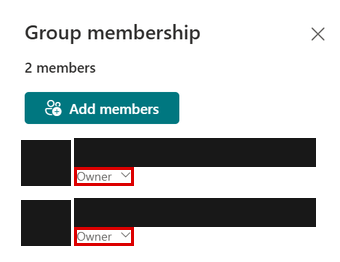

Record these values for import:

| Setting | Example |
|---|---|
| SharePoint site URL | `https://contoso.sharepoint.com/sites/Compliance` |
| Template path relative to that site | `/Shared Documents/self-inspection-result-template.xlsx` |
| Folder inside each employee's OneDrive | `/Self-Inspection Results` |

Use the library's actual URL segment: the library displayed as **Documents** commonly uses `Shared Documents`. Do not use a sharing link or an `AllItems.aspx` URL.

## 2. Create a Production environment

**Owner: Power Platform administrator**

1. Open [Power Platform admin center](https://admin.powerplatform.microsoft.com) → **Manage → Environments → New**.
2. Enter a name such as `Compliance-Production`, choose the approved geography/region, set **Type = Production**, and enable **Dataverse**. If the form asks for **Macro Region Geography**, confirm the resulting environment region meets your residency requirements. Complete the database settings and select **Save**.
3. Assign the approved Microsoft Entra security group and limit maker/admin access to maintainers. Wait until the environment is ready.
4. Confirm Copilot Studio, the required AI Builder models, and connector entitlements are available. Pilot users need working Exchange Online mailboxes and provisioned OneDrive storage.
5. Review effective data policies. Allow the six connector families below together in the approved Business group; restrict unnecessary connectors and HTTP endpoints where supported.

Required connectors: **SharePoint**, **Excel Online (Business)**, **OneDrive for Business**, **Office 365 Outlook**, **Microsoft Dataverse**, **HTTP with Microsoft Entra ID (preauthorized)**.

### Provision makers and employees before import

1. In the environment, open **Settings → Users + permissions → Security roles**. Copy **Basic User** and **Environment Maker** into `Self-Inspection User` and `Self-Inspection Maker`. Complete the required description, **Applies to**, and **Summary of core table privileges** fields. Do not edit the built-in roles.
2. In **both copies**, find **AI Event** (`msdyn_aievent`) and set **Create**, **Read**, and **Write** to **None**. Save; **Save + close** may be under **More commands**.

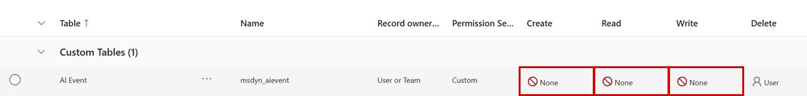

3. Add the maker and pilot employees to the environment. Assign the maker both custom roles and **Delegate**. Assign employees `Self-Inspection User` role. Keep the administrator identity separate from the maker and employee test identities.
4. Review direct and team-inherited roles: privileges are cumulative. Another role can grant AI Event access even when the custom role says None. Reopen the custom roles and confirm the saved privileges.
5. Open **Settings → Product → Features → Cloud flow run history in Dataverse**. Set **FlowRun entity time to live → Disabled**, save, and reopen to confirm.

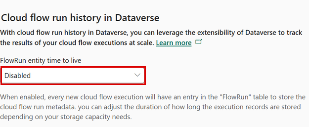

6. Have the maker refresh Power Apps and confirm **Solutions** is accessible before continuing. Prompt sharing and flow-specific permissions follow after import.


**Licensing:** This agent is designed for authenticated employee use covered by the **Microsoft 365 Copilot User Subscription License (USL)**. For licensed users running the agent in that included-use context, additional Copilot Credits are not required. Users without Microsoft 365 Copilot USL consume Copilot Credits. Included agent-flow usage requires the **When an agent calls the flow** trigger and the licensed user's identity, subject to fair-use limits; do not assume the same coverage for independently triggered flows. See [Microsoft's billing guidance](https://learn.microsoft.com/microsoft-copilot-studio/requirements-messages-management).

## 3. Import the solution

**Owner: Maker / deployment administrator**

1. Open [Power Apps](https://make.powerapps.com), select the **Production environment** created in Step 2, then **Solutions → Import solution → Browse**.

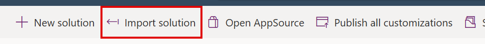

2. Select `0.Resources\ComplianceSelfInspectionAgent_1_0_0_7.zip`. Confirm `ComplianceSelfInspectionAgent`, version `1.0.0.7`. The supplied package is **Unmanaged**, which allows the history-flow configuration in Step 4.
3. Map connection references to valid target-environment connections. Use the approved SharePoint/history connection account for shared storage.
4. For **HTTP with Microsoft Entra ID (preauthorized)**, use `https://graph.microsoft.com` for both **Base Resource URL** and **Microsoft Entra ID Resource URI** in the commercial cloud. If automatic creation fails, select **Add new connection**, enter both values, and sign in as the intended connection account.

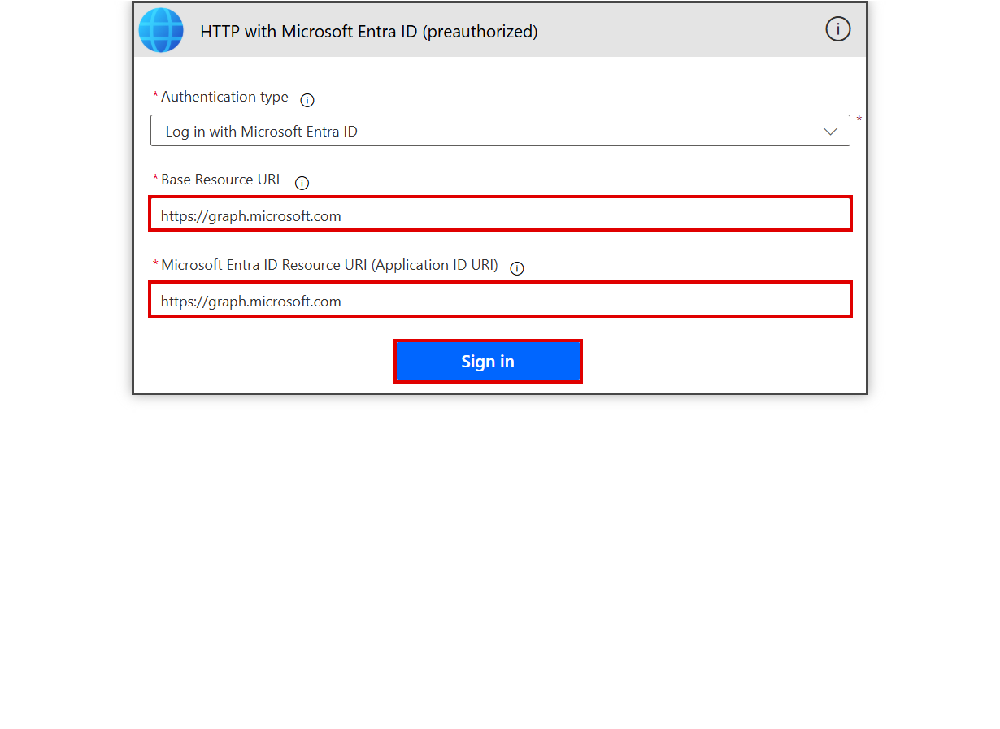

5. If **Next** remains disabled after all connections are valid, select **Back**, then **Next** to reload the connections step; do not create duplicate connections. After import, `GetTable NotFound` / `itemNotFound` can indicate source workbook IDs, and `ChildFlowNeverPublished` can indicate the completion child flow is not published. Complete Step 4 and the child-first activation in Step 6 before retrying flow activation.
6. Enter the three environment variables below. Enter plain text, without quotes or URL-encoding. Then select **Import**.

| Environment variable | Schema name | Example input |
|---|---|---|
| Self-Inspection Output Folder | `dv_SelfInspectionOutputFolder` | `/Self-Inspection Results` |
| Self-Inspection Template Path | `dv_SelfInspectionTemplatePath` | `/Shared Documents/self-inspection-result-template.xlsx` |
| Self-Inspection SharePoint Site URL | `dv_SelfInspectionSharePointSiteUrl` | `https://contoso.sharepoint.com/sites/Compliance` |

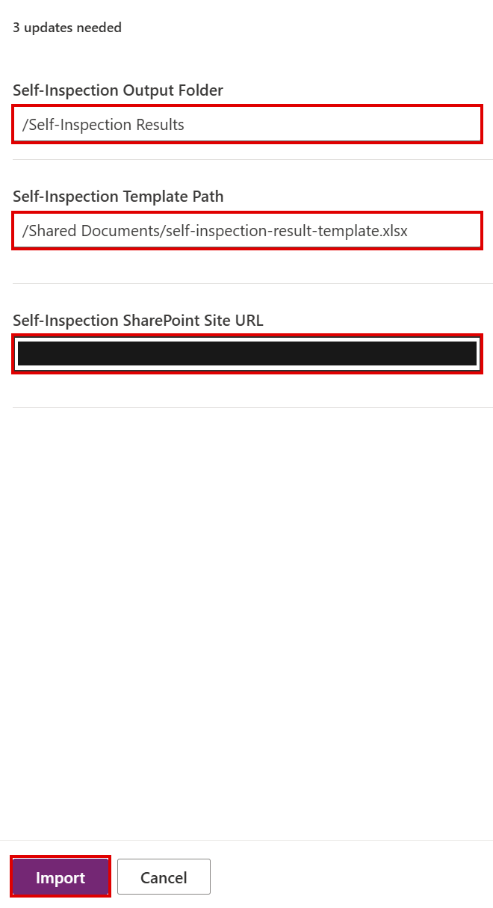

**Why this split?** URLs and file/folder paths are easy to identify and enter, so they are environment variables. File, drive, and table IDs are harder to discover, so some flows will use **designer dropdowns** instead.

7. Confirm the solution contains the agent, `Self-Inspection` topic, five flows, five prompts, six connection references, and three environment variables.

## 4. Configure Record Inspection Start and Record Inspection Completion

**Owner: Maker**

Only these two flows need manual workbook selection. Configure and publish **Record Inspection Completion** first, then **Record Inspection Start**. Runtime connection settings are covered in Step 5.

Open **Copilot Studio**, select the target environment, then **Workflows** (shown as **Flows** in some experiences). Select the flow and open its **Designer** tab.

For both Excel actions, clear imported custom values before selecting the target **Location → Document Library → File → Table**. Clear old file text before using the file picker, and wait for each dependent selector to finish loading. Reselect `scanHistory` if necessary, then restore the advanced mappings; selecting a different file/table can clear them.

### Record Inspection Completion

1. In Copilot Studio, open **Record Inspection Completion → Designer** and select **Record end time and summary in status table**.
2. Select your SharePoint **Location**, **Document Library**, **File = self-inspection-history.xlsx**, and **Table = scanHistory**.
3. Set **Key Column = id**, **Key Value = historyID** from the trigger, and the advanced fields below.
4. Save the flow; publish the saved changes if required by the designer.

| Field | Value |
|---|---|
| `completedAt` | Timestamp expression below |
| `emailBody` | Trigger input `emailBody` |
| `emailAttachments` | Trigger input `emailAttachments` |
| `onedriveFiles` | Trigger input `onedriveFiles` |

**Timestamp expression for `completedAt`:**

```text
formatDateTime(addHours(utcNow(), 9), 'yyyy-MM-dd HH:mm:ss')
```

This expression records **Korea Standard Time (KST, UTC+9)**. To use another time zone, follow [Changing the agent's time zone](#changing-the-agents-time-zone) after configuring both history flows.

**Configured example — Record Inspection Completion**

In the Copilot Studio designer, use the highlighted selectors for the target workbook. The site identity is masked.

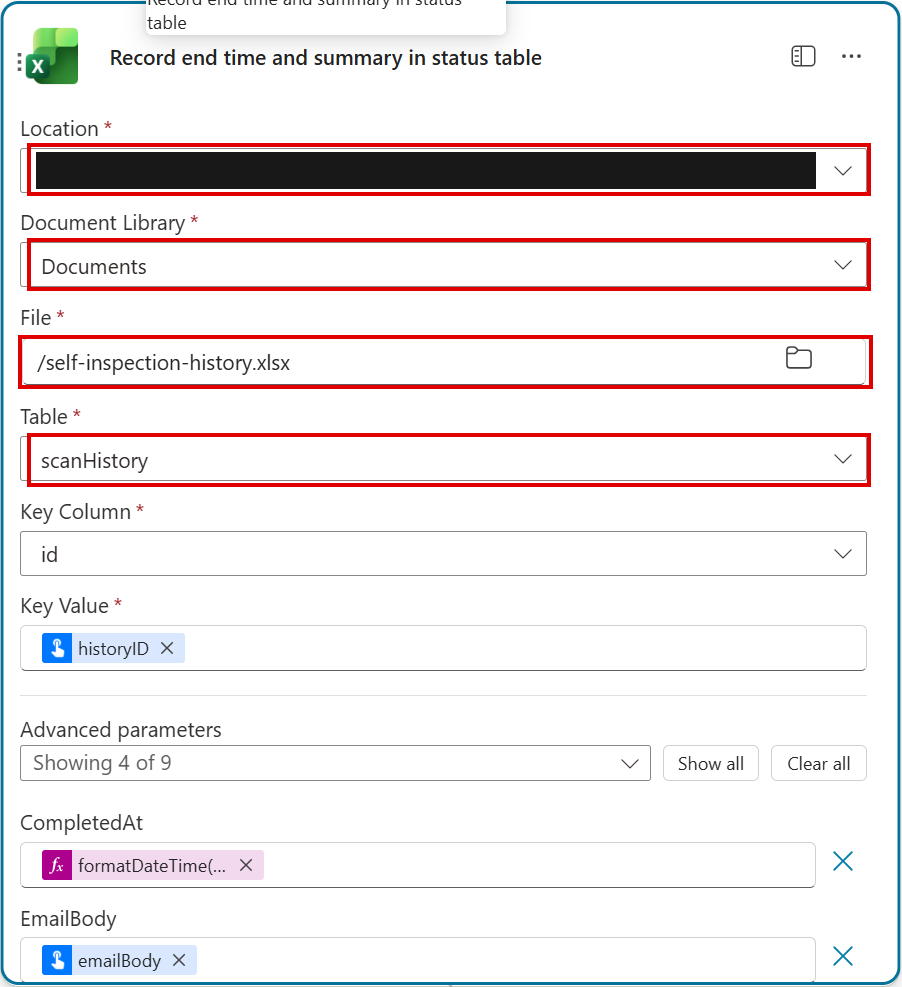

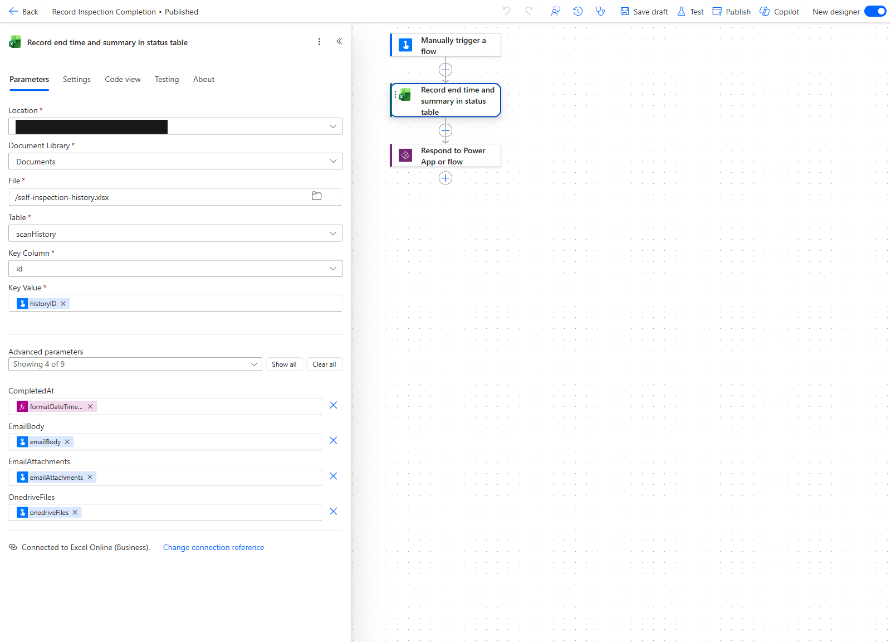

### Record Inspection Start

1. In Copilot Studio, open **Record Inspection Start → Designer** and select **Record start time in status table**.
2. Use the dropdowns to select your SharePoint **Location**, **Document Library**, **File = self-inspection-history.xlsx**, and **Table = scanHistory**.
3. Expand **Advanced parameters** and set the fields below.
4. Save the flow; in a designer with **Save draft / Publish**, publish the saved changes. Reopen both history actions and confirm their saved workbook selections and field mappings.

| Field | Value |
|---|---|
| `id` | Variable `id` |
| `userEmail` | Trigger input `userEmail` |
| `userName` | Trigger input `userName` |
| `startedAt` | Timestamp expression below |

**Timestamp expression for `startedAt`:**

```text
formatDateTime(addHours(utcNow(), 9), 'yyyy-MM-dd HH:mm:ss')
```

Use the same time zone as `completedAt`. See [Changing the agent's time zone](#changing-the-agents-time-zone) for all related settings.


**Configured example — Record Inspection Start**

Use the same target workbook in the Start action, then restore the four mappings listed above.

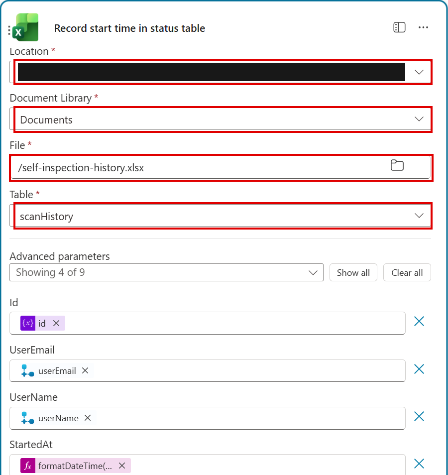

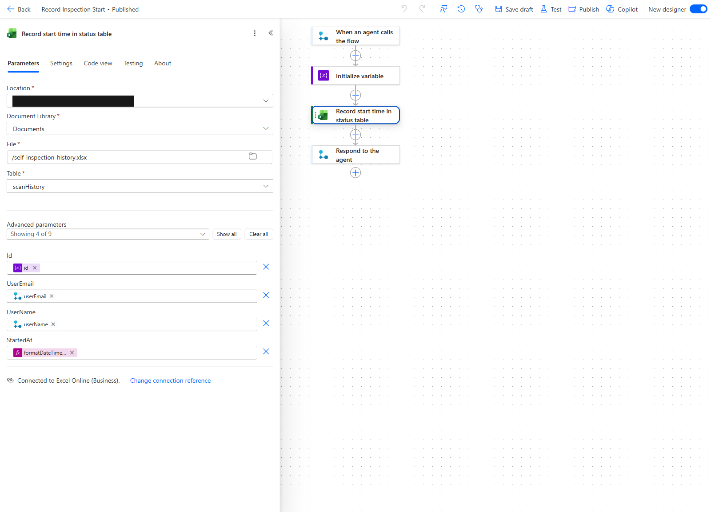

The screenshots show the English designer with an example site's saved configuration. Select your own SharePoint site; its display name may use a different language.

### Changing the agent's time zone

The solution uses **Korea Standard Time (KST, UTC+9)**. If another time zone is needed, select the target environment in Copilot Studio and update these locations consistently:

- **History start:** Copilot Studio → Workflows (or Flows) → Record Inspection Start → Designer → Record start time in status table → Advanced parameters → `startedAt`.
- **History completion:** Copilot Studio → Workflows (or Flows) → Record Inspection Completion → Designer → Record end time and summary in status table → Advanced parameters → `completedAt`.
- **Topic date conversion:** Copilot Studio → Agents → Compliance Self-Inspection Agent → Topics → Self-Inspection → valid-date branch → Set variable value immediately before Copy Self-Inspection Result Template → `Topic.str_startDate` and `Topic.str_endDate`.
- **Result filename:** Copilot Studio → Workflows (or Flows) → Copy Self-Inspection Result Template → Designer → Create file (OneDrive for Business) → File Name.

## 5. Apply governance and runtime permissions

The environment users, custom roles, and FlowRun setting must already be configured in Step 2. Complete the checks below before production use.

### Administrator tasks

1. Confirm the maker and pilot employees retain the intended effective roles from Step 2, including team-inherited privileges.
2. Confirm **FlowRun entity time to live** remains **Disabled**.
3. Approve audit scope, retention, owner succession, and access-review responsibilities with the compliance owner.

**Separate controls:** Disabling FlowRun stops new Dataverse run-metadata ingestion; it does not erase existing records or mask standard Power Automate action history. AI Event permissions and secure inputs/outputs address different data stores.

### Maker tasks

1. In **Power Apps → AI hub → Prompts**, open each of the five prompts below and share it with the pilot users/team as **User** (use/run), not Co-owner. Confirm each share succeeds.

| Prompt | Model |
|---|---|
| Compliance Keyword Analysis | GPT-4.1 mini |
| Extract Text from DOCX | GPT-5 chat |
| Extract Text from XLSX | GPT-5 chat |
| Extract Text from PPTX | GPT-5 chat |
| Extract Text from PDF | GPT-5 chat |

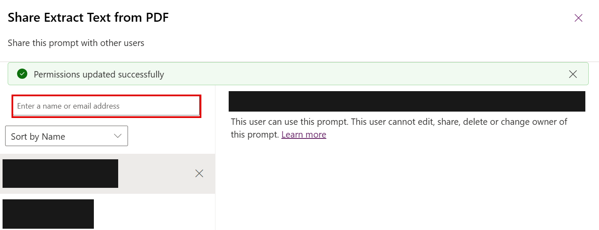

2. In **Power Automate**, open each flow's **Overview/details → Run-only users → Edit → Connections used** and apply the identity matrix below. **Save**, close the panel, then reopen it to confirm the saved selections. Use the Overview panel for connection changes; opening the designer is not required.

| Flow / connection use | Required runtime identity |
|---|---|
| Template copy: SharePoint | Approved shared connection account |
| Template copy: OneDrive | Provided by run-only user |
| Both scan flows: Graph HTTP, Excel result access, Outlook, and OneDrive where used | Provided by run-only user |
| Both scan flows: Dataverse prompts | **Provided by run-only user**, after roles and prompt sharing are ready |
| Start and completion history flows: Excel | Approved shared connection account; completion child-flow connections stay embedded |

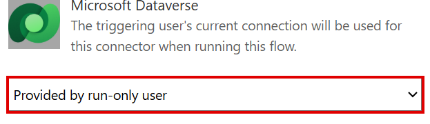

3. In action **Settings**, enable supported **Secure inputs / Secure outputs** for document bytes, mail bodies, attachments, prompt data, and result rows. Include downstream actions that carry the same content.

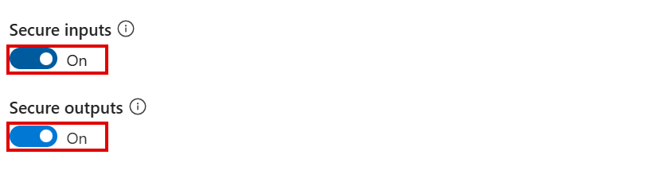

4. Keep results private to the employee. Restrict flow co-owners, administrators, and transcript access; apply the agreed retention policy.

## 6. Enable, publish, and share

**Owner: Maker / channel administrator**

1. Resolve flow connection errors. Confirm **Record Inspection Completion** is published and On before enabling its parent scans. Then enable **Record Inspection Start**, **Copy Self-Inspection Result Template**, **Scan Emails and Attachments**, and **Scan OneDrive Files**. Confirm all five are On.
2. Open **Copilot Studio → Compliance Self-Inspection Agent → Topics → Self-Inspection**. Confirm flow nodes resolve and the date card, condition, and warning agree on **1–180 days inclusive**.
3. Confirm prompt references match the five prompts above. Save intentional changes and resolve checker errors.
4. Select **Publish** and wait for a success status.
5. Open **Channels → Microsoft 365 and Microsoft Teams**. Add the channel, enable availability in Microsoft 365 Copilot, and use **Availability options → Manage sharing** to grant pilot users/team **Viewer** (chat/use) access without editor access.
6. Have the channel administrator approve availability where tenant policy requires it. Open **See agent in Microsoft 365** or **See agent in Teams**, provide the appropriate agent link to approved pilot users, and have each user select **Add**, then open the agent.

### First-use employee connections

Confirm publication with the highlighted **Publish** button. Review any author-credential warning against the runtime identity matrix in Step 5.

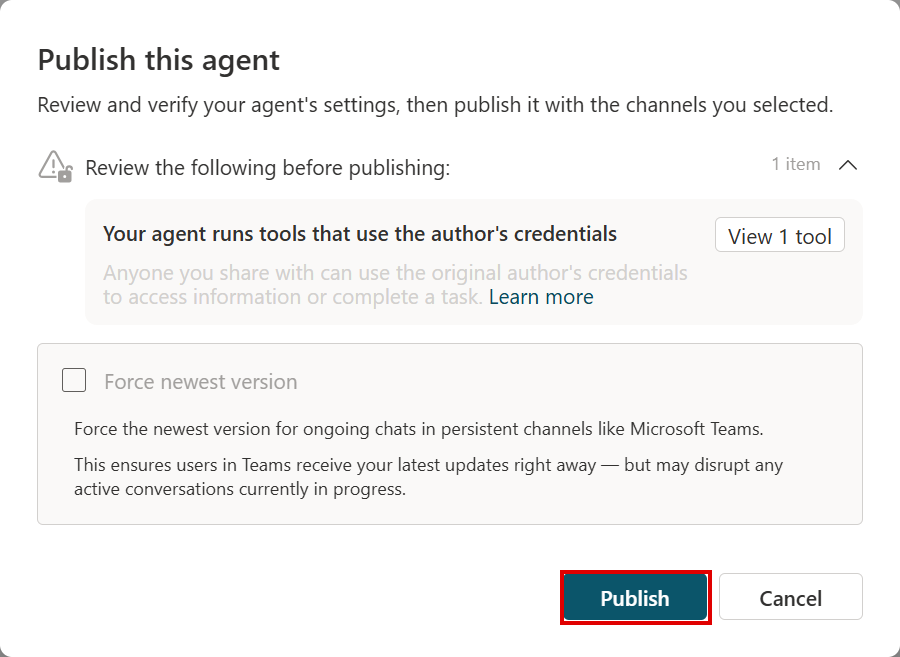

1. Verify the signed-in account separately in Microsoft 365 Copilot/Teams, OneDrive, and any connection-manager or connector sign-in window. Do not assume switching accounts in one app switches the others.
2. Start the inspection and allow the expected connector requests using the employee's own account.
3. If the agent says **I couldn't connect**, select **Open connection manager**. Confirm the identity at the top is the employee, then select **Connect** for each scan flow.
4. Select or create that employee's connections. For **HTTP with Microsoft Entra ID (preauthorized)**, enter `https://graph.microsoft.com` in both **Base Resource URL** and **Microsoft Entra ID Resource URI**. Select the employee account in each sign-in window. (Agent chat access, prompt **User** access, environment roles, and connector consent are separate requirements.)

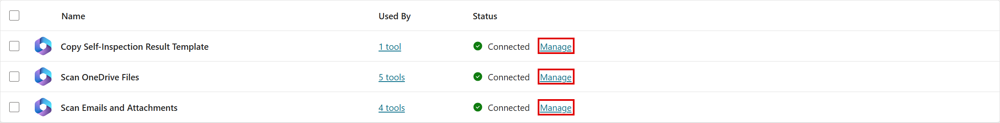

5. Select **Submit**, then **Refresh**. Confirm the template-copy connection and both scan flows show **Connected**, return to the existing conversation, and select **Retry**.

**Before rollout:** Test once as the maker and once as an ordinary employee. Do not use an administrator-only test to approve user permissions.

## 7. Run UAT with the supplied samples

### Prepare and run

1. Choose a test day **D**. From `0.Resources\Outlook_samples`, attach `Outlook_vendor_due_diligence.docx`, `Outlook_gifts_hospitality_review.pptx`, `Outlook_conflict_of_interest_register.xlsx`, and `Outlook_trading_window_incident.pdf` to an email to the test user. Use subject **Sample documents** and body **Please review the attached files.**
2. From `0.Resources\OneDrive_samples`, upload `OneDrive_expense_audit_summary.docx`, `OneDrive_third_party_risk_briefing.pptx`, `OneDrive_hospitality_log.xlsx`, and `OneDrive_quarterly_compliance_digest.pdf` to that user's OneDrive. Ensure each sample appears once in its intended channel.
3. Keep `expected_scores.csv` and this runbook outside the scanned content set. They repeat keywords and must not be test inputs.
4. Select a range covering mail **receivedDateTime** and OneDrive **lastModifiedDateTime**. For cleaner isolation, run D-to-D the following day; same-day scans can include generated result files.
5. In a new agent conversation, enter **Start self-inspection**, select the dates, and submit.

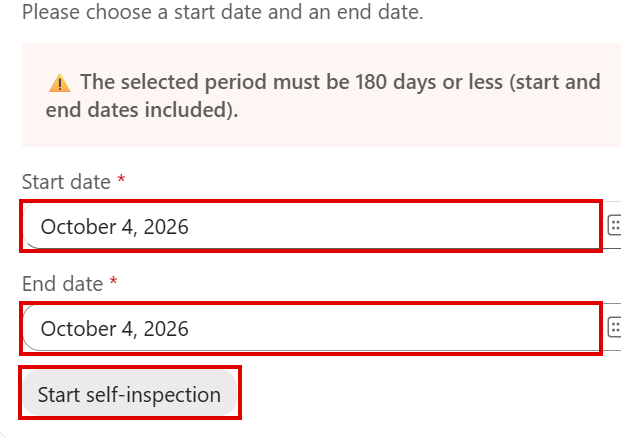

6. Wait for **both scan runs to succeed and both completion emails**. The chat's “started” message is not completion. Each scan waits **five minutes after sending its completion email** before updating central history. A notification can therefore arrive while the run still shows **Running**. Wait for both runs and reconcile the final history counts.
7. Open the result workbook and `expected_scores.csv`. Compare by filename, then repeat through the published channel as an ordinary employee.

### Expected results

Each keyword phrase appears once and counts as one hit, regardless of the number of words in the phrase. Samples have **2–5 hits per file**, **27 total**: Outlook 14, OneDrive 13.

| Sample | Hits | `riskScore` |
|---|---:|---:|
| Outlook_vendor_due_diligence.docx | 2 | 2 |
| Outlook_gifts_hospitality_review.pptx | 3 | 6 |
| Outlook_conflict_of_interest_register.xlsx | 4 | 7 |
| Outlook_trading_window_incident.pdf | 5 | 10 |
| OneDrive_expense_audit_summary.docx | 2 | 2 |
| OneDrive_third_party_risk_briefing.pptx | 2 | 3 |
| OneDrive_hospitality_log.xlsx | 4 | 9 |
| OneDrive_quarterly_compliance_digest.pdf | 5 | 5 |

Use the CSV's `keywords` and `totalMatches` to review the planted matches, then compare its 15 `cat*` fields and `riskScore` with the result workbook.

### Functional acceptance checklist

| Check | Pass condition |
|---|---|
| Result file | A workbook appears in the invoking user's output folder, named `<timestamp>_self-inspection-result_<start>_<end>.xlsx` |
| Keyword counts | Every sample's 15 category counts match the CSV; their sum equals its expected hits |
| Score | `riskScore` matches the table above; formula cells contain no errors |
| Result links | `sourceURL` identifies the corresponding source; completion email opens the result workbook |
| History | One `scanHistory` row has the user's identity and GUID; completion updates the same row and final counts reconcile |
| Completion | Both scan flows succeed and both emails arrive; a populated `completedAt` alone is insufficient |
| Isolation | User B cannot open user A's results; ordinary users cannot browse the private compliance site |

Exclude the template's blank formula row (`id = 0`) from document counts. Outlook scans can include **Inbox and Sent** copies: sending samples to yourself or to multiple test users can produce repeated attachment rows. Reconcile duplicates by filename and `sourceURL`; compare each occurrence to the CSV rather than requiring exactly eight total rows. Additional mail-body rows and other in-range files also need separate reconciliation. The samples contain text; image-only/scanned content is outside this test's scope.

### Separate production-readiness checks

Functional acceptance does not by itself prove governance or billing controls. Record these checks separately before production rollout:

| Check | Required evidence |
|---|---|
| Effective permissions | Restricted users have the intended direct and inherited privileges, and all five prompts are shared for use |
| Content protection | No new AI Event content is persisted for restricted runtime users; sensitive action data is masked across inputs, outputs, and downstream actions |
| Retention and ownership | FlowRun setting is confirmed and compliance owners approve audit, retention, succession, and access-review responsibilities |
| Licensing and usage | Confirm the licensed, authenticated published-channel use context and review applicable usage/billing evidence; successful scans alone do not establish included-use billing |

## Optional: Customize detected keywords

Skip this section to use the supplied keyword lists. Obtain compliance-owner approval and test changes in a separate development/test environment or a copy of the prompt before applying them to production.

1. Open **AI hub → Prompts** (or the prompt list in Copilot Studio **Tools**) and select **Compliance Keyword Analysis**. Use a copy for testing; leave the four text-extraction prompts unchanged.
2. In the prompt editor, locate **`RULES`**. Keywords are grouped under `cat1`–`cat5`, each with `high`, `medium`, and `low` lists.
3. Add, edit, or remove a quoted keyword in the appropriate list. Preserve the dictionary structure, the `inputText` input, and all 15 output keys.
4. Enter sample text in **`inputText`** and select **Test**. Include the edited keyword, repeated occurrences, and a no-match case.
5. Open **Code** and confirm its `RULES` dictionary contains the edits. Return to the response view and confirm all 15 numeric counts, including zeros, match your expectations.
6. Select **Save**. After approval, apply the tested changes to the **Compliance Keyword Analysis** prompt used by the solution and repeat the test. Saving a separate copy alone does not update the flows.
7. Deploy through your approved change process, publish the agent, and repeat the Outlook and OneDrive tests in Step 7. Update affected samples, `expected_scores.csv`, and the expected-results table in this guide.

**Example:** To detect `event ticket` as a medium-severity gifts/hospitality keyword, add it to the existing `cat2` medium list:

```json
"medium": ["golf outing", "gift card", "event ticket"]
```

Test with `event ticket event ticket business meal`. Expect `cat2_medium = 2`, `cat2_low = 1`, and all other counts `0`. The corresponding weighted `riskScore` is **5**. Matching is case-insensitive and counts occurrences, not just unique keywords.

Editing words within existing lists does not require new workbook columns. **Adding, deleting, or renaming categories** requires coordinated changes to the prompt output, both scan flows, the result-template columns and score formula, and expected test results.

## Operational handover

1. Record owners, retention, connection renewal, and rollback procedures. Restrict editing of the imported solution to approved maintainers.
2. Stagger larger campaigns to reduce Excel locking and connector throttling.
3. If your organization requires **Managed** deployments, prepare a managed release through its approved application lifecycle process. Configure target-specific history bindings before export when production policy prevents designer changes.

## Troubleshooting

| Problem | Action |
|---|---|
| Unexpected credit/billing message | Check the invoking user's Microsoft 365 Copilot USL and authenticated agent invocation. For users without USL, arrange Copilot Credit billing. |
| Maker cannot open Solutions / `CanEdit` forbidden | Complete Step 2 environment membership and role assignments, then refresh Power Apps |
| HTTP automatic connection creation fails | Select Add new connection and enter `https://graph.microsoft.com` for both resource fields |
| Import Next stays disabled with valid connections | Select Back, then Next to reload the step; avoid duplicate connections |
| Flow off after import / `GetTable NotFound` / `ChildFlowNeverPublished` | Select target history bindings in Step 4, publish and enable Completion first, then enable the other flows |
| Template not found | Check site URL, plain template path, library segment, and shared account access |
| History write fails | Re-select workbook/table in both history flows and restore advanced mappings |
| Prompts fail for employees | Check all five prompt User shares, the appropriate effective roles from Step 2, and user-provided Dataverse connections; do not copy the maker's extra roles to employees indiscriminately |
| `I couldn't connect` | Follow Step 6 connection-manager recovery with the employee's own connections, then Retry in the existing conversation |
| Published chat initially shows a blank response | Reload the existing conversation once before sending another start request; the date card may already exist |
| Graph requests fail | Check the preauthorized HTTP connector, Graph resource/base URL, user access, and DLP |
| Publish disabled | Resolve portal/environment errors; do not treat import as publication |
| Designer reports `'Item.item/source' is no longer present in the operation schema` | In the affected prompt action, remove only the unsupported parameter explicitly flagged by the designer. Preserve the prompt selection and content inputs, then Save draft and Publish. Reopen the checker; do not strip platform-generated runtime `item/source` metadata |
| Missing or extra samples | Check received/modified dates, duplicate copies, pagination, and other in-range files |
| Wrong user's results | Stop; correct the scan and output connections to run-only user |
| History counts disagree | Allow the five-minute post-notification delay, wait for both scans, inspect workbook contention, and reconcile final result rows |

## References

[Architecture](2.Architecture.md) · [Environment variables](https://learn.microsoft.com/power-apps/maker/data-platform/environmentvariables) · [Security roles](https://learn.microsoft.com/power-platform/admin/security-roles-privileges) · [AI Builder activity](https://learn.microsoft.com/ai-builder/activity-monitoring) · [FlowRun settings](https://learn.microsoft.com/power-automate/dataverse/cloud-flow-run-metadata) · [Publish and deploy](https://learn.microsoft.com/microsoft-copilot-studio/publication-fundamentals-publish-channels)
