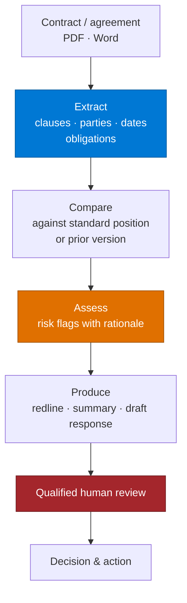

# Contract & Legal Intelligence Agent — Overview

## Scenario Overview

**Scenario Type**: Legal Operations / Contract Lifecycle
**Agent Type**: Copilot Studio agent, often with Foundry document processing
**Primary Tools**: Copilot Studio, Foundry / Document Intelligence, SharePoint, Word
**Complexity**: Advanced
**Status**: ✅ Available

Legal teams read documents to find things: obligations, risky clauses, deviations from a standard,
evidence supporting a claim. The reading is slow, the volume is growing, and the work is not
strategic — but the consequences of getting it wrong are.

This agent reads the documents and produces structured, cited output — clause extraction, risk
flags, comparisons against a standard, redlines — with a qualified human making every decision.

**15 distinct customers** across financial services, manufacturing, pharmaceuticals, food
production, automotive, public safety, and professional services in a single CAF portfolio.

---

## Problem Statement

- **Review is a bottleneck.** One privacy team reviews 3–4 data processing agreements a week
  through a repetitive, template-driven process.
- **Volume is administrative.** One group manages 300–400 board and shareholder resolutions a year
  across ~80 entities, largely by hand.
- **Non-lawyers wait on lawyers.** Procurement routinely depends on legal for routine reviews.
- **Inconsistency.** Different reviewers flag different things.
- **Evidence hunting.** Claims and disputes require searching correspondence, reports and contracts
  for the one paragraph that matters.

---

## Solution Summary

### Capability Variants Seen in the Field

| Variant | What it does |
|---|---|
| **Clause extraction & risk flagging** | Clause-by-clause analysis with risk scoring against a standard |
| **Redlining** | Tracked-changes Word output, plus a negotiation summary and a draft response |
| **Standard-position comparison** | Vendor agreement vs the organisation's approved position (DPAs, NDAs) |
| **Evidence assembly** | Retrieves supporting evidence for claims and obligations across a corpus |
| **Template-driven generation** | Board resolutions, authorisation letters, structured legal documents |
| **Report drafting** | Structured, standardised reports from unstructured operational input |
| **Bid & RFP support** | Response assembly against a question set |

The highest-value variant is usually **standard-position comparison** — it is repetitive, rule-based,
and consumes disproportionate senior time.

---

## Business Outcomes

| Outcome | Description |
|---|---|
| ⏱️ Review throughput | Routine reviews stop queuing behind senior legal capacity |
| 📐 Consistency | The same deviation is flagged the same way every time |
| 🔎 Evidence found in minutes | Claim support located across a corpus rather than by recall |
| 🧑‍⚖️ Legal time redirected | Senior time moves to negotiation and judgement |
| 📋 Defensible audit trail | What was checked, what was found, who decided |

---

## In Scope / Out of Scope

### ✅ In Scope
- Clause extraction, obligation identification, and structured comparison
- Risk flagging **with the reasoning and the source clause**
- Redline production as a reviewable draft
- Evidence retrieval across a document corpus
- Template-driven document generation with human commit

### ❌ Out of Scope — hard boundaries
- **Legal advice.** The agent surfaces and compares; a qualified person advises.
- **Final sign-off.** No agreement is approved, executed, or sent on the agent's judgement.
- **Determining enforceability, validity, or legal effect.**
- **Anything privileged leaving the review boundary.**
- **Autonomous external communication** with counterparties.

These are not cautious defaults. In most jurisdictions the line between "document analysis" and
"legal advice" carries regulatory weight, and the organisation's professional indemnity position
depends on it.

---

## Target Users

| Persona | Role |
|---|---|
| **In-house counsel / legal ops** | Primary reviewer; owns the standard positions |
| **Contract manager / procurement** | Runs routine reviews without waiting on legal |
| **Privacy / compliance team** | DPA and regulatory reviews |
| **Company secretarial** | Resolutions and corporate documents |
| **Delivery engineer** | Builds extraction, comparison, and the review surface |

---

## Qualification Checklist

| Question | Why it matters |
|---|---|
| Is there a **written standard position** to compare against? | Without it there is nothing to compare to, and defining it is the first work package |
| Who is qualified to review the output? | Determines the gate and the throughput ceiling |
| Are the documents text or scanned? | Scanned contracts need Foundry document processing |
| Is privilege in scope? | Privileged material has handling constraints that shape the architecture |
| What is the current volume and cycle time? | The business case |
| Are documents multilingual? | Legal language translation is high-risk; scope carefully |
| Does output ever reach a counterparty? | Changes the review gate entirely |
| Who owns the risk taxonomy? | Legal must own it, not the delivery team |

---

## What Actually Goes Wrong

| Symptom | Root cause | Where handled |
|---|---|---|
| Output reads as legal advice | Boundary instructions absent or weak | [3.Runbook.md](3.Runbook.md) Phase 2 |
| Risk flags without reasoning | Model asked to score, not to justify | Phase 2 |
| Missed clauses in scanned contracts | Attempted in Copilot Studio rather than Foundry | [2.Architecture.md](2.Architecture.md) |
| Redlines that mangle the document | Generating a document rather than tracked changes on the original | Phase 3 |
| Lawyers do not trust it | Output not traceable to the source clause | Phase 2 |
| Review takes as long as reading | Review surface does not show the source | [Human-in-the-Loop Review & Approval](../../02-patterns/Human-in-the-Loop-Review-and-Approval/Human-in-the-Loop-Review-and-Approval.md) |
| Inconsistent results on the same contract | No fixed standard position; comparison is open-ended | Phase 1 |

---

## Related Patterns

- [Human-in-the-Loop Review & Approval](../../02-patterns/Human-in-the-Loop-Review-and-Approval/Human-in-the-Loop-Review-and-Approval.md)
- [Intelligent Document Processing Pipeline](../../02-patterns/Intelligent-Document-Processing-Pipeline/Intelligent-Document-Processing-Pipeline.md)
- [Copilot Studio & Foundry Split Architecture](../../02-patterns/Copilot-Studio-and-Foundry-Split-Architecture/Copilot-Studio-and-Foundry-Split-Architecture.md)
- [Branded Office Artifact Generation](../../02-patterns/Branded-Office-Artifact-Generation/Branded-Office-Artifact-Generation.md) — for tracked-changes and template output
- [Grounding & Response Quality Remediation](../../02-patterns/Grounding-and-Response-Quality-Remediation/Grounding-and-Response-Quality-Remediation.md)

---

## Next

→ [2.Architecture.md](2.Architecture.md)
