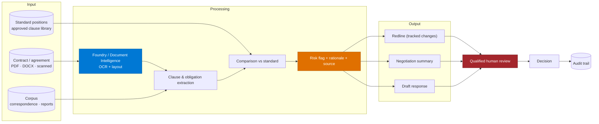

# Architecture — Contract & Legal Intelligence Agent

> **Platform**: Copilot Studio · Foundry / Document Intelligence · SharePoint · Word
> **Last Updated**: August 2026

---

## Solution Architecture

---

## The Standard Position Is the Product

Everything in this scenario depends on having something to compare against. Without it, "analyse
this contract" is open-ended and the output is inconsistent by construction.

| Artefact | What it contains |
|---|---|
| **Approved clause library** | The organisation's preferred wording per clause type |
| **Fallback positions** | Acceptable alternatives, ranked |
| **Red lines** | Positions that are never acceptable |
| **Risk taxonomy** | Categories and severities, **owned by legal** |
| **Materiality thresholds** | Value or term levels that change the review path |

If these do not exist in writing, producing them is the first work package — and it is a legal
exercise, not an engineering one. Several deliveries have discovered mid-build that "our standard
position" lived in one person's head.

> 📌 One organisation reported that existing internally-developed agents produced **inconsistent
> outcomes** on the same review task. Inconsistency is almost always the absence of a fixed standard
> to compare against, not a model problem.

---

## Document Processing Boundary

Contracts are frequently scanned, signed, and re-scanned. That places extraction firmly in Foundry.

| Source | Path |
|---|---|
| Native Word or text PDF | Copilot Studio knowledge may suffice for retrieval; still use structured extraction for clause-level work |
| Scanned or photographed | **Foundry / Document Intelligence** — Copilot Studio will not read it |
| Contract with tables (schedules, pricing) | Layout-aware extraction; tables ground poorly otherwise |
| Handwritten annotations | Expect failure; route to human |

See [Copilot Studio & Foundry Split Architecture](../../02-patterns/Copilot-Studio-and-Foundry-Split-Architecture/Copilot-Studio-and-Foundry-Split-Architecture.md).

---

## Risk Flagging — Reasoning Is Mandatory

A risk score without reasoning is unusable to a lawyer. Every flag must carry four things:

| Element | Example |
|---|---|
| **The clause** | Verbatim text from the document |
| **Location** | Section number and page |
| **The deviation** | What differs from the standard position |
| **The rationale** | Why that deviation matters, in terms of the risk taxonomy |

A reviewer must be able to disagree with the flag on its reasoning. If they cannot see the
reasoning, they will either accept everything or ignore everything — both of which defeat the
purpose.

---

## Redline Production

The highest-value and most technically awkward output.

| Requirement | Guidance |
|---|---|
| **Tracked changes on the original** | Not a regenerated document. Preserving the original is the point |
| Handles PDF and Word input | PDF input usually means producing a Word rendition first — flag this to the user |
| Change summary table | Every change listed with rationale |
| Draft counterparty response | Separate artefact, never sent automatically |
| Formatting preserved | Mangled numbering and cross-references destroy trust immediately |

> ⚠️ Generating a new document instead of marking up the original is the most common failure here.
> Lawyers compare against what was sent; a clean regenerated document is unreviewable.

---

## Privilege and Confidentiality

| Concern | Design response |
|---|---|
| Legal professional privilege | Confirm whether processing affects privilege in the relevant jurisdictions — get this from legal, in writing |
| Corpus segregation | Matter-level access control; a corpus-wide agent can cross matters it should not |
| Counterparty confidentiality | NDAs frequently restrict processing and disclosure of the agreement itself |
| Retention | Derived analysis may inherit the contract's retention class |
| Data residency | Legal documents commonly carry residency constraints |

Involve legal in the architecture review, not just the output review.

---

## Cost Model

| Driver | Implication |
|---|---|
| Document processing per page | Long contracts with schedules are expensive to process |
| Clause-by-clause analysis | Cost scales with clause count, not document count |
| Redline generation | Additional generation pass |
| Corpus evidence retrieval | Retrieval across a large corpus per query |

Scope by document type and value threshold. Running full clause-by-clause analysis on a low-value
routine order form is waste; route those to a lighter check.

---

## Non-Functional Considerations

| Concern | Guidance |
|---|---|
| **Latency** | Minutes per contract is acceptable. This is not interactive |
| **Accuracy expectation** | Lawyers expect near-perfect extraction; set expectations that this augments reading, not replaces it |
| **Language** | Legal language translation is high-risk. Prefer native-language standard positions over translation |
| **Versioning** | Standard positions change. Record which version an analysis was performed against |
| **Reviewer capacity** | The gate is a qualified person; throughput is bounded by them |

---

## Next

→ [3.Runbook.md](3.Runbook.md)
