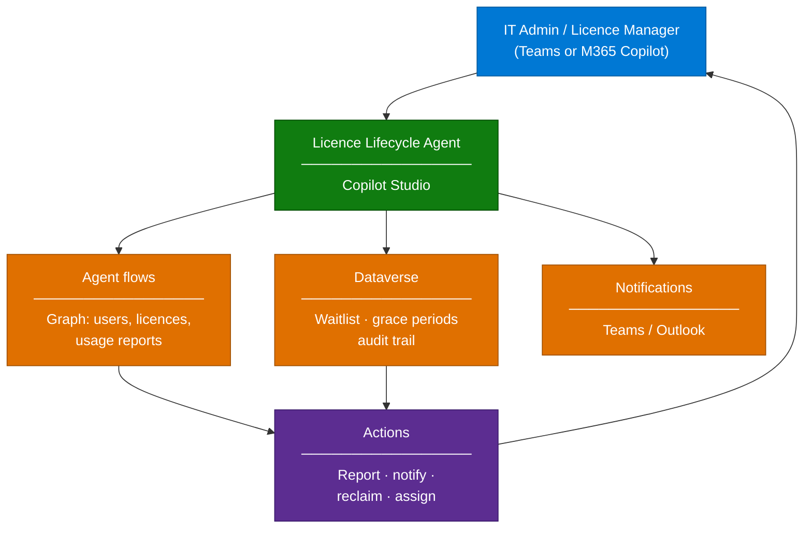

# Copilot Licence Lifecycle Agent — Overview

## Scenario Overview

**Scenario Type**: IT Operations / FinOps for Copilot
**Agent Type**: Copilot Studio custom agent with agent flows
**Primary Tools**: Microsoft Copilot Studio, Power Automate, Microsoft Graph, Dataverse
**Complexity**: Intermediate
**Status**: ✅ Available

An agent that manages the Microsoft 365 Copilot licence estate: who has a licence, who is
actually using it, who is waiting for one, and what to reclaim. Administrators interact with it
in natural language instead of exporting CSVs from the admin center.

This is one of the few agent scenarios where the agent's own subject is Copilot adoption. That
makes it unusually easy to justify — it pays for itself in reclaimed licences — and it doubles
as a working reference implementation that customer teams can learn Copilot Studio from. Several
delivery teams have used it exactly that way: deploy it, then hand the build session to the
customer as enablement.

---

## Problem Statement

Organizations buy Copilot licences in blocks and then manage them by hand:

- **No usage-driven reassignment.** Licences sit with users who stopped using Copilot months ago
  while colleagues wait on a list.
- **Manual, single-operator processes.** One administrator holds the spreadsheet. When they are
  away, nothing moves.
- **No visibility into value.** Leadership asks "are we getting our money's worth" and the
  answer takes a week to assemble.
- **Waitlists managed in email.** Requests arrive by mail and Teams message and get lost.
- **Renewal risk.** Unused licences at renewal are the strongest argument for reducing the
  estate.

---

## Solution Summary

A Copilot Studio agent that combines four capabilities behind a conversational interface:

| Capability | Description |
|---|---|
| 📋 Licence inventory | Who holds a Copilot licence, since when, in which department |
| 📈 Usage insight | Active vs dormant licence holders based on Copilot usage signals |
| 🔁 Reclaim & reassign | Identify dormant licences, notify the holder, reclaim after a grace period, assign to the next person on the waitlist |
| 🎟️ Waitlist management | Structured intake, approval, and queue position — in Dataverse, not in email |

The agent is the interface. The work is done by agent flows against Microsoft Graph, with
Dataverse holding the waitlist, the grace-period state, and the audit trail.

---

### How It Works

---

## Business Outcomes

| Outcome | Description |
|---|---|
| 💰 Reclaimed spend | Dormant licences returned to the pool instead of renewed |
| ⏱️ Hours back per month | Reporting and reassignment stop being manual |
| 📊 Defensible renewal position | Usage evidence, by department, on demand |
| 🧑‍🤝‍🧑 Fair allocation | A queue with rules replaces "whoever asked the loudest" |
| 🎓 Enablement side-effect | A real, non-trivial Copilot Studio solution the customer team can learn from |

---

## In Scope / Out of Scope

### ✅ In Scope

- Licence inventory and usage reporting through natural language
- Dormancy detection with a configurable threshold and grace period
- Notification, reclaim, and reassignment workflow with approvals
- Waitlist intake and queue management in Dataverse
- Full audit trail of every assignment and reclaim

### ❌ Out of Scope

- Purchasing or amending the licence agreement
- Managing non-Copilot licences (extensible, but scope it deliberately)
- Copilot Credits / pay-as-you-go consumption management — see
  [Copilot Credits & Cost Control](../../02-patterns/Copilot-Credits-Cost-Control/Copilot-Credits-Cost-Control.md)
- Replacing the organization's ITSM request process, if one already exists for licences

---

## Target Users

| Persona | Role in This Scenario |
|---|---|
| **Licence Manager / IT Ops** | Primary user — runs reports, approves reclaims and assignments |
| **Department Manager** | Requests licences for their team, sees queue position |
| **Employee** | Receives dormancy notifications, requests a licence |
| **M365 Admin** | Owns the service principal permissions and the approval policy |
| **Delivery Engineer** | Deploys, configures thresholds, hands over |

---

## Design Decisions That Matter

| Decision | Guidance |
|---|---|
| **What counts as dormant?** | Agree an explicit definition (for example, no Copilot activity in 45 days) with the business before building. This is a people decision, not a technical one |
| **Automatic or approved reclaim?** | Start with human approval. Fully automatic reclaim generates escalations in month one. Move to automatic only after the reclaim rate stabilises |
| **Grace period length** | 14 days with two notifications works well. Shorter feels punitive; longer defeats the purpose |
| **Who can invoke the agent?** | Restrict to the licence management team. This agent takes destructive actions |
| **Identity for actions** | Actions must run with an appropriately scoped identity. Do not use a personal admin account — it breaks the moment that person changes role |
| **Credits consumption** | Agent flows and generative actions consume Copilot Credits. Estimate before deploying — see the cost-control pattern |

---

## What Actually Goes Wrong

| Symptom | Root cause | Mitigation |
|---|---|---|
| Reclaim notifications go to the wrong people | Usage signal lags actual usage; users on leave look dormant | Exclude users on approved leave; use a longer window |
| Agent takes an action it should not | Insufficient guardrails between reporting and acting | Separate read-only topics from action topics; require explicit confirmation for anything destructive |
| Actions execute under the maker's credentials rather than the invoking user's | Connection configured with maker identity | Configure end-user authentication; verify the audit trail names the real actor |
| Credit consumption higher than expected | Agent flows and generative actions billed per invocation, including during testing | Use the usage estimator and set an agent-level credit cap before pilot |
| Solution cannot be moved between environments cleanly | Built directly in the default environment without a solution | Build inside a solution from day one, in a dedicated environment |

---

## Related Patterns

- [Copilot Credits & Cost Control](../../02-patterns/Copilot-Credits-Cost-Control/Copilot-Credits-Cost-Control.md)
- [Agent Governance & Rollout Control Plane](../../02-patterns/Agent-Governance-and-Rollout-Control-Plane/Agent-Governance-and-Rollout-Control-Plane.md)
- [Agent Publishing & Channel Deployment](../../02-patterns/Agent-Publishing-and-Channel-Deployment/Agent-Publishing-and-Channel-Deployment.md)

---

## Next

→ [2.Architecture.md](2.Architecture.md)
