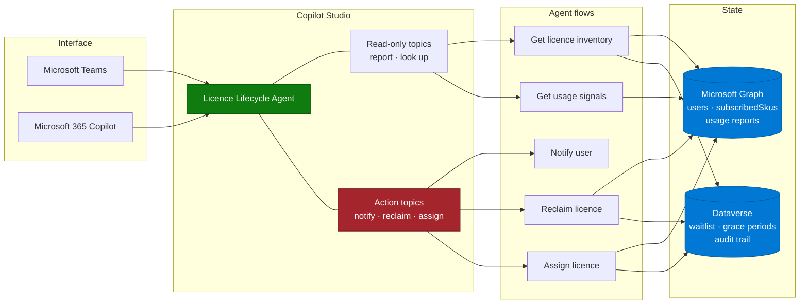

# Architecture — Copilot Licence Lifecycle Agent

> **Platform**: Microsoft Copilot Studio · Power Platform · Microsoft Graph
> **Last Updated**: August 2026

---

## Solution Architecture

The colour split is deliberate: **action topics are the risk surface**. Design them separately,
test them separately, and gate them separately.

---

## Technology Stack

| Layer | Component | Purpose |
|---|---|---|
| Interface | Microsoft Teams, Microsoft 365 Copilot | Where administrators talk to the agent |
| Agent | Copilot Studio custom agent | Topics, instructions, orchestration |
| Automation | Agent flows | Graph calls, notifications, state changes |
| Data | Microsoft Graph | Users, `subscribedSkus`, Copilot usage reports |
| State | Dataverse | Waitlist, grace periods, audit trail, configuration |
| Notification | Teams / Outlook connectors | Dormancy warnings and assignment confirmations |
| Governance | Power Platform admin center | Environment, DLP, credit caps |

---

## Data Model (Dataverse)

Minimum viable tables:

| Table | Key columns | Purpose |
|---|---|---|
| `LicenceHolder` | UserId, AssignedOn, LastActivityDate, Status, Department | Current state per licence |
| `WaitlistEntry` | UserId, RequestedOn, RequestedBy, Justification, Status, Position | Ordered queue |
| `ReclaimCase` | UserId, DetectedOn, NotifiedOn, GraceEndsOn, Outcome, ActionedBy | One record per reclaim attempt |
| `Configuration` | DormancyDays, GracePeriodDays, AutoReclaimEnabled, ExclusionGroup | Thresholds, so changes do not require a rebuild |
| `AuditEvent` | Timestamp, Actor, Action, TargetUser, Details | Every assignment, reclaim, and override |

Two things this model buys you:

- **Thresholds are data, not code.** The business will change the dormancy definition at least
  twice. Do not hard-code it into a flow.
- **`ReclaimCase` is a case, not a flag.** You need the history of "we warned this person, they
  responded, we cancelled the reclaim" for the inevitable dispute.

---

## Environment and ALM

| Decision | Recommendation |
|---|---|
| Environment | A dedicated, non-default environment with Dataverse. Never build this in the default environment |
| Solution | Build inside an unmanaged solution from the first component. Retrofitting components into a solution afterwards is avoidable pain |
| Environments | Dev → Test → Prod, promoted as a managed solution via pipelines |
| Connection references | Use them for every connector. Hard-coded connections do not survive a solution import |
| Environment variables | Dormancy threshold defaults, notification templates, admin group IDs |

> ⚠️ Agents created outside a solution frequently cannot be added to one cleanly afterwards.
> Start correctly.

---

## Identity and Permissions

This agent reads directory data and changes licence assignments. Get the identity model right
before you write a single flow.

| Aspect | Guidance |
|---|---|
| Graph permissions | Least privilege: read users and subscribed SKUs, read Copilot usage reports, and the specific write scope needed to assign or remove the licence |
| Identity used for actions | A dedicated service identity with a documented owner — never an individual admin's account |
| Who can trigger actions | Restrict agent access to the licence management team; the read-only reporting view can be shared more widely if useful |
| End-user attribution | Ensure the audit trail records the human who approved the action, not the service identity that executed it |
| Approval gate | Reclaims and assignments should require explicit confirmation in the conversation before the flow runs |

A recurring and serious failure mode in Copilot Studio solutions of this type is actions
executing under the **creator's** credentials rather than the invoking user's. Verify this
explicitly during testing by checking who the audit record names.

---

## Cost Model

This agent consumes Copilot Credits. Approximate the run rate before deployment:

| Activity | Credit rate |
|---|---|
| Generative answer | 2 credits |
| Agent action (topic transitions, triggers, deep reasoning) | 5 credits |
| Agent flow actions | 13 credits per 100 actions |

For a licence team running, say, 200 interactions a month with a handful of flow calls each,
consumption is modest. The risk is not steady-state usage — it is **testing**. Iterating on an
agent with action flows can consume thousands of credits before go-live.

Mitigations:

- Estimate with the Copilot Studio agent usage estimator before building.
- Set a per-agent monthly consumption cap in the Power Platform admin center.
- Allocate capacity explicitly to the development environment so testing cannot draw down the
  tenant pool.

See [Copilot Credits & Cost Control](../../02-patterns/Copilot-Credits-Cost-Control/Copilot-Credits-Cost-Control.md).

---

## Deployment Surfaces

| Surface | Notes |
|---|---|
| Microsoft Teams | The natural home for an admin tool. Publish here first |
| Microsoft 365 Copilot | Useful for discoverability; validate that behaviour matches Teams before promising parity |
| Standalone web | Not recommended — this agent takes privileged actions and should stay inside authenticated Microsoft surfaces |

Behaviour differences between Teams and the Microsoft 365 Copilot channel are common — adaptive
card rendering, response formatting, and session handling in particular. Test on every channel
you intend to publish to; do not assume parity. See
[Agent Publishing & Channel Deployment](../../02-patterns/Agent-Publishing-and-Channel-Deployment/Agent-Publishing-and-Channel-Deployment.md).

---

## Next

→ [3.Runbook.md](3.Runbook.md)
