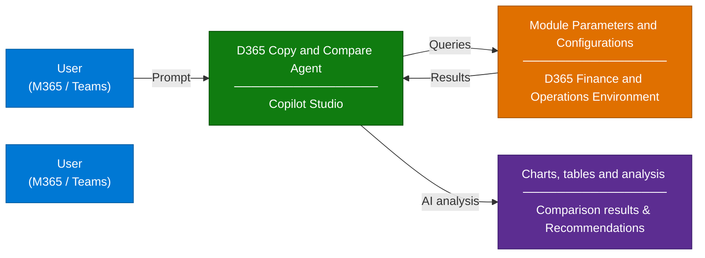

# Dynamics 365 Copy and Compare Configurations Agent

## Scenario Overview

**Scenario Type**: Analyze, update and copy Configuration Parameters  
**Agent Type**: Interactive
**Primary Tools**: Microsoft Copilot Studio, VS Code  
**LLM**: Claude Sonnet 4.6  
**Complexity**: Intermediate–Advanced  
**Owner**: AiBP CoE Dynamics 365 F&O Team  
**Status**: ✅ Available

This scenario describes how to deploy and configure the **Dynamics 365 copy and compare  Agent**, an AI agent that helps organizations analyzes, compares and updates D365 Module Parameters.

This agent helps the project team to identify the missing configurations. It also compares module parameters across companies and delivers actionable insights. It also supports the implementatiion planning and task prioritization. 

---

## Problem Statement

Dynamics 365 Finance and Operations Compare and Copy Configurations Agents helps you to:

- **Identify configured vs. missing setup** across modules, enabling implementation teams to accurately pinpoint and address business process areas relevant to the deployment.

- **Compares module parameters across multiple companies**, which is critical in multi‑entity implementations where downstream testing issues often stem from missing or incorrect configurations.

- **Delivers actionable insights** by evaluating whether key parameters, configurations, and controls—such as invoice matching, approval workflows, and journal setups—have been properly established.

- **Supports implementation planning and task prioritization** through structured timelines to ensure critical configurations are completed and validated during the implementation lifecycle, with the ability to generate corresponding Azure DevOps work items.

- **Azure DevOps integration**: The VS Code–based agent automatically creates prioritized work items for the project team based on configuration gaps identified.

**Scope limitation**: Not intended for provisioning new companies, instances, or environments.

---

## Solution Summary

- The D365 Compare and Copy agent enables **comprehensive analysis and centralized management** of D365 F&O module parameters and configurations. 

- The agent **identifies and categorizes** configurations **based on risk levels—high, medium, and low—to support informed decision‑making**.

- Provides **analytical dashboards with visual risk insights through charts, diagrams, prioritization lists**, and interactive dashboards. It also **eliminates the need for manual documentation and updates of configuration parameters**. 

- Overall, it **helps in ensuring consistent, repeatable outcomes through natural language–driven interactions**, reducing reliance on specialized technical resources for configuration management.

### Key Capabilities

| Capability | Description |
|---|---|
| 🔍 **AI driven configuration analysis** | AI‑driven analysis of module parameters and system configurations across Dynamics 365 F&O modules |
| 📊 **Chart Visualization** | Renders parameter comparison results as Pie, Bar, Column, and Time charts via interactive charts in HTML format |
| 🔔 **Guided Recommendations** | To help project teams effectively manage and remediate high, medium, and low‑risk configuration gaps |
| 📧 **Automated creation of prioritized work items** | Automated creation of prioritized Azure DevOps work items generated by the VS Code–based agent to support implementation and remediation efforts.|

---

### How It Works

The agent operates through three interaction models:

| Mode | Trigger | Description |
|---|---|---|
| **Interactive** | User provides a prompt in Copilot Studio/Teams/VS Code | Agent provides a response and results with charts, diagrams, tables and recommendations |

> 📌 For detailed architecture diagrams, see [Architecture](./2.Architecture.md).

---

## Business Outcomes

| Outcome | Description |
|---|---|
| 🔍 **Configurations & Parameter Analysis** | Analyzes configurations and parameter values in different modules within the D365 F&O application.  |
| ⚡ **Faster Execution and Elimination of manual tasks** | Eliminates the need to maintain manual configuration worksheets. Provides AI-powered analysis for faster reporting into configured modules. |
| 🧑‍💻 **Natural language capability** | Allows the project team to update configurations with natural language based prompts.  |
| 📈 **Project Planning and Informed Decision Making** | Helps the project team to analyze and plan for targeted updates to configurations.  |
| 🔌 **Faster time for deployment** | Allows for quick updates and deployment of parameter fixes across companies and environments. |

---

## In Scope / Out of Scope

### ✅ In Scope

- Configuring the Copilot Studio Agent and VS Code agent using ERP MCP servers
- Publishing the Copilot Studio solution to Microsoft Teams

### ❌ Out of Scope

- D365 Environment preparation for Copilot Studio agent to work with version 10.0.47 
- End user Training and Documentation

---

## Target Users

| Persona | Role in This Scenario |
|---|---|
| **D365 ERP Solution Architect** | Checks how well different modules and workstreams/functional areas have been configured in D365 F&O environment as per the solution scope. 
   **D365 ERP Project Manager**| Needs to identify the risk level and work on a completion plan to set the parameter values for all in-scope modules/areas in the D365 F&O Application |
| **D365 ERP Functional Consultant** | Defines Parameter values and tests the configuration and make required updates. Triages any bugs related to parameters and make the required updates |
| **Test Lead/Test Manager** | Analysis the impact of parameter changes and values on various features and test cases, co-ordinates testing and ensuring that test cases are working as per requirement |
---

## Data Sources

| Source | Content | Integration |
|---|---|---|
| **D365 F&O Environment(s)** | Module Parameters from different modules | D365 ERP MCP Server

> 📌 The agent does **not** use web search or general LLM knowledge for telemetry responses.
> It relies on Microsoft Learn Docs MCP server as well as learn articles from the Microsoft Learn Site.

---

---

## Related Resources

| Resource | Link |
|---|---|
| Architecture | [2.Architecture.md](./2.Architecture.md) |
| Step-by-Step Runbook | [3.Runbook.md](./3.Runbook.md) |
| Sample Prompts | [4.Sample-prompts.md](./4.Sample-prompts.md) |
| Copilot Studio Documentation | [Microsoft Learn](https://learn.microsoft.com/en-us/microsoft-copilot-studio/) |
| Application Insights Documentation | [Microsoft Learn](https://learn.microsoft.com/en-us/azure/azure-monitor/app/app-insights-overview) |

---

