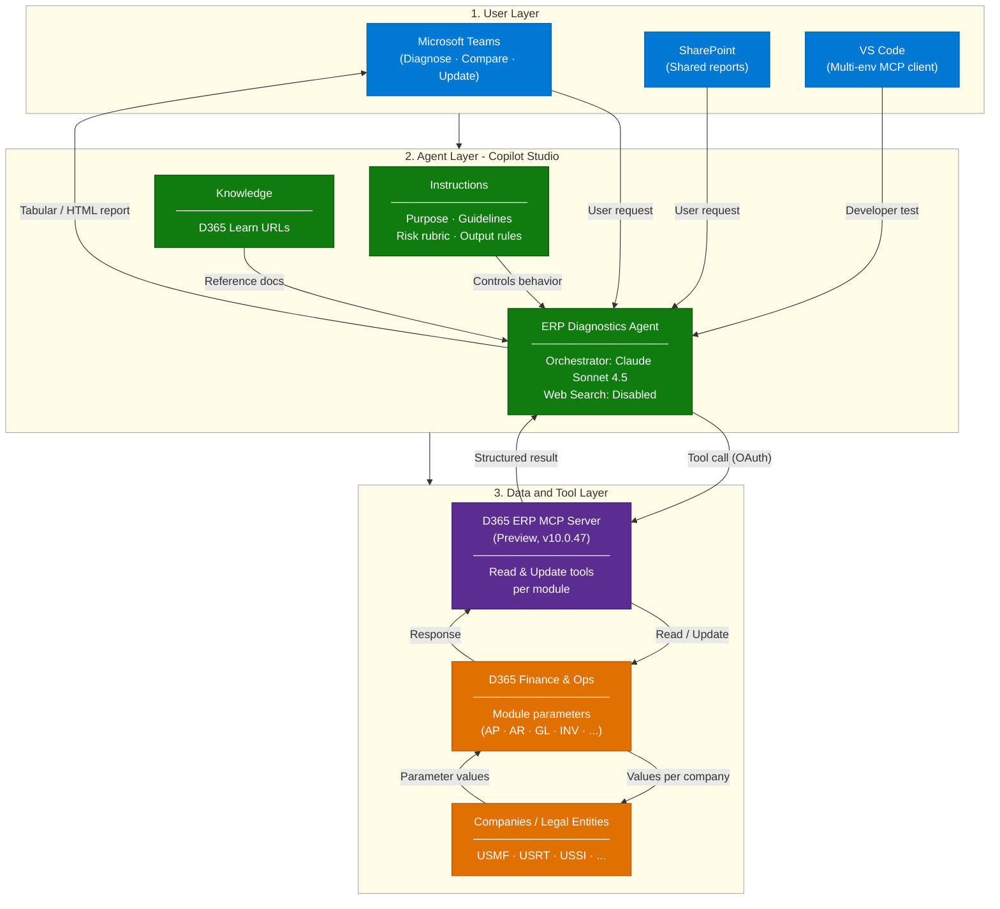
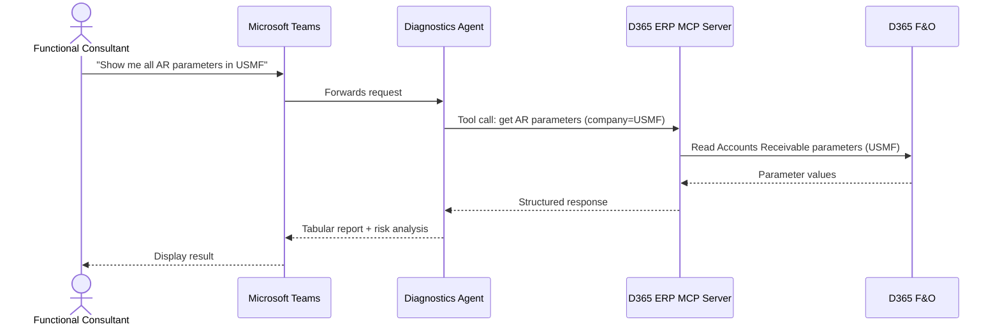
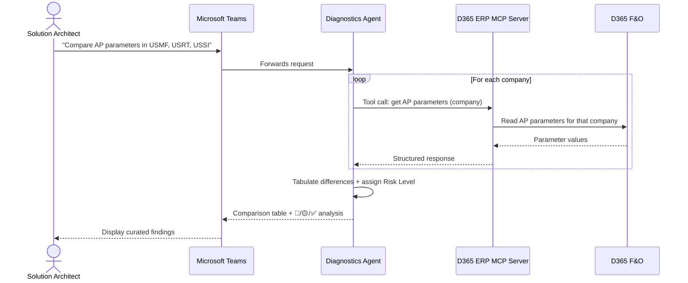
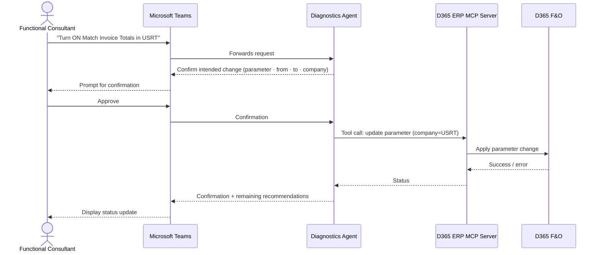

# Dynamics 365 ERP Configurations Diagnostics Agent — Architecture

## 1. Logical Architecture

The ERP Configurations Diagnostics Agent operates across three layers: the **User Layer**
(how implementation teams interact), the **Agent Layer** (how the agent reasons and
orchestrates), and the **Data & Tool Layer** (the D365 ERP MCP server and D365 F&O itself).

### How It Works

### Environment Architecture

- The **D365 Finance & Operations environment** (Tier-2 or Power Platform environment on
  version **10.0.47**) is the system of record for all module parameters.
- The **Dynamics 365 ERP MCP server (Preview)** runs alongside F&O and exposes module
  parameters as MCP tools (read and update).
- The **Copilot Studio agent** hosts the orchestration logic, instructions, and knowledge
  bindings, and authenticates to the MCP server over **OAuth**.
- Users interact with the agent through **Microsoft Teams** (primary channel) or
  **SharePoint** (shared deployments). Developers and delivery engineers can connect
  additional environments via **VS Code** using `mcp.json`.

---

## 2. Key Components

| Component                        | Technology                                      | Role                                                                                                  |
| -------------------------------- | ----------------------------------------------- | ----------------------------------------------------------------------------------------------------- |
| **Agent Environment**            | Power Platform environment (same tenant as F&O) | Hosts the Copilot Studio agent and Dataverse dependencies                                             |
| **Agent Runtime**                | Microsoft Copilot Studio                        | Core agent orchestration and response generation                                                      |
| **LLM / Orchestrator**           | Anthropic **Claude Sonnet 4.6**                 | Natural-language understanding, tool selection, risk reasoning, and answer generation                 |
| **Agent Instructions**           | Copilot Studio prompt                           | Defines purpose, guidelines, skills, step-by-step flow, risk rubric, and output rules                 |
| **Knowledge Source**             | D365 Learn URLs                                 | Reference documentation used for parameter meaning and recommended values; web search is **disabled** |
| **D365 ERP MCP Server**          | Generally available feature in **F&O v10.0.47** | Exposes module parameters and update actions as MCP tools                                             |
| **D365 Finance & Operations**    | Tier-2 / Power Platform environment, v10.0.47   | System of record for all configuration parameters                                                     |
| **Companies / Legal Entities**   | USMF, USRT, USSI (sample)                       | Scope of parameter diagnostics and comparisons                                                        |
| **Channels**                     | Microsoft Teams, SharePoint                     | Primary end-user access points                                                                        |
| **VS Code MCP Client**           | `mcp.json` configuration                        | Developer / delivery tool for connecting multiple F&O environments during testing                     |
| **Allowed MCP Clients Registry** | F&O System Administration form                  | Registers Copilot Studio (and other clients) as approved callers of the MCP server                    |

---

## 3. Data Flow

### Scenario A — Diagnose Parameters in a Single Company

### Scenario B — Compare Parameters Across Companies

### Scenario C — Update a Parameter (Human-in-the-Loop)

---

## 4. Security & Governance Considerations

| Area                                    | Consideration                                                                                                                                                                                                                                                             |
| --------------------------------------- | ------------------------------------------------------------------------------------------------------------------------------------------------------------------------------------------------------------------------------------------------------------------------- |
| **Authentication**                      | Agent authenticates to the D365 ERP MCP server using **OAuth**. Copilot Studio must be registered in F&O under **System Administration → Setup → Allowed MCP clients**.                                                                                                   |
| **Data Scope**                          | Web search is **disabled**. The agent responds exclusively from D365 F&O (via the MCP server) and the curated D365 Learn knowledge source.                                                                                                                                |
| **Write Operations**                    | All parameter updates are **human-in-the-loop**. The agent never applies a change without explicit user confirmation of the intended parameter, value, and company.                                                                                                       |
| **Access Control**                      | User permissions in D365 F&O (security roles, legal-entity access) govern which parameters can be read or updated. The MCP server respects F&O security.                                                                                                                  |
| **Allowed Clients**                     | Only MCP clients registered in F&O's *Allowed MCP clients* form can call the server; the registry is the primary access-control surface for this integration.                                                                                                             |
| **Generally Available Feature Hygiene** | The *GA Dynamics 365 ERP Model Context Protocol server* feature is automatically enabled in environments of version 10.0.47 or above.                                                                                                                                     |
| **Audit Trail**                         | Parameter changes are logged in F&O's standard database logging / audit trail if database logging is enabled for those tables; agent-driven changes are indistinguishable in shape from direct user changes and should be captured in standard change-management records. |
| **Content Safety**                      | Claude Sonnet 4.6 content filters remain active; no custom model training is involved.                                                                                                                                                                                    |
| **Model Availability**                  | Anthropic models may need to be enabled at the tenant level in **Power Platform Admin Center** before use in an agent.                                                                                                                                                    |

---

## Related Resources

| Resource             | Link                                       |
| -------------------- | ------------------------------------------ |
| Scenario Overview    | [1.Overview.md](1.Overview.md)             |
| Step-by-Step Runbook | [3.Runbook.md](3.Runbook.md)               |
| Sample Prompts       | [4.Sample-prompts.md](4.Sample-prompts.md) |
