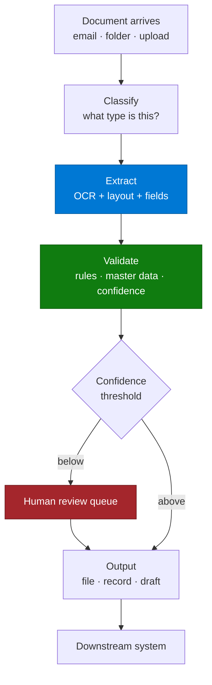

# Document Processing & Extraction Agent — Overview

## Scenario Overview

**Scenario Type**: Operations / Back-Office Automation
**Agent Type**: Foundry document processing with a Copilot Studio or Power Platform front end
**Primary Tools**: Foundry / Document Intelligence, Content Understanding, Copilot Studio, Power Automate, SharePoint
**Complexity**: Advanced
**Status**: ✅ Available

Somewhere in every operations function there is a person opening PDFs and typing what they see into
another system. Quotes, invoices, order confirmations, billing statements, work instructions, RFQs,
inspection reports. The work is high-volume, low-judgement, and error-prone precisely because it is
boring.

This agent reads those documents, extracts the fields, validates them, and produces something the
downstream system can consume.

**8–12 distinct customers** in a single CAF portfolio, across manufacturing, energy, automotive
retail, real estate, agribusiness, electronics, healthcare, and public sector.

---

## Problem Statement

Real volumes from the field:

- **~70,000 requests for quotation a year**, arriving as multilingual email attachments, manually
  read and re-keyed.
- **70–140 work instruction documents a week**, each manually reviewed and routed.
- Dealer billing statements arriving as PDFs, manually reconciled line by line.
- Property documents arriving with no classification, no metadata, and no consistent filing.
- Order emails re-typed into a spreadsheet before they can enter the ERP.

Common characteristics:

| Characteristic | Consequence |
|---|---|
| Documents arrive in inconsistent formats | Template-based extraction breaks |
| Many are scanned or photographed | Text-based tools return nothing |
| Multiple languages | Single-language pipelines fail silently |
| **The target system often has no API** | The output must be a file, not a write |
| Errors are expensive | A mis-keyed quantity or price reaches a customer |

> 📌 One customer's assessment concluded plainly that the OCR requirement **"cannot be accomplished
> with Copilot"** and needed Foundry. That conclusion arrives in most of these engagements — reach
> it in week one, not week six.

---

## Solution Summary

Classify → extract → validate → route → output. Each stage fails differently and is measured
separately. Treating it as one step is the most common design mistake.

---

## Business Outcomes

| Outcome | Description |
|---|---|
| ⏱️ Handling time | Minutes of re-keying become seconds of confirmation |
| 🎯 Accuracy | Validation against master data catches what tired eyes miss |
| 📈 Capacity | Volume scales without headcount |
| 🔁 Consistency | The same document type is handled the same way |
| 🔍 Traceability | Every extracted field traceable to its location in the source |
| 👥 People redeployed | Onto exceptions and customer contact |

---

## In Scope / Out of Scope

### ✅ In Scope
- Document classification by type
- OCR and layout-aware field extraction, including tables
- Multilingual extraction
- Validation against business rules and master data
- Confidence-based routing to human review
- Output as a structured file, record, or draft transaction

### ❌ Out of Scope
- Posting directly to a system of record without human commit, unless explicitly approved with a
  measured error rate behind it
- Handwriting recognition at production accuracy — pilot it, do not promise it
- Interpreting documents whose meaning requires domain judgement
- Replacing an integration. If the target system has no API, the output is a file and everyone
  needs to agree that is acceptable

---

## Target Users

| Persona | Role |
|---|---|
| **Operations / shared services team** | Handles the volume today; reviews exceptions tomorrow |
| **Process owner** | Owns the accuracy threshold and the exception path |
| **Master data owner** | Provides the validation reference |
| **Delivery engineer** | Builds classification, extraction, validation, routing |
| **Integration owner** | Owns the downstream boundary — often the hardest conversation |

---

## Qualification Checklist

| Question | Why it matters |
|---|---|
| How many document **types**, and how variable within a type? | Variability drives effort more than volume |
| Scanned or native? Photographed? | Determines the extraction stack immediately |
| What languages? | Multilingual is a different accuracy baseline |
| **Does the target system have an API?** | If not, output is a file — confirm the business accepts that |
| What is the acceptable error rate? | Determines the confidence threshold and review load |
| What master data exists for validation? | Validation is where accuracy actually comes from |
| Who reviews exceptions today? | They are the reviewers tomorrow |
| What happens when it is wrong today? | Sizes the risk and the business case |
| Is there a golden set of documents with known correct values? | Without it, accuracy cannot be measured |

---

## What Actually Goes Wrong

| Symptom | Root cause | Where handled |
|---|---|---|
| Nothing extracted from scans | Attempted with text-based tooling | [2.Architecture.md](2.Architecture.md) |
| Accuracy good in demo, poor in production | Demo used clean documents | [3.Runbook.md](3.Runbook.md) Phase 1 |
| Tables extracted as garbage | Not using layout-aware extraction | Phase 2 |
| Fields extracted but wrong | No validation against master data | Phase 3 |
| Review queue larger than the original workload | Confidence threshold set blind | Phase 3 |
| Built, then discovered the target system has no API | Integration boundary not qualified | Qualification |
| Non-English documents fail silently | Language coverage never tested | Phase 1 |
| Nobody can say whether it is accurate | No golden set | Phase 1 |

---

## Related Patterns

- [Intelligent Document Processing Pipeline](../../02-patterns/Intelligent-Document-Processing-Pipeline/Intelligent-Document-Processing-Pipeline.md) — the reference implementation
- [Copilot Studio & Foundry Split Architecture](../../02-patterns/Copilot-Studio-and-Foundry-Split-Architecture/Copilot-Studio-and-Foundry-Split-Architecture.md)
- [Human-in-the-Loop Review & Approval](../../02-patterns/Human-in-the-Loop-Review-and-Approval/Human-in-the-Loop-Review-and-Approval.md)
- [Agentic Workflow Orchestration](../../02-patterns/Agentic-Workflow-Orchestration/Agentic-Workflow-Orchestration.md)

---

## Next

→ [2.Architecture.md](2.Architecture.md)
