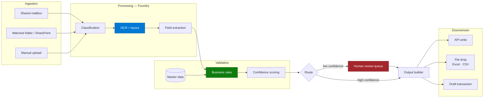
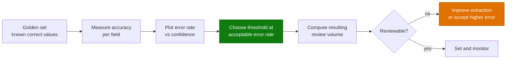

# Architecture — Document Processing & Extraction Agent

> **Platform**: Foundry / Document Intelligence · Content Understanding · Copilot Studio · Power Automate · SharePoint
> **Last Updated**: August 2026

---

## Solution Architecture

---

## The Extraction Stack Decision

Make this in week one.

| Document characteristic | Use |
|---|---|
| Native PDF / Word, simple layout | Copilot Studio knowledge may suffice for Q&A — **not for field extraction** |
| Any scanned or photographed document | **Foundry / Document Intelligence** |
| Structured forms, consistent layout | Document Intelligence custom model |
| Semi-structured (invoices, receipts, IDs) | Document Intelligence prebuilt models |
| High variability, no fixed layout | Content Understanding or a model-based extraction pass |
| Tables and line items | Layout-aware extraction, always |
| Handwriting | Pilot only. Do not commit to an accuracy number |

> ⚠️ The single most common wasted sprint in this scenario is proving that Copilot Studio cannot
> read a scanned PDF. It cannot. Test one real scan on day one and move on.

See [Copilot Studio & Foundry Split Architecture](../../02-patterns/Copilot-Studio-and-Foundry-Split-Architecture/Copilot-Studio-and-Foundry-Split-Architecture.md).

---

## Classification Comes First

Extraction quality collapses when the pipeline does not know what it is reading. Classify before
extracting, and treat "unknown type" as a valid outcome routed to a human.

| Classification design | Guidance |
|---|---|
| Class list | Closed set, agreed with the process owner |
| Unknown | Always a class. Never force a document into the nearest match |
| Multi-document files | Split before classifying — one PDF often holds several documents |
| Confidence | Score classification separately from extraction |

One real-estate implementation classified, tagged metadata, OCR'd, and then **recommended** a
filing location for human confirmation — a good shape. The system proposes; the person commits.

---

## Validation Is Where Accuracy Comes From

Extraction gets you a value. Validation tells you whether to trust it.

| Validation type | Example |
|---|---|
| **Format** | Date parses; amount is numeric; reference matches the expected pattern |
| **Master data lookup** | Supplier exists; part number exists; customer account is active |
| **Arithmetic** | Line items sum to the stated total; tax computes correctly |
| **Cross-field** | Delivery date after order date; currency consistent |
| **Business rule** | Quantity within the normal range for that part |
| **Duplicate** | This document reference has been processed before |

A field that extracts cleanly and validates against master data can carry a high confidence score.
A field that extracts cleanly and matches nothing should be treated as low confidence regardless of
what the extraction engine reports.

---

## Confidence Thresholds and Review Load

The threshold is a business decision expressed as a number, and it must be set from measured data.

Set the threshold per field, not per document. Reference numbers and amounts warrant a stricter
threshold than a free-text description.

---

## The Downstream Boundary — Qualify This Early

The most damaging late discovery in this scenario is that the target system cannot be written to.

| Situation | Design response |
|---|---|
| Target has a supported API | Write, with human commit unless an approved error rate says otherwise |
| **Target has no API** | Output a file the target can import. Confirm the business accepts a file, in writing |
| Target has an API but no access is granted | Same as no API, until access exists |
| Target is a legacy system with manual entry only | The agent produces a review-ready worksheet; a person keys it. Still a large saving — but say so upfront |

Real examples: an order-processing pipeline whose deliverable was an **SAP-ready Excel file**; a
procurement pipeline that produced **draft purchase orders as files** because writes were out of
scope; a payroll integration where **no APIs existed between the systems at all**.

> 📌 "What does the output land in, and who commits it?" belongs in the first qualification
> conversation. It determines the architecture more than the document format does.

---

## Multilingual Processing

| Concern | Guidance |
|---|---|
| Language detection | Explicit step; do not assume |
| Extraction accuracy per language | Measure separately. A single blended accuracy number hides failures |
| Field labels in local language | Extraction prompts must handle the local label set |
| Numeric and date formats | Decimal separators and date orders vary — a validation concern, not an extraction one |
| Unsupported language | Route to human. Never guess |

One customer's RFQ flow spans multiple European languages at ~70,000 documents a year. Accuracy was
reported per language, and the weakest language set the rollout order.

---

## Cost Model

| Driver | Notes |
|---|---|
| Pages processed | The dominant cost. Multi-page attachments add up quickly |
| Model type | Custom and layout models cost more than basic read |
| Reprocessing | Failed and retried documents are paid for twice |
| Classification pass | A separate pass over at least the first page |
| Review surface | Power Platform licensing for reviewers |

Estimate on **pages per month**, not documents per month. The difference is often 3–5x.

---

## Non-Functional Considerations

| Concern | Guidance |
|---|---|
| **Throughput** | Batch overnight where the business allows; peak-hour design costs more |
| **Latency** | Seconds to minutes per document is normal and usually fine |
| **Resilience** | Retry with backoff; a poison-document queue that never blocks the pipeline |
| **Traceability** | Every extracted field references its page and bounding region |
| **Retention** | Source documents and extractions may carry different retention classes |
| **Residency** | Document processing region must match the data's residency requirement |
| **Drift** | Suppliers change their templates. Monitor accuracy continuously, not just at go-live |

---

## Next

→ [3.Runbook.md](3.Runbook.md)
