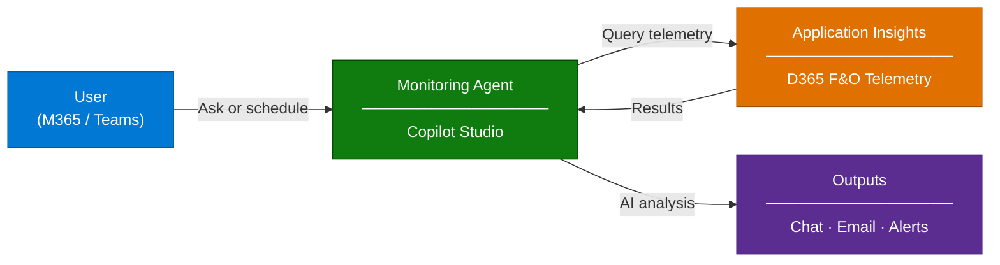

# Dynamics 365 Monitoring Agent - Overview

## Scenario Overview

**Scenario Type**: Application Health Monitoring  
**Agent Type**: Interactive + Autonomous (Proactive)  
**Primary Tools**: Microsoft Copilot Studio, Power Platform, Application Insights, Dataverse, Azure Blob Storage  
**LLM**: GPT-4.1  
**Complexity**: Intermediate–Advanced  
**Owner**: BSA Innovation  
**Status**: ✅ Available

This scenario describes how to deploy and configure the **Dynamics 365 Monitoring Agent**, a data-driven
AI agent that helps organizations detect issues earlier, understand them faster, and resolve them more
consistently, without requiring deep expertise in logs, KQL, or monitoring tools.

The agent is built on a **reusable framework** (`MCSA Agent Framework`) that separates
agent logic from monitoring capabilities. New telemetry queries can be added as rows in a
Dataverse table with no code changes, no redeployment, no fragmentation.

---

## Problem Statement

Dynamics 365 administrators and help desk staff responsible for application uptime, maintenance,
and issue resolution face significant challenges in detecting and resolving problems across
complex, business-critical environments.

With **Lifecycle Services (LCS) being deprecated**, customers are losing their primary window
into environment health, while at the same time, the volume of available telemetry data
continues to grow with every product release. The gap between available data and the ability
to act on it is widening.

Without a structured, automated solution, organizations experience:

- **Delayed detection of failures and performance issues**: Batch job errors, data import
  failures, throttling, and long-running processes often go unnoticed until users report
  them, turning preventable incidents into business disruptions.
- **Difficulty interpreting raw telemetry and logs**: Application Insights data and infolog
  entries are complex and fragmented. Administrators without KQL expertise are unable to
  extract meaningful insights from raw telemetry signals.
- **Slow response and resolution times**: The combination of delayed detection and difficulty
  interpreting telemetry data significantly increases time to resolution, impacting business
  operations and user productivity.
- **No proactive monitoring**: Without automated anomaly detection and alerting, teams operate
  reactively, discovering problems only after they escalate.

### From D365 F&O Need to Multi-Product Framework

This agent was born from a concrete need: giving **D365 Finance & Operations** customers
visibility into their environment health after LCS, with curated, expert-designed telemetry
insights delivered in natural language.

During development, it became clear that embedding **AI capabilities** directly into
the agent, from natural language understanding and intent matching to telemetry
interpretation, anomaly detection, and actionable analysis, could dramatically simplify
both how organizations monitor their environments and how the agent itself is maintained.
No KQL expertise. No Azure portal navigation. Just ask.

And because the entire architecture is **data-driven**: queries, configurations, and
rules stored as Dataverse rows. What started as a D365 F&O monitoring solution naturally
evolved into a **platform-agnostic agent framework**. Any Dynamics 365 workload, any Power
Platform app, any system that exports telemetry to Application Insights can be monitored
by the same agent, simply by adding the right queries.

---

## Solution Summary

The **Dynamics 365 Monitoring Agent** (`d365fo_telemetryAgent`) is an AI agent built on
**Microsoft Copilot Studio** that provides curated, expert-designed telemetry insights
delivered directly where administrators already work: **Microsoft 365 Copilot** and **Microsoft Teams**.

The agent operates at **Autonomy Level 2 (Partial Autonomy)**. It can independently run scheduled
monitoring tasks, detect anomalies, and send proactive alerts, while deferring to human judgment
for any remediation or configuration changes.

The core innovation is a **data-driven query engine**: all monitoring capabilities are defined
as rows in a Dataverse table (`MCSA Agent Queries`). Each row specifies a KQL query, its natural
language trigger phrases, chart configuration, anomaly detection settings, and daily briefing
inclusion. Adding a new monitoring capability requires only inserting a new row; the agent picks
it up automatically.

> ✨ **New capability = New row in Dataverse. No code · No deployment · No fragmentation.**

### Key Capabilities

| Capability | Description |
|---|---|
| 🔍 **Curated Telemetry Queries** | Expert-designed KQL queries covering batch jobs, errors, slow queries, form performance, DMF imports, throttling, and more |
| 📊 **Chart Visualization** | Renders telemetry results as Pie, Bar, Column, and Time charts via Adaptive Cards and Azure Blob Storage |
| 🔔 **Anomaly Detection** | Scheduled automation queries that detect unusual patterns in batch execution times using time-series decomposition |
| 📧 **Daily Briefing Report** | Automated daily email with key metrics, trends, charts, and warnings, delivered to configured recipients |
| 🚨 **Proactive Alerts** | Real-time notifications pushed to Microsoft Teams when anomalies are detected |
| ⚙️ **Self-Service Configuration** | In-chat configuration center for managing App Insights connections, email recipients, query settings, and alert rules |
| 🤖 **AI-Powered Analysis** | GPT-4.1 interprets telemetry results and provides concise, action-oriented summaries with evidence-based recommendations |
| 🤝 **M365 Copilot & Teams** | Deployable as an agent in Microsoft 365 Copilot and Microsoft Teams |
| 🔌 **Extensible Framework** | Built on the MCSA Agent Framework. Same architecture supports any platform with Application Insights telemetry |

---

### How It Works

The agent operates through three interaction models:

| Mode | Trigger | Description |
|---|---|---|
| **Interactive** | User asks a question in M365/Teams | Agent matches intent → selects KQL query → executes against App Insights → returns AI-analyzed results with charts |
| **Scheduled** | Recurrence (daily/periodic) | Automated flows run daily briefing queries and anomaly detection, generate reports, and send email summaries |
| **Reactive** | Dataverse trigger (new anomaly detected) | When a telemetry automation run detects an issue, the agent pushes an alert to Teams and/or email automatically |

> 📌 For detailed architecture diagrams, see [Architecture](./2.Architecture.md).

---

## Extensibility & Maintenance

The agent's monitoring capabilities are **entirely data-driven**. Every query the agent
can run, including its natural language triggers, chart configuration, anomaly detection
rules, and display formatting, is stored as a **row in a Dataverse table**.

This design means:

- **Adding a new capability** requires only inserting a new row; the agent picks it up automatically
- **Disabling a capability** is a toggle on the row, no deletion, no redeployment
- **Customizing for a customer** means curating the right set of queries for their environment
- **Expanding to a new platform** (e.g., D365 Sales, Customer Service) requires only adding
  queries that target the relevant Application Insights telemetry. Same agent, same framework

> ✨ **No code · No deployment · No fragmentation.**

For the full list of available queries and example interactions, see [Sample Prompts](./4.Sample-prompts.md).

---

## Business Outcomes

| Outcome | Description |
|---|---|
| 🔍 **Earlier issue detection** | Scheduled anomaly detection and proactive alerts surface problems before users report them |
| ⚡ **Faster time to resolution** | AI-powered analysis translates raw telemetry into actionable insights with no KQL expertise required |
| 📊 **Curated operational visibility** | Daily briefing reports deliver key metrics, trends, and warnings directly to inbox |
| 🧑‍💻 **Reduced monitoring complexity** | Administrators interact in natural language via M365/Teams instead of navigating Azure portals |
| 📈 **Self-service telemetry access** | Help desk staff and business analysts can investigate issues independently |
| 🔌 **Extensible by design** | New monitoring capabilities added as Dataverse rows: no code, no deployment, no fragmentation |
| 🌐 **Platform-agnostic foundation** | Built for D365 F&O, but the framework extends to any platform with Application Insights telemetry (D365 Sales, Customer Service, Power Platform) |

---

## In Scope / Out of Scope

### ✅ In Scope

- Deployment of the MCSA Agent Framework (umbrella) and Telemetry Agent (child) solutions
- Configuration of Application Insights connection and agent settings
- Import of curated KQL query library
- Configuration of daily briefing recipients and alert rules
- Anomaly detection automation setup
- Agent configuration center (in-chat settings management)
- Publishing to Microsoft 365 Copilot and Microsoft Teams

### ❌ Out of Scope

- Direct remediation or configuration changes to D365 environments (agent is read-only / advisory)
- Custom KQL query authoring (customers can add their own queries, but authoring support is not included)
- Application Insights provisioning and D365 telemetry export configuration (must be pre-configured)
- Azure DevOps integration for automated bug/task creation (roadmap item)
- Custom ML model training or fine-tuning
- Multi-environment App Insights switching (roadmap item)

---

## Target Users

| Persona | Role in This Scenario |
|---|---|
| **Dynamics 365 Admin** | **Primary agent end-user**: Asks health and telemetry questions via M365/Teams   **Agent configuration manager**: Manages monitoring preferences, alert recipients, query settings via the Configuration Center   **D365 configuration manager**: Configures D365 telemetry export to Application Insights |
| **Help Desk Staff** | Secondary agent end-user: Investigates reported issues using natural language telemetry queries |
| **Business Analyst** | Uses daily briefing reports and trend analysis to monitor operational health |
| **IT Admin / M365 Admin** | Manages agent solution deployment, App Insights connections, publishing, and org-wide access |
| **CSA / Delivery Engineer** | Deploys and configures the agent using this runbook |

---

## Data Sources

| Source | Content | Integration |
|---|---|---|
| **Application Insights** | Runtime telemetry from any connected environment (batch execution, form performance, data imports, errors, slow queries, throttling, and more) | KQL queries executed via Power Automate HTTP actions |
| **Dataverse: Agent Queries** | Curated KQL query definitions with prompt variations, chart configs, anomaly flags, and display formatting | Read by agent topics and automation flows |
| **Dataverse: Agent Settings** | Application Insights connection details, email recipient lists, alert rules | Read/updated via Configuration Center topic and settings flows |
| **Dataverse: Agent Logs** | Telemetry analysis results stored in JSON format: anomaly detection outputs, daily briefing data | Written by automation flows, read by notification triggers |
| **Azure Blob Storage** | Chart images and report files generated by query execution | SAS URI generated for Adaptive Card rendering in Teams/M365 |

> 📌 The agent does **not** use web search or general LLM knowledge for telemetry responses.
> All telemetry answers are grounded exclusively in Application Insights data queried via
> curated KQL, ensuring accuracy and traceability.

---

## Solution Structure

The Monitoring Agent is deployed as **two Dataverse solutions** with a parent-child relationship:

| Solution | Version | Type | Contents |
|---|---|---|---|
| **MCSA Agent Framework** | 0.0.0.4 | Parent (umbrella) | 3 Dataverse tables (Agent Queries, Agent Settings, Agent Logs), shared across all agents |
| **MCSA Telemetry Agent** | 0.0.0.3 | Child | Agent definition, 4 topics, 9 Power Automate flows, AI Builder models, entity definitions |

> ⚠️ The **Agent Framework** must be imported **before** the Telemetry Agent, as the child
> solution depends on the parent's Dataverse tables.

The framework is designed for extensibility. Future agents (e.g., Supply Chain Monitoring,
Commerce Monitoring) can be deployed as additional child solutions under the same umbrella,
sharing the same configuration and logging infrastructure.

---

## Related Resources

| Resource | Link |
|---|---|
| Architecture | [2.Architecture.md](./2.Architecture.md) |
| Step-by-Step Runbook | [3.Runbook.md](./3.Runbook.md) |
| Sample Prompts | [4.Sample-prompts.md](./4.Sample-prompts.md) |
| Copilot Studio Documentation | [Microsoft Learn](https://learn.microsoft.com/en-us/microsoft-copilot-studio/) |
| Application Insights Documentation | [Microsoft Learn](https://learn.microsoft.com/en-us/azure/azure-monitor/app/app-insights-overview) |

---

