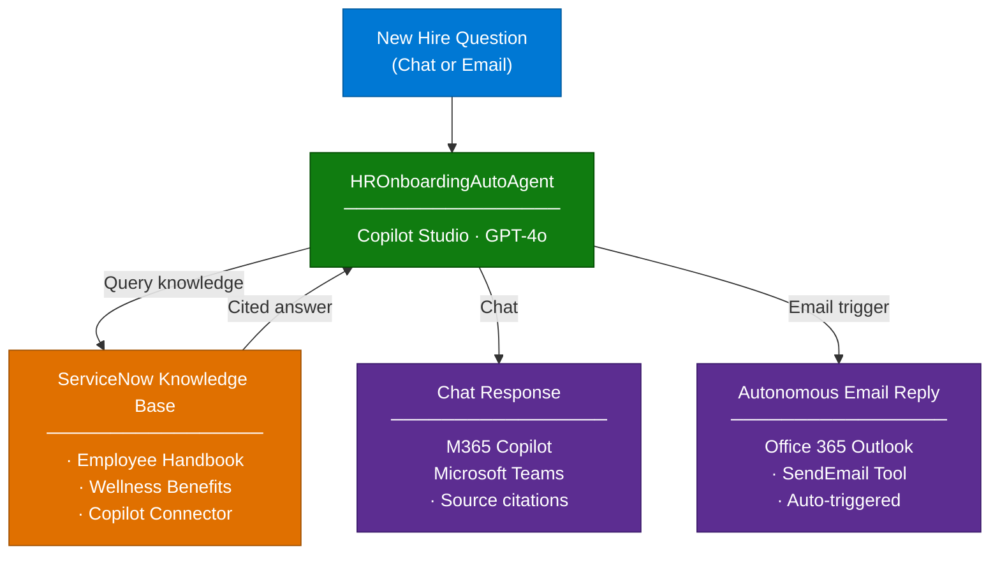

# Dynamics 365 Monitoring Agent — Overview

## Scenario Overview

**Scenario Type**: Application Health (Monitoring)  
**Agent Type**: Interactive + Autonomous  
**Primary Tools**: Microsoft Copilot Studio, Power Platform, Application Insights 
**Complexity**: Intermediate  
**Status**: :white_check_mark: Available

This runbook describes how to deploy and configure a Dynamics 365 Monitoring Agent that helps organizations detect issues earlier, understand them faster, and resolve them more consistently—without requiring deep expertise in logs, KQL, or monitoring tools.

---

## Problem Statement

The Dynamics 365 administrators and help desk staff responsible for application uptime, maintenance, and issue resolution frequently face challenges detecting problems and providing quick resolution due to the complexity of issues that come up when supporting a wide variety of critical business processes.

Without a structured, automated solution, organizations can experience:

- **Delayed detection of failures and performance issues**: The detection of failures such as batch job errors, data import issues, throttling, and long-running processes frequently relies on manual checks causing late discovery by users or support teams.
- **Difficulty interpreting raw telemetry and logs**: Application Insights data and infolog entries can be complex and fragmented. The agent interprets telemetry using predefined Kusto queries and contextual analysis, converting low-level signals into actionable insights that clearly explain what went wrong.
- **Slow response and resolution times for operational issuess**: The combination of delayed detection and difficulty interpreting telemetry data can significantly slow time to resolution.

---

## Solution Summary

The **Dynamics 365 Monitoring Agent** is an autonomous AI agent built on
**Microsoft Copilot Studio** that streamlines the onboarding experience for new employees.
The agent provides instant, accurate answers to HR-related questions by leveraging a
**ServiceNow Knowledge Base** as its grounding data source — ensuring every response is
policy-aligned and traceable to a source document.

### Key Capabilities

| Capability | Description |
|---|---|
| 🔍 Knowledge Retrieval | Answers HR questions from ServiceNow Knowledge Base (employee handbook, wellness benefits, etc.) |
| 📧 Autonomous Email Response | Automatically responds to HR inquiry emails using an email trigger |
| 🤝 M365 Copilot Integration | Deployable as an agent in Microsoft 365 Copilot and Microsoft Teams |
| 🛡️ Scoped Responses | Strictly answers from configured knowledge; avoids LLM hallucination |
| 💬 Suggested Starter Prompts | Pre-configured prompts guide new hires to the most common topics |

---

### How It Works

---

## Business Outcomes

| Outcome | Description |
|---|---|
| 📉 Reduce HR helpdesk workload | Automates responses to the most common new-hire questions |
| 🚀 Improve onboarding experience | New hires get instant, accurate answers 24/7 |
| ✅ Ensure policy-aligned responses | All answers grounded in official HR documents — no hallucination |
| 📈 Increase self-service adoption | Empowers employees to find answers independently via M365 Copilot or Teams |
| 📧 Enable autonomous operations | Email trigger allows the agent to respond without human involvement |

---

## In Scope / Out of Scope

### ✅ In Scope

- Deployment of agent solution and core dependancies
- Agent configuration
- Suggested prompt configuration for guided conversations
- Publishing to Microsoft 365 Copilot and Microsoft Teams

### ❌ Out of Scope

- HR transactional workflows (e.g., payroll processing, personal data updates)
- Case management or ticketing system integration (e.g., ServiceNow Incident creation)
- Custom ML model training or fine-tuning
- Real-time data lookup (e.g., leave balances, current org charts)

---

## Target Users

| Persona | Role in This Scenario |
|---|---|
| **Dynamics 365 Admin** | **Primary agent end-user**: Asks health and telemetry related  questions   **Agent configuration manager**: Configure agent monitoring preferences   **Dynamics 365 configuration manager**: Configure Dynamics 365 telemetry settings |
| **Help Desk Staff** | Secondary agent end-user: Asks health and telemetry related questions
| **IT Admin / M365 Admin** | Agent solution deployment, connector setup, publishing, and org-wide deployment |
| **CSA / Delivery Engineer** | Builds and deploys the agent using this runbook |

---

## Knowledge Sources Used

| Source | Content | Category |
|---|---|---|
| Contoso Employee Handbook | Company policies, onboarding process, code of conduct, travel expense | Policy |
| Health & Wellness Benefits Guide | Medical plans, dental, vision, gym memberships, mental health support | Benefit |

> 📌 Both documents are added as articles to the **ServiceNow IT Knowledge Base**
> and indexed via the **ServiceNow Microsoft Copilot Connector**.

---

