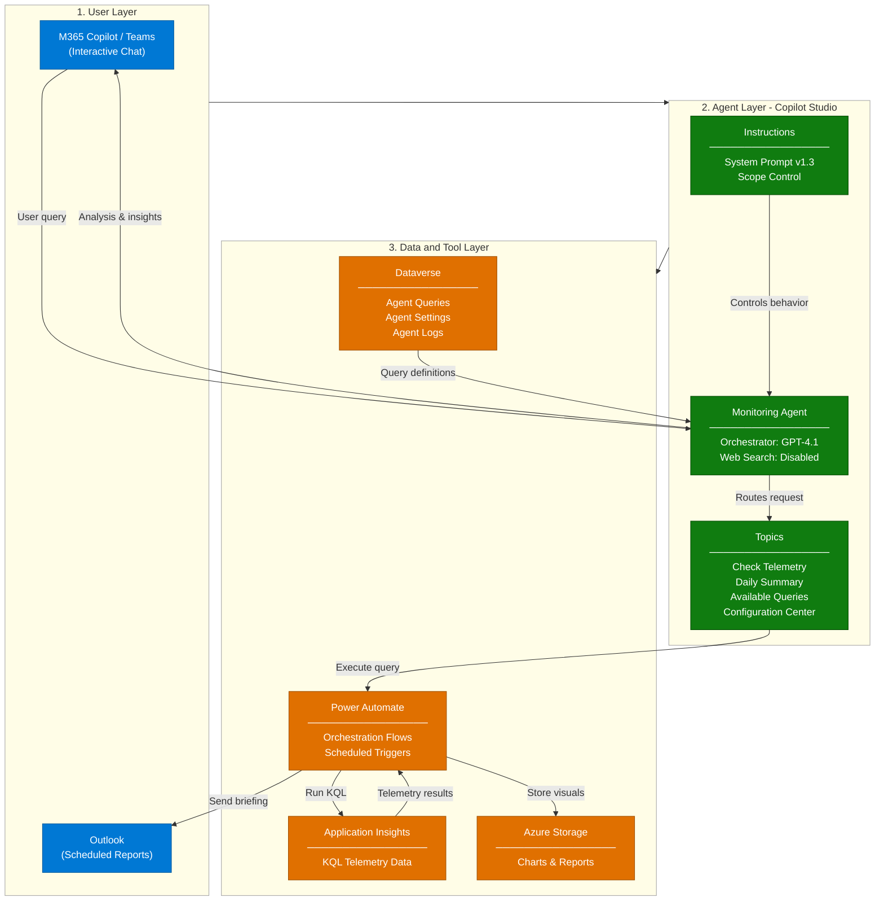
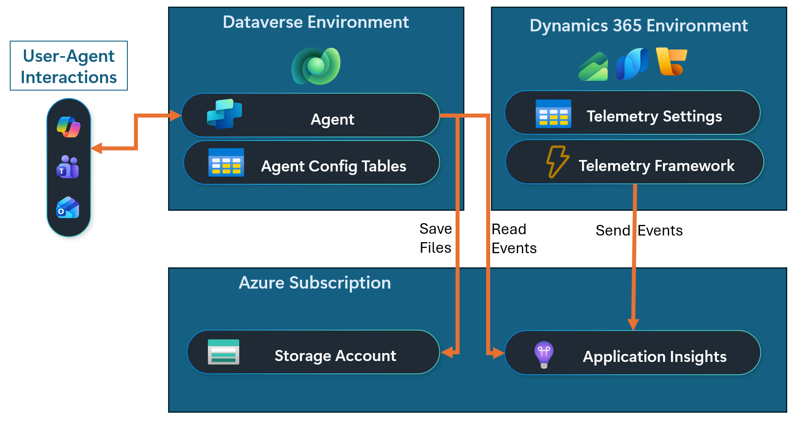
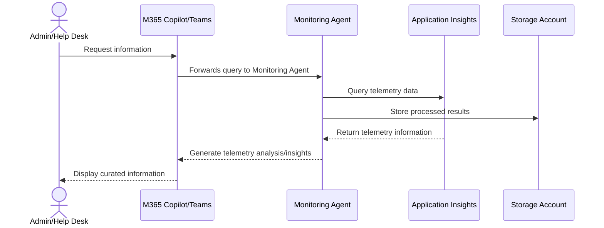
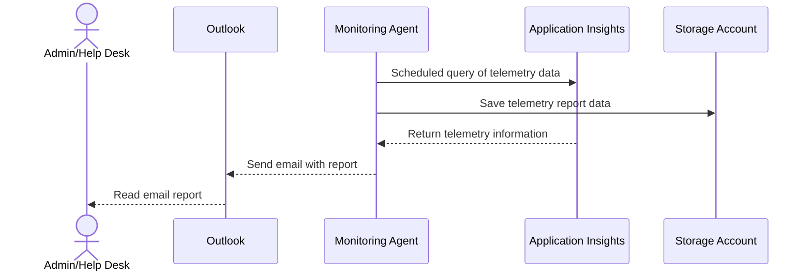
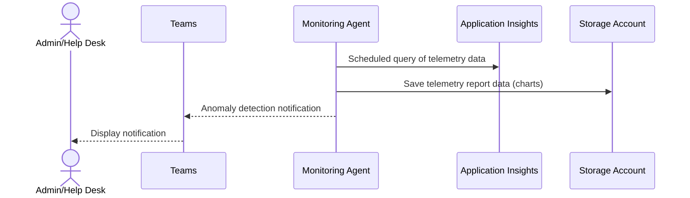

# Dynamics 365 Monitoring Agent — Architecture

## 1. Logical Architecture

The Dynamics 365 Monitoring Agent operates across three layers: the **User Layer** (how users interact),
the **Agent Layer** (how the agent processes requests), and the **Data & Tool Layer**
(what the agent uses to generate responses).
### How It Works

### Environment Architecture
 - The **Dynamics 365 environment** (Finance, Supply Chain Management, or Commerce) generates the telemetry events.
 - The **Dataverse environment** hosts the agent and supporting components such as agent flows and configuration tables.
 - The **Azure subscription** hosts the Application Insights instance where telemetry events are stored and the storage account where the agent stores files that users can download.
 - Users can interact with the agent via Microsoft 365 Copilot or Microsoft Teams and agent emails can be sent to an Outlook email account.

---

## 2. Key Components

| Component | Technology | Role |
|---|---|---|
| **Agent Environment** | Power Platform Developer Environment | Hosts agent artifacts and Dataverse |
| **Deployment Channels** | Microsoft Teams + M365 Copilot | Primary end-user access points for interactive chat |
| **Admin Portal** | Microsoft 365 Admin Center | Publishing, connector setup, and org-wide deployment |
| **Agent Runtime** | Microsoft Copilot Studio | Core agent orchestration and response generation |
| **LLM / Orchestrator** | GPT-4.1 | Natural language understanding and answer generation |
| **Agent Queries** | Dataverse Table | Stores curated KQL query definitions, prompt variations, chart configs, anomaly flags, and display formatting |
| **Agent Settings** | Dataverse Table | Stores Application Insights connection, alert recipients, daily summary config, and global settings |
| **Agent Logs** | Dataverse Table | Tracks agent activity, query execution history, and anomaly detection events |
| **Available Queries - Topic** | Agent Topic | List questions the agent can help you answer |
| **Check Telemetry - Topic** | Agent Topic | Format and execute KQL query based on user request |
| **Daily Summary - Topic** | Agent Topic | Provide daily briefing content based on user request |
| **Configuration Center - Topic** | Agent Topic | Review or update agent settings via Adaptive Card UI |
| **Run KQL Queries - Flow** | Agent Flow | Execute KQL telemetry queries against Application Insights |
| **Daily Briefing Report - Flow** | Agent Flow (Recurrence) | Scheduled trigger that generates daily telemetry briefings |
| **Daily Summary - Flow** | Agent Flow | Generate daily briefing content on demand |
| **Send Summary Email - Flow** | Agent Flow | Send daily briefing to configured email recipients |
| **Telemetry Automation - Flow** | Agent Flow (Recurrence) | Scheduled trigger for continuous anomaly detection |
| **Telemetry Notification - Flow** | Agent Flow (Dataverse) | Triggered when anomaly is detected, sends proactive alert |
| **Application Insights Connection - Flow** | Agent Flow | Get/update Application Insights connection details |
| **Output Settings (Email) - Flow** | Agent Flow | Get/update email output settings |
| **Query Settings - Flow** | Agent Flow | Get/update KQL query definitions |

---

## 3. Data Flow

### Scenario A — Interactive Chat (User-Initiated)

### Scenario B — Daily Summary Email (Scheduled)

### Scenario C — Anomaly Detection

---

## 4. Security & Governance Considerations

| Area | Consideration |
|---|---|
| **Credentials** | Power Automate flows support both **maker's connection credentials** and **Service Principal** authentication for Application Insights and email services |
| **Data Scope** | Web Search is **disabled**. The agent responds exclusively from Application Insights telemetry and Dataverse configuration |
| **Knowledge Boundary** | All query capabilities are defined as Dataverse rows. The agent only executes pre-curated, validated KQL queries |
| **Access Control** | M365 Admin approval required for org-wide deployment via Integrated Apps |
| **Telemetry Access** | Application Insights access is scoped through connection credentials. Users interact with processed results, not raw telemetry |
| **Content Safety** | GPT-4.1 content filters remain active; no custom model training involved |

---

## Related Resources

| Resource | Link |
|---|---|
| Scenario Overview | [1.Overview.md](1.Overview.md) |
| Step-by-Step Runbook | [3.Runbook.md](3.Runbook.md) |
| Sample Prompts | [4.Sample-prompts.md](4.Sample-prompts.md) |
