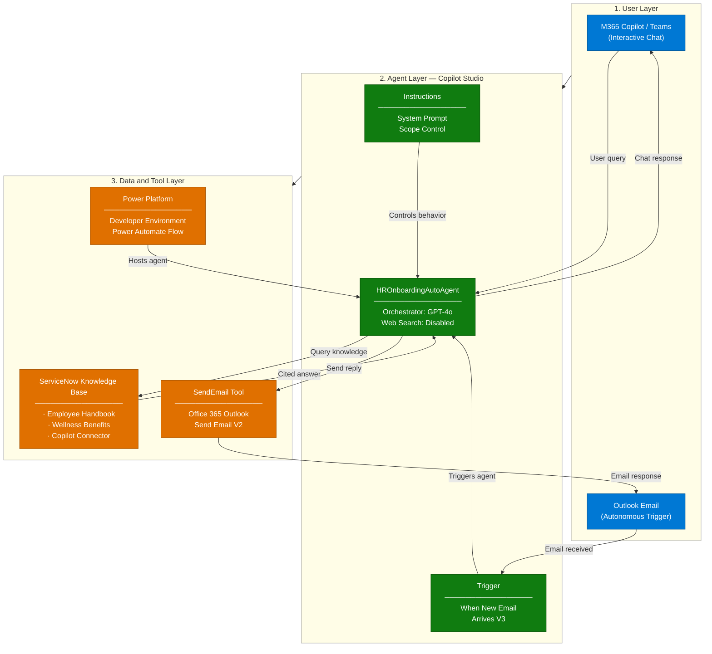
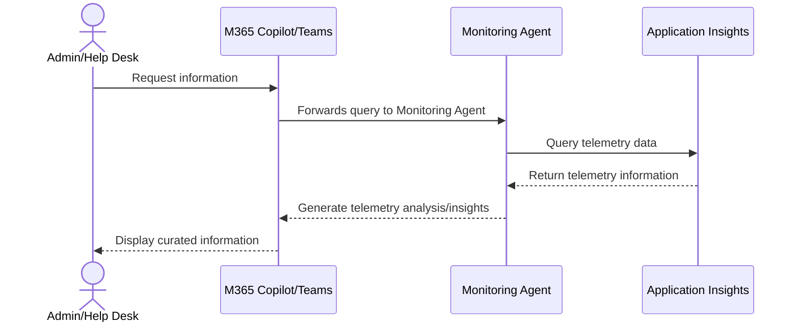
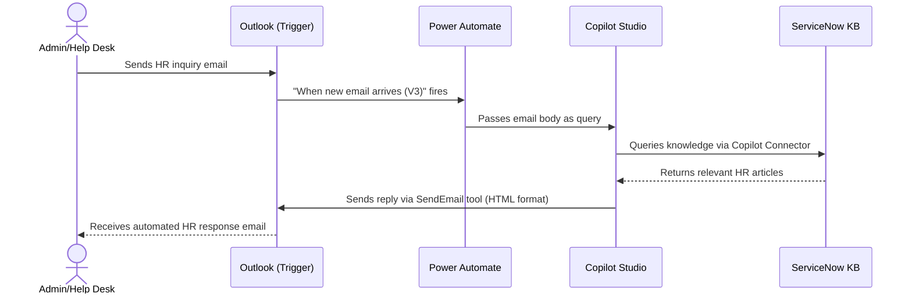

# Dynamics 365 Monitoring Agent — Architecture

## 1. Logical Architecture

The Dynamics 365 Monitoring Agent operates across three layers: the **User Layer** (how users interact),
the **Agent Layer** (how the agent processes requests), and the **Data & Tool Layer**
(what the agent uses to generate responses).
### How It Works

### Environment Architecture
 - The **Dynamics 365 environment** (Finance, Supply Chain Managment, or Commerce) generates the telemetry events.
 - The **Dataverse environment** hosts the agent and supporting components such as agent flows and configuration tables.
 - The **Azure subscription** hosts the Application Insights instance where telemetry events are stored and the storage account where the agent stores files that users can download.
 - Users can interact with the agent via Microsoft 365 Copilot or Microsoft Teams and agent emails can be sent to an Outlook email account.

---

## 2. Key Components

| Component | Technology | Role |
|---|---|---|
| **Agent Environment** | Power Platform Developer Environment | Hosts agent artifacts and Dataverse |
| **Deployment Channels** | Microsoft Teams + M365 Copilot | Primary end-user access points for interactive chat |
| **Admin Portal** | Microsoft 365 Admin Center | Publishing, connector setup, and org-wide deployment |
| **Agent Runtime** | Microsoft Copilot Studio | Core agent orchestration and response generation |
| **LLM / Orchestrator** | Claude Sonnet 4.5 | Natural language understanding and answer generation |
| **Available Queries - Topic** | Agent Topic  | List questions the agent can help you answer
| **Check Telemetry - Topic** | Agent Topic  | Format and execute KQL query based on user request
| **Daily Summary - Topic** | Agent Topic  | Provide daily briefing content based on user request
| **Configuration Center - Topic** | Agent Topic  | Review or update agent settings
| **Run KQL Queries - Flow**  | Agent Flow | Execute KQL telemetry queries |
| **Daily Summary - Flow** | Agent Flow | Generate daily briefing content |
| **Send Summary Email - Flow** | Agent Flow | Send daily briefing to email recipients |
| **Application Insights Connection - Flow** | Agent Flow  | Get/update application insights connection details |
| **Output Settings (Email) - Flow** | Agent Flow  | Get/update email settings |
| **Query Settings - Flow** | Agent Flow  | Get/update KQL query details |

---

## 3. Data Flow

### Scenario A — Interactive Chat (User-Initiated)

### Scenario B — Autonomous Email Response (Trigger-Initiated)

---

## 4. Security & Governance Considerations

| Area | Consideration |
|---|---|
| **Credentials** | Email trigger and SendEmail tool use the **maker's credentials** (author's connection) |
| **Data Scope** | Web Search is **disabled** — agent only responds from ServiceNow knowledge |
| **Knowledge Boundary** | If no answer is found, agent directs user to HR contact email instead of guessing |
| **Access Control** | M365 Admin approval required for org-wide deployment via Integrated Apps |
| **Connector Permissions** | ServiceNow Copilot Connector access scoped to authorized users only |
| **Content Safety** | GPT-4o content filters remain active; no custom model training involved |

---

## Related Resources

| Resource | Link |
|---|---|
| Scenario Overview | ./1-Overview.md |
| Step-by-Step Runbook | ./3-Runbook.md |
| Sample Prompts | ./4-Sample-Prompts.md |
