# Step-by-Step Guide — Dynamics 365 Monitoring Agent

> **Scenario**:  Application Health (Monitoring)  
> **Platform**: Microsoft Copilot Studio, Power Platform, Application Insights  
> **Target Readers**: CSA / Vendor / PM  
> **Last Updated**: April 10, 2026

---

## Overview

Dynamics 365 administrators and help desk staff are responsible for application uptime, maintenance, and issue resolution. People in these roles frequently face challenges detecting problems and providing quick resolutions due to the complexity of issues that come up when supporting a wide variety of critical business processes. This agent makes monitoring easier by:

- Providing quicker detection of failures and performance issues
- Helping with raw telemetry and log interpretation
- Improving response and resolution times for operational issues

>*Diagram of the agent solution components*
>
>

In this step-by-step guide, you will perform tasks in each of the following portals. It’s a good idea to ensure you can successfully login to each portal or you know a resource who can assist with configuration changes in each area prior to continuing.

 Below is an overview of each administration portal and what you’ll need to configure in each one.

 | Location | Portal URL | Task |
|---|---|---|
| Power Platform admin center | https://admin.powerplatform.microsoft.com | Manage tenant settings and your Dynamics 365 and Dataverse environments |
| Power Apps Maker Portal | https://make.powerapps.com | Deploy the agent solution, update connection credentials, and configure agent settings |
| Copilot Studio | https://copilotstudio.microsoft.com | Customize, test, and publish the agent |
| Azure Portal | https://portal.azure.com | Create Application Insights instance, app registration, and storage account |
| Microsoft 365 admin center | https://admin.microsoft.com | Manage user license assignments and settings |
| Teams admin center | https://admin.teams.microsoft.com | Manage Teams settings |

---

## Prerequisites

Before starting, confirm the following are in place.

> **Note:** The Monitoring Agent is built on a **platform-agnostic framework**. It works with any
> Dynamics 365 workload or Power Platform application that exports telemetry to Azure Application
> Insights. The core prerequisites below apply to **all** scenarios. Telemetry source-specific
> requirements (versions, licenses, and admin roles needed to configure the telemetry export)
> vary by platform and are documented in [Phase 1](#phase-1-configure-telemetry-source).

### Core Environment Requirements

   | Requirement | Description |
   |---|---|
   | Telemetry source | At least one Dynamics 365 or Power Platform environment configured to send telemetry to Application Insights (see [Phase 1](#phase-1-configure-telemetry-source) for platform-specific setup) |
   | Dataverse capacity | 1 GB of available Dataverse capacity so a new Power Platform environment can be created with a Dataverse datastore (same tenant as telemetry source) |
   | Azure subscription | Azure subscription (same tenant as environments) |
   | Copilot credits | Available Copilot credits or a billing plan setup for Pay‑As‑You‑Go copilot credit billing (same tenant as environments) |
   | Email account | Email-enabled Outlook account (same tenant as environments) |

### License Requirements

**Administrator and Author License Requirements**

   | Requirement | Description |
   |---|---|
   | Dynamics 365 or Power Platform License | A license for the platform you are monitoring is required so you can configure telemetry export. See the [Telemetry Source Prerequisites](#telemetry-source-prerequisites) table below for details per platform. |
   | Copilot Studio User License | Anyone who builds, edits, or publishes agents must have this license. More information on Copilot Studio licensing can be found here:    <https://learn.microsoft.com/en-us/microsoft-copilot-studio/billing-licensing> |

**End-user License Requirements** 
Users interacting with the agent need access to wherever the agent is published (Microsoft 365 Copilot, Teams etc.)

   | Requirement | Description |
   |---|---|
   | Microsoft 365 license | Microsoft 365 license (E3/E5 etc.) is required if the agent is published to Teams |
   | Microsoft 365 Copilot license | Microsoft 365 Copilot license is required if the agent is published to Microsoft 365 Copilot |

### Access and Permissions

   | Requirement | Description |
   |---|---|
   | Dataverse and Dynamics 365 environments | User account with the **Power Platform Administrator** role or **Dynamics 365 Administrator** role assigned in the Microsoft 365 admin center is required so you can manage your Dataverse and Dynamics 365 environments. |
   | Telemetry source platform | Admin role required to configure telemetry export varies by platform. See the [Telemetry Source Prerequisites](#telemetry-source-prerequisites) table below. |
   | Azure subscription | User account with the **Owner** or **Contributor** role on an Azure subscription so you can create and manage the Application Insights instance and storage account. |
   | Microsoft 365 admin center | User account with the ability to adjust settings in the Microsoft 365 admin center. |
   | Teams admin center | User account with the ability to adjust settings in the Teams admin center. |

### Telemetry Source Prerequisites

The table below lists the platform-specific requirements for configuring the telemetry source that feeds the agent. **You only need to meet the requirements for the platform(s) you intend to monitor.**

   | Platform | Minimum Version / Requirement | License Required | Admin Role for Telemetry Config | Setup Documentation |
   |---|---|---|---|---|
   | **D365 Finance, SCM, Commerce** | Version 10.0.45 (PU69) or later | D365 Finance, SCM, or Commerce license | **System administrator** or **Monitoring and telemetry administrator** in F&O | [Get started with telemetry for F&O apps](https://learn.microsoft.com/dynamics365/fin-ops-core/dev-itpro/monitoring-telemetry/monitoring-getting-started) |
   | **Dataverse / Model-driven apps** (D365 Sales, Customer Service, Field Service, etc.) | Managed Environment + paid/premium Dataverse license | D365 Sales, Customer Service, Field Service, or equivalent CE license | **Power Platform Administrator** + **System Administrator** on the Dataverse environment | [Analyze model-driven apps and Dataverse telemetry](https://learn.microsoft.com/power-platform/admin/analyze-telemetry) &bull; [Export data to App Insights](https://learn.microsoft.com/power-platform/admin/set-up-export-application-insights) |
   | **Canvas Apps** | Admin must enable *Canvas app insights* in PPAC tenant settings | Power Apps license (per-app or per-user) | **Power Platform Administrator** (tenant setting) + app maker configures per-app | [Canvas apps + Application Insights](https://learn.microsoft.com/power-apps/maker/canvas-apps/application-insights) |
   | **Power Automate** (Cloud Flows) | Managed Environment | Power Automate license (per-user or per-flow) | **Power Platform Administrator** + **System Administrator** on the Dataverse environment | [Set up App Insights with Power Automate](https://learn.microsoft.com/power-platform/admin/app-insights-cloud-flow) |

---

## Phase 1: Configure Telemetry Source

Prior to setting up the agent, you need to ensure your target platform is sending telemetry events to an Azure Application Insights instance. The configuration steps vary depending on the platform you are monitoring.

> **Already sending telemetry to Application Insights?** If your environment is already configured,
> **skip to Phase 2**. You only need the Application Insights connection details (instrumentation key
> or connection string) for the agent configuration later.

### Overview

All platforms in the Dynamics 365 and Power Platform ecosystem can export telemetry to Application Insights. The agent is platform-agnostic: it reads from Application Insights regardless of the source. The only difference is **how** each platform sends data to Application Insights.

| Platform | Configuration Approach | Where to Configure |
|---|---|---|
| **D365 Finance, SCM, Commerce** | Feature flag in the app + connection string in Monitoring and Telemetry parameters | Within Finance and Operations app |
| **Dataverse / Model-driven apps** (Sales, Customer Service, Field Service) | Data Export from Power Platform Admin Center | Power Platform Admin Center → Manage → Data Export |
| **Canvas Apps** | Per-app instrumentation key in app settings | Power Apps Studio (per app) + PPAC tenant settings |
| **Power Automate** (Cloud Flows) | Data Export from Power Platform Admin Center | Power Platform Admin Center → Manage → Data Export |

### Step 1-1. Create Log Analytics Workspace

This step is common to **all** platforms.

1.	Navigate to the Azure Portal. http://portal.azure.com
2. Select **Create a resource**.
3. Type **Log Analytics Workspace** in the search box. Find the **Log Analytics Workspace** tile in the list and select **Create → Log Analytics Workspace**.
4. Fill in the following values, then **Review + create** your Log Analytics Workspace.

   | Required Field | Value |
   |---|---|
   | Subscription | Select your preferred subscription |
   | Resource Group | Create a new Resource Group called `D365MonitoringRG` or select your preferred resource group |
   | Name | Name your Log Analytics Workspace `D365Monitoring-Logs` or give it your preferred name |
   | Region | Select a region close to your Dynamics 365 instance |

---

### Step 1-2. Create Application Insights Instance

This step is common to **all** platforms.

1.	Navigate to the Azure Portal. http://portal.azure.com
2. Select **Create a resource**.
3. Open the category **Monitoring & Diagnostics**, then select **Application Insights**.
4. Fill in the following values, then **Review + create** your Application Insights instance.

   | Required Field | Value |
   |---|---|
   | Subscription | Select your preferred subscription |
   | Resource Group | Select the **D365MonitoringRG** you created earlier or select your preferred resource group |
   | Name | Name your Application Insights instance `D365Monitoring-AppInsights` or give it your preferred name |
   | Region | Select the same region as your Log Analytics Workspace |

---

### Step 1-3. Connect Your Platform to Application Insights

Choose the section below that matches your telemetry source. You may configure **multiple** sources if your organization uses more than one platform.

---

#### Option A — D365 Finance & Operations (Finance, SCM, Commerce)

1. In Finance and Supply Chain Management, open the **Feature management workspace**.
2. Filter the feature list to find the **Monitoring and Telemetry** feature. Select the feature, and then select **Enable** if it is not already enabled.
3. Go to **System administration → Monitoring and Telemetry parameters**.
4. On the **Monitoring settings** page, click on the **Environments** tab. Create a record for each environment that you want to emit telemetry for. Multiple environments can be entered here. By entering all your environments, you ensure that database refresh operations include this configuration and are synced across environments. For each environment, set the following fields:
   | Field Name | Description |
   |---|---|
   | Environment ID | The unique identifier of the environment. |
   | Environment Mode | A value that specifies whether the environment is a development, test, or production environment. This field is used to separate telemetry in different Application Insight instances that are intended for development, test, or production. |

5. On the **Application Insights Registry** tab, create a record for each environment mode that is used. For each environment mode, set the following fields.
   | Field Name | Description |
   |---|---|
   | Environment Mode | A value that specifies whether the environment is a development, test, or production environment. |
   | Instrumentation Key | The instrumentation key that is used to connect to Application Insights.   :warning: `If a connection string is specified, the instrumentation key is ignored.` |
   | Connection String | The unique identifier of the Application Insights instance. |

6. On the **Configure** tab, turn on the option for each telemetry event you want sent to Application Insights. Additional information about the event options can be found here: 
   - Available Telemetry: https://learn.microsoft.com/en-us/dynamics365/fin-ops-core/dev-itpro/monitoring-telemetry/monitoring-available-telemetry
   - Custom telemetry signals: https://learn.microsoft.com/en-us/dynamics365/fin-ops-core/dev-itpro/monitoring-telemetry/monitoring-developer-add-custom-signals

    | Metric | Description |
   |---|---|
   | Custom metrics (Metrics) | Disable, agent does not use by default |
   | Form runs (Page views) | `Recommended to enable.` Agent monitors these events by default. |
   | User sessions (Custom Events) | Disable, agent does not use by default |
   | X++ exceptions (Failures) | `Recommended to enable.` Agent monitors these events by default. |
   | Custom traces (Traces) | Disable, agent does not use by default |
   | Batch Start Time | `Recommended to enable.` Agent monitors these events by default. |
   | Batch Stop Time | `Recommended to enable.` Agent monitors these events by default. |
   | Batch Throttling | `Recommended to enable.` Agent monitors these events by default. |
   | Batch Failure | `Recommended to enable.` Agent monitors these events by default. |
   | Batch Queue | `Recommended to enable.` Agent monitors these events by default. |
   | Batch Threads | `Recommended to enable.` Agent monitors these events by default. |
   | Warehouse events | Enable if you have warehouse mobile events to track |
   | DMF Errors | `Recommended to enable.` Agent monitors these events by default. |

> 📖 **Full documentation**: [Get started with telemetry for Finance and Operations apps](https://learn.microsoft.com/dynamics365/fin-ops-core/dev-itpro/monitoring-telemetry/monitoring-getting-started)

---

#### Option B — Dataverse / Model-driven Apps (D365 Sales, Customer Service, Field Service)

> ⚠️ This integration requires a **Managed Environment** and a **paid/premium Dataverse license**.

1. Sign in to the **Power Platform Admin Center** → https://admin.powerplatform.microsoft.com
2. In the navigation pane, select **Manage** → **Data export**.
3. On the **Data export** page, select the **App Insights** tab → click **New data export**.
4. Provide a friendly name for the export package.
5. Select **Dataverse diagnostics and performance** as the data type.
6. Select the environment you are exporting data **from**. Click **Next**.
7. Select the Azure subscription, resource group, and Application Insights instance you are exporting data **to**. Click **Next**.
8. Review the details and click **Create**.

> Data starts flowing to Application Insights within 24 hours of setup.

> 📖 **Full documentation**: [Export data to Application Insights](https://learn.microsoft.com/power-platform/admin/set-up-export-application-insights) · [Analyze model-driven apps and Dataverse telemetry](https://learn.microsoft.com/power-platform/admin/analyze-telemetry)

---

#### Option C — Canvas Apps

> ⚠️ A tenant admin must first enable **Canvas app insights** in the Power Platform Admin Center (Settings → Tenant settings → Canvas app insights → On).

1. Open your canvas app in **Power Apps Studio**.
2. Go to the app **Settings**.
3. Enter the **Instrumentation Key** from your Application Insights instance.
4. Save and publish the app.

> 📖 **Full documentation**: [Analyze system-generated logs using Application Insights](https://learn.microsoft.com/power-apps/maker/canvas-apps/application-insights)

---

#### Option D — Power Automate (Cloud Flows)

> ⚠️ This integration requires a **Managed Environment**.

1. Sign in to the **Power Platform Admin Center** → https://admin.powerplatform.microsoft.com
2. In the navigation pane, select **Manage** → **Data export**.
3. On the **Data export** page, select the **App Insights** tab → click **New data export**.
4. Provide a friendly name for the export package.
5. Select **Power Automate** as the data type. Choose whether to export cloud flow runs, triggers, or actions.
6. Select the environment you are exporting data **from**. Click **Next**.
7. Select the Azure subscription, resource group, and Application Insights instance you are exporting data **to**. Click **Next**.
8. Review the details and click **Create**.

> 📖 **Full documentation**: [Set up Application Insights with Power Automate](https://learn.microsoft.com/power-platform/admin/app-insights-cloud-flow)

---

When this step is complete, you will have the highlighted part of the solution completed.

>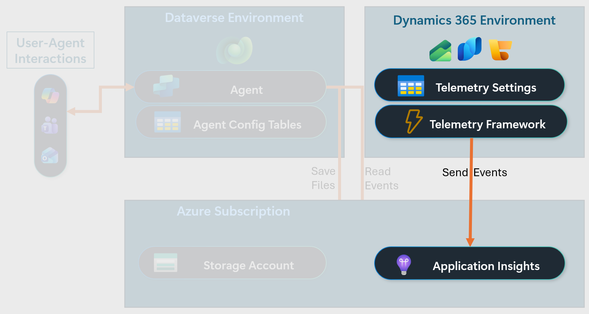

---

## Phase 2: Create Environment

### Step 2-1. Create Power Platform (Dataverse) Environment

1. Go to **Power Platform Admin Center** → https://admin.powerplatform.microsoft.com
2. Click **Environments** → **+ New**
3. Fill in the following values and click **Next**

   | Required Field | Value |
   |---|---|
   | Name | `D365Monitoring` (or any preferred name) |
   | Managed Environment | **No** |
   | Region | Select the region closest to your tenant |
   | Type | **Sandbox** |
   | Add a Dataverse data store? | **Yes** |

4. Fill in the following values

   | Required Field | Value |
   |---|---|
   | Language | `English (United States)`(Suggested) |
   | Currency | `USD($)` (or any preferred currency)|
   | Security group | `Open access - None` (or your preferred security group)|

5. Click **Save**

When the environment is done deploying, you will have added a blank Dataverse environment to the solution. The highlighted components of the solution now exist.

>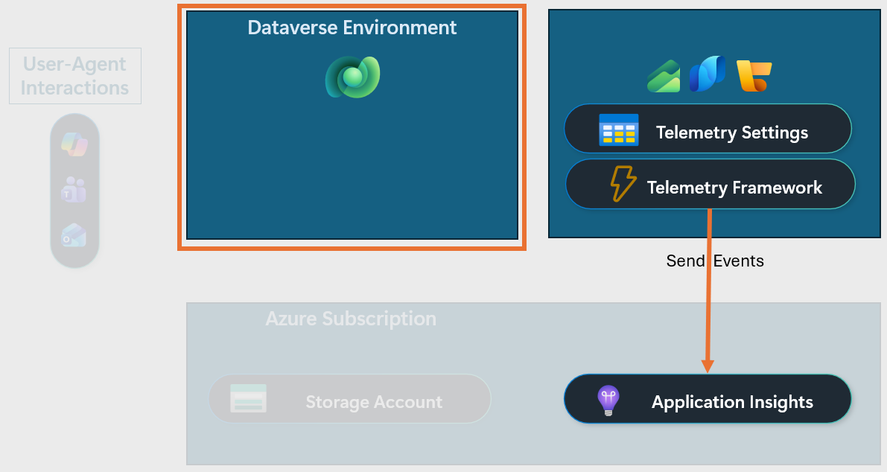

---

### Step 2-2. Create App Registration

In this step, you will create and configure an app registration. This is the set of credentials used by the agent to authenticate with Application Insights, the storage account, and other solution components.
1.	Navigate to the Azure Portal. http://portal.azure.com
2. Go to **Microsoft Entra ID → Manage → App registrations → New registration**.
3.	Enter name: `MonitoringAgentAppReg` or another descriptive name.
4.	Select account type: **Single tenant only**.
5.	Click **Register**.
6.	Record the **Application (client) ID** for the app registration.
7.	Go to **Manage → Certificates & Secrets**. Click  **+ New client secret**. Provide a meaningful description such as `MonitoringAgentSecret`, set the expiration date, then click **Add**.
8.	Record the value from the secret.
9. Go to **Manage → API permissions**. Click  **+ Add a permission**, then click on the tab **APIs my organization uses**.
10. Type `Application Insights API` in the search box, then click on **Application Insights API** in the list. Select the **Delegated permissions** option, then select the **Data.Read** permission. Click **Add permission**.
11. Type `Microsoft Graph` in the search box, then click on **Microsoft Graph** in the list. Select the **Delegated permissions** option, then select the **User.Read** permission under the **User** category. Click **Add permission**.

---

### Step 2-3. Assign Permission to Application Insights

In this step, you will assign permissions to your Application Insights instance so the agent will be able to read telemetry data.

1.	Navigate to the Azure Portal. http://portal.azure.com
2.	Go to the Resource Group named **D365MonitoringRG**. If you used an alternative name for the resource group that contains your agent resources, then find that resource group.
3. Open your Application Insights instance **D365Monitoring-AppInsights**.
4. Go to **Access control (IAM)**. Click **+ Add → Add role assignment**.
5. On the **Role** tab, select **Reader**.
6. On the **Members** tab, add the following details.
   | Required Field | Value |
   |---|---|
   | Assign access to | User, group, or service principal |
   | Members | Click **+ Select members**. Type `MonitoringAgentAppReg` in the search box, select **MonitoringAgentAppReg** from the list, then click **Select**. |
7. Click **Review + assign**.

---

### Step 2-4. Create Storage Account

1. Go to the **Azure Portal** → https://portal.azure.com
2. Go to **Storage accounts → + Create**
3. Fill in the following values on the **Basics** tab then click **Next**.

   | Required Field | Value |
   |---|---|
   | Subscription | Select your preferred subscription |
   | Resource Group | Select **D365MonitoringRG** or the name of the resource group containing all the agent resources. |
   | Storage account name | Requires a globally unique name |
   | Region | Select the region closest to your tenant |
   | Performance | **Standard** (Suggested as lowest cost) |
   | Redundancy | **Locally-redundant storage (LRS)** (Suggested as lowest cost) |

4. Review the settings on the remaining tabs (Advanced, Networking, Data protection, Encryption, Tags). Below is a list of settings to verify. 

   | Tab | Setting | Value |
   |---|---|---|
   | Advanced | Require secure transfer for REST API operations | Enabled (default value) |
   | Advanced | Allow enabling anonymous access on individual containers | Disabled (default value) |
   | Advanced | Enable storage account key access | Enabled (default value) |
   | Networking | Public network access | Enabled (default value) |
   | Networking | Public network access scope | Enable from all networks (default value) |

5. Click **Review + Create**, then click **Create**.
6. Open your newly created storage account. 
7. Go to **Access control (IAM)**. Click **+ Add → Add role assignment**.
8. On the **Role** tab, select **Storage Blob Data Contributor**.
9. On the **Members** tab, add the following details. 
   | Required Field | Value |
   |---|---|
   | Assign access to | User, group, or service principal |
   | Members | Click **+ Select members**. Type `MonitoringAgentAppReg` in the search box, select **MonitoringAgentAppReg** from the list, then click **Select**. |
10. Click **Review + assign**.

When the storage account is done deploying, the highlighted components of the solution will exist.

>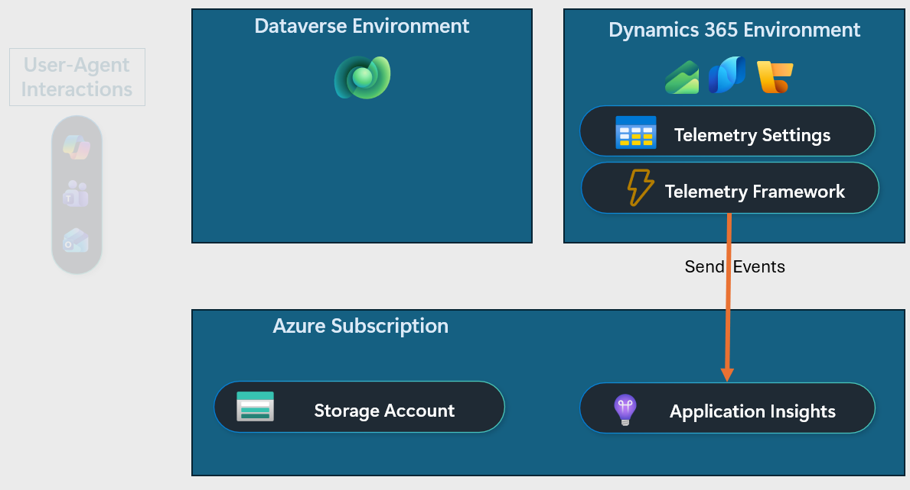

---

## Phase 3: Deploy Agent Solution

The Monitoring Agent is deployed as **two Dataverse solutions** with a parent-child relationship:

| Solution | Version | Type | Contents |
|---|---|---|---|
| **MCSA Agent Framework** | 0.0.0.4 | Parent (umbrella) | 3 Dataverse tables (Agent Queries, Agent Settings, Agent Logs), shared across all agents |
| **MCSA Telemetry Agent** | 0.0.0.3 | Child | Agent definition, 4 topics, 9 Power Automate flows, AI Builder models, entity definitions |

> ⚠️ The **Agent Framework** must be imported **before** the Telemetry Agent, as the child
> solution depends on the parent's Dataverse tables.

The framework is designed for extensibility. Future agents (e.g., Supply Chain Monitoring,
Commerce Monitoring) can be deployed as additional child solutions under the same umbrella,
sharing the same configuration and logging infrastructure.

> **📦 Initial Release Notice**
>
> This is the **initial public release** of the Monitoring Agent. The deployment steps in this
> phase replicate the same process our team uses internally to stand up new agent instances
> across environments.
>
> While the agent itself is fully functional and production-ready,
> we are actively working to streamline the deployment experience and reduce the number of
> manual steps required. As improvements are made, this Runbook will be updated accordingly.

### Step 3-1. Install Agent Framework Solution

1.	Download latest Monitoring Agent Framework solution package [MCSA Agent Framework](0.Resources/Solution-files).
2.	Go to the Power Apps Maker Portal https://make.powerapps.com.
3. Select the **Environment (e.g., D365Monitoring)** created in Phase 2.
4.	Navigate to **Solutions → Import solution**.
5.	Upload the solution **.zip** file you downloaded in step 1.
6.	Review dependencies and confirm the environment meets the requirements.
7.	Install.
8. Verify the following tables were created by selecting **Tables** from the left menu and selecting the **Custom** filter button above the table list. 

   | Table Name |
   |---|
   | MCSA Agent Logs |
   | MCSA Agent Queries |
   | MCSA Agent Settings |

---

### Step 3-2. Import Agent Configuration Data

> **Important:** The query library included in this release contains **pre-curated KQL queries
> designed for D365 Finance & Operations** (Finance and Supply Chain Management)
> environments. These queries cover the most common monitoring needs identified by support
> engineers and system administrators — batch jobs, errors, slow queries, form performance,
> DMF imports, throttling, and more.
>
> This library is **continuously growing**. We are actively collaborating with engineers across
> different Dynamics 365 and Power Platform teams to expand the query catalog to additional
> platforms (D365 Sales, Customer Service, Field Service, Power Platform). Because the agent
> framework is entirely data-driven, adding support for a new platform requires only inserting
> new query rows into the Dataverse table — no code changes, no redeployment.
>
> For the full list of available queries and example interactions, see [Sample Prompts](./4.Sample-prompts.md).

**Import Agent Query Data**

1.	Download and extract the csv file from [MCSA Agent Queries.zip](0.Resources/Solution-files)
2.	Navigate to Tables → MCSA Agent Queries
3.	Click on Ellipse → Import → Import data from Excel
4.	Select MCSA Agent Queries.csv and import

**Import Agent Settings Data**

1.	Download and extract the csv file from [MCSA Agent Settings.zip](0.Resources/Solution-files)
2.	Navigate to Tables → MCSA Agent Settings
3.	Click on Ellipse → Import → Import data from Excel
4.	Select MCSA Agent Settings.csv and import

---

### Step 3-3. Install Telemetry Agent Solution

1.	Download latest Monitoring Agent Telemetry solution package [MCSA Telemetry Agent](0.Resources/Solution-files).
2.	Go to the Power Apps Maker Portal https://make.powerapps.com.
3. Select the **Environment (e.g., D365Monitoring)** created in Phase 2.
4.	Navigate to **Solutions → Import solution**.
5.	Upload the solution **.zip** file you downloaded in step 1.
6.	Review dependencies and confirm the environment meets the requirements.
7.	Install.

> **⚠️ Activate Power Automate Flows**
>
> Some Power Automate flows may import in an **Off** state. After importing the Telemetry Agent
> solution, go to **Solutions → MCSA Telemetry Agent → Cloud flows** and verify all 9 flows
> are turned **On**. If any flow is off, open it and click **Turn on** from the command bar.
> The agent will not function correctly until all flows are active.

> *Diagram with all agent components installed*
>
>

---

### Step 3-4. Update Agent Settings using Configuration Prompts

After deploying the solutions, configure the agent's connection settings and notification preferences. You can do this directly through the agent's built-in Configuration Center.

1. Open the agent in **Copilot Studio** → Open the **Test panel** (right side).
2. Type: *"Open the agent configuration center"*
3. Use the Adaptive Card UI to update the following settings:

   | Setting | What to Configure |
   |---|---|
   | **Application Insights Configuration** | Update the tenant ID, resource group name, and Application Insights resource name to match your environment |
   | **Daily Summary Recipients** | Add the email addresses that should receive the daily briefing report |
   | **Alert Recipients** | Add the email addresses that should receive anomaly detection alerts |
   | **Query Configuration** | Review active queries and enable/disable as needed for your environment |

4. Verify settings were saved by asking: *"Show me the configuration options"*

---

## Phase 4: Testing, Publishing & Deployment

This phase covers the full lifecycle from validating the agent to making it available org-wide.

```mermaid
flowchart LR
    A["Test in<br/>Copilot Studio"]
    B["Publish<br/>Agent"]
    C["Verify Tenant<br/>Settings"]
    D["Add Channel<br/>Teams & M365"]
    E["Re-publish<br/>Agent"]
    F["Deploy<br/>Org-Wide"]
    G["End Users<br/>Access Agent"]

    A -->|"✅ Test passes"| B
    B -->|"✅ Published"| C
    C -->|"✅ Extensibility<br/>& sideloading OK"| D
    D -->|"Channel added"| E
    E -->|"✅ Re-published"| F
    F -->|"Admin approves"| G

    style A fill:#107C10,color:#fff,stroke:#004B00
    style B fill:#107C10,color:#fff,stroke:#004B00
    style C fill:#E07000,color:#fff,stroke:#A05000
    style D fill:#0078D4,color:#fff,stroke:#005A9E
    style E fill:#107C10,color:#fff,stroke:#004B00
    style F fill:#5C2D91,color:#fff,stroke:#3B1A6B
    style G fill:#0078D4,color:#fff,stroke:#005A9E
```

### Step 4-1. Test Monitoring Agent (Chat)

1. In Copilot Studio, open the **Test panel** (right side)
2. Click the **Start new test session** button to reload with the latest data
3. Enter one of the suggested prompts (e.g., *"Batch..."*)
4. Verify the agent returns a relevant answer

---

### Step 4-2. Publish the Agent

1. Click **"Publish"** in the top navigation bar
2. In the **"Publish this agent"** dialog, review the following warnings:
   - Editors will have full access to embedded connections
   - Triggers use the author's credentials
   - Anthropic model selected (if you chose Anthropic models such as Claude Sonnet 4.5, Claude Sonnet 4.6, Claude Opus 4.6)
3. Click **"Publish"**
4. Confirm the success message is displayed

---

### Step 4-3. Verify Tenant Settings (Optional)

Steps 4-3 through 4-6 are only required if you plan to deploy the agent to **Microsoft Teams** and/or **M365 Copilot**. The agent can be used exclusively within **Copilot Studio** without any tenant-level changes. If org-wide deployment is not needed at this time, you can skip to the [Summary Checklist](#summary-checklist).

If you do plan to deploy to Teams or M365 Copilot, confirm the following tenant settings are in place. These settings may already be enabled in your organization. If you are unsure, check with your M365 or Teams administrator.

> **Note:** If your tenant already allows Copilot agents and custom app sideloading, skip this step and proceed to Step 4-4.

**Verify Copilot Extensibility**

1. Go to **Microsoft 365 Admin Center** → https://admin.microsoft.com
2. Navigate to **Integrated Apps** → **Available apps**
3. Click the **Settings icon** (top right)
> 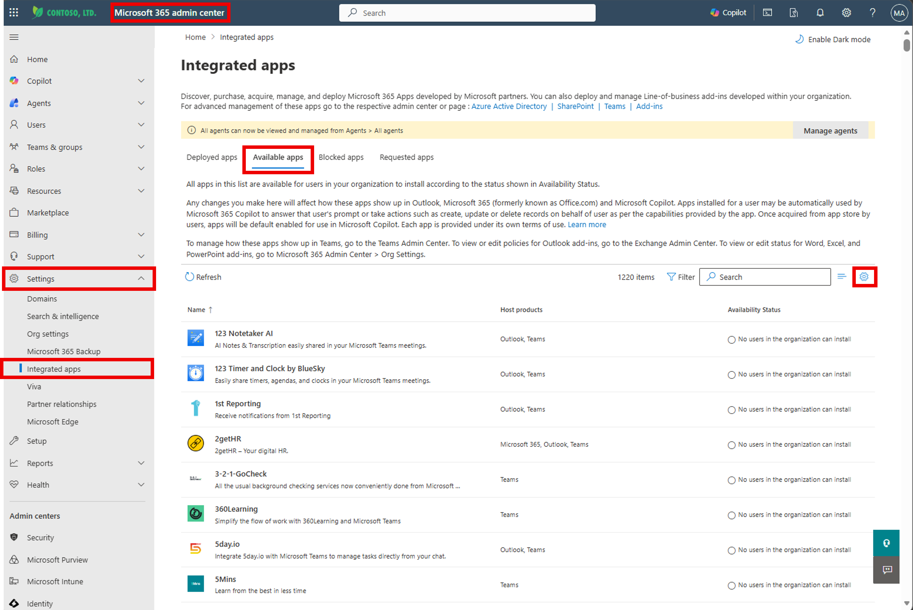

4. In the panel, find **"Allow the following users access to Copilot agents"**
5. Confirm it is set to **"All users"**, or verify your user or group is included
> 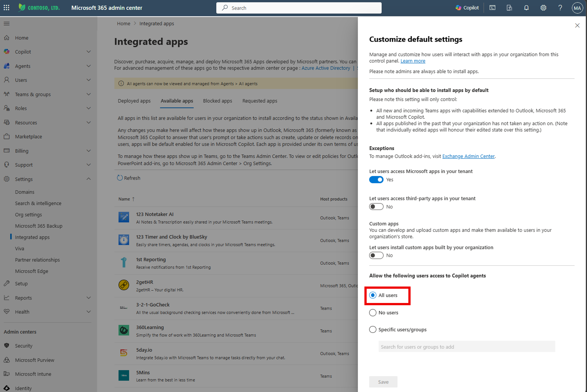

**Enable Custom App Sideloading in Microsoft Teams**

1. Sign in to **Teams Admin Center** → https://admin.teams.microsoft.com
2. Go to **Teams apps** → **Manage apps**
3. Click **Actions** (top right) → **Org-wide app settings**
> 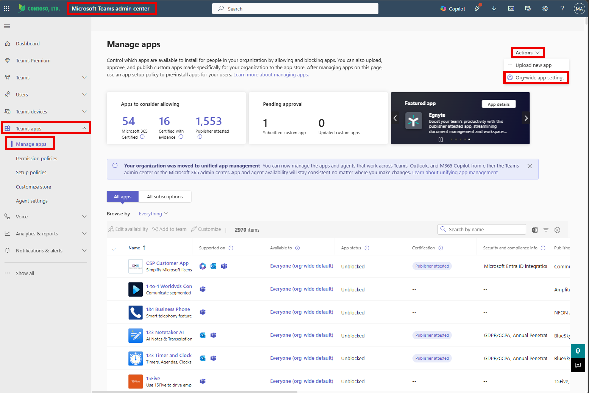

4. Under **Custom apps**, toggle **"Let users interact with custom apps in preview"** → **On** → Click **Save**
> 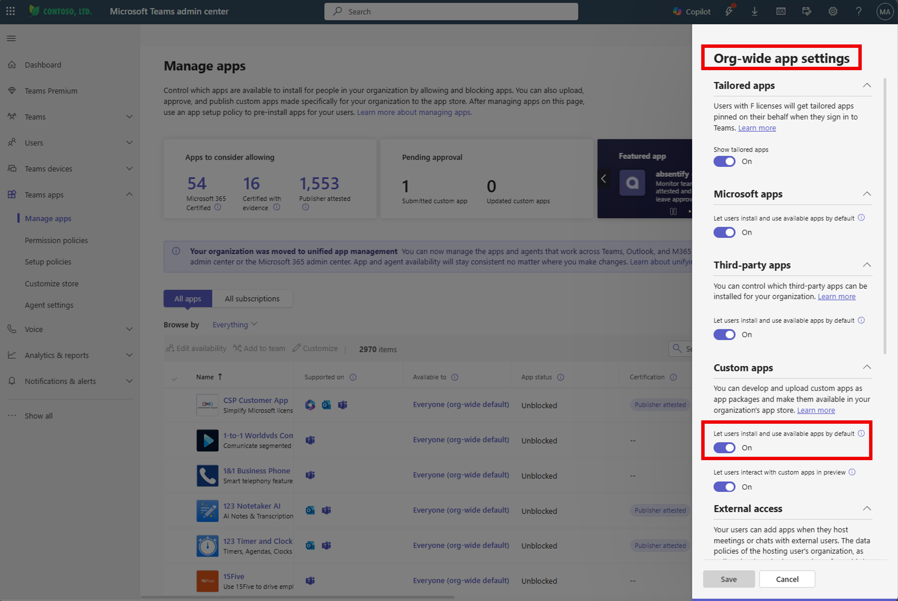

5. Go to **Teams apps** → **Setup policies** → **Global (Org-wide default)**
> 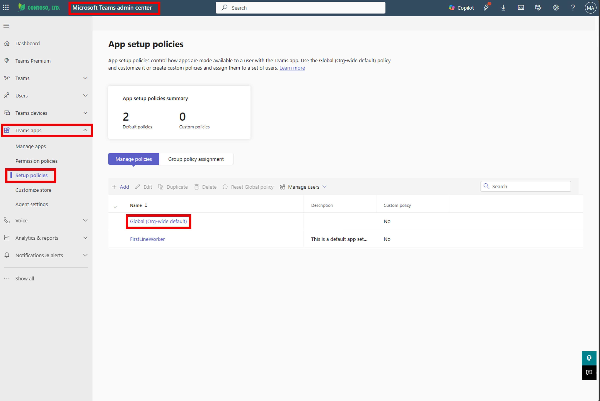

6. Toggle **"Upload custom apps"** → **On** → Click **Save**
> 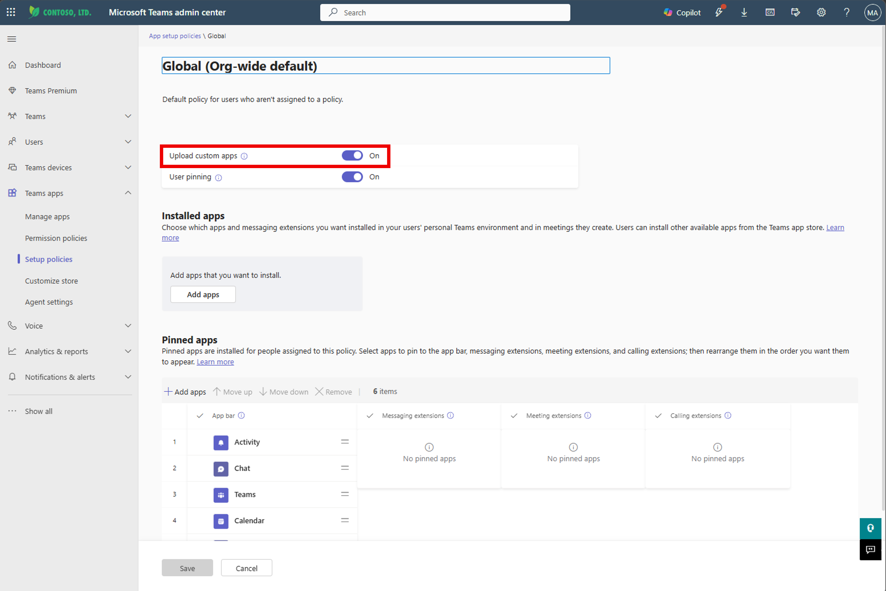

---

### Step 4-4. Extend Agent to Teams & M365 Copilot

1. In Copilot Studio, open the Monitoring Agent.
2. On the Agent Overview page, click the **"Channels"** tab.
3. Click **"Teams and Microsoft 365 Copilot"**.
4. Ensure **"Make agent available in Microsoft 365 Copilot"** is selected.
5. Click **"Add channel"**.
6. Confirm the success message is displayed.
7. **Re-publish the agent** (repeat Step 4-2) — this is required for M365 Copilot to reflect the newly added channel.

---

### Step 4-5. Deploy Agent Org-Wide

1. Go to the **Channels** tab → Click **"Teams and Microsoft 365 Copilot"**.
2. Click **"Availability option"**.
3. Click **"Show to everyone in my org"**.
4. Note the **App ID** displayed on the screen.
5. Click **"Submit for admin approval"**.
6. In the confirmation dialog, click **"Yes"**.
7. As an **M365 Admin**, go to https://admin.microsoft.com
8. Navigate to **Settings** → **Integrated apps** → **Requested apps**.
9. Find the Monitoring Agent (status: "Publish pending").
10. Click the agent → Verify **Host Product** includes: **Copilot**, **Microsoft 365**, and **Teams**.

    > ⚠️ If **"Copilot"** is missing from Host Product, re-publish the agent (repeat Steps 4-2 and 4-4).

11. Click **"Publish"** → Click **"Confirm"**.
12. Confirm the success message is displayed.

---

### Step 4-6. Add Agent in Microsoft Teams or M365 Copilot

#### Option A — Microsoft Teams

1. Open **Microsoft Teams** (web or desktop).
2. Go to **Apps** → **Built for your org**.
3. Find the Monitoring Agent → Click **"Add"**.

#### Option B — M365 Copilot

1. Go to https://www.microsoft365.com/chat
2. Click **"Get Agents"** in the right navigation panel.
3. Select **"Built for your org"** → Click the Monitoring Agent → Click **"Add"**.
4. Start a conversation using the suggested prompts or your own questions.

>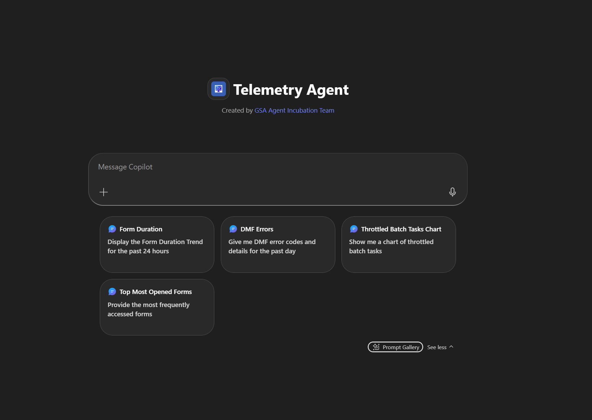
---

## Summary Checklist

| Phase | Step | Status |
|---|---|---|
| Phase 1 | Log Analytics Workspace created | ☐ |
| Phase 1 | Application Insights instance created | ☐ |
| Phase 1 | Telemetry source configured and validated | ☐ |
| Phase 2 | Power Platform (Dataverse) environment created | ☐ |
| Phase 2 | App registration created and configured | ☐ |
| Phase 2 | Application Insights permissions assigned | ☐ |
| Phase 2 | Storage account created and permissions assigned | ☐ |
| Phase 3 | MCSA Agent Framework solution imported | ☐ |
| Phase 3 | Agent configuration data imported (Queries + Settings) | ☐ |
| Phase 3 | MCSA Telemetry Agent solution imported | ☐ |
| Phase 3 | All 9 Power Automate flows activated | ☐ |
| Phase 3 | Agent settings updated via Configuration Center | ☐ |
| Phase 4 | Chat-based test passed in Copilot Studio | ☐ |
| Phase 4 | Agent published successfully | ☐ |
| Phase 4 | Tenant settings verified (Copilot extensibility + Teams sideloading) | ☐ |
| Phase 4 | Agent extended to Teams & M365 Copilot channel | ☐ |
| Phase 4 | Agent re-published after channel extension | ☐ |
| Phase 4 | Agent deployed org-wide via M365 Admin Center | ☐ |
| Phase 4 | Agent added and verified in Teams or M365 Copilot | ☐ |

---

## Related Resources

| Resource | Link |
|---|---|
| Scenario Overview | [1.Overview.md](./1.Overview.md) |
| Architecture | [2.Architecture.md](./2.Architecture.md) |
| Sample Prompts & Query Catalog | [4.Sample-prompts.md](./4.Sample-prompts.md) |
| Copilot Demo Tenant | https://aka.ms/copilotdemotenant |
| Copilot Studio | https://copilotstudio.microsoft.com |
| Power Platform Admin Center | https://admin.powerplatform.microsoft.com |
| Microsoft 365 Admin Center | https://admin.microsoft.com |
| Teams Admin Center | https://admin.teams.microsoft.com |
