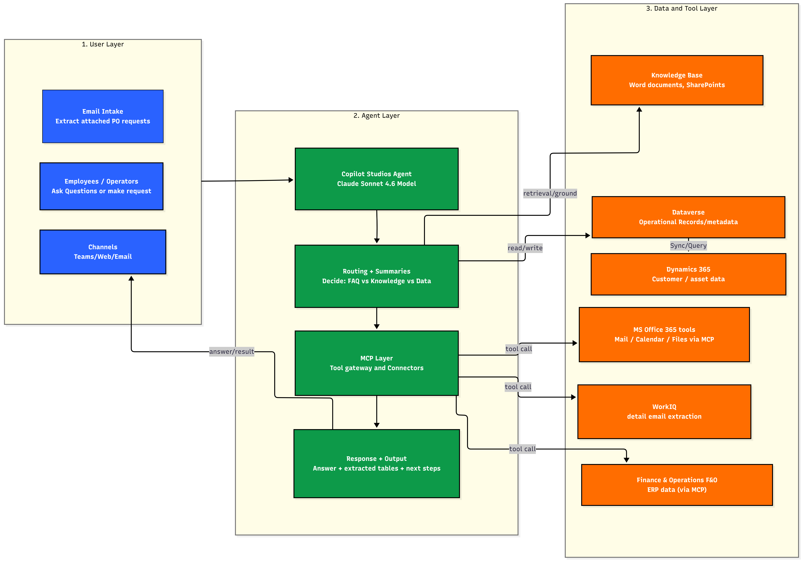
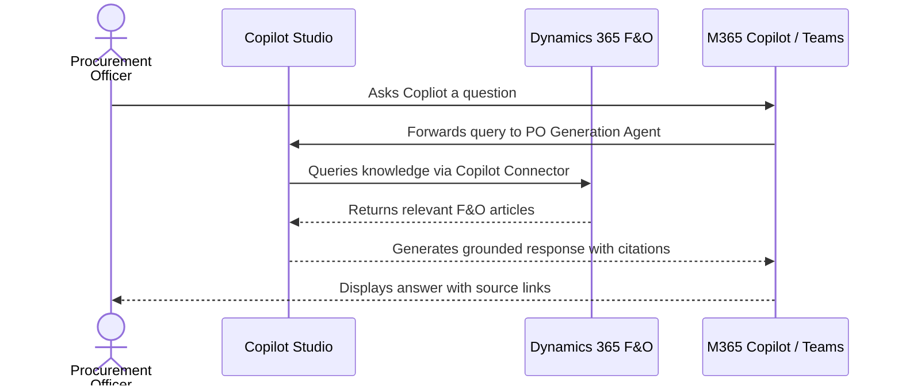
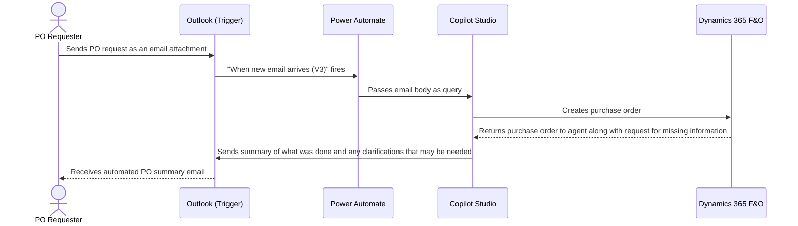
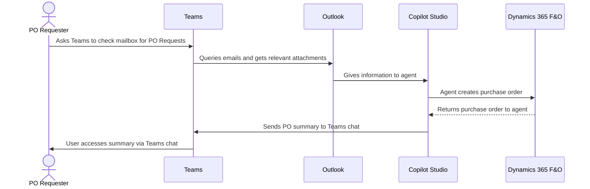

# Dynamics 365 PO Generation Agent — Architecture

## 1. Logical Architecture

The Dynamics 365 PO Generation Agent operates across three layers: the **User Layer**
(how implementation teams interact), the **Agent Layer** (how the agent reasons and
orchestrates), and the **Data & Tool Layer** (the D365 F&O  connection itself).

### How It Works

### Environment Architecture

- The **D365 Finance & Operations environment** (Tier-2 or Power Platform environment on
  version **10.0.47**) is the system of record for all module parameters.
- The **Copilot Studio agent** hosts the orchestration logic, instructions, and knowledge
  bindings, and authenticates to the MCP server over **OAuth**.

---

## 2. Key Components

| Component                        | Technology                                      | Role                                                                                                  |
| -------------------------------- | ----------------------------------------------- | ----------------------------------------------------------------------------------------------------- |
| **Agent Environment**            | Power Platform environment (same tenant as F&O) | Hosts the Copilot Studio agent and Dataverse dependencies                                             |
| **Agent Runtime**                | Microsoft Copilot Studio                        | Core agent orchestration and response generation                                                      |
| **LLM / Orchestrator**           | Anthropic **Claude Sonnet 4.6**                 | Natural-language understanding, tool selection, risk reasoning, and answer generation                 |
| **Agent Instructions**           | Copilot Studio prompt                           | Defines purpose, guidelines, skills, step-by-step flow, risk rubric, and output rules                 |
| **D365 Finance & Operations**    | Tier-2 / Power Platform environment, v10.0.47   | System of record for all configuration parameters                                                     |

---

## 3. Data Flow

### Scenario A — Interactive Chat User Initiated

### Scenario B — Autonomous Email Response (Trigger Activated Mode)

### Scenario C — Manually submitting a request via Teams (Interactive Mode)

---

## 4. Security & Governance Considerations

| Area | Consideration |
|---|---|
| **Credentials** | Email trigger and SendEmail tool use the **maker's credentials** (author's connection) |
| **Data Scope** | Web Search is **disabled** — agent will only respond from the provided knowledge sources |
| **Knowledge Boundary** | If no answer is found, agent directs user to HR contact email instead of guessing |
| **Access Control** | M365 Admin approval required for org-wide deployment via Integrated Apps |
| **Connector Permissions** | ServiceNow Copilot Connector access scoped to authorized users only |
| **Content Safety** | Resonsible AI content filters remain active; no custom model training involved |

---

## Related Resources

| Resource             | Link                                       |
| -------------------- | ------------------------------------------ |
| Scenario Overview    | [1.Overview.md](1.Overview.md)             |
| Step-by-Step Runbook | [3.Runbook.md](3.Runbook.md)               |
| Sample Prompts       | [4.Sample-prompts.md](4.Sample-prompts.md) |