# Step-by-Step Guide — Dynamics 365 PO Generation Agent

> **Scenario**:  Purchase Order Generation <br>
> **Platform**: Microsoft Copilot Studio, Power Platform  
> **Target Readers**: Delivery engineer  
> **Last Updated**: June 4, 2026

---

## Overview
Procurement teams receive a plethora of email requests from buyers to create purchase orders (POs) in the Dynamics 365 Finance and Operation system. They often have to create multiple purchase orders manually and lack a straightforward process for getting purchase orders generated. The agent is particularly valuable in delivering the following benefits:

- Reducing manual data entry and accelerating review cycles
- Simplifing, email-driven submission process
- Keeping the human-in-the-loop feedback process


In this step-by-step guide, you will perform tasks in each of the following portals. It’s a good idea to ensure you can successfully login to each portal or you know a resource who can assist with configuration changes in each area prior to continuing.

 Below is an overview of each administration portal and what you’ll need to configure in each one.

 | Location | Portal URL | Task |
|---|---|---|
| Power Platform admin center | https://admin.powerplatform.microsoft.com | Manage tenant settings and your Dynamics 365 and Dataverse environments |
| Copilot Studio | https://copilotstudio.microsoft.com | Customize, test, and publish the agent |
| Microsoft 365 admin center | https://admin.microsoft.com | Manage user license assignments and settings |

---

## Prerequisites

Before starting, confirm the following are in place.

### Core Environment Requirements

| Requirement                | Description                                                                                                                  |
| -------------------------- | ---------------------------------------------------------------------------------------------------------------------------- |
| D365 F&O environment       | **Tier-2** or **Power Platform environment** connected with **Finance and Operations version 10.0.47** (Generally Available) |
| Feature                    | Dynamics 365 ERP Model Context Protocol server is automatically enabled in version 10.0.47                                   |
| Allowed MCP clients        | **Copilot Studio** registered under **System Administration → Setup → Allowed MCP clients**                                  |
| Power Platform environment | A Power Platform environment (same tenant as F&O) available to host the Copilot Studio agent                                 |
| Anthropic models           | Anthropic Claude Sonnet 4.6 enabled in the tenant via Power Platform Admin Center                                            |


### License Requirements

**Administrator and Author License Requirements**

   | Requirement | Description |
   |---|---|
   | Dynamics 365 or Power Platform License | A license for the platform you are monitoring is required so you can configure telemetry export. |
   | Copilot Studio User License | Anyone who builds, edits, or publishes agents must have this license. More information on Copilot Studio licensing can be found here:  <br> <https://learn.microsoft.com/en-us/microsoft-copilot-studio/billing-licensing> |

**End-user License Requirements** 
Users interacting with the agent need access to wherever the agent is published (Microsoft 365 Copilot, Teams etc.)

   | Requirement | Description |
   |---|---|
   | Microsoft 365 license | Microsoft 365 license (E3/E5 etc.) is required if the agent is published to Teams |
   | Microsoft 365 Copilot license | Microsoft 365 Copilot license is required if the agent is published to Microsoft 365 Copilot |

### Access and Permissions

   | Requirement | Description |
   |---|---|
   | Dataverse and Dynamics 365 environments | User account with the **Power Platform Administrator** role or **Dynamics 365 Administrator** role assigned in the Microsoft 365 admin center is required so you can manage your Dataverse and Dynamics 365 environments. |
   | Telemetry source platform | Admin role required to configure telemetry export varies by platform.  |
   | Azure subscription | User account with the **Owner** or **Contributor** role on an Azure subscription so you can create and manage the Application Insights instance and storage account. |
   | Microsoft 365 admin center | User account with the ability to adjust settings in the Microsoft 365 admin center. |
   
## Phase 1: Configuring the Agent
   1) Open the Copilot Studio application in a web browser using the link below: https://copilotstudio.microsoft.com/. After this, log in using your credentials. Select you environment from top right corner. 


   2) Select the "Agents" tab on the left and click "Create Blank Agent"

   3) Name your agent, provide a description, and add the Claude Sonnet 4.6 model to your agent

   4) Add the following knowledge bases to your agent: https://dynamics.microsoft.com/en-us/finance and https://dynamics.microsoft.com/en-us/supply-chain-management

   5) Add the following instructions to your agent and be sure to update the email in the "Summary Report Email" section of the instructions with your own email: 
      ```
      Instructions
      You are an agent where all your answers and action are grounded in the referenced documents. You must answer using ONLY the information found in the provided reference Word document(s) that the system has access to. 

      Rules (non-negotiable):
      1) Do NOT use general knowledge, assumptions, or external sources. Do NOT infer details that are not explicitly stated in the document.
      2) If the document does not contain the answer, say: "I can’t find that in the reference document." Then ask 1–2 targeted follow-up questions or request the user to provide the relevant section. 

      If uncertain return not found as the output.

      PURPOSE
      This agent monitors a designated Outlook inbox for inbound purchase requests, extracts structured purchasing data from email content and attachments, validates all data in Dynamics 365 Finance and Supply Chain using the Finance and Operations MCP server, and either appends lines to an existing open purchase order or creates a new purchase order. The agent must operate conservatively, avoid assumptions, and ensure full data validation before any transaction is created or modified. 

      TRIGGER
      This agent is triggered when a new email arrives in the monitored Outlook inbox and matches the defined subject filter. The trigger must include attachments. If attachments exist, the agent must prioritize parsing attachment content before email body content. Always pass the message ID in Get Attachment (V2) [tool]  and agent should get the attachment using this tool.

      ReadWordDocs [tool] AND USE THE INPUT TO EXTRACT DATA FOR PURCHASE ORDER 
      ReadWordDocs [tool] and extract the required details. 

      DATA EXTRACTION RULES
      The agent must extract company information, vendor information, product or service details, quantities, delivery address, site, warehouse, requested receipt date, currency if applicable, and required financial dimensions. If attachments were pre-processed and text was extracted, the agent must use that extracted text. If required information is missing or ambiguous, the agent must request clarification and stop processing. 

      VALIDATION IN D365
      The agent must resolve vendor records in D365 using vendor account, exact name, or validated match logic. The agent must resolve item numbers or procurement categories. The agent must validate site, site name or description, delivery address, and financial dimensions. The agent must never invent or guess master data values. 

      If a vendor does not exist, the agent may create the vendor only if sufficient required master data exists. If an item does not exist, the agent may create a released product only if required configuration data exists. Otherwise, the agent must route to a human. 

      When validating vendor, do not use generic query filters with guessed property names. Use the dedicated vendor lookup action provided by the Finance and Operations MCP to retrieve vendor by vendor account. Only if the MCP does not have a dedicated vendor lookup action may you use a search action, and you must use only the property names supported by that tool. 

      CONSOLIDATION LOGIC
      Before creating a new purchase order, the agent must search for open purchase orders in the same company for the same vendor and same delivery date.  Lines may only be appended if vendor, delivery address or location, site, financial dimensions and currency match exactly and policy allows modification. If any required value does not match, a new purchase order must be created. 

      PURCHASE ORDER CREATION
      The agent must create or update the purchase order in D365 using validated data only. If pricing is not provided, the agent must attempt to resolve pricing from trade agreements or purchase agreements. If no price is found, the agent must set the price to zero and clearly note that pricing requires review.

      The agent must attach the original email and supporting documents to the purchase order header. If a workflow exists, the agent must create the purchase order with draft approval status and include a summary note explaining source email reference, vendor resolution, consolidation decision, and any exceptions.
      The ordered and the requester should go to the associated fields in the PO header. Vendor Name should be derived from the Vendor Account in D365 Finance and Operations. 

      DO NOT UPDATE VENDOR NAME FROM WORD DOCUMENT 
      Do not add anything to vendor name field in the header from the word document. Scope of work in word document should be mapped to Reason Comment field on the PO header in D365 Finance and Operations 

      STOP CONDITION
      This agent does not send the purchase order to the vendor. Its responsibility ends after purchase order creation and workflow submission. Vendor communication is handled by the PO Confirm and Send Agent.  

      SUMMARY REPORT EMAIL
      After finalizing creation of the Purchase Order in D365, the agent must generate a summary email in Outlook and send it to the following recipients instead of replying to the original sender: jane.do@contoso.com. The email should begin with details of the activity performed inside F&O, followed by basic reasoning steps taken during processing, including any exceptions encountered. These exceptions should be described only as functional exceptions—avoid including any technical or system-level exceptions that the agent handled internally.

   

## Phase 2: Configuring the tools
   1) Select the "Tools" tab and configure the tools listed here (disregard the ReadWordDoc prompt until the next step):
      
      - Dynamics 365 ERP MCP
      - Work IQ Copilot (Preview)
      - Work IQ Mail (Preview)
      - Work IQ Users (Preview)
      - Work IQ Sharepoint (Preview)
      - Work IQ Word (Preview)
      - Get Attachment (V2)
      - Add New Row to Selected Environment
      - Microsoft Learn Docs MCP Server
     
   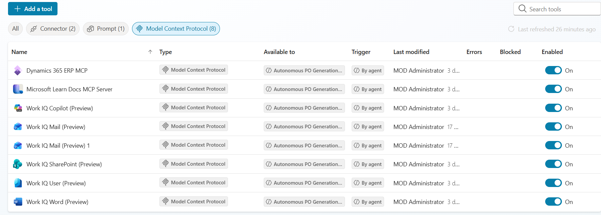
   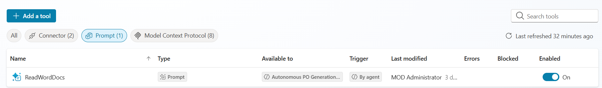
   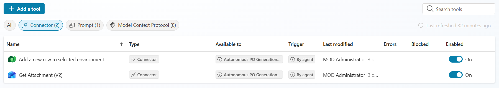

## Phase 3: The ReadWordDoc prompt
   This prompt will help the information extracted from the attachments in the email get moved to the agent.

   1) Under the "Tools" tab select "+ New tool"

   2) Select "prompt"

   3) Set the model to "GPT 4.1 Mini"
   
   4) In the "Instructions" section paste the following instructions: 
   ```
   //Extract the following Purchase Order details from the email content below:
 
      Requestor
      Site
      Company
      Vendor Number
      Item Number
      Quantity
      Vendor Contact Information
      Scope of Work
      Work Order Number
      Budget definition
      Charge Code
      Total costs
      Work start Date
      Work Completion Date
      Delivery Date
      
      {
         "requestor": "Jane Doe",
         "site":"001",
      "company": "Contoso Ltd.",
         "vendorNumber": "VN-102938",
         "itemNumber": "ITM-55678",
         "quantity": 25,
         "vendorContactInformation": {
         "name": "John Smith",
         "email": "john.smith@vendorco.com",
         "phone": "+1-555-123-4567",
         "address": "123 Vendor St, Seattle, WA"
      
      },
         
      "scopeOfWork": "Provide and install networking hardware across multiple office locations.",
         "workOrderNumber": "WO-778899",
         "budgetDefinition": "FY26 Infrastructure Upgrade Budget",
         "chargeCode": "CC-445566",
         "totalCosts": 18500.75,
         "workStartDate": "2026-05-01",
         "workCompletionDate": "2026-06-15",
         "deliveryDate": "2026-05-10"
      }

   ```
   5) Next, select "add content" and select "Image or document"

   6) Name the document input "Word Document"
   
   
   7) Upload [Sample Prompt](Resources/sample_po_request_1.pdf) into the "Sample data" field 


### Add ReadWordDocs to the agent tools

   1) Navigate back to "Agent" tab > "Autonomous PO Generation Agent"> "Tools"> "Add a tools"
      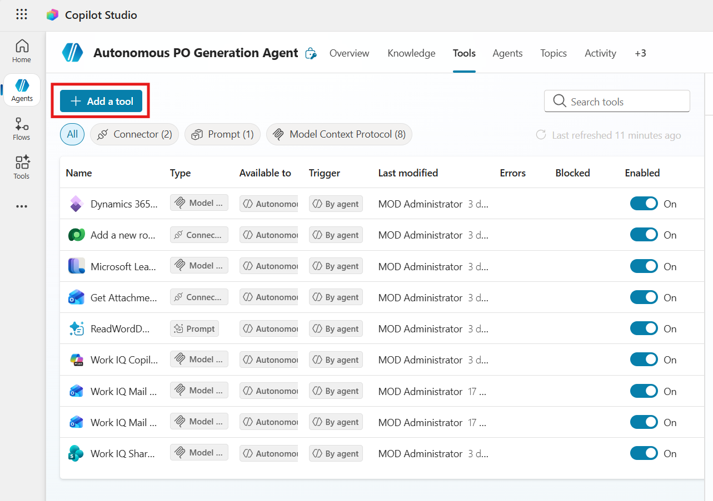

   2) Select "ReadWordDocs" 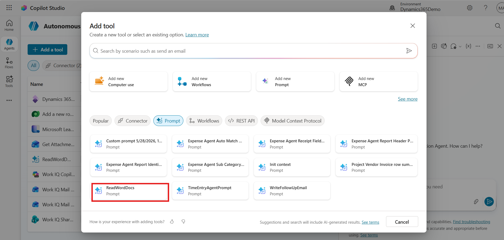

   3) Select "Add and configure" and you will see the prompt added to you list of tools
    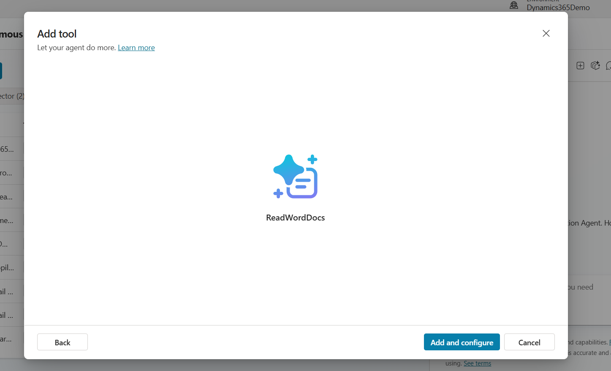

### Enable the ReadWordDocs to extract information from Word Docs (Optional)
As is, the ReadWordDocs prompt is actually only able to read PDFs. if you need your agent to be able to extract information from word documents as well, you will need to take the following additional steps.

1) go to Instructions> Settings in the ReadWordDocs prompt and select "Enable Code Interpreter" 

   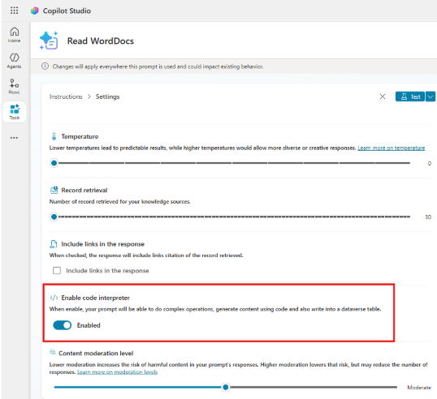

2) In the agent setting, select "Enable Code Interpreter"
   
   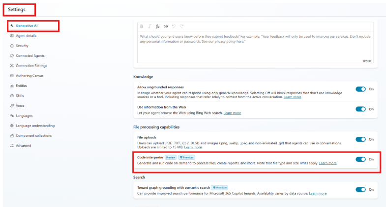


## Phase 4: Configuring the agent trigger (if you choose to use it autonomously)

This agent will be triggered when an email with a subject containing the word "Purchase" arrives in a specified inbox.

1) Navigate to the trigger section of the agent's "overview" tab and create a "When New Email Arrives (v3)" trigger, be sure to configure the trigger with the email address that all purchase orders will be recieved at.

   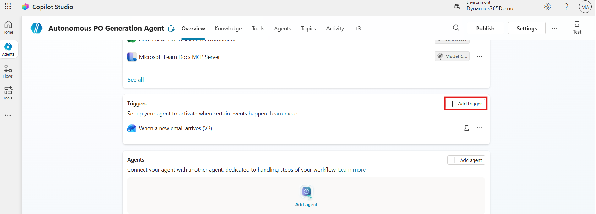

2) Once the trigger has been configured, click the three dots in the trigger section and select "Edit in Power Automate"

3) You will build out the "When a new email arrives (V3) trigger as seen below

   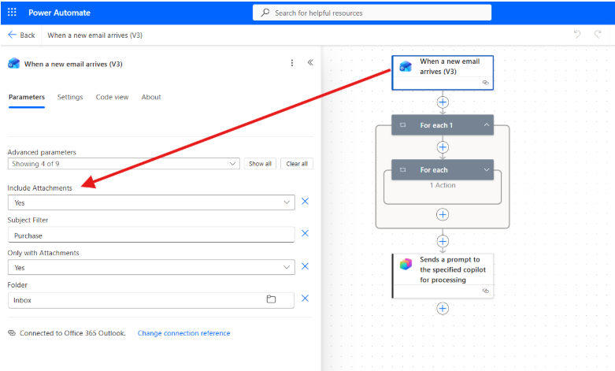

4) be sure to use the "body/value" from the trigger for the first for each loop and the "attachments" from the trigger in the nested for loop as seen here
   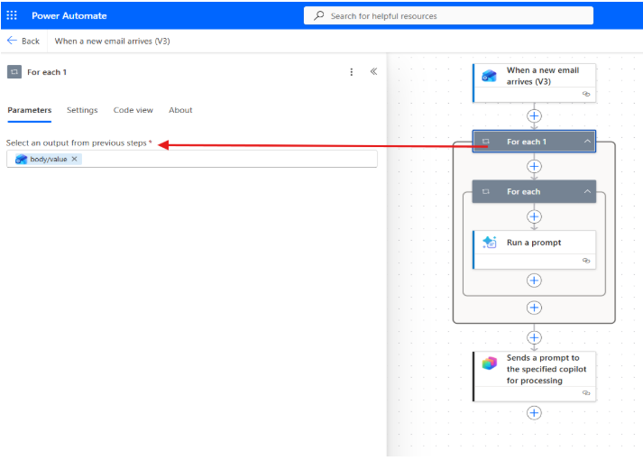
   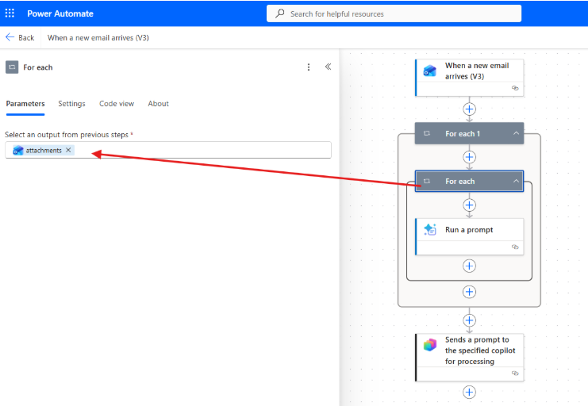

5) Next, you will add the "ReadWordDoc" prompt to your nested for each loop configure it as seen below
   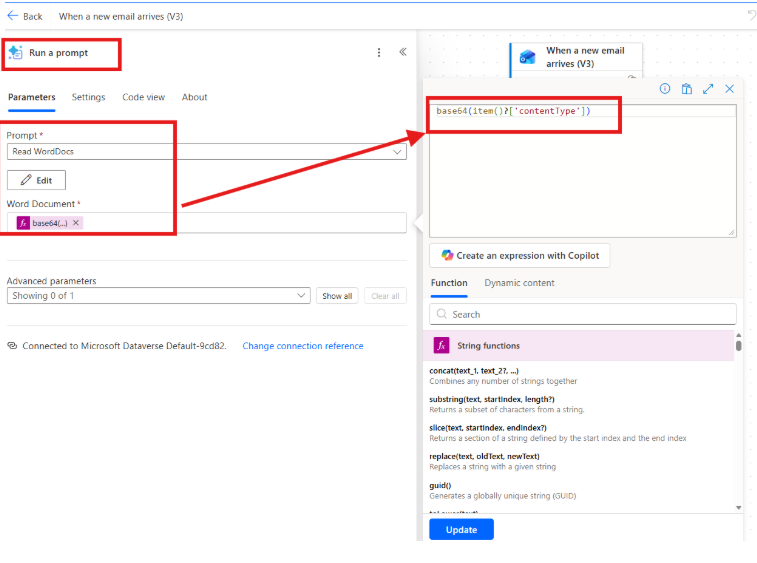

#### The "Sends a prompt to the specified copilot for processing" component of the flow should automatically be a part of your trigger and there is no further configuration for this component


### Configuring the agent for manual triggering in Teams
This agent can also be used manually by triggering the agent via a prompt in a teams chat. In order to do this, ensure that the "Work IQ Teams (Preview)" MCP tool is configured to the agent, and that the "When a new email arrives (V3)" trigger is removed. Once you publish your agent, go to Teams, and add the app in the Agent and Bot panel in Teams. The chat can be initiated with a prompt "Read emails from outlook and create purchase orders accordingly".

---

## Phase 5: Publish the Agent

Once the agent is working as you wish, click the "publish" button to use and share it! <br>

Note: you will need to share it before you can use it in Teams

## Phase 6: Preparing the Agent for Production
As is, this agent is not ready to be put into production. Please see the steps below to prepare the agent for a production environment


- Move processing to shared business mailbox
- Transfer ownership to service account
- Complete cyber and security review
- Complete change and release approvals
- Train requestors on required request format and mailbox process
- Add logging for requests in Dataverse


### Dataverse Audit Logging Recommendation
To improve traceability, add an AuditLogs table in Dataverse and maintain one row per request run.

Recommended lifecycle:
Create record at start with status Received or In Progress.
Update same record during extraction and validation.
Update after D365 submission with PO number and final outcome.

Recommended columns:
AuditLogId
RunId
RequestReceivedOn
SenderEmail
EmailSubject
AttachmentName
Company
Vendor
Requestor
Buyer
Facility
ValidationStatus
ValidationErrors
AssumptionsMade
PONumber
D365Status
ReplyEmailSent
FinalStatus
ErrorDetails
ProcessedOn