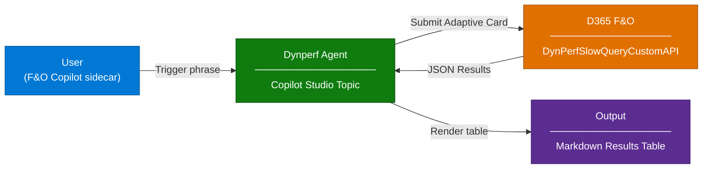

# Dynperf Agent - Overview

## Scenario Overview

**Scenario Type**: Application Performance Diagnostics (Slow Query Analysis)  
**Agent Type**: Interactive  
**Primary Tools**: Microsoft Copilot Studio, Dynamics 365 Finance & Operations Custom API  
**Complexity**: Intermediate–Advanced  
**Owner**: BSA Innovation  
**Status**: 🚧 In Development  

This scenario describes how to deploy and configure the **Dynperf Agent**, an AI agent
that helps Dynamics 365 Finance & Operations (F&O) administrators and DBAs inspect
**SQL Query Data Store (QDS)** data — slow queries, missing indexes, query plans —
**directly inside F&O**, without requiring deep SQL expertise, LCS access, or ad-hoc
SSMS sessions.

The agent is delivered as **two pieces**: a Copilot Studio topic that handles the
conversation, and a small F&O X++ model (`DynPerfAgent`) that exposes the
**`DynPerfSlowQueryCustomAPI`** Custom API. The topic calls the Custom API directly
— there are no Power Automate flows, no Dataverse tables, and no Application Insights
in the loop.

---

## Problem Statement

Performance regressions in Dynamics 365 Finance & Operations are one of the most disruptive
and hardest-to-diagnose categories of incident. They typically surface as user-perceived
slowness on a form, a long-running batch, or a stuck integration — but the root cause
almost always lives in the SQL layer (a slow query, a missing index, a parameter-sniffing
plan regression, blocking).

With **Lifecycle Services (LCS) being deprecated**, customers are losing the SQL Insights /
Performance reports they previously relied on, while at the same time access to the
underlying SQL database in Tier-2+ environments remains restricted and indirect.

Without a structured solution, organizations experience:

- **Blind spots on SQL performance**: Administrators can see *that* a form or batch is slow,
  but not *which query* is causing it, *how often* it has run, or *how its duration is trending*.
- **Reliance on scarce expertise**: Diagnosing slow queries typically requires a senior DBA or
  an FastTrack/CSS engineer; line-of-business administrators cannot self-serve.
- **Slow time to triage**: By the time a support ticket is raised, the slow execution is
  already in the past and the evidence (query text, duration, parameters, call stack) is hard
  to recover.
- **No proactive view**: There is no out-of-the-box way to be notified when a previously
  fast query suddenly degrades, or when a new slow query appears in production.

### From a Concrete F&O Need to a Focused Tool

The Dynperf Agent was born from a concrete need: **giving F&O customers self-service
access to Query Data Store data from inside the F&O sidecar**, post-LCS, without
granting direct SQL access.

The scope is intentionally narrow. Where the Monitoring Agent is the
"telemetry-from-App-Insights" agent, the Dynperf Agent is the
"Query-Data-Store-from-F&O" agent. Two edit surfaces, one Custom API, one topic — and
that's it.

---

## Solution Summary

The **Dynperf Agent** is an AI agent built on **Microsoft Copilot Studio** that surfaces
F&O Query Data Store data directly where administrators already work: the **Dynamics 365
Finance & Operations Copilot sidecar** (the in-app Copilot pane available from any F&O
workspace).

The core building block is the **`DynPerfSlowQueryCustomAPI`** Custom API, deployed into
F&O via the **`DynPerfAgent` X++ model**. The Copilot Studio topic calls this Custom API
directly using the F&O connector and renders the response (a JSON `Results` table with
6 columns) as a markdown table in the conversation.

### Key Capabilities

| Capability | Description |
|---|---|
| 🐢 **Slow Query Inspection** | Search the F&O Query Data Store for slow queries over a configurable date/time window, filtered by search text, minimum duration, and minimum executions |
| 🪪 **Query / Plan Identifiers** | Returns `QUERY_ID` and `PLAN_ID` so administrators can look up the full query text and execution plan in QDS |
| 🔁 **Iterative Search** | Follow-up prompt lets the user re-open the parameter card and search again without re-typing a trigger phrase |
| 🤝 **In-app from F&O** | Triggered from the F&O Copilot sidecar with one of 5 keywords (`Dynperf`, `Get slow queries`, `Get missing indexes`, `query performance`, `query tuning`) |

---

### How It Works

The agent has a single interaction model: **interactive only**.

| Mode | Trigger | Description |
|---|---|---|
| **Interactive** | User types a trigger phrase in the F&O Copilot sidecar | Agent shows the **DynPerf Tool** Adaptive Card → user submits parameters → topic calls `DynPerfSlowQueryCustomAPI` → results rendered as a markdown table |

> 📌 For detailed architecture diagrams, see [Architecture](2.Architecture.md).

---

## Extensibility & Maintenance

The Dynperf Agent is intentionally simple to extend. There are exactly **two** places to change behavior, depending on whether the change is to the **data** or to the **conversation**:

- **Server-side (data layer) — `DynPerfSlowQueryCustomAPI` X++ class**
  Change *what data is returned* (new query against Query Data Store, new filter, new
  output column, additional method). Edits live in the **`DynPerfAgent`** X++ model in F&O.
  After changes: build the model, run database sync, and redeploy to the target environment.
- **Agent-side (conversation layer) — Copilot Studio topic**
  Change *how the agent interacts with the user* (trigger phrases, prompted parameters,
  how the API response is rendered, follow-up flow, message wording). Edits are made
  directly in the Copilot Studio topic for the Dynperf Agent and take effect on **Publish**
  — no F&O changes required.

Most enhancements fall cleanly into one of the two:

| You want to… | Edit here |
|---|---|
| Add a new search dimension or output column | `DynPerfSlowQueryCustomAPI` X++ class |
| Change a default value or pre-filter | `DynPerfSlowQueryCustomAPI` X++ class |
| Add or rename a trigger phrase / keyword | Copilot Studio topic |
| Adjust the parameter prompts the user sees | Copilot Studio topic |
| Change how the API response is summarized or formatted | Copilot Studio topic |
| Add a new conversational follow-up | Copilot Studio topic |

> ✨ **X++ for the data, Copilot Studio for the conversation. No third place to look.**

For the trigger phrases, card fields, and result schema, see [Sample Prompts](4.Sample-prompts.md).

---

## Business Outcomes

| Outcome | Description |
|---|---|
| ⚡ **Faster time to triage** | Surface the slowest queries from QDS in seconds, directly inside F&O — no need to pivot to SSMS, LCS, or a DBA |
| 🧑‍💻 **Reduced dependency on senior DBAs** | Line-of-business administrators can self-serve common slow-query investigations using a guided Adaptive Card |
| 🔐 **Safe by design** | The agent reads through a curated, read-only Custom API; no direct SQL access, no DML, no LCS dependency |
| 🔌 **Extensible by design** | Two clean edit surfaces — `DynPerfSlowQueryCustomAPI` X++ class for the data, Copilot Studio topic for the conversation |
| 🧪 **Pre-production performance validation** | Run the agent against **UAT / sandbox** environments to catch slow queries and missing indexes *before* customizations or new releases reach production |

---

## In Scope / Out of Scope

### ✅ In Scope

- Deployment of the **`DynPerfAgent`** X++ model to D365 F&O (`DynPerfSlowQueryCustomAPI` Custom API + security artifacts + label file)
- Deployment of the **Dynperf Agent** Copilot Studio agent and its single topic (trigger phrases + Adaptive Card + Custom API call + results rendering)
- Wiring the F&O Custom API connector to the agent's service principal and the `DynPerfRole`
- Publishing the agent into the F&O Copilot sidecar

### ❌ Out of Scope

- Direct remediation, query rewriting, or index changes in F&O (agent is read-only / advisory)
- Authoring of brand-new X++ Custom API methods (customers can extend, but authoring support is not included in this scenario)
- F&O environment provisioning and deployment (must already exist; minimum platform version applies)
- SQL-level access to Tier-2+ environments (the agent intentionally avoids this)
- Charts, daily briefings, scheduled emails, or proactive alerts (not implemented in the current topic)
- Free-form natural-language Q&A (the topic is triggered only by the configured keywords; the conversation is then driven by the Adaptive Card)
- Multi-environment connection switching

---

## Target Users

| Persona | Role in This Scenario |
|---|---|
| **Dynamics 365 F&O Admin** | **Primary agent end-user**: Triggers the agent from the F&O Copilot sidecar and inspects QDS results   **F&O configuration manager**: Imports the `DynPerfAgent` model and assigns the `DynPerfRole` to the agent's service principal |
| **Help Desk / Tier-1 Support** | Triages reported slowness from inside F&O before escalating |
| **DBA / Performance Engineer** | Uses the agent to quickly surface candidate slow queries (`QUERY_ID` / `PLAN_ID`) for deeper investigation in QDS / SSMS |
| **CSA / Delivery Engineer** | Deploys and configures the agent using this runbook |

---

## Data Sources

| Source | Content | Integration |
|---|---|---|
| **D365 F&O — `DynPerfSlowQueryCustomAPI`** | Query Data Store data surfaced by F&O: `QUERY_ID`, `PLAN_ID`, `AVG_DURATION_MS`, `MAX_DURATION_MS`, `TOTAL_EXECUTIONS`, `TOTAL_TIME_SECS` | Called directly from the Copilot Studio topic via the **F&O Custom API connector** (`msdyn_fnocopilot.DynPerfRole.DynPerfSlowQueryCustomAPI`), authenticated as the agent's service principal |

> 📌 The agent does **not** use web search or general LLM knowledge for performance answers,
> and there is **no** Dataverse, Power Automate, Azure Blob Storage, or Application Insights
> in the data path. The only data source is the F&O Custom API.

---

## Solution Structure

The Dynperf Agent is deployed as **two pieces**:

| Piece | Where it lives | Type | Contents |
|---|---|---|---|
| **`DynPerfAgent`** X++ model | D365 F&O (PackagesLocalDirectory) | F&O model | `DynPerfSlowQueryCustomAPI` class, `CustomApiTable.DynPerfAgent` form extension, `DynPerfSlowQueryCustomAPI` action menu item, `DynPerfAPIPrivileges` / `DynPerfAPIDuty` / `DynPerfRole` security artifacts, `DynPerfAgent_en-US` label file |
| **Dynperf Agent (Copilot Studio)** | Power Platform environment | Copilot Studio agent | One agent with one topic (`Dynperf`) containing the trigger phrases, the **DynPerf Tool** Adaptive Card, the F&O Custom API call, and the results-rendering logic |

> ⚠️ The **`DynPerfAgent`** X++ model must be **deployed and database-synced** in F&O
> *before* the Copilot Studio agent is published, otherwise the Custom API endpoint will
> not exist for the topic to call.

---

## Related Resources

| Resource | Link |
|---|---|
| Architecture | [2.Architecture.md](2.Architecture.md) |
| Step-by-Step Runbook | [3.Runbook.md](3.Runbook.md) |
| Sample Prompts | [4.Sample-prompts.md](4.Sample-prompts.md) |
| Companion scenario — Monitoring Agent | [../Dynamics-365-Monitoring-Agent/1.Overview.md](../Dynamics-365-Monitoring-Agent/1.Overview.md) |
| Copilot Studio Documentation | [Microsoft Learn](https://learn.microsoft.com/en-us/microsoft-copilot-studio/) |
| F&O Custom Services / Custom APIs | [Microsoft Learn](https://learn.microsoft.com/en-us/dynamics365/fin-ops-core/dev-itpro/data-entities/custom-services) |

---
