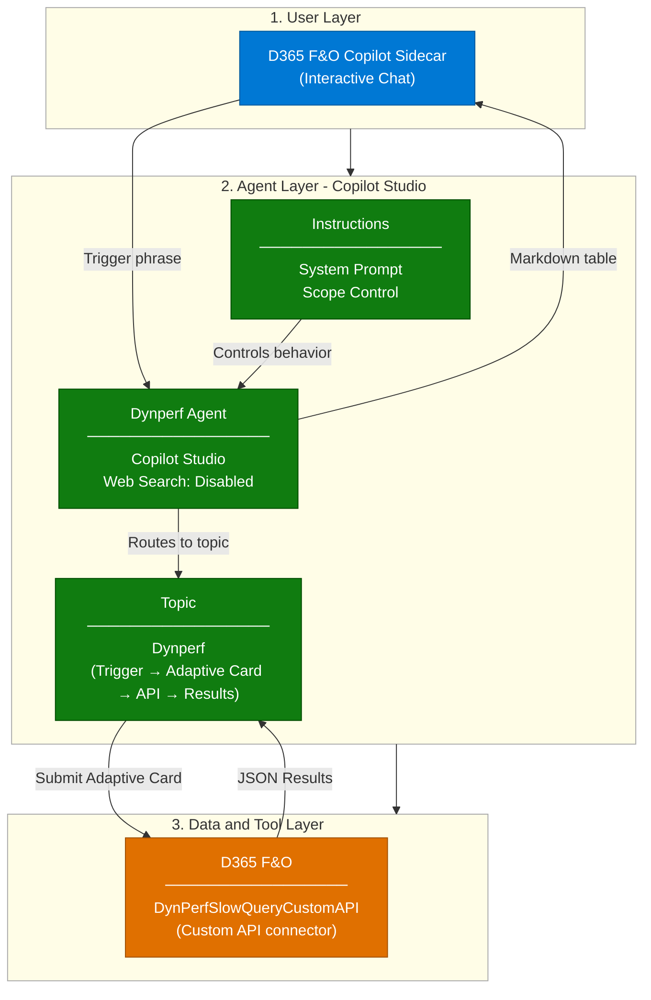
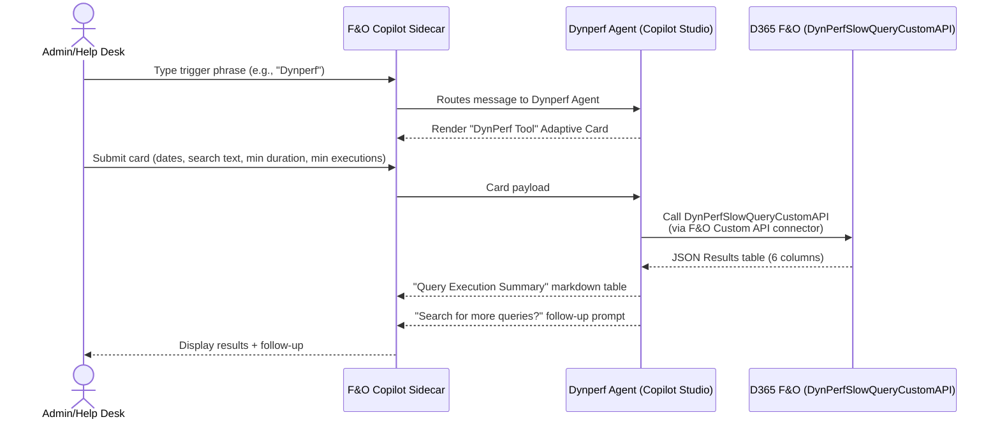

# Dynperf Agent — Architecture

## 1. Logical Architecture

The Dynperf Agent operates across three layers: the **User Layer** (how users interact),
the **Agent Layer** (how the agent processes requests), and the **Data & Tool Layer**
(what the agent uses to generate responses).

The agent is intentionally minimal: a **single Copilot Studio topic** that calls a
**Custom API exposed directly by F&O** (`DynPerfSlowQueryCustomAPI`). There is no
Dataverse, no Power Automate, no Azure Blob Storage, and no Application Insights in the
data path.

### How It Works

### Environment Architecture

- The **D365 F&O environment** (Finance and/or Supply Chain Management) hosts the
  `DynPerfAgent` X++ model. The model exposes the `DynPerfSlowQueryCustomAPI` Custom API
  and ships the `DynPerfRole` security role assigned to the agent's service principal.
- The **Power Platform environment** hosts the Copilot Studio agent and its single
  `Dynperf` topic. No Dataverse tables, Power Automate flows, or storage accounts are
  required for the agent to function.
- Users interact with the agent through the **Dynamics 365 Finance & Operations Copilot sidecar**
  (the in-app Copilot pane available from any F&O workspace).

> 📌 If you are also deploying the Dynamics 365 Monitoring Agent, the **same Power Platform
> environment** can be reused — they are independent Copilot Studio agents. They share no
> Dataverse tables or flows.

---

## 2. Key Components

| Component | Technology | Role |
|---|---|---|
| **Agent Environment** | Power Platform Environment | Hosts the Copilot Studio agent |
| **Deployment Surface** | D365 F&O Copilot sidecar | Where end users invoke the agent |
| **Agent Runtime** | Microsoft Copilot Studio | Hosts the `Dynperf` topic and the F&O Custom API connector binding |
| **Topic** | `Dynperf` (single topic) | `OnRecognizedIntent` trigger → `AdaptiveCardPrompt` (`DynPerf Tool` card) → `BeginDialog` to the Custom API connector → `ParseValue` → `SendActivity` (markdown table) → `Question` follow-up (`Yes, Search Again` / `No, Do Not Search Again`) |
| **F&O Connector** | `msdyn_fnocopilot.DynPerfRole.DynPerfSlowQueryCustomAPI` | Power Platform connector that calls the F&O Custom API; authenticated as the agent's service principal |
| **F&O X++ Model** | `DynPerfAgent` (PackagesLocalDirectory) | Hosts the Custom API class, security artifacts, form extension, label file |
| **F&O Custom API** | `DynPerfSlowQueryCustomAPI` (X++ class + Action Menu Item) | Reads SQL Query Data Store and returns `QUERY_ID`, `PLAN_ID`, `AVG_DURATION_MS`, `MAX_DURATION_MS`, `TOTAL_EXECUTIONS`, `TOTAL_TIME_SECS` |
| **F&O Form Extension** | `CustomApiTable.DynPerfAgent` | Surfaces the Custom API in the standard `CustomApiTable` form |
| **F&O Security — Privilege** | `DynPerfAPIPrivileges` | Grants execute access on the menu item / Custom API |
| **F&O Security — Duty** | `DynPerfAPIDuty` | Bundles the privilege |
| **F&O Security — Role** | `DynPerfRole` | Assigned to the agent's service principal in F&O |
| **F&O Labels** | `DynPerfAgent_en-US` | English labels for the model |

---

## 3. Data Flow

The agent has a single interaction model: **interactive only**, triggered from inside
the F&O Copilot sidecar.

---

## 4. Security & Governance Considerations

| Area | Consideration |
|---|---|
| **Credentials** | The F&O Custom API connector authenticates as a **Microsoft Entra app registration** (service principal). The same app registration is registered in F&O as an external user mapped to the `DynPerfRole` security role. |
| **Data Scope** | Web Search is **disabled**. The agent responds exclusively from data returned by `DynPerfSlowQueryCustomAPI`. |
| **Knowledge Boundary** | The topic only invokes the single, pre-curated `DynPerfSlowQueryCustomAPI` Custom API. No other data source is reachable. |
| **Read-Only by Design** | The Custom API is intentionally read-only. The agent cannot modify F&O data, rewrite queries, or change indexes. |
| **No Direct SQL Access** | The agent never connects to the F&O SQL database directly. All access is mediated by the X++ Custom API and constrained by F&O security. |
| **No Free-Form NL Surface** | The conversation is gated by the configured trigger phrases and then driven by the Adaptive Card; there is no free-form prompt path that could leak prompts or data. |
| **Access Control** | F&O access is scoped through the `DynPerfRole`. Sidecar publishing is controlled by the standard F&O Copilot governance. |
| **Content Safety** | Copilot Studio's default content filters remain active; no custom model training is involved. |

---

## Related Resources

| Resource | Link |
|---|---|
| Scenario Overview | [1.Overview.md](1.Overview.md) |
| Step-by-Step Runbook | [3.Runbook.md](3.Runbook.md) |
| Sample Prompts | [4.Sample-prompts.md](4.Sample-prompts.md) |
| Companion scenario — Monitoring Agent | [../Dynamics-365-Monitoring-Agent/2.Architecture.md](../Dynamics-365-Monitoring-Agent/2.Architecture.md) |
