# Step-by-Step Guide — Dynperf Agent

> **Scenario**: Application Performance Diagnostics (Slow Query Analysis)
> **Platform**: Microsoft Copilot Studio, Power Platform, D365 Finance & Operations
> **Target Readers**: CSA / Vendor / PM
> **Last Updated**: April 29, 2026

---

## Overview

D365 F&O administrators and DBAs are responsible for application performance, but with LCS
deprecated and Tier-2+ SQL access restricted, they have lost visibility into the SQL
performance signals (slow queries, regressions, top consumers) they previously relied on.

The Dynperf Agent makes slow-query diagnostics easier by:

- Surfacing slow queries directly from F&O in natural language
- Detecting query regressions against a baseline window
- Providing daily performance briefings without requiring SSMS or LCS
- Pushing proactive alerts to Teams when a regression appears

> *Diagram of the agent solution components*
>
> 

In this step-by-step guide, you will perform tasks in each of the following portals. Confirm
you can sign in to each portal — or that you have a counterpart who can — before starting.

| Location | Portal URL | Task |
|---|---|---|
| Dynamics 365 F&O (LCS / app workspace) | https://lcs.dynamics.com (or your environment URL) | Deploy the `DynPerfAgent` X++ model, run database sync, register the agent's app to F&O |
| Power Platform admin center | https://admin.powerplatform.microsoft.com | Manage tenant settings and your Dataverse environments |
| Power Apps Maker Portal | https://make.powerapps.com | Deploy the agent solution, update connection credentials, and configure agent settings |
| Copilot Studio | https://copilotstudio.microsoft.com | Customize, test, and publish the agent |
| Azure Portal | https://portal.azure.com | Create the Microsoft Entra app registration and storage account |
| Microsoft 365 admin center | https://admin.microsoft.com | Manage user license assignments and settings |
| Teams admin center | https://admin.teams.microsoft.com | Manage Teams settings |

---

## Prerequisites

Before starting, confirm the following are in place.

### Core Environment Requirements

| Requirement | Description |
|---|---|
| D365 F&O environment | A Tier-1 (dev/build) and a target Tier-2+ (sandbox/prod) F&O environment running a supported platform version (10.0.39 / PU63 or later recommended for Custom APIs). |
| Dataverse capacity | 1 GB of available Dataverse capacity so a new Power Platform environment can be created with a Dataverse datastore (same tenant as F&O) |
| Azure subscription | Azure subscription (same tenant as F&O) |
| Copilot credits | Available Copilot credits or a billing plan setup for Pay-As-You-Go copilot credit billing (same tenant) |
| Email account | Email-enabled Outlook account (same tenant) |

### License Requirements

**Administrator and Author License Requirements**

| Requirement | Description |
|---|---|
| Dynamics 365 F&O License | A D365 Finance, SCM, or Commerce license is required to access the F&O environment and assign the security role. |
| Copilot Studio User License | Anyone who builds, edits, or publishes the agent must have this license. <https://learn.microsoft.com/en-us/microsoft-copilot-studio/billing-licensing> |

**End-user License Requirements**

Users interacting with the agent need access to wherever the agent is published.

| Requirement | Description |
|---|---|
| Microsoft 365 license | Microsoft 365 license (E3/E5 etc.) is required if the agent is published to Teams |
| Microsoft 365 Copilot license | Microsoft 365 Copilot license is required if the agent is published to Microsoft 365 Copilot |

### Access and Permissions

| Requirement | Description |
|---|---|
| Dataverse environments | User account with the **Power Platform Administrator** role or **Dynamics 365 Administrator** role in the Microsoft 365 admin center. |
| D365 F&O — model deployment | **System administrator** role in F&O for the target environment, plus access to the build/dev environment to compile and package the X++ model. |
| Azure subscription | User account with the **Owner** or **Contributor** role on an Azure subscription so you can create and manage the app registration and storage account. |
| Microsoft 365 admin center | User account with the ability to adjust settings in the Microsoft 365 admin center. |
| Teams admin center | User account with the ability to adjust settings in the Teams admin center. |

---

## Phase 1: Deploy the `DynPerfAgent` X++ Model to F&O

The agent's data source is the **`DynPerfSlowQueryCustomAPI`** Custom API exposed by the
`DynPerfAgent` X++ model. The model must be present in F&O before the Power Platform agent
can call it.

### Step 1-1. Acquire the Model

Choose **one** of the two delivery formats:

**Option A — Source model (recommended for dev / Tier-1)**

1. Download the `DynPerfAgent` source model package from [0.Resources/Solution-files](0.Resources/Solution-files).
2. Extract the contents into your F&O Tier-1 environment under
   `K:\AosService\PackagesLocalDirectory\DynPerfAgent\` (or the equivalent path on your
   build VM).
3. Open Visual Studio on the Tier-1 environment, open the solution
   `DynPerfAgent\DynPerfAgent.rnrproj`, and verify the model loads with no missing references.

**Option B — Deployable package (recommended for Tier-2+)**

1. Download the `DynPerfAgent` deployable package (`.zip`) from [0.Resources/Solution-files](0.Resources/Solution-files).
2. In **LCS** → your project → **Asset library** → **Software deployable package**, upload
   the package.

### Step 1-2. Build & Database Sync (Tier-1)

1. In Visual Studio on the Tier-1 environment, build the `DynPerfAgent` model (Build → Build solution).
2. Confirm there are no build errors in the **Output** window.
3. Run **Synchronize database** (Dynamics 365 → Synchronize database) — this picks up the
   new menu item, security artifacts, and any table extensions shipped by the model.
4. Validate compilation by opening **System administration → Setup → Custom APIs** in F&O
   and confirming `DynPerfSlowQueryCustomAPI` appears in the list.

### Step 1-3. Apply the Deployable Package (Tier-2+)

1. In **LCS** → your project → **Environments** → select the target environment.
2. Click **Maintain → Apply updates**.
3. Select the `DynPerfAgent` deployable package uploaded in Step 1-1 (Option B).
4. Apply, then wait for the environment to come back online.

### Step 1-4. Verify the Custom API

1. Sign in to F&O with a system administrator account.
2. Navigate to **System administration → Setup → Custom APIs**.
3. Confirm `DynPerfSlowQueryCustomAPI` is listed and **Enabled**.
4. Note the OData endpoint pattern that the agent will call:
   `https://<your-fo-host>/api/services/<service-group>/<service>/<operation>`
   (record the exact URL — you will paste it into the agent's connection settings later).

> **What ships with the model?** A single Custom API class (`DynPerfSlowQueryCustomAPI`),
> a form extension on the standard `CustomApiTable` form, an Action menu item, the
> security artifacts (`DynPerfAPIPrivileges`, `DynPerfAPIDuty`, `DynPerfRole`), and the
> English label file (`DynPerfAgent_en-US`). No table changes, no UI changes for end users.

When this step is complete, you will have the highlighted part of the solution completed.

> 

---

## Phase 2: Import the `DyperfTopXQuery` Dataverse Solution

The Copilot Studio agent calls F&O via the **F&O Virtual Entity / Custom API connector**.
For that connector to surface `DynPerfSlowQueryCustomAPI` in Power Platform, the Custom API
must be **projected into Dataverse as an AI Plugin Operation**. That projection ships as a
small unmanaged Dataverse solution:

**[`DyperfTopXQuery_1_0_0_1.zip`](0.Resources/Solution-files/DyperfTopXQuery_1_0_0_1.zip)**

| Property | Value |
|---|---|
| Solution unique name | `DyperfTopXQuery` |
| Version | `1.0.0.1` |
| Type | **Unmanaged** |
| Publisher prefix | `new` (Default Publisher) |

### What's inside

| Component type | Name |
|---|---|
| **Custom API** | `mserp_DynPerfSlowQueryCustomAPI` |
| Custom API Request Parameter | `mserp_DynPerfSlowQueryCustomAPI_StartDate` |
| Custom API Request Parameter | `mserp_DynPerfSlowQueryCustomAPI_EndDate` |
| Custom API Request Parameter | `mserp_DynPerfSlowQueryCustomAPI_SearchText` |
| Custom API Request Parameter | `mserp_DynPerfSlowQueryCustomAPI_MinDuration` |
| Custom API Request Parameter | `mserp_DynPerfSlowQueryCustomAPI_MinExecutions` |
| Custom API Response Property | `mserp_DynPerfSlowQueryCustomAPI_topQueriesInJson` |
| **AI Plugin Operation** | `aiplugin.name=mserp_xppapi_DynPerfRole, operationid=mserp_DynPerfSlowQueryCustomAPI_…` |

The AI Plugin Operation is the row that the Copilot Studio Tool / Topic binds to.

---


### Step 2-3. Verify the Imported Components

1. From **Solutions**, open **`DyperfTopXQuery`**.
2. Confirm the following objects are present:

   | Object name | Type | Expected count |
   |---|---|---|
   | `mserp_DynPerfSlowQueryCustomAPI` | Custom API | 1 |
   | `mserp_DynPerfSlowQueryCustomAPI_*` | Custom API Request Parameter | 5 |
   | `mserp_DynPerfSlowQueryCustomAPI_topQueriesInJson` | Custom API Response Property | 1 |
   | `mserp_xppapi_DynPerfRole / mserp_DynPerfSlowQueryCustomAPI_…` | AI Plugin Operation | 1 |

3. If any object is missing, the F&O Virtual Entity prerequisite is not met. Re-check
   the [Prerequisites](#prerequisites) section, then re-import.

---

### Step 2-4. (One-time) Authorize the Connection

The first call to the operation will prompt for a connection.

1. In **Power Apps Maker** → **Connections** → **+ New connection**.
2. Search for **F&O Virtual Entity** (or **Microsoft Dataverse**, depending on tenant).
3. Sign in with the account that has the **`DynPerfRole`** assigned in F&O — either:
   - the **`DynperfAgentAppReg`** service principal created in [Phase 1 Step 2-2 / 2-3](#phase-1-deploy-the-dynperfagent-x-model-to-fo) (recommended for production), or
   - an interactive user account that has been granted `DynPerfRole` in F&O (recommended for dev / first-time validation).
4. Click **Create**. The connection should report **Connected**.

When this step is complete, the F&O Custom API is fully projected into Dataverse and ready
to be consumed by the Copilot Studio agent in Phase 3.

> 

---

## Phase 3: Add the Tool and Topic to the F&O Agent

The Dynperf experience runs as a **Tool + Topic** added to the **built-in F&O Agent**
(the Copilot Studio agent that ships with Dynamics 365 Finance & Operations and powers
the in-app Copilot sidecar). You do **not** create a new agent — you extend the existing
F&O Agent in your environment with two pieces:

| Source file | What it is | Where it goes |
|---|---|---|
| [`DynperfAgent Tool Code.txt`](0.Resources/Solution-files/DynperfAgent%20Tool%20Code.txt) | Copilot Studio **Tool (TaskDialog)** YAML — `Get top X Slow queries - DynPerfRole`. Wraps the Dataverse AI Plugin Operation imported in Phase 2 (`mserp_xppapi_DynPerfRole / mserp_DynPerfSlowQueryCustomAPI_…`) so the topic can call it. | F&O Agent → **Tools** |
| [`DynperfAgent Topic Code.txt`](0.Resources/Solution-files/DynperfAgent%20Topic%20Code.txt) | Copilot Studio **Topic** YAML — the `Dynperf` topic (trigger phrases, **DynPerf Tool** Adaptive Card, call to the tool above, results table, follow-up question). | F&O Agent → **Topics** |

> 🧭 **Why edit the F&O Agent (and not a new agent)?** End users will trigger the
> experience from inside F&O via the Copilot sidecar. The sidecar is bound to the F&O
> Agent. Adding the tool and topic there makes the diagnostic available to everyone who
> already uses Copilot in F&O — no extra publishing, channels, or admin approvals.

> ⚠️ **Prerequisite — Phase 2 must be complete.** The tool YAML binds to the AI Plugin
> Operation `aiplugin.name=mserp_xppapi_DynPerfRole, operationid=mserp_DynPerfSlowQueryCustomAPI_…`
> created by importing `DyperfTopXQuery_1_0_0_1.zip`. If that solution is not imported in
> the same Dataverse environment, the tool will fail to save with an "operation not found"
> error.

---

### Step 3-1. Open the F&O Agent in Copilot Studio

1. Sign in to **Copilot Studio** → https://copilotstudio.microsoft.com
2. In the **environment picker** (top right), select the **same Dataverse environment**
   that hosts your F&O virtual entities and the `DyperfTopXQuery` solution from Phase 2.
3. In the left navigation, click **Agents**.
4. Open the **F&O Agent** (the agent shipped by Microsoft for F&O — it appears in every
   environment that has the Finance and Operations Virtual Entity package installed).

> If you do not see the F&O Agent in the list, the **Finance and Operations Virtual
> Entity** anchor package is not installed in this environment. Re-check
> [Phase 2 → Prerequisites](#prerequisites).

---

### Step 3-2. Add the Tool — `Get top X Slow queries - DynPerfRole`

1. With the F&O Agent open, go to the **Tools** tab → **+ Add a tool → New tool → Custom**.
2. When prompted to choose a creation method, pick **Code editor** (paste YAML).
3. Open `DynperfAgent Tool Code.txt` from the deliverables and paste the **entire
   contents** into the code editor.
4. Click **Save**. After save, confirm the tool details match the YAML:

   | Field | Expected value |
   |---|---|
   | Display name | `Get top X Slow queries - DynPerfRole` |
   | Description | `Return the list of the top X slow queries` |
   | Action kind | `InvokeAIPluginTaskAction` |
   | Bound entity | `aiplugin.name=mserp_xppapi_DynPerfRole, operationid=mserp_DynPerfSlowQueryCustomAPI_…` |

   **Inputs (5):**
   - `mserp_DynPerfSlowQueryCustomAPI_StartDate`
   - `mserp_DynPerfSlowQueryCustomAPI_EndDate`
   - `mserp_DynPerfSlowQueryCustomAPI_SearchText`
   - `mserp_DynPerfSlowQueryCustomAPI_MinDuration`
   - `mserp_DynPerfSlowQueryCustomAPI_MinExecutions`

   **Output (1):**
   - `mserp_DynPerfSlowQueryCustomAPI_topQueriesInJson`

5. Confirm the tool's **Trigger condition** (visible in the YAML) is in place:

   ```text
   = Or(
       IsBlank(Global.PA_Copilot_ServerForm_UserContext),
       Or(
         Global.PA_Copilot_ServerForm_UserContext.isSystemAdministrator,
         !IsBlank(Global.PA_Copilot_ServerForm_UserContext.securityRoles)
           && "DynPerfRole" in Global.PA_Copilot_ServerForm_UserContext.securityRoles
       )
   )
   ```

   This is what gates the tool to F&O users who are either **System administrator** or
   hold the **`DynPerfRole`** security role assigned in [Phase 1](#phase-1-deploy-the-dynperfagent-x-model-to-fo).

---

### Step 3-3. Add the Topic — `Dynperf`

1. Still in the F&O Agent, go to the **Topics** tab → **+ Add a topic → Create from blank**.
2. In the topic editor, switch to the **Code editor** view (top-right `</>` icon, or
   ellipsis → **Open code editor**).
3. Open `DynperfAgent Topic Code.txt` from the deliverables and paste the **entire
   contents**, replacing the scaffold Copilot Studio created.
4. Click **Save**. After save, confirm the topic details match the YAML:

   | Element | Expected |
   |---|---|
   | **Trigger phrases** (`OnRecognizedIntent`) | `Dynperf`, `Get slow queries`, `Get missing indexes`, `query performance`, `query tuning` |
   | **Adaptive Card prompt** | Card titled **DynPerf Tool**; inputs `startdate`, `StartTime`, `endate`, `EndTime`, `searchtext`, `minduration` (default `10`), `MinExecutions` (default `1`); Submit button |
   | **`BeginDialog`** action | Calls the dialog `msdyn_fnocopilot.DynPerfRole.DynPerfSlowQueryCustomAPI_…` (which is the tool from Step 3-2) with the card values bound to the 5 input parameters |
   | **`ParseValue`** action | Parses `mserp_DynPerfSlowQueryCustomAPI_topQueriesInJson` into `Topic.JsonData.Results` (columns `QUERY_ID`, `PLAN_ID`, `AVG_DURATION_MS`, `MAX_DURATION_MS`, `TOTAL_EXECUTIONS`, `TOTAL_TIME_SECS`) |
   | **`SendActivity`** | Renders the **Query Execution Summary** markdown table |
   | **`Question`** + **`ConditionGroup`** | Asks `Search for more queries?` with options `Yes, Search Again` / `No, Do Not Search Again`; "Yes" loops back to the start of the topic |

> **Common save-time errors:**
> - **`BeginDialog` action shows a red error** — the tool from Step 3-2 is not bound. Open
>   the action, re-select **Get top X Slow queries - DynPerfRole** as the dialog target,
>   and re-save.
> - **"Operation not found" / GUID mismatch** — the AI Plugin Operation GUID in your
>   environment does not match the one hard-coded in the YAML
>   (`83f78374-94b6-f011-bbd3-7c1e526716f4`). Open the tool, re-bind it to the operation
>   from the picker, then re-paste the topic YAML and re-bind `BeginDialog` to the tool.

---

### Step 3-4. Replace the AI Plugin Operation GUID in the YAML

The Tool YAML and the Topic YAML both reference the AI Plugin Operation by **GUID**. The
deliverables ship with the GUID from the source environment baked in:

`83f78374-94b6-f011-bbd3-7c1e526716f4`

When the `DyperfTopXQuery` solution was imported in [Phase 2](#phase-2-import-the-dyperftopxquery-dataverse-solution),
Dataverse created its own row for the Custom API and AI Plugin Operation **with a new
GUID**. You must replace the source GUID with the one from your environment in **both**
the Tool YAML and the Topic YAML, otherwise saves succeed but the topic fails at runtime
with *"operation not found"*.

#### 3-4a. Get the GUID from your environment

There are two equivalent ways. Pick whichever is faster.

**Option A — From the Custom API row in the maker portal**

1. Sign in to the **Power Apps Maker Portal** → https://make.powerapps.com (same
   environment as Phase 2).
2. Left navigation: **Tables** (or use search) → open **Custom API** (table display name
   `Custom API`, schema name `customapi`).
3. Filter / search for **`mserp_DynPerfSlowQueryCustomAPI`**. Open the row.
4. In the URL bar of the open record, copy the value of the `id` query string parameter.
   That GUID is your environment's `customapiid` for `mserp_DynPerfSlowQueryCustomAPI`.

   Example URL fragment:
   ```text
   .../entity/customapi/<THIS-IS-THE-GUID>?...
   ```

**Option B — From an XrmToolBox / FetchXML query**

```xml
<fetch top="1">
  <entity name="customapi">
    <attribute name="customapiid" />
    <attribute name="uniquename" />
    <filter>
      <condition attribute="uniquename" operator="eq" value="mserp_DynPerfSlowQueryCustomAPI" />
    </filter>
  </entity>
</fetch>
```

The `customapiid` returned is the GUID you need.

> ℹ️ The AI Plugin Operation row uses the **same GUID** as the Custom API it wraps —
> that's why one lookup is enough to fix both files.

#### 3-4b. Replace the GUID in the **Tool** YAML

1. In Copilot Studio, open the F&O Agent → **Tools** → **`Get top X Slow queries - DynPerfRole`**.
2. Open the **Code editor** view.
3. Find this line:

   ```yaml
   entityKey: aiplugin.name=mserp_xppapi_DynPerfRole,operationid=mserp_DynPerfSlowQueryCustomAPI_83f78374-94b6-f011-bbd3-7c1e526716f4
   ```

4. Replace `83f78374-94b6-f011-bbd3-7c1e526716f4` with the GUID you copied in **3-4a**.
   Keep the `mserp_DynPerfSlowQueryCustomAPI_` prefix and the underscore separator
   intact — only the GUID portion changes.
5. Click **Save**. The save should succeed without an "operation not found" warning.

#### 3-4c. Replace the GUID in the **Topic** YAML

1. In the F&O Agent, open the **Topics** tab → **`Dynperf`** → **Code editor**.
2. Find this line inside the `BeginDialog` action:

   ```yaml
   dialog: msdyn_fnocopilot.DynPerfRole.DynPerfSlowQueryCustomAPI_83f78374-94b6-f011-bbd3-7c1e526716f4
   ```

3. Replace `83f78374-94b6-f011-bbd3-7c1e526716f4` with the **same** GUID you used in 3-4b.
4. Click **Save**. The `BeginDialog` action should now bind cleanly to the tool from
   Step 3-2 (no red error indicator).

> ✅ **Sanity check:** Both files now contain *exactly the same* GUID after the
> `…CustomAPI_` prefix. If they differ, the topic will save but fail at runtime with
> "dialog not found".

---

### Step 3-5. Publish the F&O Agent Changes

1. With the F&O Agent open, click **Publish** in the top navigation bar.
2. In the **Publish this agent** dialog, review and confirm.
3. Wait for the success banner.

> Publishing the F&O Agent makes the new tool and topic available in the F&O Copilot
> sidecar for every user who meets the trigger condition (System administrator or
> `DynPerfRole`).

---

### Step 3-6. Smoke-Test from the Test Panel

1. In Copilot Studio, with the F&O Agent open, open the **Test panel** (right side).
2. Click **Start new test session** to pick up the newly published topic.
3. Type `Dynperf`. The agent should render the **DynPerf Tool** Adaptive Card.
4. Submit the card with the defaults. The first call will prompt you to authorize the
   F&O connection — sign in with the account from [Phase 2 → Step 2-4](#step-2-4-one-time-authorize-the-connection).
5. Confirm the agent returns a **Query Execution Summary** table with the 6 columns
   (`QUERY_ID`, `PLAN_ID`, `AVG_DURATION_MS`, `MAX_DURATION_MS`, `TOTAL_EXECUTIONS`,
   `TOTAL_TIME_SECS`).
6. Pick **Yes, Search Again** to confirm the loop branch returns to the Adaptive Card.

> **If the test fails:**
> - **`401 Unauthorized`** — the connection account does not have `DynPerfRole` in F&O.
>   Re-check [Phase 1](#phase-1-deploy-the-dynperfagent-x-model-to-fo).
> - **`404 Not Found`** — the `DynPerfAgent` X++ model is not deployed or DB sync did not
>   complete. Re-check [Phase 1, Step 1-4](#step-1-4-verify-the-custom-api).
> - **The topic does not trigger** — the trigger condition filtered the user out. Sign in
>   as a System administrator, or assign `DynPerfRole` to your test user in F&O.

---

## Phase 4: Testing, Publishing & Deployment

This phase covers the full lifecycle from validating the agent to making it available org-wide.

```mermaid
flowchart LR
    A["Test in<br/>Copilot Studio"]
    B["Publish<br/>Agent"]
    C["Verify Tenant<br/>Settings"]
    D["Add Channel<br/>Teams & M365"]
    E["Re-publish<br/>Agent"]
    F["Deploy<br/>Org-Wide"]
    G["End Users<br/>Access Agent"]

    A -->|"✅ Test passes"| B
    B -->|"✅ Published"| C
    C -->|"✅ Extensibility<br/>& sideloading OK"| D
    D -->|"Channel added"| E
    E -->|"✅ Re-published"| F
    F -->|"Admin approves"| G

    style A fill:#107C10,color:#fff,stroke:#004B00
    style B fill:#107C10,color:#fff,stroke:#004B00
    style C fill:#E07000,color:#fff,stroke:#A05000
    style D fill:#0078D4,color:#fff,stroke:#005A9E
    style E fill:#107C10,color:#fff,stroke:#004B00
    style F fill:#5C2D91,color:#fff,stroke:#3B1A6B
    style G fill:#0078D4,color:#fff,stroke:#005A9E
```



### Step 4-1. Test Dynperf Agent (Chat)

1. In Copilot Studio, open the **Test panel** (right side)
2. Click the **Start new test session** button to reload with the latest data
3. Enter one of the suggested prompts (e.g., *"Show me the top slow queries"*)
4. Verify the agent returns a relevant answer sourced from F&O

> If the call fails with `401 Unauthorized`, re-check Phase 2 Steps 2-2 and 2-3 — the app
> registration must have admin consent granted *and* be registered in F&O with the
> `DynPerfRole` assigned. If the call fails with `404 Not Found`, the X++ model is not
> deployed or the database sync did not complete (Phase 1).

---

### Step 4-2. Publish the Agent

1. Click **"Publish"** in the top navigation bar
2. In the **"Publish this agent"** dialog, review the warnings:
   - Editors will have full access to embedded connections
   - Triggers use the author's credentials
3. Click **"Publish"**
4. Confirm the success message is displayed

---

### Step 4-3. Verify Tenant Settings (Optional)

Steps 4-3 through 4-6 are only required if you plan to deploy the agent to **Microsoft
Teams** and/or **M365 Copilot**. The agent can be used exclusively within **Copilot Studio**
without any tenant-level changes. If org-wide deployment is not needed at this time, you can
skip to the [Summary Checklist](#summary-checklist).

If you do plan to deploy to Teams or M365 Copilot, confirm the following tenant settings
are in place. These settings may already be enabled in your organization. If you are
unsure, check with your M365 or Teams administrator.

**Verify Copilot Extensibility**

1. Go to **Microsoft 365 Admin Center** → https://admin.microsoft.com
2. Navigate to **Integrated Apps** → **Available apps**
3. Click the **Settings icon** (top right)

> 

4. In the panel, find **"Allow the following users access to Copilot agents"**
5. Confirm it is set to **"All users"**, or verify your user or group is included

> 

**Enable Custom App Sideloading in Microsoft Teams**

1. Sign in to **Teams Admin Center** → https://admin.teams.microsoft.com
2. Go to **Teams apps** → **Manage apps**
3. Click **Actions** (top right) → **Org-wide app settings**

> 

4. Under **Custom apps**, toggle **"Let users interact with custom apps in preview"** → **On** → Click **Save**

> 

5. Go to **Teams apps** → **Setup policies** → **Global (Org-wide default)**

> 

6. Toggle **"Upload custom apps"** → **On** → Click **Save**

> 

---

### Step 4-4. Extend Agent to Teams & M365 Copilot

1. In Copilot Studio, open the Dynperf Agent.
2. On the Agent Overview page, click the **"Channels"** tab.
3. Click **"Teams and Microsoft 365 Copilot"**.
4. Ensure **"Make agent available in Microsoft 365 Copilot"** is selected.
5. Click **"Add channel"**.
6. Confirm the success message is displayed.
7. **Re-publish the agent** (repeat Step 4-2) — this is required for M365 Copilot to
   reflect the newly added channel.

---

### Step 4-5. Deploy Agent Org-Wide

1. Go to the **Channels** tab → Click **"Teams and Microsoft 365 Copilot"**.
2. Click **"Availability option"**.
3. Click **"Show to everyone in my org"**.
4. Note the **App ID** displayed on the screen.
5. Click **"Submit for admin approval"**.
6. In the confirmation dialog, click **"Yes"**.
7. As an **M365 Admin**, go to https://admin.microsoft.com
8. Navigate to **Settings** → **Integrated apps** → **Requested apps**.
9. Find the Dynperf Agent (status: "Publish pending").
10. Click the agent → Verify **Host Product** includes: **Copilot**, **Microsoft 365**, and **Teams**.

    > ⚠️ If **"Copilot"** is missing from Host Product, re-publish the agent (repeat Steps 4-2 and 4-4).

11. Click **"Publish"** → Click **"Confirm"**.
12. Confirm the success message is displayed.

---

### Step 4-6. Add Agent in Microsoft Teams or M365 Copilot

#### Option A — Microsoft Teams

1. Open **Microsoft Teams** (web or desktop).
2. Go to **Apps** → **Built for your org**.
3. Find the Dynperf Agent → Click **"Add"**.

#### Option B — M365 Copilot

1. Go to https://www.microsoft365.com/chat
2. Click **"Get Agents"** in the right navigation panel.
3. Select **"Built for your org"** → Click the Dynperf Agent → Click **"Add"**.
4. Start a conversation using the suggested prompts or your own questions.

---

## Summary Checklist

| Phase | Step | Status |
|---|---|---|
| Phase 1 | `DynPerfAgent` X++ model acquired | ☐ |
| Phase 1 | Model built and database synced (Tier-1) | ☐ |
| Phase 1 | Deployable package applied (Tier-2+) | ☐ |
| Phase 1 | `DynPerfSlowQueryCustomAPI` verified in F&O Custom APIs list | ☐ |
| Phase 2 | Power Platform (Dataverse) environment created (or reused) | ☐ |
| Phase 2 | App registration created and configured | ☐ |
| Phase 2 | App registered in F&O and `DynPerfRole` assigned | ☐ |
| Phase 2 | Storage account created and permissions assigned | ☐ |
| Phase 3 | MCSA Agent Framework solution imported (or reused) | ☐ |
| Phase 3 | Agent configuration data imported (Queries + Settings) | ☐ |
| Phase 3 | MCSA Dynperf Agent solution imported | ☐ |
| Phase 3 | All Power Automate flows activated | ☐ |
| Phase 3 | Agent settings updated via Configuration Center | ☐ |
| Phase 4 | Chat-based test passed in Copilot Studio | ☐ |
| Phase 4 | Agent published successfully | ☐ |
| Phase 4 | Tenant settings verified (Copilot extensibility + Teams sideloading) | ☐ |
| Phase 4 | Agent extended to Teams & M365 Copilot channel | ☐ |
| Phase 4 | Agent re-published after channel extension | ☐ |
| Phase 4 | Agent deployed org-wide via M365 Admin Center | ☐ |
| Phase 4 | Agent added and verified in Teams or M365 Copilot | ☐ |

---

## Related Resources

| Resource | Link |
|---|---|
| Scenario Overview | [1.Overview.md](1.Overview.md) |
| Architecture | [2.Architecture.md](2.Architecture.md) |
| Sample Prompts & Diagnostic Catalog | [4.Sample-prompts.md](4.Sample-prompts.md) |
| Companion runbook — Monitoring Agent | [../Dynamics-365-Monitoring-Agent/3.Runbook.md](../Dynamics-365-Monitoring-Agent/3.Runbook.md) |
| Copilot Demo Tenant | https://aka.ms/copilotdemotenant |
| Copilot Studio | https://copilotstudio.microsoft.com |
| Power Platform Admin Center | https://admin.powerplatform.microsoft.com |
| Microsoft 365 Admin Center | https://admin.microsoft.com |
| Teams Admin Center | https://admin.teams.microsoft.com |
| F&O Custom APIs | https://learn.microsoft.com/en-us/dynamics365/fin-ops-core/dev-itpro/data-entities/custom-services |
