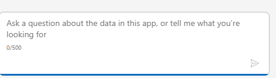
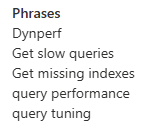
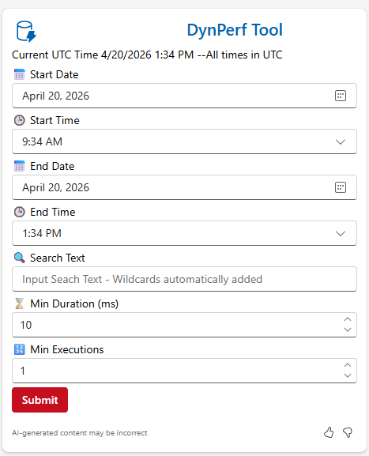

# Cheat Sheet — Using the Agent from inside F&O

The fastest way to launch the Dynperf Agent is directly from the Copilot pane inside
Dynamics 365 Finance & Operations. This cheat sheet walks through the three steps an end
user needs to know.

## Step 1 — Open Copilot from within Dynamics 365 Finance and Operations

Sign in to your F&O environment and open the **Copilot** pane from the top-right of any
workspace.

> 

## Step 2 — Trigger the Keywords to Launch the Agent

In the Copilot pane, type one of the trigger phrases below. Copilot will route the
conversation to the Dynperf Agent.

> 

You can use any of the following keywords / phrases:

| Phrase |
|---|
| `Dynperf` |
| `Get slow queries` |
| `Get missing indexes` |
| `query performance` |
| `query tuning` |

> 

## Step 3 — Enter the Parameters to Search Query Data Store

The agent prompts you for the parameters it will use to search the SQL **Query Data Store**
(QDS) on the F&O environment.

> 

### Date / Time Window

| Field | Default | Notes |
|---|---|---|
| **Start Date / Start Time** | 4 hours ago, **UTC** | |
| **End Date / End Time** | Current time, **UTC** | |

> ℹ️ Query Data Store contains data going back **weeks**, so you can widen the window when
> needed.

### Search Text

This parameter provides the most flexibility in finding queries. Beginning and ending
wildcards are **not** required — they are added automatically. The `%` wildcard is only
needed when you combine multiple terms (Options 4 and 5).

| Option | Goal | Example value |
|---|---|---|
| **Option 1** | Find queries that reference a specific table / entity | `SalesTable` |
| **Option 2** | List queries that have a **missing index** hint | `MissingIndex` |
| **Option 3** | List queries that have an **Index Scan** in the plan | `Index Scan` |
| **Option 4** | Combine the above (wildcard required) | `SALESTABLE%Missing Index` |
| **Option 5** | Find two tables in the same query | `SALESTABLE%SALESLINE` |

### Min Duration

Find queries running longer than the specified duration **in milliseconds**. Use this to
zero in on the long-running offenders.

> Example: `1000` returns queries taking longer than 1 second.

### Min Executions

Find queries that have run at least *N* times in the window. Use this to filter out one-off
queries (e.g., a single bad ad-hoc search by a user) and focus on the workload that is
actually impacting the environment.

---

# D365 F&O Slow-Query Diagnostic — How the Topic Works

The Dynperf Agent ships as a **single Copilot Studio topic** that talks to the
`DynPerfSlowQueryCustomAPI` Custom API in F&O. The conversation has three beats:

1. **Trigger** — the user types one of the trigger phrases.
2. **Adaptive Card** — the agent renders a card to collect the search parameters.
3. **Results table + follow-up** — the agent shows the slow-query results in a markdown
   table and asks whether to search again.

## 1 — Trigger Phrases

The topic is triggered by any of the following utterances. They are configured on the
topic's `OnRecognizedIntent` trigger and can be edited in Copilot Studio.

| Trigger phrase |
|---|
| `Dynperf` |
| `Get slow queries` |
| `Get missing indexes` |
| `query performance` |
| `query tuning` |

## 2 — Adaptive Card (Search Parameters)

Once triggered, the agent shows the **DynPerf Tool** Adaptive Card. The card displays the
current UTC time and prompts for the search parameters that will be passed to
`DynPerfSlowQueryCustomAPI`.

> 

| Field | Card input | Default | Notes |
|---|---|---|---|
| 📅 **Start Date** | `Input.Date` (`startdate`) | Today (UTC) | |
| 🕒 **Start Time** | `Input.Time` (`StartTime`) | 4 hours ago (UTC) | |
| 📅 **End Date** | `Input.Date` (`endate`) | Today (UTC) | |
| 🕒 **End Time** | `Input.Time` (`EndTime`) | Now (UTC) | |
| 🔍 **Search Text** | `Input.Text` (`searchtext`) | *(empty)* | Wildcards are added automatically — the topic wraps the value with `%…%` before sending it to F&O |
| ⌛ **Min Duration (ms)** | `Input.Number` (`minduration`) | `10` | |
| 🔢 **Min Executions** | `Input.Number` (`MinExecutions`) | `1` | |

When the user clicks **Submit**, the topic invokes the F&O Custom API connector
`msdyn_fnocopilot.DynPerfRole.DynPerfSlowQueryCustomAPI` with the following inputs:

| API parameter | Built from |
|---|---|
| `mserp_DynPerfSlowQueryCustomAPI_StartDate` | `startdate + " " + StartTime` |
| `mserp_DynPerfSlowQueryCustomAPI_EndDate`   | `endate + " " + EndTime` |
| `mserp_DynPerfSlowQueryCustomAPI_SearchText`| `"%" + searchtext + "%"` |
| `mserp_DynPerfSlowQueryCustomAPI_MinDuration`   | `minduration` |
| `mserp_DynPerfSlowQueryCustomAPI_MinExecutions` | `MinExecutions` |

The Custom API responds with a JSON payload (`mserp_DynPerfSlowQueryCustomAPI_topQueriesInJson`)
containing a `Results` table with the columns shown below.

## 3 — Results Table

The agent parses the JSON and renders a markdown table titled **Query Execution Summary**
with one row per result.

| Column | Type | Description |
|---|---|---|
| `QUERY_ID` | Number | Query Data Store query identifier — use this to look up the query text in QDS |
| `PLAN_ID` | Number | Query Data Store plan identifier for the execution sample |
| `AVG_DURATION_MS` | Number | Average execution duration in milliseconds over the selected window |
| `MAX_DURATION_MS` | Number | Maximum execution duration in milliseconds over the selected window |
| `TOTAL_EXECUTIONS` | Number | Number of executions in the selected window |
| `TOTAL_TIME_SECS` | Number | Cumulative execution time in seconds (avg × executions, surfaced by the Custom API) |

### Example Interaction

> **User**: `Dynperf`
>
> **Agent**: *[Renders the DynPerf Tool Adaptive Card]*
>
> **User** *(submits the card)*:
> - Start: `2026-04-30 06:30 UTC` · End: `2026-04-30 10:30 UTC`
> - Search Text: `SalesTable`
> - Min Duration: `1000` · Min Executions: `5`
>
> **Agent**: **Query Execution Summary**
>
> | QUERY_ID | PLAN_ID | AVG_DURATION_MS | MAX_DURATION_MS | TOTAL_EXECUTIONS | TOTAL_TIME_SECS |
> |---|---|---|---|---|---|
> | 48291 | 12 | 4280  | 7140  | 14 | 59  |
> | 48287 | 8  | 3140  | 5980  | 7  | 22  |
> | 48315 | 3  | 1960  | 2740  | 22 | 43  |
>
> **Search for more queries?** &nbsp; `Yes, Search Again` · `No, Do Not Search Again`

If the user picks **Yes, Search Again**, the topic loops back to the start (resetting
`utcNow` / `utcToday`) and re-shows the Adaptive Card. If the user picks **No, Do Not
Search Again**, the dialog ends.

---

## Common Search Patterns

The **Search Text** field is the main lever for narrowing results. Because the topic wraps
the value with `%…%` automatically, leading/trailing wildcards are not required — but
the `%` wildcard is still useful between terms.

| Goal | Search Text value |
|---|---|
| Queries that reference a specific table / entity | `SalesTable` |
| Queries flagged with a missing-index hint | `MissingIndex` |
| Queries with an `Index Scan` in the plan | `Index Scan` |
| Combine table + missing index | `SALESTABLE%Missing Index` |
| Find two tables in the same query | `SALESTABLE%SALESLINE` |

## Tuning the Filters

| Filter | Why it matters |
|---|---|
| **Date / Time window** | Defaults to the last 4 hours. Widen it (Query Data Store retains weeks of data) for historical investigations; narrow it to focus on a recent incident. |
| **Min Duration (ms)** | Raise this to suppress noise and only see truly slow queries. `1000` (1 s) is a good starting point for most environments. |
| **Min Executions** | Raise this to ignore one-off queries (e.g., a single ad-hoc search) and focus on workload that runs at scale. |

---

# Extending the Agent

The Dynperf Agent has exactly **two** edit surfaces. Where you make a change depends on
whether you are changing the **data** the agent returns or the **conversation** the user
sees.

| You want to… | Edit here |
|---|---|
| Add a new search dimension or output column (e.g., expose `LAST_EXECUTION_TIME`) | `DynPerfSlowQueryCustomAPI` X++ class in the `DynPerfAgent` model |
| Change a default value or pre-filter on the F&O side | `DynPerfSlowQueryCustomAPI` X++ class |
| Add or rename a trigger phrase / keyword | Copilot Studio topic — `OnRecognizedIntent` trigger |
| Add a new field to the Adaptive Card | Copilot Studio topic — `AdaptiveCardPrompt` action |
| Change the wording of the results table or follow-up question | Copilot Studio topic — `SendActivity` / `Question` actions |
| Add a new conversational follow-up branch | Copilot Studio topic — `ConditionGroup` |

> ✨ **X++ for the data, Copilot Studio for the conversation. No third place to look.**

## Editing the Custom API (Data)

1. Open the `DynPerfAgent` model in Visual Studio on your F&O Tier-1 / dev environment.
2. Edit `DynPerfSlowQueryCustomAPI` (add a parameter, return column, or new method).
3. Build the model and run **Synchronize database**.
4. Apply the deployable package to higher environments (see [3.Runbook.md → Phase 1](3.Runbook.md#phase-1-deploy-the-dynperfagent-x-model-to-fo)).
5. If you added a new output column, also update the **Results Table** rendering in the
   Copilot Studio topic (otherwise the new column is fetched but not displayed).

## Editing the Topic (Conversation)

1. Open the Dynperf Agent in **Copilot Studio**.
2. Open the `Dynperf` topic.
3. Edit the relevant action:
   - **Trigger phrases** — `OnRecognizedIntent` → `triggerQueries`
   - **Adaptive Card** — `AdaptiveCardPrompt` → edit the card JSON / `body`
   - **Custom API call** — `BeginDialog` → input bindings on
     `msdyn_fnocopilot.DynPerfRole.DynPerfSlowQueryCustomAPI_…`
   - **Results table** — `SendActivity` → markdown built with `Concat(Topic.JsonData.Results, …)`
   - **Follow-up branching** — `Question` → `ConditionGroup`
4. **Save** and **Publish** the agent. Changes take effect on the next conversation.

> 📖 **Reference**: [Custom services in Finance and Operations apps](https://learn.microsoft.com/en-us/dynamics365/fin-ops-core/dev-itpro/data-entities/custom-services)

---

## Tips for Better Results

| Tip | How |
|---|---|
| **Specify a time range** | Adjust the Start / End Date and Time fields on the card — the defaults (last 4 hours) are usually too narrow for trend questions. |
| **Filter by table or pattern** | Put a table name, `MissingIndex`, or `Index Scan` in **Search Text**. The topic adds `%` wildcards automatically. |
| **Suppress noise** | Raise **Min Duration** (e.g., `1000` ms) and **Min Executions** (e.g., `5`) to ignore one-off / fast queries. |
| **Combine search terms** | Use `%` between terms (e.g., `SALESTABLE%MissingIndex` or `SALESTABLE%SALESLINE`). |
| **Iterate fast** | Use the **Yes, Search Again** follow-up to re-open the card without re-typing the trigger phrase. |

---

## Out-of-Scope Topics

The Dynperf Agent is intentionally focused. Anything outside slow-query inspection in F&O
is out of scope for this agent.

Topics that are **not** handled:

- Direct changes to F&O configuration, code, or indexes (the agent is read-only)
- Free-form natural-language questions (the agent only responds to the configured trigger
  phrases — see [Trigger Phrases](#1--trigger-phrases) — and then drives the rest of the
  conversation through the Adaptive Card)
- Charts, daily briefings, scheduled emails, or proactive alerts (not implemented in the
  current topic)
- Application Insights / KQL telemetry — use the **Dynamics 365 Monitoring Agent** for that
- Real-time business data from F&O (the agent only reads Query Data Store performance signals)
- Questions about query text, plans, users, or AOS attribution beyond the 6 columns returned
  by `DynPerfSlowQueryCustomAPI` (extend the X++ class first if you need more)

---

## Related Resources

| Resource | Link |
|---|---|
| Scenario Overview | [1.Overview.md](1.Overview.md) |
| Architecture | [2.Architecture.md](2.Architecture.md) |
| Step-by-Step Runbook | [3.Runbook.md](3.Runbook.md) |
| Companion scenario — Monitoring Agent | [../Dynamics-365-Monitoring-Agent/4.Sample-prompts.md](../Dynamics-365-Monitoring-Agent/4.Sample-prompts.md) |
| Copilot Studio Documentation | [Microsoft Learn](https://learn.microsoft.com/en-us/microsoft-copilot-studio/) |
| F&O Custom Services / Custom APIs | [Microsoft Learn](https://learn.microsoft.com/en-us/dynamics365/fin-ops-core/dev-itpro/data-entities/custom-services) |

---
