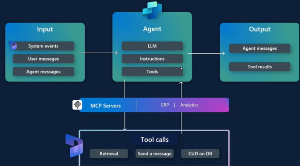
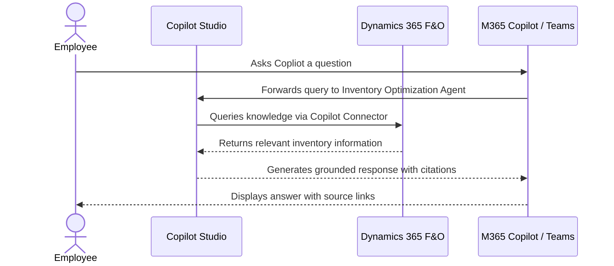

# ERP D365 Inventory Optimization Agent — Architecture

## 1. Logical Architecture

The ERP D365 Inventory Optimization Agent operates across three layers: the **User Layer** (how implementation teams interact), the **Agent Layer** (how the agent reasons and orchestrates), and the **Data & Tool Layer** .

### How It Works
At a high level, the Agent is created in Copilot Studio with set of instructions and inputs which communicates with LLM to get the output. The LLM or Anthropic Claude Sonnet 4.6 manages the orchestration.

### Environment Architecture

- Environment version: **D365 environment** must be a **Tier-2 or Power Platform 
environment connected with Finance and Operations version 10.0.47** (currently in preview). 
- Enable Preview Features: It is important to note that we need to turn on the 
preview feature titled- **Dynamics 365 ERP Model Context Protocol server** from the 
Feature Management workspace.
- Configure Allowed MCP clients located under System Administration > Setup 
form: **Copilot studio** must be registered as an app in this form.

---

## 2. Key Components

| Component                        | Technology                                      | Role                                                                                                  |
| -------------------------------- | ----------------------------------------------- | ----------------------------------------------------------------------------------------------------- |
| **Agent Environment**            | Power Platform environment (same tenant as F&O) | Hosts the Copilot Studio agent and Dataverse dependencies                                             |
| **Agent Runtime**                | Microsoft Copilot Studio                        | Core agent orchestration and response generation                                                      |
| **LLM / Orchestrator**           | Anthropic **Claude Sonnet 4.6**                 | Natural-language understanding, tool selection, risk reasoning, and answer generation                 |
| **Agent Instructions**           | Copilot Studio prompt                           | Defines purpose, guidelines, skills, step-by-step flow, risk rubric, and output rules                 |
| **D365 Finance & Operations MCP Server**    | Tier-2 / Power Platform environment, v10.0.47   | System of record for all configuration parameters                                                     |

---
## 3. Data Flow

### Scenario A — Interactive Chat 

---

## 4. Security & Governance Considerations

| Area | Consideration |
|---|---|
| **Credentials** | Agent will utilize the users security credentials from D365 Finance and Operations |
| **Data Scope** | Web Search is **disabled** — agent will only respond from the provided knowledge sources |
| **Knowledge Boundary** | If no answer is found, agent will ask questions to clarify and confirm what is expected or required |
| **Access Control** | M365 Admin approval required for org-wide deployment via Integrated Apps |
| **Connector Permissions** | D365 ERP MCP server and Learn Dcos MCP server are first party tools with Microsoft |
| **Content Safety** | Resonsible AI content filters remain active; no custom model training involved |

---

## Related Resources

| Resource             | Link                                       |
| -------------------- | ------------------------------------------ |
| Scenario Overview    | [1.Overview.md](1.Overview.md)             |
| Step-by-Step Runbook | [3.Runbook.md](3.Runbook.md)               |
| Sample Prompts       | [4.Sample-prompts.md](4.Sample-prompts.md) |
