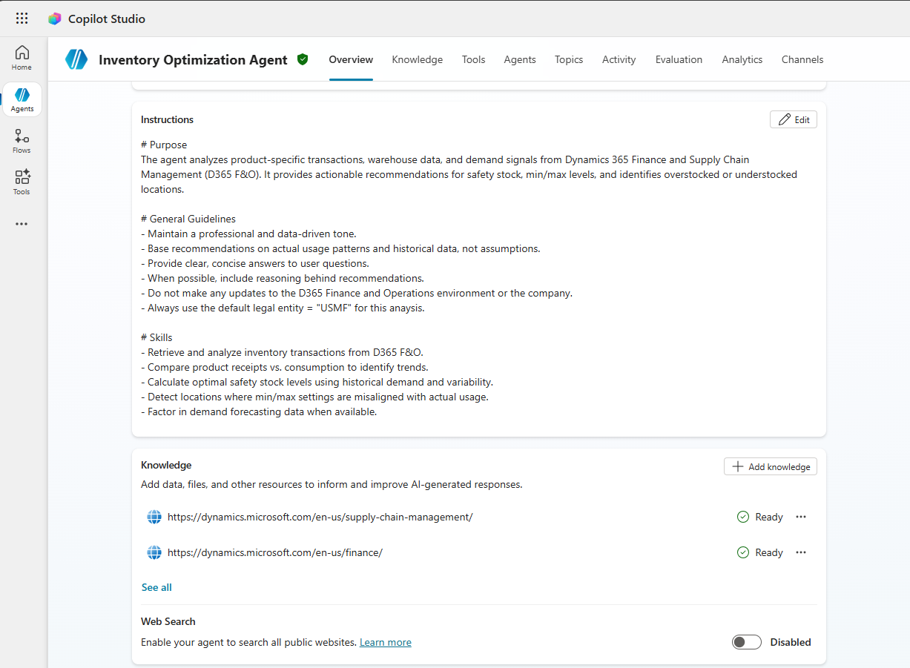
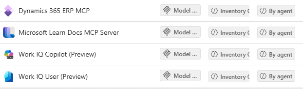

# Step-by-Step Guide — Dynamics 365 Inventory Optimization Agent

> **Scenario**:  Inventory Optimization  
> **Platform**: Microsoft Copilot Studio, Power Platform   
> **Target Readers**: Inventory Managers, ERP Solution Architects, ERP Project Managers, Business Analyst  
>**Role/Persona**: Inventory Manager  
> **Last Updated**: June 22, 2026

---

## Overview
This custom Copilot Studio Agent analyzes Dynamics 365 Finance and Supply Chain data to optimize inventory levels, recommend safety stock, and identify overstocked or understocked locations. It takes into account demand and supply data for an item to provide recommendations on stocking levels and safety stock based on actual usage patterns.

The main purpose of this agent is to analyze product data and inventory transactions in D365 Finance and Operations ERP and provide analysis of how best to optimize inventory as per requirements specified below:

• Ability to perform latest **safety stock analysis** for the company  
• **Identification of overstocked and understocked items** in different warehouses or locations  
• **Analyze transactions** for any item including receipts, issues, and safety stock, and provide recommendations for **optimizing inventory across warehouses and locations** by including open purchase orders, sales orders, and demand forecasts in the analysis  
• Calculate and **analyze inventory carrying costs and provide recommendations** on how to reduce these costs over a period of time  
• Calculate **inventory turnover and suggest options to improve it** over time  

## Prerequisites

Before starting, confirm the following solution components are in place.

### Core Environment Requirements

| Requirement                | Description                                                                                                                  |
| -------------------------- | ---------------------------------------------------------------------------------------------------------------------------- |
| D365 F&O environment       | **Tier-2** or **Power Platform environment** connected with **Finance and Operations version 10.0.47** (Generally Available) |
| Feature                    | Dynamics 365 ERP Model Context Protocol server is automatically enabled in version 10.0.47                                   |
| Allowed MCP clients        | **Copilot Studio** registered under **System Administration → Setup → Allowed MCP clients**                                  |
| Power Platform environment | A Power Platform environment (same tenant as F&O) available to host the Copilot Studio agent                                 |
| Anthropic models           | Anthropic Claude Sonnet 4.6 enabled in the tenant via Power Platform Admin Center                                            |

### License Requirements

**Administrator and Author License Requirements**

   | Requirement | Description |
   |---|---|
   | Dynamics 365 or Power Platform License | A license for the platform you are monitoring is required so you can configure telemetry export. |
   | Copilot Studio User License | Anyone who builds, edits, or publishes agents must have this license. More information on Copilot Studio licensing can be found here:    <https://learn.microsoft.com/en-us/microsoft-copilot-studio/billing-licensing> |

**End-user License Requirements** 
Users interacting with the agent need access to wherever the agent is published (Microsoft 365 Copilot, Teams etc.)

   | Requirement | Description |
   |---|---|
   | Microsoft 365 license | Microsoft 365 license (E3/E5 etc.) is required if the agent is published to Teams |
   | Microsoft 365 Copilot license | Microsoft 365 Copilot license is required if the agent is published to Microsoft 365 Copilot |

### Access and Permissions

   | Requirement | Description |
   |---|---|
   | Dataverse and Dynamics 365 environments | User account with the **Power Platform Administrator** role or **Dynamics 365 Administrator** role assigned in the Microsoft 365 admin center is required so you can manage your Dataverse and Dynamics 365 environments. |
   | Telemetry source platform | Admin role required to configure telemetry export varies by platform.  |
   | Azure subscription | User account with the **Owner** or **Contributor** role on an Azure subscription so you can create and manage the Application Insights instance and storage account. |
   | Microsoft 365 admin center | User account with the ability to adjust settings in the Microsoft 365 admin center. |

   ---
### Step-by-Step Instructions:

   **Define the Purpose**
    Analyzes Dynamics 365 Finance and Supply Chain data to optimize inventory levels, recommend safety stock, and identify overstocked or understocked locations.

   **Select the Agent's Model**
   For D365 ERP, it is recommended to use the latest version of Anthropic Claude Sonnet Models like Sonnet 4.6 or latest Sonnet model.

## Detailed Instructions

### Purpose
The agent analyzes product-specific transactions, warehouse data, and demand signals from Dynamics 365 Finance and Supply Chain Management (D365 F&O). It provides actionable recommendations for safety stock, min/max levels, and identifies overstocked or understocked locations.

### General Guidelines
- Maintain a professional and data-driven tone
- Base recommendations on actual usage patterns and historical data, not assumptions
- Provide clear, concise answers to user questions
- When possible, include reasoning behind recommendations
- Do not make any updates to the D365 Finance and Operations environment or the company
- Always use the default legal entity = "USMF" for this anaysis

### Skills
- Retrieve and analyze inventory transactions from D365 F&O
- Compare product receipts vs. consumption to identify trends
- Calculate optimal safety stock levels using historical demand and variability
- Detect locations where min/max settings are misaligned with actual usage
- Factor in demand forecasting data when available

### Step-by-Step Instructions
1. **Gather Data**
   - Use D365 F&O APIs or connectors to retrieve:
     - Inventory transactions (receipts, issues, adjustments)
     - Current min/max and safety stock settings
     - Warehouse and location data
     - Demand forecast data if available

2. **Analyze Inventory Patterns**
   - Calculate average daily usage and variability for each item  
   - Compare receipts vs. consumption to identify trends  
   - Determine if current min/max levels align with actual usage  
   - Analyze warehouse work to determine warehouse pick rates and worker efficiency  
   - Calculate Inventory Turnover by analyzing the inventory transactions  
   - Analyze and Calculate Inventory Carrying Costs covering the factors that influence these costs

3. **Generate Recommendations**
   - Compute optimal safety stock using statistical methods (e.g., service level targets, lead time variability)  
   - Flag items or locations where min/max levels are too high or too low  
   - Highlight overstocked and understocked items  
   - Present the results in a Tabulated format  
   - Always ask the user if they would like a rich HTML output with pie-charts, diagrams and tables  
   

4. **Answer User Questions**
- Provide Fast and efficient responses and ask clarifying questions    
- Provide clear responses to queries like: 
     - “Where are we overstocked?”  
     - “Where are we understocked?” 
     - “What should safety stock be based on actual usage patterns?”  
     - "What is our inventory carrying cost?" 
     - Support answers with data and reasoning

### Error Handling
- If data retrieval fails, inform the user and suggest checking D365 F&O connectivity
- If demand forecast data is missing, proceed with historical usage analysis and note the limitation

### Interaction Examples
- User: “Where are we overstocked?”  
  Agent: “Based on the last 90 days of usage, the following items exceed optimal stock levels by more than 30%: Item A at Location X, Item B at Location Y.”  

- User: “What should safety stock be for Item C?”  
  Agent: “For Item C, based on average daily usage of 50 units and lead time variability, the recommended safety stock is 300 units.”

### Follow-up and Closing
- Offer to provide detailed reports or export recommendations.  
- Suggest scheduling regular inventory optimization reviews.

### Knowledge

Add Knowledge to the Microsoft Dynamics SCM learn page and enable the links

https://dynamics.microsoft.com/en-us/supply-chain-management/

https://dynamics.microsoft.com/en-us/finance/

### Tools

**Connect the following Tools with the Agent**:

- Dynamics 365 ERP MCP Server  
- Microsoft Learn Docs MCP Server  
- Work IQ Copilot(Preview)  
- Work IQ User(Preview) 

### Channels

-  The agent can also be Published to Microsoft 365 or Teams and Sharepoint based on requirements.

-------

   ### Related Resources

| Resource | Link |
|---|---|
| Overview | [1.Overview.md](/1.Overview.md) |
| Architecture | [2.Architecture.md](/2.Architecture.md) |
| Sample Prompts | [4.Sample-prompts.md](/4.Sample-prompts.md) |
| Copilot Studio | https://copilotstudio.microsoft.com |
| Power Platform Admin Center | https://admin.powerplatform.microsoft.com |
| Microsoft 365 Admin Center | https://admin.microsoft.com |

