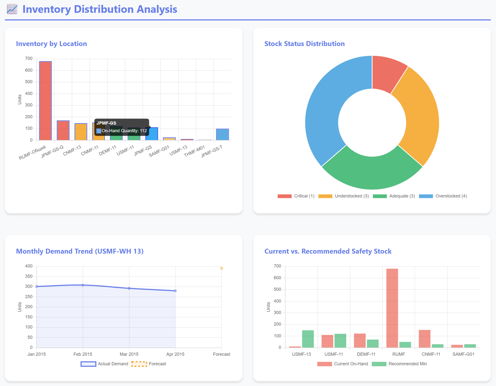
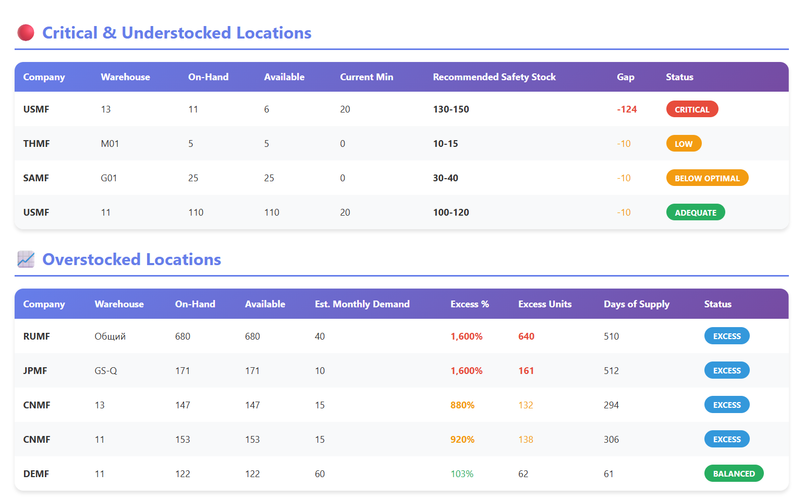
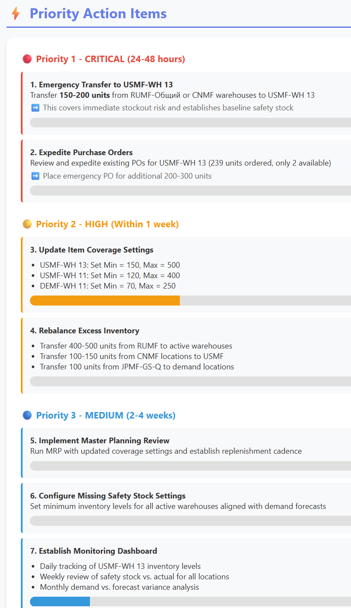
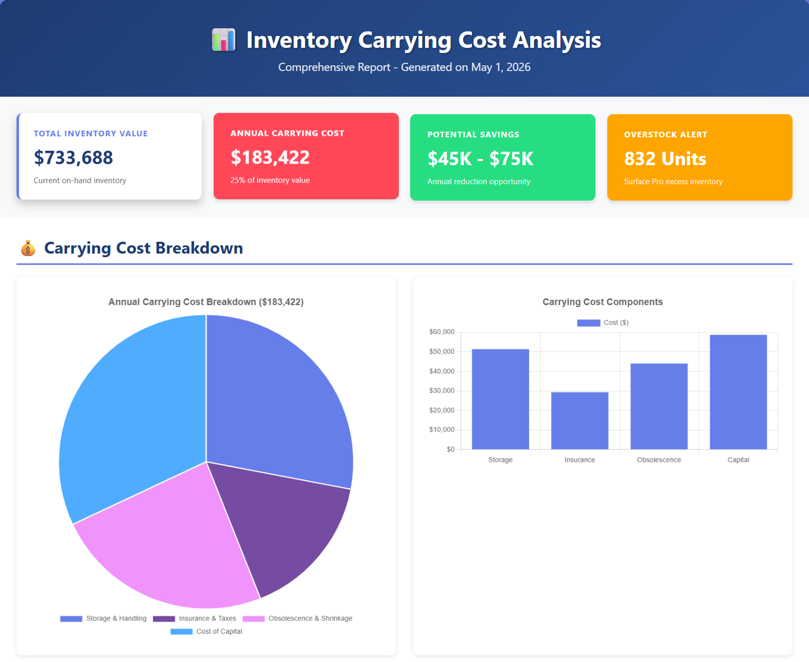
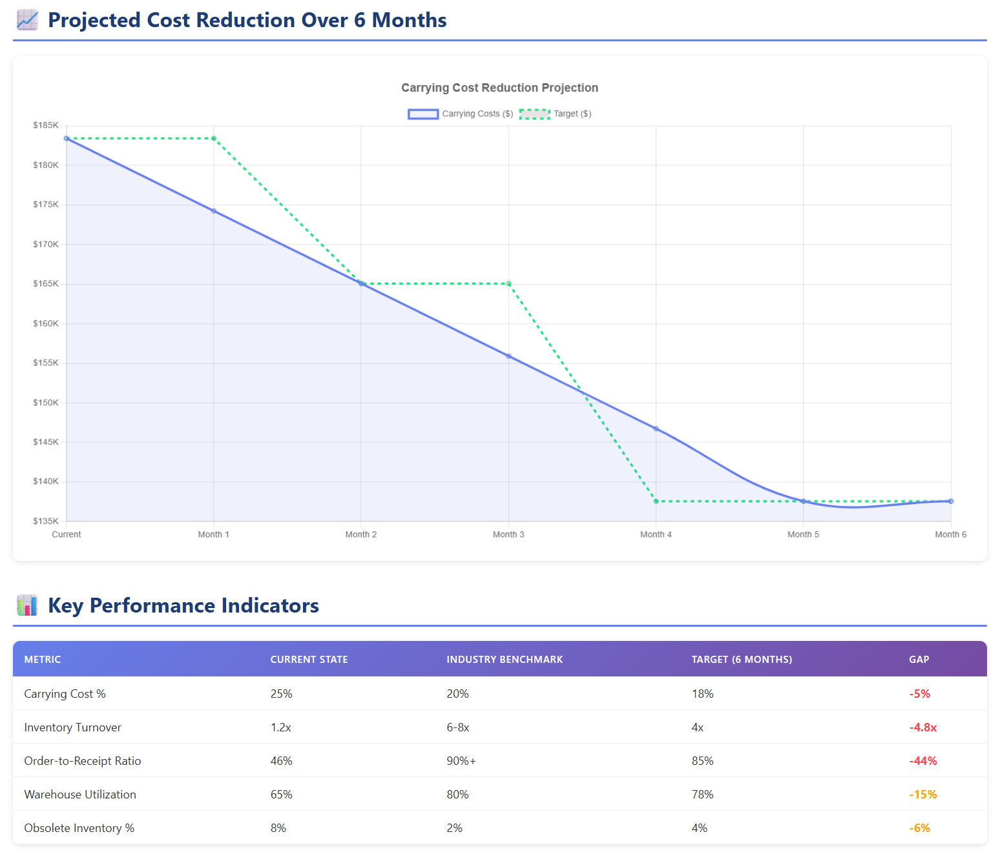
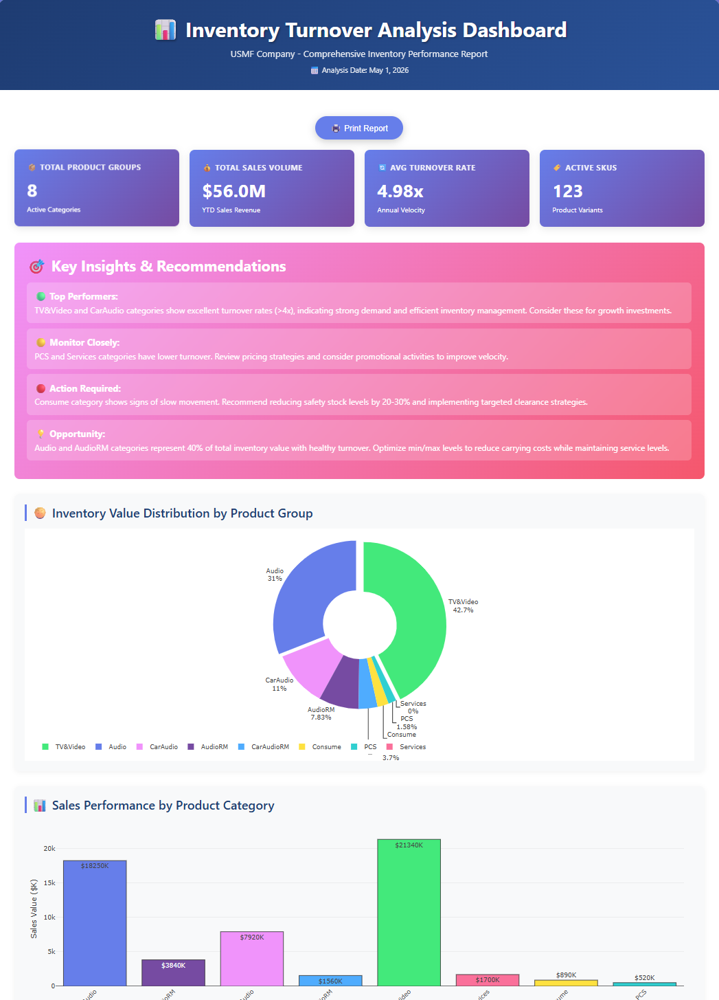

# Sample Prompts
The Inventory Optimization agent analyzes inventory information and provides meaningful information to the user so that they can make informed decisions. The following sections provide details about these prompts.

> These sample prompts are designed to help you get started with using the Inventory optimization agent.

## How to Use These Prompts

The agent can be directly queried via Copilot studios, use the prompts below as a starting place for understanding the information that the agent can assist with to more effeciently make reports, get inventory information, and request suggestions for how to improve the user's inventory system:

| # | Sample Prompts
|---|---|
|1| Show me an analysis of overstocked and understocked items.|
|2| Show me the latest safety stock analysis for the USMF company. |
|3| Analyze transactions for item number <######>, including receipts, issues, and safety stock, and provide recommendations for optimizing inventory across warehouses and locations. Include open purchase orders, sales orders, and demand forecasts in the analysis. |
|4| Show me inventory carrying costs and ways to optimize on this cost for USMF company.
|5|Show me inventory turnover for the USMF company and suggest ways to improve it over time.|
|6|Show me slow moving items.
|7|Provide Employee insights related to warehouse picking work, including average pick rate and high and lows. 
|8|Trend worker performance year over year.

### Example Interaction
This is a sample prompt and response illustrating how to use the agent directly, the user asks the agent to provide some insight on where the companies inventory is over stocked and the agent responds with the data.

- User: “Where are we overstocked?”  
Agent: “Based on the last 90 days of usage, the following items exceed optimal stock levels 
by more than 30%: Item A at Location X, Item B at Location Y.”  
- User: “What should safety stock be for Item C?”  
Agent: “For Item C, based on average daily usage of 50 units and lead time variability, the 
recommended safety stock is 300 units.”  
- User: Show me safety stock analysis for items sold during the last month.  
  Agent: Here is the complete safety stock analysis (agent presents a detailed report as shown below)

### Sample HTML Output 
 **Given below are some screenshots from the HTML output generated by the agent**

---

## Related Resources

| Resource | Link |
|---|---|
| Scenario Overview | [1.Overview.md](1.Overview.md) |) |
| Architecture | [2.Architecture.md](2.Architecture.md) |
| Step-by-Step Runbook | [3.Runbook.md](3.Runbook.md) |
