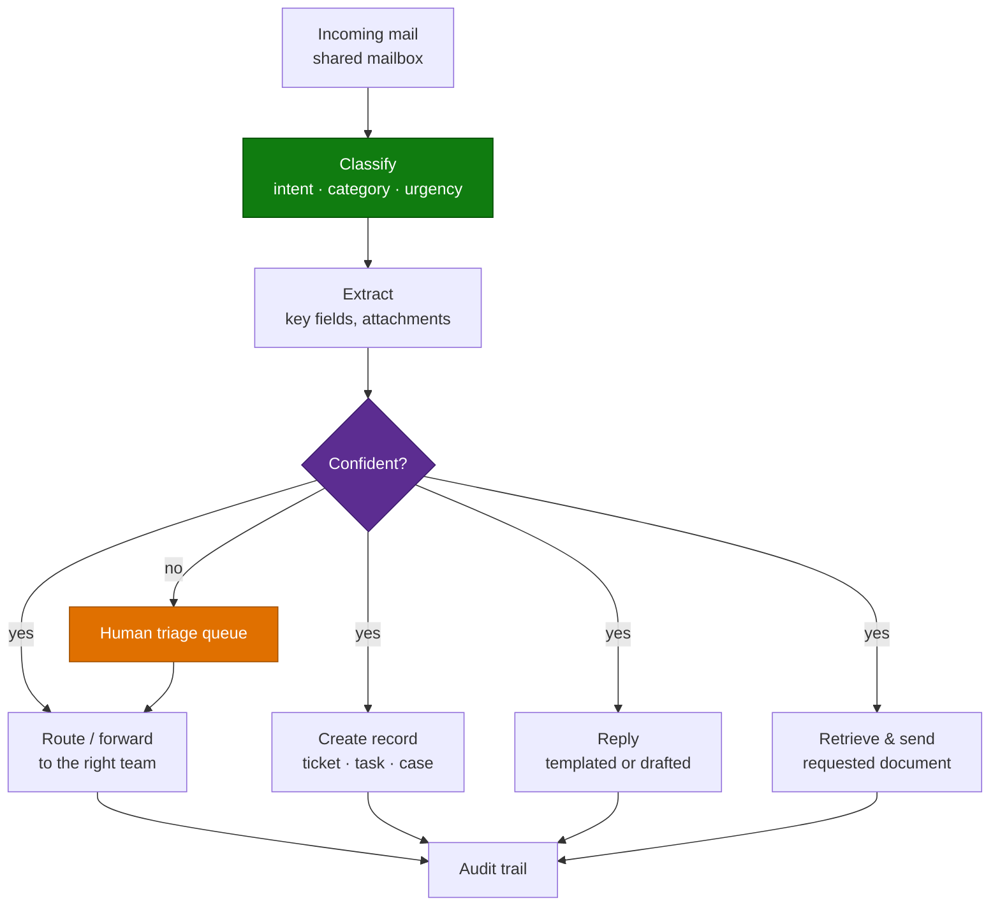

# Email & Shared Mailbox Triage Agent — Overview

## Scenario Overview

**Scenario Type**: Operations / Customer & Employee Service
**Agent Type**: Copilot Studio agent, event-triggered on mail arrival
**Primary Tools**: Copilot Studio, Power Automate, Outlook/Exchange, the downstream system of record
**Complexity**: Intermediate
**Status**: ✅ Available

A shared mailbox receives thousands of messages a year. Someone reads each one, works out what it
is, and forwards it, files it, answers it, or turns it into a ticket. It is high-volume, low-
judgement work, and it is done inconsistently because it depends on who is on shift.

This agent classifies incoming mail, extracts what matters, and takes the routing action — with a
human in the loop wherever the classification is uncertain or the action is consequential.

**20 distinct customers** in a single CAF delivery portfolio, across public sector, higher
education, financial services, manufacturing, healthcare, and equipment hire. It is the single most
common operational agent shape in the dataset.

---

## Problem Statement

- **Volume without structure.** One institution processes ~9,000 emails a year through a shared
  mailbox, read and forwarded by hand.
- **Inconsistent routing.** The same enquiry reaches different teams depending on who triaged it.
- **Delay.** Messages sit until someone gets to them; urgency is not detected.
- **Attachments make it worse.** Much of the work is opening attachments to find out what the
  message is actually about.
- **It does not scale.** Headcount is the only lever, and the work is unrewarding.

---

## Solution Summary

### Capability Variants Seen in the Field

| Variant | What it does | Typical sector |
|---|---|---|
| **Classify & route** | Categorises and forwards to the right team | Public sector, higher education |
| **Classify & create** | Turns the message into a ticket, task, or calendar item | IT service, operations |
| **Document on demand** | Recognises a request for an invoice or delivery note, retrieves it, sends it | Equipment hire, distribution |
| **Templated reply** | Classifies intent and sends an approved templated response | Sales, marketing response handling |
| **Order intake** | Extracts order data from mail and attachments into an ERP-ready format | Manufacturing |
| **Claims intake** | Triages a claim and orchestrates the lifecycle | Financial services |

Most deliveries start with classify-and-route, then add one action variant. Attempting all of them
at once is the most common scoping error.

---

## Business Outcomes

| Outcome | Description |
|---|---|
| ⏱️ Hours returned to the team | The highest-volume, lowest-judgement task is removed |
| 🎯 Consistent routing | The same enquiry reaches the same team every time |
| ⚡ Faster first response | Triage happens on arrival, not when someone opens the mailbox |
| 📈 Scales without headcount | Volume growth stops being a hiring conversation |
| 📋 Auditable handling | Every message has a recorded classification and action |

---

## In Scope / Out of Scope

### ✅ In Scope
- Classification of incoming mail by intent, category, and urgency
- Extraction of key fields from the body and attachments
- Routing, forwarding, and record creation in the downstream system
- Templated or drafted replies with a review gate
- Human triage queue for uncertain cases

### ❌ Out of Scope
- Free-form autonomous replies to customers without review
- Anything requiring a judgement the organisation would not delegate to a new starter
- Complaint handling, legal correspondence, or regulated notifications — route these, never answer them
- Deleting or archiving mail autonomously

---

## Target Users

| Persona | Role |
|---|---|
| **Mailbox team / service desk** | Primary — receives triaged work and handles exceptions |
| **Team leader** | Owns routing rules and the exception queue |
| **Downstream teams** | Receive correctly routed work |
| **Compliance / records** | Owns retention and auditability of correspondence |
| **Delivery engineer** | Builds classification, extraction, and routing |

---

## Qualification Checklist

| Question | Why it matters |
|---|---|
| What is the actual annual volume? | Below a few thousand a year the business case is thin |
| How many categories, really? | More than ~10 and classification accuracy drops sharply |
| Is there a written routing rule set today, or is it tribal knowledge? | If tribal, that discovery **is** the first work package |
| What proportion of messages need the attachment to classify? | Drives whether you need document processing |
| What is the downstream system, and does it have a write API? | The write is usually harder than the classification |
| Are replies to external parties in scope? | Changes the review gate entirely |
| What are the retention and records obligations on correspondence? | Correspondence is frequently a regulated record |
| Who owns the exception queue? | An unowned queue silently becomes a backlog |

---

## What Actually Goes Wrong

| Symptom | Root cause | Where handled |
|---|---|---|
| Classification accuracy plateaus low | Too many categories, or overlapping definitions | [3.Runbook.md](3.Runbook.md) Phase 1 |
| Agent misroutes edge cases confidently | No confidence gate; everything auto-routed | Phase 3 |
| Exception queue grows unattended | No owner, no SLA | Phase 0 |
| Cannot classify without opening the attachment | Attachment content not processed | [2.Architecture.md](2.Architecture.md) |
| Replies sent that should not have been | Review gate too loose for external mail | [Human-in-the-Loop Review & Approval](../../02-patterns/Human-in-the-Loop-Review-and-Approval/Human-in-the-Loop-Review-and-Approval.md) |
| Duplicate tickets created | Retry without idempotency | Phase 2 |
| Works in test, fails on real mail | Test set was curated; real mail includes forwards, chains, and signatures | Phase 4 |

---

## Related Patterns

- [Human-in-the-Loop Review & Approval](../../02-patterns/Human-in-the-Loop-Review-and-Approval/Human-in-the-Loop-Review-and-Approval.md)
- [Intelligent Document Processing Pipeline](../../02-patterns/Intelligent-Document-Processing-Pipeline/Intelligent-Document-Processing-Pipeline.md) — where attachments drive classification
- [Copilot Studio & Foundry Split Architecture](../../02-patterns/Copilot-Studio-and-Foundry-Split-Architecture/Copilot-Studio-and-Foundry-Split-Architecture.md)
- [Copilot Credits & Cost Control](../../02-patterns/Copilot-Credits-Cost-Control/Copilot-Credits-Cost-Control.md) — event-triggered agents run on volume, not on user sessions

---

## Next

→ [2.Architecture.md](2.Architecture.md)
