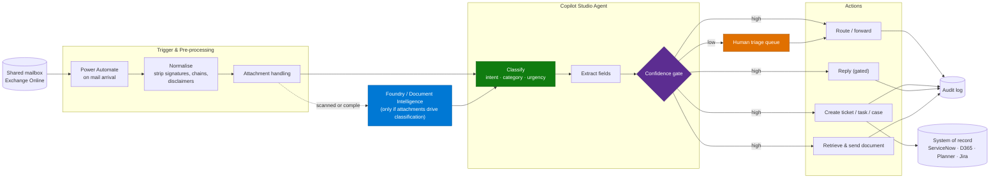

# Architecture — Email & Shared Mailbox Triage Agent

> **Platform**: Copilot Studio · Power Automate · Exchange Online · downstream system of record
> **Last Updated**: August 2026

---

## Solution Architecture

---

## The Pre-processing Nobody Budgets For

Real mail is not clean. Before classification, you almost always need to:

| Step | Why |
|---|---|
| Strip signatures and disclaimers | Legal boilerplate dominates the token budget and skews classification |
| Collapse reply chains | A 12-message thread classified as one blob returns the wrong intent — classify the **newest** message with the thread as context |
| Detect forwards | The sender is often not the requester |
| Handle auto-replies and bounces | Should never reach classification |
| Normalise language | Multilingual mailboxes are common; decide whether to translate or classify natively |
| Extract inline images vs attachments | An "attachment" is often a logo |

Skipping this is the most common cause of "accuracy was fine in testing".

---

## Classification Design

Two viable approaches. Choose deliberately.

| Approach | How | When it fits |
|---|---|---|
| **Instruction-based** | Categories and definitions in the agent instructions; the model classifies | Up to roughly 10 well-separated categories. Fast to build and change |
| **Knowledge-grounded** | Category definitions and examples as a knowledge source | Many categories, or definitions that change often and are owned by the business |

Rules that hold up:

- **Cap the categories.** Accuracy degrades sharply as categories multiply and overlap. If the
  business insists on 30, group them into a coarse first pass and a second-level classification.
- **Definitions must be mutually exclusive.** If two categories can both be right, the model will
  oscillate and your accuracy measurement becomes meaningless.
- **Always include an `Unclear` category.** Forcing a choice produces confident misroutes. `Unclear`
  routes to the human queue, which is the correct answer.
- **Classify intent, not topic.** "Invoice" is a topic. "Requesting a copy of an invoice" is an
  intent, and only the intent determines the action.

---

## Confidence and the Human Queue

The confidence gate is what makes this deployable.

| Confidence | Action |
|---|---|
| High, low-consequence action | Proceed automatically |
| High, consequential action (external reply, record creation) | Proceed per the gate assigned in the human-in-the-loop pattern |
| Low | Human triage queue with the agent's suggestion pre-filled |
| `Unclear` category | Human triage queue |

The queue is not a failure state — it is the design. One regional government implementation is
explicitly specified as classifying and creating tasks "with human intervention in uncertain cases".

**The queue needs an owner and an SLA.** An unowned exception queue becomes an invisible backlog and
the team quietly reverts to reading the mailbox.

---

## Downstream Write

Usually the hardest part of the build.

| Concern | Guidance |
|---|---|
| **Write API** | Confirm it exists in week one. Discovering there is no API late reframes the solution |
| **Idempotency** | Mail triggers retry. Without an idempotency key you will create duplicate tickets |
| **Identity** | Does the record show the agent as creator, or the original sender? Decide — it affects audit and reporting |
| **Attachments** | Do they need to travel to the downstream record? Usually yes, and it is often forgotten |
| **Failure** | If the downstream system is down, queue and retry. Never lose the message |

---

## Reply Handling

Replies to external parties are the highest-risk action in this scenario.

| Reply type | Gate |
|---|---|
| Acknowledgement ("we've received this") | Auto, templated |
| Approved templated response for a known intent | Auto, but only for intents explicitly approved |
| Document delivery (invoice, delivery note) | Auto where the document match is unambiguous |
| Anything drafted by the model | **Human review before send** |
| Complaints, legal, regulatory | Never auto-reply. Route only |

An organisation's outbound correspondence is a commitment. Treat generated replies as drafts unless
the template was pre-approved.

---

## Cost Model

This is an **event-triggered** agent — consumption tracks mail volume, not user sessions.

| Driver | Implication |
|---|---|
| Every message triggers classification | 9,000 messages/year is 9,000 runs, regardless of how many are actionable |
| Attachments add document processing | Priced separately, per page |
| Spam and auto-replies still cost | Filter **before** the agent, not inside it |

Filter aggressively at the trigger — auto-replies, bounces, newsletters, internal noise. Paying to
classify a mail-delivery-failure notification is pure waste. See
[Copilot Credits & Cost Control](../../02-patterns/Copilot-Credits-Cost-Control/Copilot-Credits-Cost-Control.md).

---

## Non-Functional Considerations

| Concern | Guidance |
|---|---|
| **Latency** | Triage within minutes is fine; this is not interactive |
| **Throughput** | Check for burst patterns — Monday mornings, month-end, campaign responses |
| **Retention** | Correspondence is frequently a regulated record. Confirm what the agent's classification metadata means for retention |
| **Mailbox permissions** | The agent identity needs appropriate shared mailbox access; scope it tightly |
| **Language** | Multilingual mailboxes are common. Validate accuracy per language, not overall |
| **Failure visibility** | If the agent stops, someone must notice. Alert on zero-throughput |

---

## Next

→ [3.Runbook.md](3.Runbook.md)
