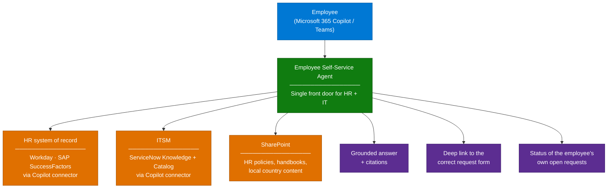

# Employee Self-Service (ESS) Agent — Overview

## Scenario Overview

**Scenario Type**: Employee Experience (HR + IT front door)
**Agent Type**: Microsoft-provided ESS agent template, or a custom equivalent
**Primary Tools**: Microsoft 365 Copilot, ServiceNow / Workday / SAP SuccessFactors connectors, SharePoint
**Complexity**: Intermediate — low build effort, high readiness effort
**Status**: ✅ Available

One conversational front door in Microsoft 365 Copilot for the questions employees currently
have to route across three or four systems: HR policy, payroll and benefits, IT support,
ticket status, and request submission.

This has been the single most requested agent scenario across large enterprises — global
shipping, pharmaceuticals, consumer goods, banking, automotive, aviation, and utilities have
all run the same play. The build is not the hard part. Roughly 80% of the delivery effort is
tenant readiness, connector configuration, and expectation setting.

---

## Problem Statement

Employees navigate multiple systems to do routine things — look up a benefit, check a payslip,
raise an IT request, chase a ticket. Each system has its own login, its own search, and its own
support queue. The consequences show up as:

- **Repetitive load on HR and IT.** The same twenty questions consume most of tier-1 capacity.
- **Poor findability.** HR content lives in Workday, SuccessFactors, ServiceNow HRSD, and
  SharePoint simultaneously, and none of them search each other.
- **Low Copilot value perception.** Organizations with Copilot licences but no departmental
  agent struggle to demonstrate return, which puts renewal at risk.
- **Shadow alternatives.** Where nothing is provided, business units build their own agents,
  which then have to be governed retrospectively.

---

## Solution Summary

An ESS agent presents a single conversational entry point that:

- Answers HR and IT questions grounded in the organization's own content
- Surfaces the employee's own pending and completed requests
- Routes to the correct request form or catalog item rather than answering from memory
- Respects the source system's access rules for every answer

Two viable builds, and the choice matters:

| Build | When to use |
|---|---|
| **Microsoft ESS agent template** | The organization wants HR + IT deflection quickly, meets the programme entry requirements, and can live with the template's supported scope and languages |
| **Custom agent (Agent Builder or Copilot Studio)** | Requirements fall outside the template — non-standard HRIS, context-aware answers driven by Entra attributes, or a specific conversation flow |

Several organizations attempted the custom route first, found the effort higher than expected,
and moved to the template. Others were blocked from the template on entry requirements and had
to build custom. Establish which path applies during qualification, not during delivery.

---

### How It Works

---

## Business Outcomes

| Outcome | Description |
|---|---|
| 📉 HR and IT ticket deflection | The most common questions get answered without a ticket |
| 🎯 Demonstrable Copilot value | A named, measurable use case for a licence investment that otherwise looks diffuse |
| ⏱️ Faster time to answer | Employees stop bouncing between portals |
| 🧑‍💼 Consistent policy answers | Everyone gets the same answer from the same source of truth |
| 🛡️ Governed by default | One approved agent instead of dozens of unmanaged departmental ones |

---

## In Scope / Out of Scope

### ✅ In Scope

- Readiness assessment and connector configuration (HRIS + ITSM + SharePoint)
- Agent deployment to Microsoft 365 Copilot and Teams
- Knowledge curation and de-duplication across HR sources
- Pilot with a defined population, evaluation, and production rollout
- Adoption and change-management plan

### ❌ Out of Scope

- Transactional HR writes (updating personal data, submitting time off) unless explicitly
  designed with the HRIS vendor's supported integration
- Payroll calculations or any answer that depends on live individual entitlement data
- Replacing the HRIS or ITSM portal
- Multi-language support beyond what has been validated — see the note below

---

## Target Users

| Persona | Role in This Scenario |
|---|---|
| **Employee** | Primary user — asks HR and IT questions, checks own requests |
| **HR Operations** | Owns HR content quality and the deflection target |
| **IT Service Desk** | Owns ITSM content and catalog accuracy |
| **M365 / Workplace Admin** | Deploys connectors, controls agent availability, monitors usage |
| **Delivery Engineer** | Runs readiness, configures connectors, validates answers |

---

## Qualification Checklist

Run this before committing to a delivery date. Every item here has blocked a real engagement.

| Question | Why it matters |
|---|---|
| How many Microsoft 365 Copilot seats are assigned? | Template programmes carry seat thresholds; below them, expect an exception process with lead time |
| Which HRIS? Workday, SuccessFactors, or something else? | Determines the connector, and whether a partner integration is in the path |
| Which ITSM? | ServiceNow is the well-trodden path; others need validation |
| Is HR content in the HRIS, SharePoint, or both? | Duplicated and contradictory content is the top cause of poor answers |
| What languages must be supported? | Assume English-only unless proven otherwise. Multilingual needs advanced configuration and has only been validated for a limited set of languages |
| Is there a named HR business sponsor? | Deployments without one stall at content curation |
| Is the organization in a competitive evaluation? | Changes the pilot scope — you need a measurable comparison, not just a working agent |
| Which cloud (Commercial / GCC / GCCH)? | Feature availability differs materially |

---

## What Actually Goes Wrong

| Symptom | Root cause | Mitigation |
|---|---|---|
| Persistent HTTP 400 / malformed response from the HRIS connector | Request enlarged by headers added in the integration path; more common with partner-brokered HRIS integrations | Validate the HRIS connector end-to-end in a sandbox before the pilot; keep a fallback of SharePoint-grounded answers |
| Answers differ between Copilot-licensed and Copilot Chat users | Different retrieval paths and semantic index availability | Define the target population before the pilot; test as both licence types |
| Unlicensed users blocked from a shared agent | A Copilot licence check can still apply at agent add/open time even where pay-as-you-go is configured | Confirm the licensing boundary for your exact agent type before promising broad access |
| Answer quality drops as content grows | Duplicate and contradictory HR policies across SharePoint and the HRIS | Curate and de-duplicate before scaling — this is a content project, not a model problem |
| Pilot succeeds, rollout disappoints | Pilot used clean, curated content for one country; rollout added twelve more | Scope the pilot to a representative country/business unit, not the easiest one |

---

## Related Patterns

- [Copilot Connector Knowledge Onboarding](../../02-patterns/Copilot-Connector-Knowledge-Onboarding/Copilot-Connector-Knowledge-Onboarding.md)
- [Grounding & Response Quality Remediation](../../02-patterns/Grounding-and-Response-Quality-Remediation/Grounding-and-Response-Quality-Remediation.md)
- [Agent Governance & Rollout Control Plane](../../02-patterns/Agent-Governance-and-Rollout-Control-Plane/Agent-Governance-and-Rollout-Control-Plane.md)
- [Copilot Credits & Cost Control](../../02-patterns/Copilot-Credits-Cost-Control/Copilot-Credits-Cost-Control.md)

---

## Next

→ [2.Architecture.md](2.Architecture.md)
