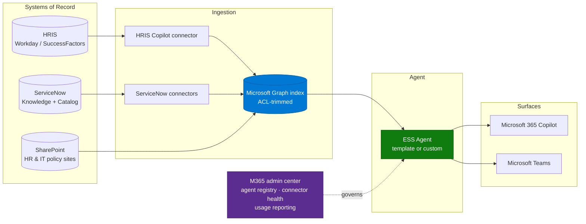

# Architecture — Employee Self-Service Agent

> **Platform**: Microsoft 365 Copilot · Copilot connectors · SharePoint · (optionally Copilot Studio)
> **Last Updated**: August 2026

---

## Solution Architecture

---

## Content Architecture — The Part That Decides Success

Connector plumbing is mechanical. Content topology is where ESS agents succeed or fail.

Before configuring anything, map every HR and IT content location onto this table:

| Content domain | Authoritative source | Duplicated elsewhere? | Owner | Language(s) | Action |
|---|---|---|---|---|---|
| Benefits | | | | | |
| Leave & absence | | | | | |
| Payroll & expenses | | | | | |
| Onboarding | | | | | |
| Code of conduct | | | | | |
| IT how-to | | | | | |
| IT catalog | | | | | |

Rules that consistently improve outcomes:

1. **One authoritative source per domain.** If the same benefits policy exists in the HRIS and
   in three SharePoint sites, the agent will cite whichever it found — and users will notice
   the inconsistency before you do.
2. **Retire before you connect.** Deleting or archiving superseded content costs less than
   engineering around it.
3. **Country-scoped content needs country-scoped permissions**, not a country name in the file
   title. Retrieval matches on content, not filename convention.
4. **Scanned PDFs and image-only documents are effectively invisible.** Policy libraries that
   are scans of signed documents need to be re-published as text before they will ground
   anything. This is a very common blocker in policy-heavy organizations.
5. **Tables inside PDFs ground unreliably.** If entitlement tables matter, move them to a
   structured source or restate them in text.

---

## Build Option A — Microsoft ESS Agent Template

| Aspect | Detail |
|---|---|
| Effort | Lowest — configuration, not development |
| Prerequisites | Programme entry requirements including a Microsoft 365 Copilot seat threshold, a readiness assessment, and a committed rollout timeline |
| Connectors | HRIS (Workday / SuccessFactors) and ITSM (ServiceNow) |
| Language | English by default; multilingual requires advanced customer-side configuration and has been validated for a limited set of languages |
| Surfaces | Microsoft 365 Copilot and Teams |
| Best for | Organizations that want deflection quickly and whose HR/IT stack matches the supported set |

Where the organization falls under the seat threshold, an exception path exists but adds lead
time. Raise it at qualification, not two weeks before the pilot.

---

## Build Option B — Custom Agent

Use this when the template does not fit. Two sub-options:

### B1 — Declarative agent (Agent Builder)

- Best when the requirement is knowledge retrieval across SharePoint plus connectors.
- Fast to build, instruction-driven, inherits Copilot's retrieval quality.
- No conversation flow control, no write-back.

### B2 — Copilot Studio custom agent

- Needed when you require topics, validated inputs, approval flows, request submission, or
  publishing beyond Microsoft surfaces.
- Introduces Copilot Credits consumption and a Power Platform environment strategy.
- If you go this route, read
  [Copilot Credits & Cost Control](../../02-patterns/Copilot-Credits-Cost-Control/Copilot-Credits-Cost-Control.md)
  before the pilot, and confirm the licensing boundary for your target audience.

### Context-aware answers

A recurring requirement is answers that vary by the employee's site, business unit, or role —
for example, a different canteen policy per location. Two supported approaches:

1. **Permission-scoped content** — separate the content by location and let ACLs do the work.
   Preferred: no custom logic, correct by construction.
2. **Entra attribute lookup in a Copilot Studio agent** — read the user's attributes and filter
   or branch. More flexible, more to maintain, and it requires the Copilot Studio route.

Avoid the third approach of putting "if the user is in France, answer X" into instructions.
It does not scale past a handful of cases and it silently degrades.

---

## Integration Points

| Integration | Direction | Notes |
|---|---|---|
| HRIS → Graph | Inbound crawl | The most fragile link in this architecture. Validate in a sandbox first |
| ServiceNow → Graph | Inbound crawl | See the [Copilot Connector Knowledge Onboarding](../../02-patterns/Copilot-Connector-Knowledge-Onboarding/Copilot-Connector-Knowledge-Onboarding.md) pattern |
| SharePoint | Native | No connector required; ensure sites are in scope and permissions are correct |
| Agent → user | Query time | Runs as the signed-in user; retrieval is security-trimmed |

---

## Licensing and Audience Boundary

Decide, in writing, before the pilot:

| Question | Why |
|---|---|
| Who consumes the agent — Copilot-licensed users only, or all employees? | Answer quality and access behaviour differ, and licence enforcement can apply at agent add/open time |
| Are frontline (F-SKU) workers in scope? | Frequently the largest part of the ESS audience and the most likely to be blocked |
| Is pay-as-you-go configured, and against which environment? | Misalignment between admin-center policies and Power Platform billing policies produces confusing access failures |
| Who pays? | Chargeback needs to be designed up front; retrofitting per-department cost attribution is painful |

---

## Non-Functional Considerations

| Concern | Guidance |
|---|---|
| Freshness | Connector crawl schedules; HR policy changes are usually monthly, so defaults are fine |
| Availability by cloud | GCC and GCCH have materially different capability; verify per feature |
| Data residency | Confirm processing boundary requirements with the HR and legal stakeholders before the pilot |
| Observability | M365 admin center usage reports plus connector health; agree the deflection metric before go-live |
| Rollback | Keep the existing portal path live during pilot; do not decommission anything until the deflection metric is proven |

---

## Next

→ [3.Runbook.md](3.Runbook.md)
