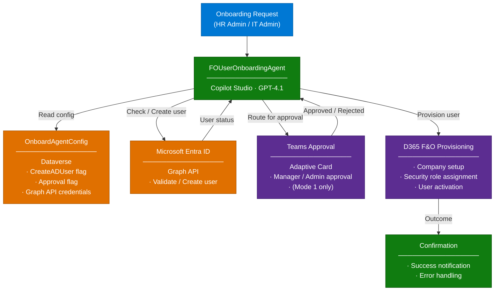

# F&O User Onboarding Agent — Overview

## Scenario Overview

**Scenario Type**: IT / HR Operations — User Provisioning
**Agent Type**: Autonomous Agent (Form-triggered + API-grounded + Approval-enabled)
**Primary Tools**: Microsoft Copilot Studio, Power Automate, Microsoft Graph API, Microsoft Teams, Dataverse
**LLM**: GPT-4.1 (Copilot Studio default)
**Complexity**: Intermediate–Advanced
**Status**: ✅ Available

This runbook describes how to build and deploy the **F&O User Onboarding Agent**, an
end-to-end automated user provisioning solution for **Dynamics 365 Finance & Operations**.
The agent automates the creation of Entra ID (Azure AD) user accounts, routes approval
requests through Microsoft Teams, and provisions users in the correct D365 F&O company
with the appropriate security roles — without requiring manual IT intervention.

---

## Problem Statement

Onboarding a new user into Dynamics 365 Finance & Operations is a multi-step process that
spans HR, IT, and the business. Without automation, organizations typically face:

- **Manual, error-prone provisioning**: Admins must manually create Entra ID accounts,
  assign licenses, and configure D365 F&O access across multiple portals
- **Approval bottlenecks**: No structured workflow exists to capture manager or admin
  approval before system access is granted
- **Inconsistent role assignment**: Security roles are assigned ad hoc, leading to either
  over-privileged or under-provisioned users
- **Delayed productivity**: New users wait days for access to the systems they need to
  perform their job
- **No audit trail**: Without a structured flow, it is difficult to trace who approved
  what access and when

---

## Solution Summary

The **F&O User Onboarding Agent** (`FOUserOnboardingAgent`) is an AI-powered autonomous
agent built on **Microsoft Copilot Studio** that orchestrates the full user provisioning
workflow for Dynamics 365 Finance & Operations.

The agent is driven by a **configuration-first design**: a single `OnboardAgentConfig`
table in Dataverse controls whether user accounts are auto-created in Entra ID, whether
manager approval is required via Teams, and which Graph API permissions are in use. This
means the same agent supports multiple deployment modes across different customer
environments with no code changes.

### Operational Modes

The agent supports three operational modes, controlled by two configuration flags:

| Mode | CreateADUser | Approval Required | Description |
|---|---|---|---|
| **Mode 1** | `1` (Auto-Create) | **Yes** | Creates Entra ID user automatically, routes to Teams for manager/admin approval before D365 F&O provisioning |
| **Mode 2** | `0` (Validate Only) | N/A | Validates that the user already exists in Entra ID — does NOT create; stops with error if user not found |
| **Mode 3** | `1` (Auto-Create) | **No** | Creates Entra ID user automatically (if not exists), then provisions directly in D365 F&O without approval |

### Key Capabilities

| Capability | Description |
|---|---|
| 📋 **Guided Onboarding Form** | Collects new hire details (name, email, company, roles) via a structured conversational form |
| 🔍 **Entra ID Validation** | Checks Microsoft Entra ID for existing user via Microsoft Graph API before taking action |
| 👤 **Automated User Creation** | Creates Entra ID user account and assigns license automatically (when CreateADUser=1) |
| ✅ **Teams Approval Workflow** | Sends an Adaptive Card to a configured Teams channel for manager/admin approval (when Approval=Yes) |
| ⚙️ **D365 F&O Provisioning** | Provisions the user into the correct D365 F&O company and assigns security roles |
| 🔔 **Confirmation Notifications** | Sends success/failure notifications back to the requestor |
| 🛡️ **Configuration-Driven** | All behavior controlled via `OnboardAgentConfig` in Dataverse — no code changes required to switch modes |
| 🤝 **M365 Copilot & Teams** | Agent accessible via Microsoft Teams and Microsoft 365 Copilot |

---

### How It Works

---

## Business Outcomes

| Outcome | Description |
|---|---|
| ⚡ **Faster time-to-access** | Reduces user provisioning from days to minutes with full automation |
| 🔒 **Consistent security posture** | Every user is provisioned with the correct roles and company access — no ad hoc assignments |
| ✅ **Structured approval governance** | Teams-based approval creates a clear, auditable chain of authorization before access is granted |
| 📉 **Reduced IT overhead** | Eliminates manual steps across Entra ID, M365 Admin Center, and D365 F&O portals |
| 🔌 **Configuration-driven flexibility** | Supports multiple customer environments and compliance postures from a single agent deployment |
| 📊 **Full audit traceability** | Every provisioning event, approval decision, and configuration change is captured in Dataverse |

---

## In Scope / Out of Scope

### ✅ In Scope

- Collecting new hire details via a conversational onboarding form
- Entra ID user validation via Microsoft Graph API
- Automatic Entra ID user creation with license assignment (Mode 1 and Mode 3)
- Teams Adaptive Card approval routing (Mode 1)
- D365 F&O user provisioning: company assignment and security role configuration
- Success/failure notifications to the requestor
- Configuration management via `OnboardAgentConfig` Dataverse table
- Deployment to Microsoft Teams and Microsoft 365 Copilot

### ❌ Out of Scope

- Payroll system integration or HRIS data sync (e.g., SAP, Workday)
- Automated license assignment beyond the initial Entra ID account creation
- D365 F&O data access configuration (e.g., data entities, legal entity filtering)
- User offboarding or deprovisioning
- Custom HR workflow integrations beyond Teams approval
- Multi-environment D365 F&O provisioning in a single run

---

## Target Users

| Persona | Role in This Scenario |
|---|---|
| **HR Admin / IT Admin** | **Primary requestor**: Initiates the onboarding form on behalf of a new hire |
| **Manager / Business Approver** | Receives Teams Adaptive Card and approves or rejects the provisioning request (Mode 1) |
| **D365 F&O System Admin** | Manages security role definitions and company setup in D365 F&O |
| **Power Platform Admin** | Deploys the solution, configures connections, and manages environment settings |
| **CSA / Delivery Engineer** | Builds and configures the agent using this runbook |

---

## Data Sources and Integrations

| Source / Integration | Content / Role | Method |
|---|---|---|
| **Microsoft Entra ID** | User directory — validate existence and create new user accounts | Microsoft Graph API (HTTP connector) |
| **Dataverse: OnboardAgentConfig** | Agent configuration table — CreateADUser flag, approval settings, Graph API credentials, Teams channel info | Read/write via Power Automate |
| **Microsoft Teams** | Approval channel — sends Adaptive Card for manager/admin review (Mode 1 only) | Teams connector in Power Automate |
| **Dynamics 365 F&O** | Provisioning target — company setup and security role assignment | D365 F&O connector / OData |
| **Microsoft 365 Copilot / Teams** | Agent access channel — HR/IT admin submits onboarding requests | Copilot Studio publishing |

---

## Solution Structure

The F&O User Onboarding Agent is deployed as a **Dataverse solution** containing:

| Component | Type | Description |
|---|---|---|
| `FOUserOnboardingAgent` | Copilot Studio Agent | Core agent with conversational topics and orchestration instructions |
| `OnboardAgentConfig` | Dataverse Table | Stores all configuration flags and credentials for the agent |
| `FO User Onboarding Flow` | Power Automate Cloud Flow | Main orchestration flow: Entra ID check/create → Approval routing → D365 F&O provisioning |
| `Teams Approval Flow` | Power Automate Cloud Flow | Sends Adaptive Card to Teams channel and waits for approval response |
| `D365 FO Provision Flow` | Power Automate Cloud Flow | Provisions user in D365 F&O and assigns security roles |
| Onboarding Form Canvas | Copilot Studio Conversation | Guided form that collects new hire details from the requestor |

---

## Related Resources

| Resource | Link |
|---|---|
| Architecture | [2.Architecture.md](./2.Architecture.md) |
| Step-by-Step Runbook | [3.Runbook.md](./3.Runbook.md) |
| Sample Prompts | [4.Sample-prompts.md](./4.Sample-prompts.md) |
| UAT Test Guide | [5.UAT-Test-Guide.md](./5.UAT-Test-Guide.md) |
| Copilot Studio Documentation | [Microsoft Learn](https://learn.microsoft.com/en-us/microsoft-copilot-studio/) |
| Microsoft Graph API — User Resource | [Microsoft Learn](https://learn.microsoft.com/en-us/graph/api/resources/user) |
| D365 F&O User Provisioning | [Microsoft Learn](https://learn.microsoft.com/en-us/dynamics365/fin-ops-core/dev-itpro/sysadmin/tasks/create-new-users) |

---
