# F&O User Onboarding Agent — Architecture

## 1. Logical Architecture

The F&O User Onboarding Agent operates across three layers: the **User Layer** (how requests
are submitted and approvals are captured), the **Agent Layer** (how the agent orchestrates the
workflow), and the **Integration & Data Layer** (the systems the agent interacts with to
provision users end-to-end).

> *Architecture overview — all components and connections*
>
> 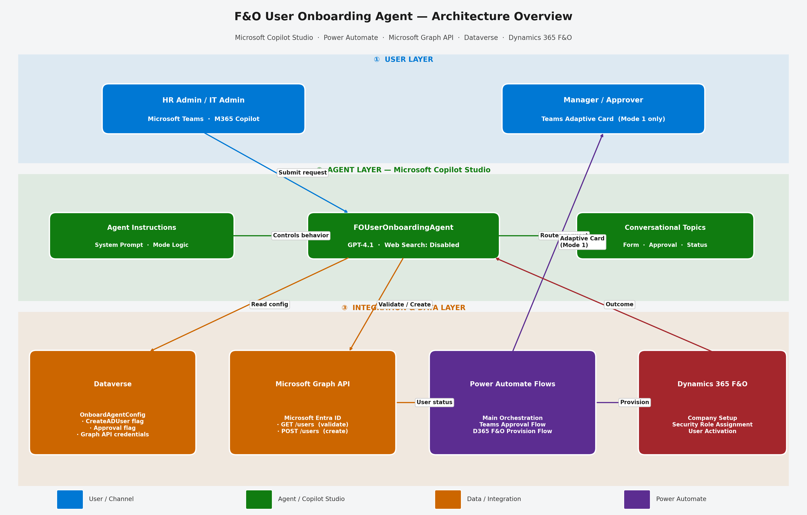

### How It Works

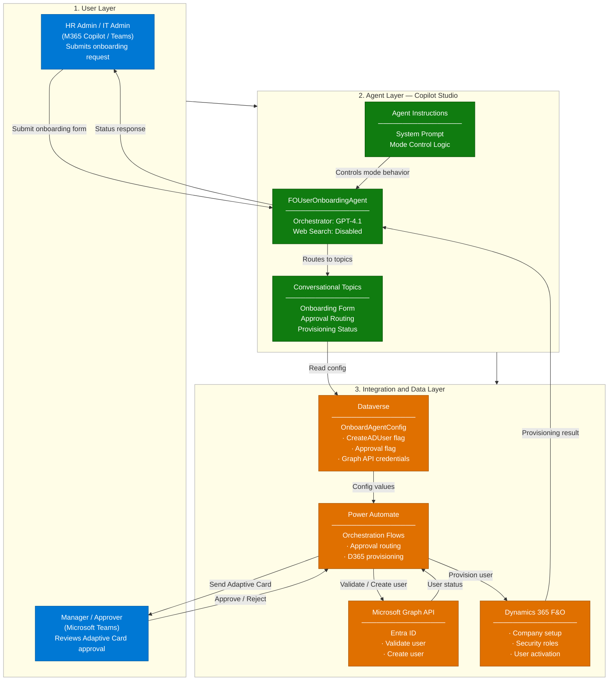

---

## 2. Key Components

| Component | Technology | Role |
|---|---|---|
| **Agent Runtime** | Microsoft Copilot Studio | Core agent orchestration, conversation management, and topic routing |
| **LLM / Orchestrator** | GPT-4.1 (Copilot Studio) | Natural language understanding and form-guided conversation |
| **Agent Configuration** | Dataverse — `OnboardAgentConfig` table | Stores all operational flags: CreateADUser, approval settings, Graph API credentials, Teams channel configuration |
| **Entra ID Integration** | Microsoft Graph API (HTTP connector) | Validates user existence and creates new Entra ID accounts when `CreateADUser = 1` |
| **Approval Workflow** | Power Automate + Teams Adaptive Card | Routes provisioning request to manager/admin via Teams channel (Mode 1 only); waits for approve/reject response |
| **D365 F&O Provisioning Flow** | Power Automate Cloud Flow | Provisions user in the target D365 F&O company and assigns the configured security roles |
| **Orchestration Flow** | Power Automate Cloud Flow | Main flow coordinating Entra ID check → optional creation → optional approval → D365 F&O provisioning |
| **Agent Environment** | Power Platform Environment (Dataverse-enabled) | Hosts agent artifacts, Dataverse tables, and Power Automate flows |
| **Deployment Channels** | Microsoft Teams + M365 Copilot | Primary channels for HR/IT admins to submit onboarding requests |

---

## 3. Data Flow

> *Power Automate flow — Mode 1 (Create + Teams Approval + Provision)*
>
> 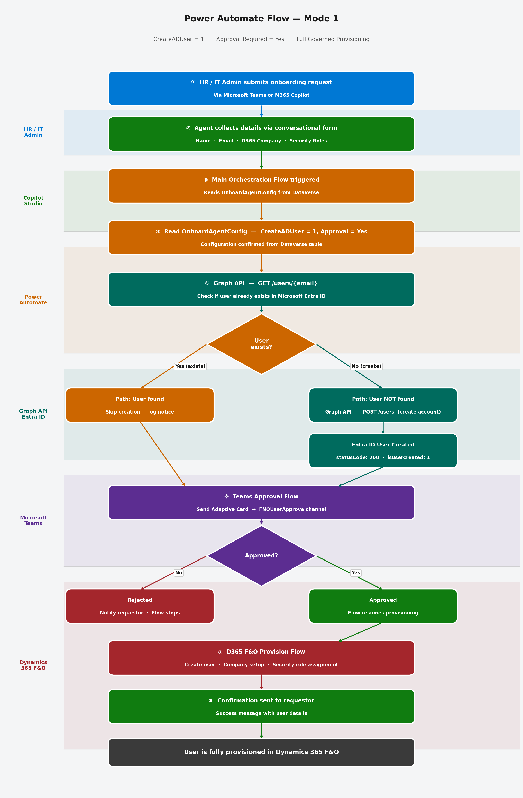

> *Power Automate flow — Mode 2 (Validation Only)*
>
> 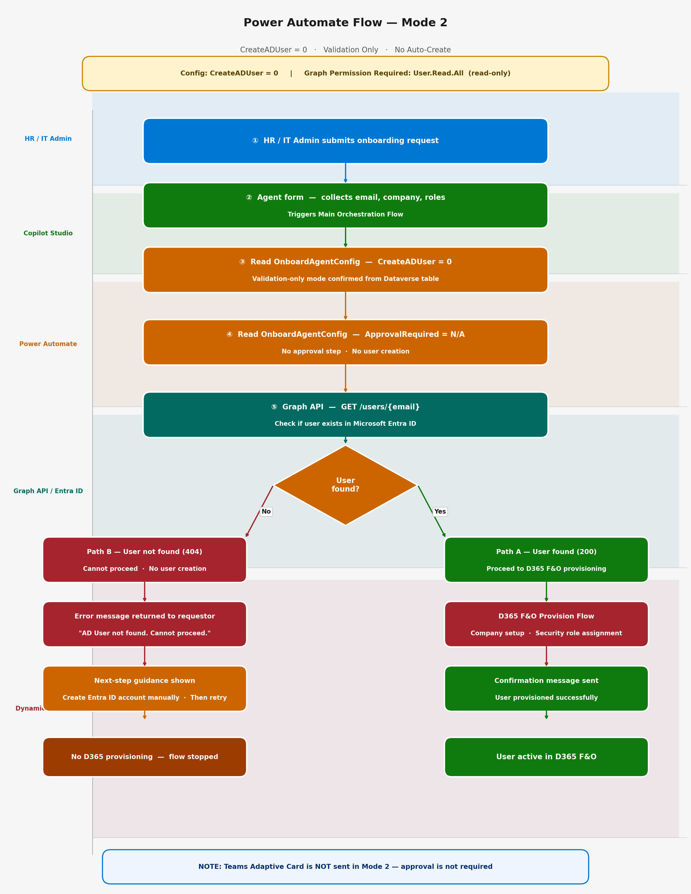

> *Power Automate flow — Mode 3 (Direct Auto-Provisioning)*
>
> 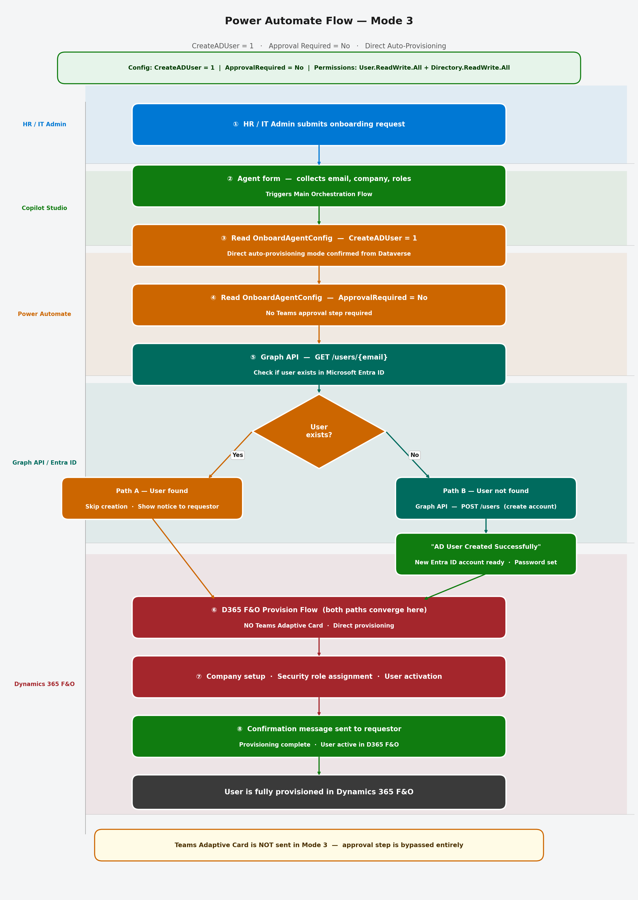

### Mode 1 — Auto-Create + Approval Required

This is the most governed mode. Entra ID account is created automatically, and a Teams
Adaptive Card is sent for manager approval before D365 F&O access is granted.

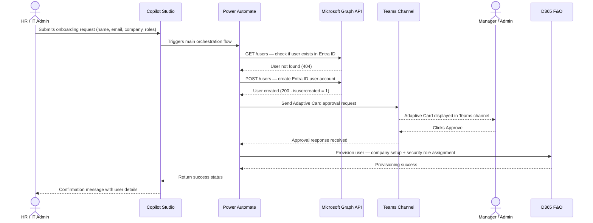

---

### Mode 2 — Validate Only (No Auto-Create)

In this mode the agent acts as a **gating check**. It validates that the user already
exists in Entra ID before allowing D365 F&O provisioning to proceed. If the user is not
found, the flow stops with an actionable error message.

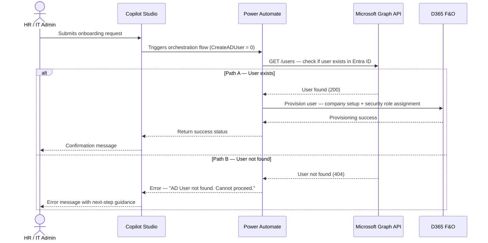

---

### Mode 3 — Auto-Create + Direct Provisioning (No Approval)

This is the streamlined mode for environments where pre-authorization exists. Entra ID
account is created automatically (if not present) and the user is provisioned in D365 F&O
directly, without a Teams approval step.

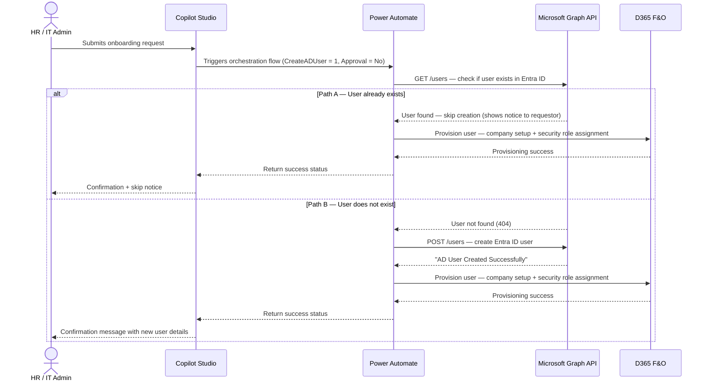

---

## 4. Configuration Architecture

> *OnboardAgentConfig table and operational mode selection matrix*
>
> 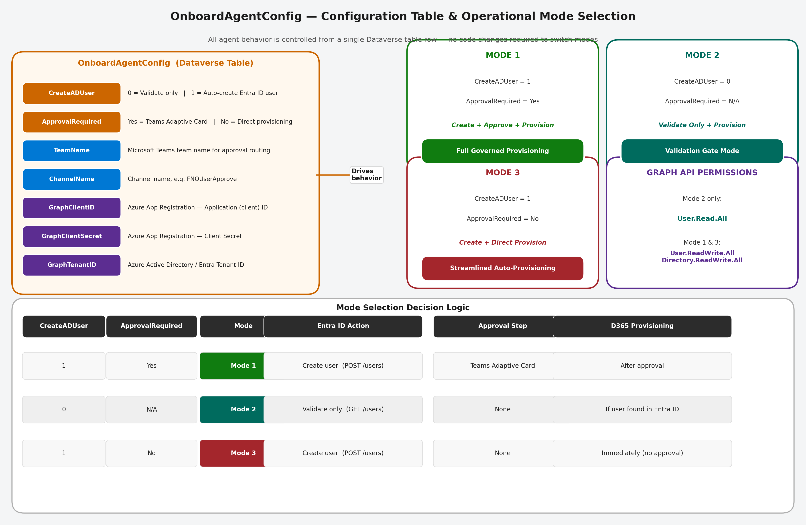

All agent behavior is controlled by the **`OnboardAgentConfig`** table in Dataverse.
There is no need to modify agent code or flows when switching operational modes.

```mermaid
flowchart LR
    subgraph CONFIG["OnboardAgentConfig (Dataverse)"]
        direction TB
        F1["CreateADUser<br/>(0 = Validate only · 1 = Auto-create)"]
        F2["ApprovalRequired<br/>(Yes · No)"]
        F3["TeamName<br/>Target Teams team for approvals"]
        F4["ChannelName<br/>Target channel (e.g. FNOUserApprove)"]
        F5["GraphClientID<br/>App Registration Client ID"]
        F6["GraphClientSecret<br/>App Registration Client Secret"]
        F7["GraphTenantID<br/>Azure AD Tenant ID"]
    end

    subgraph MODES["Operational Mode Selection"]
        direction TB
        M1["Mode 1<br/>CreateADUser=1 · Approval=Yes"]
        M2["Mode 2<br/>CreateADUser=0 · Approval=N/A"]
        M3["Mode 3<br/>CreateADUser=1 · Approval=No"]
    end

    CONFIG --> MODES

    style F1 fill:#E07000,color:#fff,stroke:#A05000
    style F2 fill:#E07000,color:#fff,stroke:#A05000
    style F3 fill:#0078D4,color:#fff,stroke:#005A9E
    style F4 fill:#0078D4,color:#fff,stroke:#005A9E
    style F5 fill:#5C2D91,color:#fff,stroke:#3B1A6B
    style F6 fill:#5C2D91,color:#fff,stroke:#3B1A6B
    style F7 fill:#5C2D91,color:#fff,stroke:#3B1A6B
    style M1 fill:#107C10,color:#fff,stroke:#004B00
    style M2 fill:#107C10,color:#fff,stroke:#004B00
    style M3 fill:#107C10,color:#fff,stroke:#004B00
```

### Required Graph API Permissions by Mode

| Mode | Permissions Required | Scope |
|---|---|---|
| **Mode 2** (Validate Only) | `User.Read.All` | Read-only — check user existence |
| **Mode 1** (Auto-Create + Approval) | `User.ReadWrite.All` · `Directory.ReadWrite.All` | Create user accounts and assign directory roles |
| **Mode 3** (Auto-Create, No Approval) | `User.ReadWrite.All` · `Directory.ReadWrite.All` | Create user accounts and assign directory roles |

---

## 5. Agent Conversation & Topic Flow

> *Copilot Studio conversation flow — topics, form collection, and action routing*
>
> 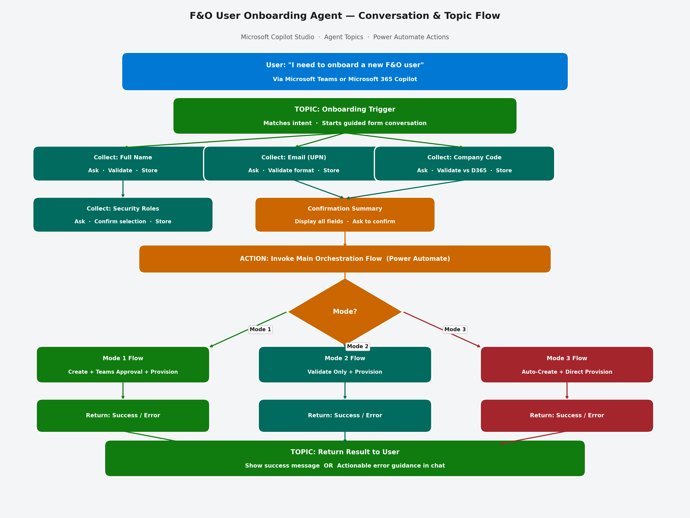

---

## 6. Power Automate Flow Architecture

The agent delegates all integration work to Power Automate flows. The three core flows
are described below:

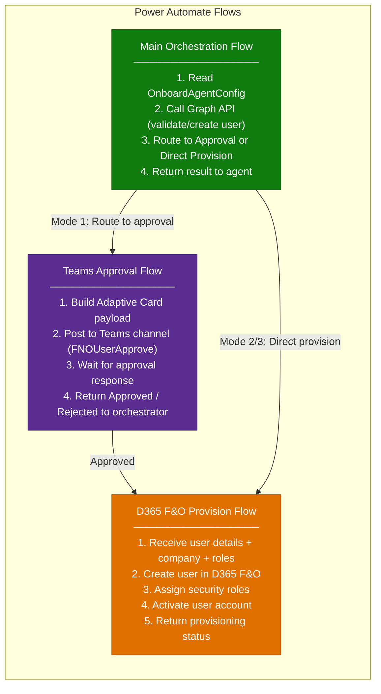

---

## 7. Security & Governance Considerations

| Area | Consideration |
|---|---|
| **Graph API Credentials** | Client ID, Client Secret, and Tenant ID stored in the `OnboardAgentConfig` Dataverse table; credentials are not hardcoded in flows |
| **Least-Privilege Permissions** | Mode 2 requires only `User.Read.All`; Modes 1 and 3 require `User.ReadWrite.All` and `Directory.ReadWrite.All` — use the minimum permissions for the environment's operational mode |
| **Approval Chain** | Mode 1 enforces explicit manager/admin approval via Teams Adaptive Card before any D365 F&O access is granted — creates an auditable approval event |
| **Data Scope** | Agent does not use web search or general LLM knowledge — all provisioning actions are driven by the structured form input and configuration table |
| **Connection Credentials** | Power Automate connections (Teams, D365 F&O, Dataverse) use the maker's service account or managed identity — review before production deployment |
| **Access Control** | D365 F&O security role assignment is scoped to the roles defined in the onboarding form — no blanket admin access is granted |
| **Dataverse Security** | `OnboardAgentConfig` table should be restricted to Power Platform admins; Graph API credentials in the table must be treated as sensitive secrets |

---

## Related Resources

| Resource | Link |
|---|---|
| Scenario Overview | [1.Overview.md](./1.Overview.md) |
| Step-by-Step Runbook | [3.Runbook.md](./3.Runbook.md) |
| Sample Prompts | [4.Sample-prompts.md](./4.Sample-prompts.md) |
| UAT Test Guide | [5.UAT-Test-Guide.md](./5.UAT-Test-Guide.md) |

---
