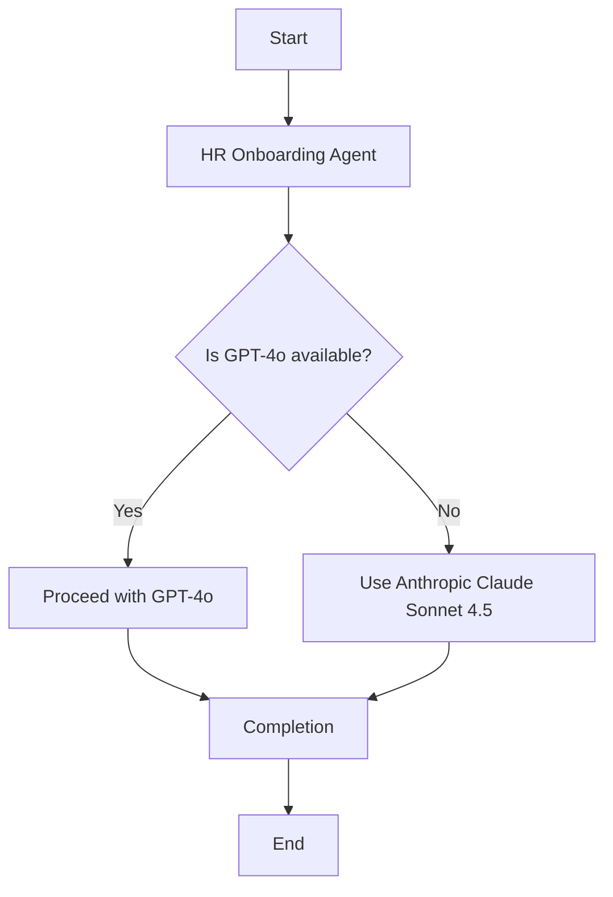

# Overview

This document provides an overview of the HR Onboarding Agent implementation and its components.

## Flowchart Diagram

## Context

In this implementation, the use of the Anthropic Claude Sonnet 4.5 model aligns with more recent documentation in the 3.Runbook.md file, which refers to Anthropic models such as Cloud Sonnet 4.5, Cloud Sonnet 4.6, and Cloud Opus 4.6.