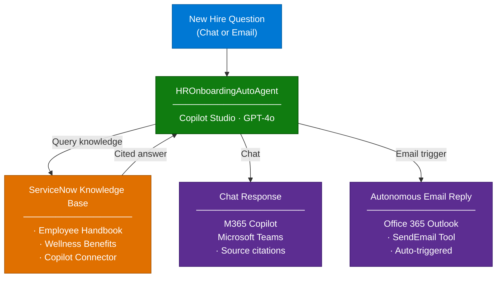

# HR Onboarding Autonomous Agent — Overview

## Scenario Overview

**Scenario Type**: Employee Self-Service (HR)  
**Agent Type**: Autonomous Agent (Email-triggered + Knowledge-grounded)  
**Primary Tools**: Microsoft Copilot Studio, ServiceNow Copilot Connector, Power Platform  
**Complexity**: Intermediate  
**Status**: ✅ Available

This runbook describes how to build and deploy an HR Onboarding Autonomous Agent that helps
new hires find HR-related information such as onboarding processes, policies, and employee
benefits. The agent uses authoritative HR knowledge grounded in a ServiceNow Knowledge Base
and can autonomously respond to email-based inquiries — without human intervention.

---

## Problem Statement

New hires often face challenges in understanding company policies, accessing necessary
resources, and integrating into the team. This can lead to a prolonged onboarding process
and decreased productivity.

Without a structured, automated solution, organizations experience:

- **Information overload**: Difficulty finding the right HR policies, benefits, and procedures
- **Delayed support**: HR teams are overwhelmed with repetitive, routine onboarding questions
- **Inconsistent answers**: Responses vary depending on who the new hire asks
- **Slow productivity ramp-up**: Time spent searching for information delays actual work contributions

---

## Solution Summary

The **HR Onboarding Agent** (`HROnboardingAutoAgent`) is an autonomous AI agent built on
**Microsoft Copilot Studio** that streamlines the onboarding experience for new employees.
The agent provides instant, accurate answers to HR-related questions by leveraging a
**ServiceNow Knowledge Base** as its grounding data source — ensuring every response is
policy-aligned and traceable to a source document.

### Key Capabilities

| Capability | Description |
|---|---|
| 🔍 Knowledge Retrieval | Answers HR questions from ServiceNow Knowledge Base (employee handbook, wellness benefits, etc.) |
| 📧 Autonomous Email Response | Automatically responds to HR inquiry emails using an email trigger |
| 🤝 M365 Copilot Integration | Deployable as an agent in Microsoft 365 Copilot and Microsoft Teams |
| 🛡️ Scoped Responses | Strictly answers from configured knowledge; avoids LLM hallucination |
| 💬 Suggested Starter Prompts | Pre-configured prompts guide new hires to the most common topics |

---

### How It Works

---

## Business Outcomes

| Outcome | Description |
|---|---|
| 📉 Reduce HR helpdesk workload | Automates responses to the most common new-hire questions |
| 🚀 Improve onboarding experience | New hires get instant, accurate answers 24/7 |
| ✅ Ensure policy-aligned responses | All answers grounded in official HR documents — no hallucination |
| 📈 Increase self-service adoption | Empowers employees to find answers independently via M365 Copilot or Teams |
| 📧 Enable autonomous operations | Email trigger allows the agent to respond without human involvement |

---

## In Scope / Out of Scope

### ✅ In Scope

- Knowledge-grounded responses using ServiceNow Copilot Connector
- Email-triggered autonomous execution (Power Automate + Outlook trigger)
- Suggested prompt configuration for guided conversations
- Deployment to Microsoft 365 Copilot and Microsoft Teams

### ❌ Out of Scope

- HR transactional workflows (e.g., payroll processing, personal data updates)
- Case management or ticketing system integration (e.g., ServiceNow Incident creation)
- Custom ML model training or fine-tuning
- Real-time data lookup (e.g., leave balances, current org charts)

---

## Target Users

| Persona | Role in This Scenario |
|---|---|
| **New Hire** | Primary end-user — asks onboarding and HR questions |
| **HR Team** | Knowledge base owner — maintains ServiceNow articles |
| **IT Admin / M365 Admin** | Manages connector setup, publishing, and org-wide deployment |
| **CSA / Delivery Engineer** | Builds and deploys the agent using this runbook |

---

## Knowledge Sources Used

| Source | Content | Category |
|---|---|---|
| Contoso Employee Handbook | Company policies, onboarding process, code of conduct, travel expense | Policy |
| Health & Wellness Benefits Guide | Medical plans, dental, vision, gym memberships, mental health support | Benefit |

> 📌 Both documents are added as articles to the **ServiceNow IT Knowledge Base**
> and indexed via the **ServiceNow Microsoft Copilot Connector**.

---

