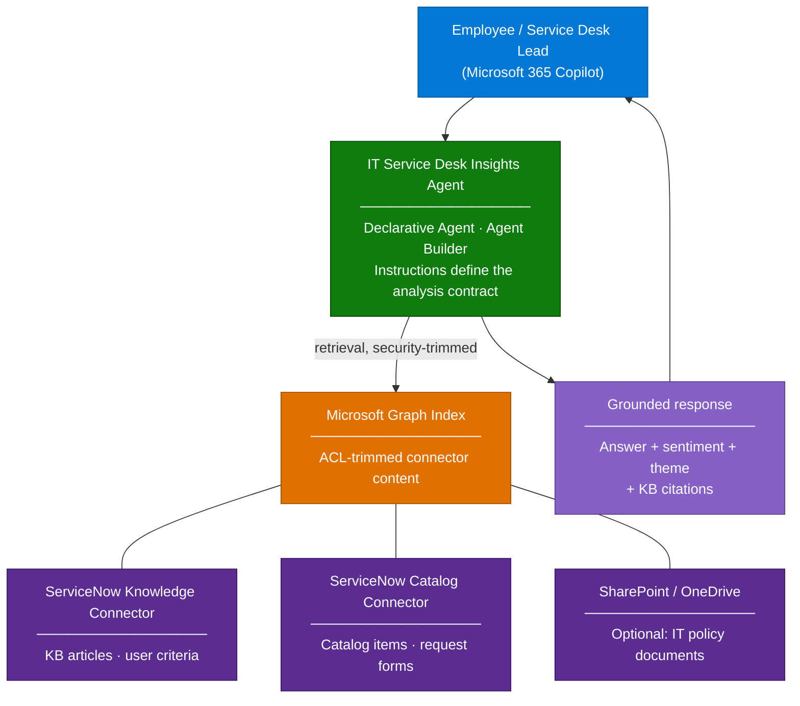

# IT Service Desk Insights Agent — Overview

## Scenario Overview

**Scenario Type**: IT Service Management (ITSM) / Employee Support
**Agent Type**: Declarative Agent (Microsoft 365 Copilot), knowledge-grounded
**Primary Tools**: Microsoft 365 Copilot, Agent Builder, ServiceNow Knowledge + Catalog Copilot connectors
**Complexity**: Intermediate
**Status**: ✅ Available

This scenario covers an agent that sits on top of a ServiceNow estate and answers two very
different classes of question from one place inside Microsoft 365 Copilot:

1. **"What is the answer?"** — knowledge article and service catalog lookups ("how do I request
   a VPN token", "what is the laptop refresh policy").
2. **"What is going on?"** — qualitative analysis over ticket and article content: recurring
   themes, sentiment in ticket descriptions, which services are generating the most frustration,
   which knowledge articles are stale.

The second part is what makes this different from a generic Q&A bot, and it is also where most
delivery time goes. The pattern has been run repeatedly with large enterprises — a global luxury
goods manufacturer, a US home-improvement retailer, a telco group — and the build itself is
short. The hard part is permissions, language handling, and getting consistent answers.

---

## Problem Statement

Service desk teams and their business stakeholders sit on years of ticket history and hundreds
of knowledge articles, and can rarely answer simple management questions without a data
engineering project:

- **Answers depend on who you ask.** The same question asked twice returns a good answer once
  and "I couldn't find that" the next time.
- **Ticket sentiment is invisible.** Nobody reads 4,000 free-text descriptions a month, so
  frustration only surfaces once it becomes an escalation.
- **Knowledge is siloed.** Employees search ServiceNow separately from SharePoint, and neither
  search understands the other's content.
- **Access control gets in the way.** ITSM knowledge bases are heavily segmented (HR-scoped
  articles, region-scoped articles, restricted runbooks). Any Copilot experience over that
  content has to honour those rules exactly, or the project stops.

---

## Solution Summary

The agent is a **declarative agent in Microsoft 365 Copilot**, grounded on ServiceNow content
that has been indexed into Microsoft Graph through the **ServiceNow Knowledge** and
**ServiceNow Catalog** Copilot connectors. The connectors do the permission work — they carry
each article's ServiceNow user criteria into the Graph index as an ACL — so the agent never
has to implement its own security model.

The "insights" behaviour is not a separate system. It comes from the agent instructions: a
defined analysis contract that tells the model how to classify sentiment, how to group themes,
what to do when evidence is thin, and what format to answer in.

### Key Capabilities

| Capability | Description |
|---|---|
| 🔍 Grounded ticket & KB lookup | Answers from ServiceNow knowledge articles and catalog items, with citations back to the article |
| 😐 Sentiment classification | Classifies ticket text into a fixed scale (frustrated / neutral / satisfied) with the quoted evidence |
| 📊 Theme clustering | Groups related tickets into named themes and reports volume and trend direction |
| 🔐 Permission-trimmed | Users only see articles their ServiceNow user criteria allow — enforced by the connector ACL, not by prompt |
| 🌐 Language mirroring | Answers in the language of the question, even when the knowledge base is in another language |
| 📎 Traceable output | Every claim carries the KB number or ticket reference it came from |

---

### How It Works

---

## Business Outcomes

| Outcome | Description |
|---|---|
| 📉 Deflect tier-1 tickets | Employees self-serve knowledge and catalog answers from the Copilot they already use |
| 🔦 Surface friction early | Sentiment and theme analysis exposes problem services before they become escalations |
| ⏱️ Kill the reporting cycle | Service desk leads ask questions in natural language instead of waiting for a BI request |
| 🧭 Keep knowledge honest | Stale or contradictory articles get flagged as soon as they produce bad answers |
| 🔐 Satisfy security review | ServiceNow ACLs are enforced by the platform, which is usually the thing that unblocks approval |

---

## In Scope / Out of Scope

### ✅ In Scope

- ServiceNow Knowledge and Catalog connector deployment with user-criteria (ACL) mapping
- Declarative agent built in Agent Builder, published to Microsoft 365 Copilot
- Instruction design for sentiment classification and theme grouping
- Multilingual query handling against a single-language knowledge base
- Evaluation set and consistency testing before go-live

### ❌ Out of Scope

- Writing back to ServiceNow (creating, updating, or closing incidents) — that needs a
  Copilot Studio agent with the ServiceNow Power Platform connector and end-user (invoker)
  authentication. See the note in [2.Architecture.md](2.Architecture.md).
- Numeric ticket analytics (counts, MTTR, SLA breach rates). Use Power BI over the ServiceNow
  data warehouse. The agent reasons over text, not over aggregates.
- Real-time ticket status. Synced connector content is indexed on a crawl schedule, not live.
- Replacing the ServiceNow Virtual Agent for customer-facing support.

---

## Target Users

| Persona | Role in This Scenario |
|---|---|
| **Employee** | Asks how-to and policy questions, finds catalog items |
| **Service Desk Lead / IT Manager** | Asks the analytical questions — themes, sentiment, hotspots |
| **ServiceNow Admin** | Owns knowledge bases, user criteria, and the integration account |
| **Microsoft 365 Admin** | Deploys and monitors the connectors, controls agent availability |
| **Delivery Engineer** | Builds the agent, writes the instructions, runs the evaluation |

---

## Knowledge Sources Used

| Source | Content | Connector |
|---|---|---|
| ServiceNow Knowledge Base(s) | How-to articles, policies, runbooks, FAQ | ServiceNow Knowledge (synced) |
| ServiceNow Service Catalog | Requestable items and their descriptions | ServiceNow Catalog (synced) |
| SharePoint IT site (optional) | Policy documents not maintained in ServiceNow | Native SharePoint knowledge |

> 📌 Both ServiceNow connectors are deployed from **Microsoft 365 admin center → Copilot →
> Connectors**. Article-level and knowledge-base-level user criteria are carried into the
> Graph index, so retrieval is security-trimmed per user.

---

## What Actually Goes Wrong

These are the failure modes seen on real deliveries of this scenario. Plan for them; they are
not edge cases.

| Symptom | Root cause | Where it is handled |
|---|---|---|
| Same question answers correctly, then fails minutes later | The model produced an answer but didn't emit an in-text citation, so the grounded-answer check withheld it | [3.Runbook.md](3.Runbook.md) — Phase 4 |
| Agent replies in the wrong language | Instructions state the rule once, in prose, competing with the knowledge base language | Phase 3, instruction block |
| Agent cites an article the user cannot open | Advanced (script-based) user criteria evaluated with the **Simple** flow | Phase 1, connector flow selection |
| "List articles from last 7 days" returns nonsense | Relative date reasoning over indexed metadata is unreliable — anchor on explicit dates | Phase 3 + [4.Sample-prompts.md](4.Sample-prompts.md) |
| Wrong or truncated links returned | `AccessUrl` default expression doesn't match the portal URL format the organization uses | Phase 1, property customization |
| Copilot Studio build gives worse answers than Agent Builder | Different retrieval path; for pure knowledge retrieval a declarative agent is usually the better fit | [2.Architecture.md](2.Architecture.md) — build choice |

---

## Related Patterns

- [Copilot Connector Knowledge Onboarding](../../02-patterns/Copilot-Connector-Knowledge-Onboarding/Copilot-Connector-Knowledge-Onboarding.md) — how the connectors are deployed and validated
- [Grounding & Response Quality Remediation](../../02-patterns/Grounding-and-Response-Quality-Remediation/Grounding-and-Response-Quality-Remediation.md) — diagnosing inconsistent answers
- [Agent Governance & Rollout Control Plane](../../02-patterns/Agent-Governance-and-Rollout-Control-Plane/Agent-Governance-and-Rollout-Control-Plane.md) — publishing and controlling the agent at scale

---

## Next

→ [2.Architecture.md](2.Architecture.md) — architecture, build-tool decision, and integration points
