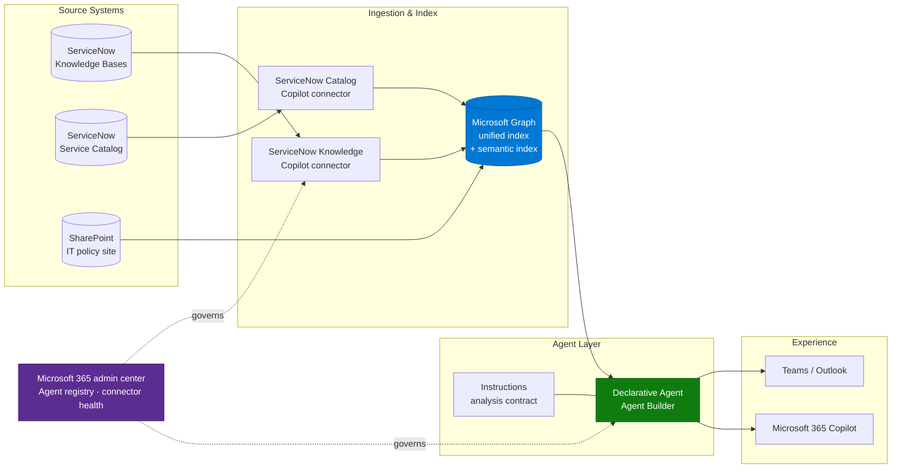

# Architecture — IT Service Desk Insights Agent

> **Platform**: Microsoft 365 Copilot · Agent Builder · Microsoft 365 Copilot connectors
> **Last Updated**: August 2026

---

## Solution Architecture

---

## Technology Stack

| Layer | Component | Purpose |
|---|---|---|
| Source | ServiceNow (Xanadu / Yokohama / Zurich) | Knowledge articles, catalog items, user criteria |
| Ingestion | ServiceNow Knowledge Copilot connector | Crawls `kb_knowledge`, carries user criteria as ACLs |
| Ingestion | ServiceNow Catalog Copilot connector | Crawls catalog items and their descriptions |
| Index | Microsoft Graph unified index + semantic index | Full-text and semantic retrieval, permission filtering |
| Agent | Declarative agent (Agent Builder) | Instructions, knowledge scoping, starter prompts |
| Identity | Microsoft Entra ID | Identity mapping between Entra and ServiceNow users |
| Governance | Microsoft 365 admin center → Copilot → Agents / Connectors | Agent registry, availability, connector health |

---

## Build-Tool Decision — Declarative Agent vs Copilot Studio

This decision has been re-litigated on almost every engagement of this type, so it is worth
being explicit.

| Requirement | Declarative agent (Agent Builder) | Copilot Studio custom agent |
|---|---|---|
| Read-only knowledge retrieval over connectors | ✅ Best fit — uses the same retrieval stack as Copilot | ⚠️ Works, but retrieval quality often lags for connector content |
| Deterministic conversation flow (topics, validation) | ❌ Not available | ✅ Topics, conditions, variables |
| Write-back to ServiceNow (create/update incident) | ❌ | ✅ via Power Platform connector |
| Publishing to non-Microsoft channels | ❌ M365 surfaces only | ✅ Teams, web, SharePoint, Slack, voice |
| Time to first working version | Hours | Days |
| Runs on Copilot Credits | Instruction/knowledge-only agents largely included with the M365 Copilot licence | Consumes credits per interaction |

**Recommendation for this scenario:** start as a declarative agent. Move to Copilot Studio only
when you need write-back or a non-Microsoft channel. Teams that started in Copilot Studio for a
pure retrieval use case have consistently ended up rebuilding in Agent Builder after answer
quality complaints.

If write-back is genuinely required, plan for it as a separate agent and read the authentication
note below before committing.

---

## Data Flow

1. Connector crawls ServiceNow on a schedule — full crawl daily, incremental every 15 minutes
   by default. Identity and user-criteria mappings only refresh on a **full** crawl.
2. Each article is written to the Graph index with content, metadata, and an ACL derived from
   its `Can Read` / `Cannot Read` user criteria.
3. A user asks the agent a question in Microsoft 365 Copilot.
4. Retrieval runs against the index **as that user** — items whose ACL excludes them are never
   returned to the model.
5. The model applies the agent instructions (analysis contract, language rule, citation rule)
   and composes an answer.
6. Citations resolve through the `AccessUrl` property back into the ServiceNow portal.

---

## Integration Points

| Integration | Direction | Auth | Notes |
|---|---|---|---|
| ServiceNow → Graph | Inbound crawl | Federated Auth (recommended), OAuth 2.0, Entra OIDC, or Basic | Federated Auth avoids storing and rotating a client secret |
| Identity mapping | Inbound | Entra UPN / Mail → ServiceNow email | Custom mapping formula required if the org doesn't use email as the ServiceNow user key |
| Agent → Graph | Query time | End-user Entra identity | Security trimming is automatic |
| Agent → SharePoint (optional) | Query time | End-user Entra identity | Only if IT policy docs live outside ServiceNow |

---

## Permission Model — Read This Before You Build

The connector's handling of ServiceNow user criteria is the single highest-risk part of this
architecture. Three specific behaviours matter:

1. **Simple vs Advanced flow.** The default **Simple** flow does not evaluate script-based user
   criteria. If a script-based criterion sits on a `Cannot Read` (deny) path, the connector
   fails safe and blocks that content **for everyone**. If your instance uses Advanced Scripts,
   you must select the **Advanced** flow and set up the Scripted REST API.

2. **Articles with no user criteria.** If neither the article nor its knowledge base has a
   `Can Read` criterion, visibility depends on the ServiceNow property
   `glide.knowman.block_access_with_no_user_criteria`. If the integration account cannot read
   `sys_properties`, the connector assumes `true` and blocks those articles.

3. **HR Service Delivery scope.** If any knowledge base lives in the `sn_hr_core` scope, the
   service account needs `sn_hr_core.content_reader` or `sn_hr_core.admin`. Without it the
   connector receives empty results rather than an error, may treat HR-restricted articles as
   unrestricted, and index compensation or disciplinary content as readable by everyone. This
   is the oversharing scenario that ends projects — verify it explicitly.

---

## Note on Write-Back Scenarios

Teams frequently ask to extend this agent to create and update ServiceNow tickets. That is a
different architecture with a known friction point: actions must run under the **end-user
(invoker)** identity so ServiceNow ACLs and audit fields stay correct, and the on-behalf-of
connection experience in Power Platform can produce repeated consent prompts and connection
loops — particularly where the identity provider is federated (Okta or similar in front of
Entra). Validate the end-to-end auth experience in a pilot before scoping write-back into a
committed delivery.

---

## Non-Functional Considerations

| Concern | Guidance |
|---|---|
| Freshness | Incremental crawl every 15 min; permission changes at KB level only apply after a full crawl |
| Scale | Index size follows article count, not ticket volume — plan the initial full crawl window |
| Latency | Declarative agent retrieval is comparable to Copilot Chat; no extra orchestration hops |
| Regional | Confirm connector and Agent Builder availability for the tenant's cloud (GCC/GCCH have different support) |
| Auditability | Prompts and responses are captured in Purview audit; connector health in M365 admin center |

---

## Next

→ [3.Runbook.md](3.Runbook.md) — step-by-step implementation
