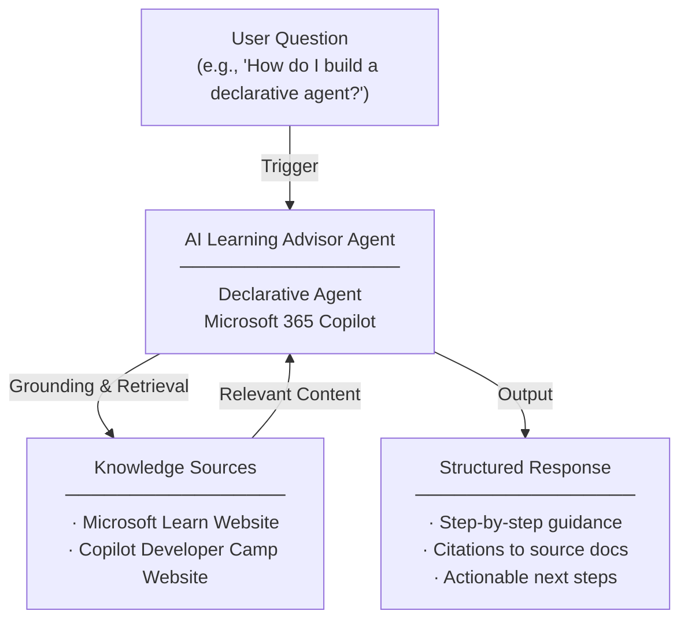

# AI Learning Advisor Agent — Overview

## Scenario Overview

**Scenario Type**: Technical Enablement & Self-Service Learning  
**Agent Type**: Declarative Agent (Knowledge-grounded)  
**Primary Tools**: Microsoft 365 Copilot, Microsoft Learn Website, Copilot Developer Camp Website  
**Complexity**: Beginner  
**Status**: 📋 Overview Available

This document describes the **AI Learning Advisor Agent** — a declarative Copilot agent that acts as a personal AI teaching assistant for the Microsoft technology stack, delivering step-by-step guidance, personalized learning plans, and structured troubleshooting grounded in official Microsoft Learn documentation.

---

## Problem Statement

Teams and individuals across organizations frequently struggle to find trusted, up-to-date technical guidance on the Microsoft technology stack. Without a centralized, intelligent learning companion, organizations experience:

- **Trusted answers are slow to find**: Developers and makers spend significant time searching for accurate, authoritative guidance across Microsoft's extensive documentation landscape
- **Fragmented documentation**: Knowledge is scattered across many product domains — Azure, Power Platform, Microsoft 365, Entra ID, Copilot Studio, and more — making it hard to find the right answer in the right context
- **Repetitive technical questions tie up SMEs**: Subject matter experts are repeatedly pulled into answering the same foundational questions, reducing their capacity for high-value work
- **Inconsistent answers create rework and compliance risk**: Without a single source of truth, teams receive conflicting guidance that leads to rework, misconfigurations, and compliance exposure

---

## Solution Summary

The **AI Learning Advisor Agent** provides fast, trusted, step-by-step guidance on the Microsoft technology stack — from Azure and Power Platform to Microsoft 365 and Entra ID — grounded in official Microsoft Learn documentation.

Instead of manually searching across multiple documentation portals, developers and makers can ask the agent to explain concepts, build personalized learning plans, recommend the right tool for a scenario, provide step-by-step build guides, and walk through structured troubleshooting.

The agent leverages scoped web search locked to two trusted public domains — **learn.microsoft.com** and **microsoft.github.io/copilot-camp** — ensuring every answer is grounded in current, authoritative first-party Microsoft documentation. It adapts its depth and vocabulary for Beginner, Maker, or Pro Code Developer audiences, always ending with actionable next steps and citation-backed references.

### Key Capabilities

| Capability | Description |
|---|---|
| 💬 Conversational Access | Users interact with the agent directly via Microsoft 365 Copilot |
| 📖 Knowledge Grounding | Responses are grounded in the Microsoft Learn website and Copilot Developer Camp website |
| 🔗 Step-by-Step Guidance | Delivers step-by-step answers with direct citations to source documentation |
| ⚙️ Multi-Product Coverage | Covers Azure, Power Platform, Microsoft 365, Entra ID, Copilot Studio, and beyond |
| 🎓 Audience Adaptation | Detects user level (Beginner / Maker / Pro Dev) and tailors tone, vocabulary, and depth accordingly |
| 📚 Personalized Learning Plans | Generates structured curricula with Microsoft Learn modules and Copilot Developer Camp exercises |

---

## How It Works

### User Journey

1. **Trigger** — User asks the agent a technical question about the Microsoft stack (e.g., *"How do I build a declarative agent in Copilot Studio?"* or *"What's the difference between Power Automate and Azure Logic Apps?"*)
2. **Evaluation** — Agent evaluates the question, detects the user's level (Beginner / Maker / Pro Dev), retrieves grounded content from Microsoft Learn and Copilot Developer Camp, and selects the most relevant, up-to-date information
3. **Output** — Agent delivers a clear, step-by-step answer with citations to official documentation, actionable next steps, and tailored depth based on the user's expertise level

---

## Knowledge Sources

| Source | Description |
|---|---|
| 🌐 Microsoft Learn | Official Microsoft documentation across all product domains (learn.microsoft.com) |
| 🏕️ Copilot Developer Camp | Hands-on exercises and developer guidance (microsoft.github.io/copilot-camp) |

---

## Business Outcomes

- ⚡ **Faster time to resolution** with instant, trusted technical guidance
- 📚 **Unified knowledge access** across the entire Microsoft product portfolio
- 🧑‍💻 **Subject matter experts freed up** to focus on high-value work
- 🔒 **Consistent, compliant answers** that reduce rework and mitigate risk

---

## Target Users

- **Developers & Pro Code Engineers** — Need fast, accurate guidance on Azure, APIs, SDKs, and advanced configurations with code-level detail
- **Makers & Citizen Developers** — Building solutions with Power Platform, Copilot Studio, and Agent Builder who need step-by-step walkthroughs and tool recommendations
- **Knowledge Workers & Learners** — Exploring Microsoft's AI and low-code stack, seeking personalized learning plans and concept explanations

---

## Resources

The following resources are available for download from the [M365 Agent Templates](https://microsoft.github.io/m365-agent-templates/) repository:

| Resource | Description | Link |
|---|---|---|
| 📦 Agent Package | Importable agent solution package (.zip) for deployment | [AI Learning Advisor.zip](https://raw.githubusercontent.com/microsoft/m365-agent-templates/main/AI%20Learning%20Advisor/AI%20Learning%20Advisor.zip) |
| 📖 Setup Guide | Step-by-step setup and configuration guide | [AI Learning Advisor - Setup Guide.pdf](https://raw.githubusercontent.com/microsoft/m365-agent-templates/main/AI%20Learning%20Advisor/AI%20Learning%20Advisor%20-%20Setup%20Guide.pdf) |
| 📊 Overview Deck | Scenario overview presentation | [AI Learning Advisor Agent - Overview Deck.pptx](https://raw.githubusercontent.com/microsoft/m365-agent-templates/main/AI%20Learning%20Advisor/AI%20Learning%20Advisor%20Agent%20-%20Overview%20Deck.pptx) |
| ✅ Evaluation Test Plan | Evaluation prompts and expected results | [AI Learning Advisor - Evaluation Test Plan.pdf](https://raw.githubusercontent.com/microsoft/m365-agent-templates/main/AI%20Learning%20Advisor/AI%20Learning%20Advisor%20-%20Evaluation%20Test%20Plan.pdf) |

> 💡 **Explore more**: Browse the full [M365 Agent Templates](https://microsoft.github.io/m365-agent-templates/) repository to discover all available agent templates and resources.
