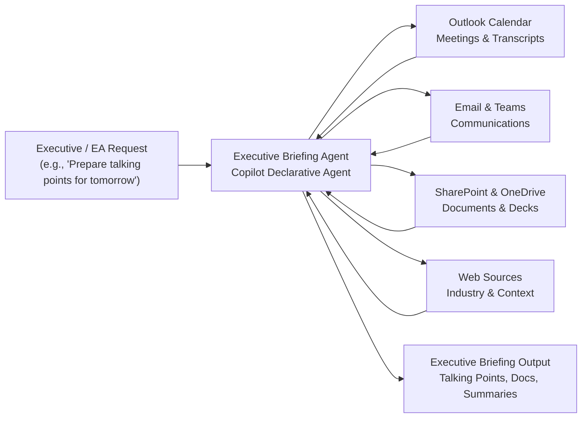

# Executive Briefing Agent — Overview

## Scenario Overview

**Scenario Type**: Executive Productivity  
**Agent Type**: Declarative Agent (M365 Data Synthesis)  
**Primary Tools**: Microsoft 365 Copilot (Outlook, SharePoint, OneDrive, Teams, Word)  
**Complexity**: Intermediate  
**Status**: 📋 Overview Available

This document describes the **Executive Briefing Agent** — a declarative Copilot agent that supports executives across the full briefing lifecycle by synthesizing Microsoft 365 content into structured, executive-ready outputs.

---

## Solution Summary

The **Executive Briefing Agent** simplifies executive preparation by transforming fragmented information into structured, actionable briefing materials across the entire engagement lifecycle.

Instead of manually assembling talking points from emails, documents, and meeting notes, users can simply ask Copilot to generate a briefing. The agent retrieves and synthesizes Microsoft 365 content and external context into structured deliverables.

The agent consolidates enterprise data from:
- Outlook Calendar (meetings, transcripts, recordings)
- Email and Teams conversations
- SharePoint and OneDrive content (documents, decks, prior briefings)
- Public web sources for industry context

This ensures executives receive **consistent, accurate, and up-to-date briefing materials** for meetings, events, and media engagements.

---

## How It Works

### Workflow

The agent follows a structured multi-step process:

**1. Trigger**  
The Executive or Executive Assistant requests a briefing, such as meeting preparation, interview prep, or event messaging.

**2. Evaluation & Context Gathering**  
The agent determines the engagement type (meeting, event, interview) and collects relevant context such as participants, agenda, and objectives.

**3. Content Retrieval**  
The agent retrieves data from Microsoft 365 sources including calendar, email, Teams messages, SharePoint documents, and web context.

**4. Analysis & Synthesis**  
The agent extracts key themes, decisions, risks, and context, transforming raw data into structured insights.

**5. Output Generation**  
The agent produces executive-ready deliverables such as:
- Pre-meeting briefing documents
- Post-meeting summaries
- Executive talking points
- Interview preparation materials

---

## Business Outcomes

- ⏱️ **Reduced preparation and follow-up time**  
  Eliminates manual effort required to gather and synthesize briefing content

- 🎯 **Higher consistency and quality of messaging**  
  Ensures alignment across meetings, interviews, and public communications

- 🔄 **Improved continuity across engagements**  
  Maintains context across meetings, discussions, and follow-ups

- 💼 **Improved executive confidence and readiness**  
  Provides structured, data-driven insights for better decision-making and communication

---

## Target Users

**Executive Assistants / Chiefs of Staff**
- Responsible for preparing briefing documents and talking points
- Spend significant time aggregating data from multiple systems
- Need structured, ready-to-share executive materials

**Executives**
- Participate in leadership meetings, public events, and interviews
- Require concise, high-quality insights with minimal preparation time
- Need consistent, up-to-date messaging and aligned communication

---

## Resources

The following resources are available for download from the [M365 Agent Templates](https://microsoft.github.io/m365-agent-templates/) repository:

| Resource | Description | Link |
|---|---|---|
| 📦 Agent Package | Importable agent solution package (.zip) | [ExecutiveBriefingAgent_v1.0.0.0.zip](https://raw.githubusercontent.com/microsoft/m365-agent-templates/main/Executive%20Briefing/ExecutiveBriefingAgent_v1.0.0.0.zip) |
| 📖 Setup Guide | Step-by-step setup and configuration guide | [Executive Briefing Agent — Setup Guide.pdf](https://raw.githubusercontent.com/microsoft/m365-agent-templates/main/Executive%20Briefing/Executive%20Briefing%20Agent%20-%20Setup%20Guide.pdf) |
| 📊 Overview Deck | Scenario overview presentation | [Executive Briefing Agent — Overview Deck.pptx](https://raw.githubusercontent.com/microsoft/m365-agent-templates/main/Executive%20Briefing/Executive%20Briefing%20Agent%20-%20Overview%20Deck.pptx) |
| ✅ Evaluation Test Plan | Evaluation prompts and expected results | [Executive Briefing Agent — Evaluation Test Plan.pdf](https://raw.githubusercontent.com/microsoft/m365-agent-templates/main/Executive%20Briefing/Executive%20Briefing%20Agent%20-%20Evaluation%20Test%20Plan.pdf) |

> 💡 **Explore more**: Browse the full [M365 Agent Templates](https://microsoft.github.io/m365-agent-templates/) repository to discover all available agent templates and resources.
