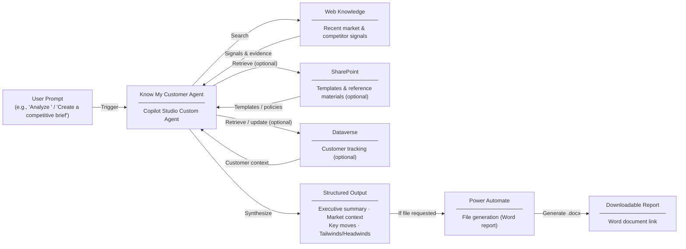

# Know My Customer Agent — Overview

## Scenario Overview

**Scenario Type**: Competitive Intelligence / Customer Research  
**Agent Type**: Copilot Studio Custom Agent (Multi-phase Workflow)  
**Primary Tools**: Microsoft Copilot Studio, Power Automate, SharePoint, Dataverse, Web Knowledge  
**Complexity**: Advanced  
**Status**: 📋 Overview Available

The **Know My Customer (KMC) Agent** is a Copilot Studio-based custom agent that helps organizations perform structured customer research, competitive intelligence, and generate executive-ready reports through a single conversational interface.

---

## Problem Statement

Organizations face several challenges when preparing for customer engagements:

- Customer data is scattered across public websites, documents, and internal systems  
- Manual research processes are time-consuming and introduce operational risk  
- Documentation is inconsistent across teams  
- Difficulty identifying gaps in knowledge and changes over time  

---

## Solution Summary

The **Know My Customer (KMC) Agent** automates and standardizes customer research by consolidating customer data, documents, and signals into a single guided workflow.

It enables users to:
- Quickly understand customer context
- Identify knowledge gaps
- Generate structured insights
- Prepare for meetings with confidence

---

## How It Works

---

## Core Capabilities

### Competitive Intelligence & Research
- Multi-stage web research to gather competitive intelligence
- Market context and competitor analysis synthesis

### KMC & Checklist Generation
- Rules-driven checklist generation by segment and jurisdiction
- Identification of required data points and compliance gaps

### Gap Analysis
- Automated comparison against available documents and data sources

### Risk Signals & Insights
- Detection and explanation of key signals

### Report Generation
- Automatic generation of structured reports and Word documents

---

## Multi-Phase Workflow

The agent operates in a deterministic three-phase workflow:

### 1. Search Phase
- Conducts web-based research using recent data

### 2. Content Phase
- Synthesizes data into structured sections (Executive Summary, Market Context, etc.)

### 3. File Phase
- Generates a Word document and returns a downloadable link

---

## User Journey

1. **Trigger**  
User asks the agent to prepare for a customer meeting or analyze a company  

2. **Evaluation**  
Agent evaluates known vs unknown information and identifies relevant signals  

3. **Assembly**  
Agent:
- Summarizes customer context
- Highlights gaps
- Identifies discussion points  

4. **Output**  
Generates structured briefing or document with actionable insights

---

## Knowledge Sources

| Source | Purpose |
|---|---|
| Web Knowledge | Competitive intelligence and market insights |
| SharePoint Templates | Standardized KMC checklist templates |
| SharePoint Reference Materials | Policies and documentation |
| Dataverse | Customer tracking and structured data |
| Power Automate | Document generation workflows |

---

## Business Outcomes

- Faster customer preparation and research workflows  
- Reduced manual effort and operational risk  
- Improved consistency and transparency  
- Structured, executive-ready reporting outputs  

---

## Target Users

**Account Executives / Sellers**
- Prepare for meetings and engagements
- Need fast access to customer insights

**Compliance & Risk Analysts**
- Perform customer validation and assessments
- Identify documentation gaps and risks

---

## Resources

The following resources are available for download from the [M365 Agent Templates](https://microsoft.github.io/m365-agent-templates/) repository:

| Resource | Description | Link |
|---|---|---|
| 📦 Agent Package | Importable agent solution package (.zip) for deployment to your Microsoft 365 environment | [KnowMyCustomer_1_0_0_1.zip](https://raw.githubusercontent.com/microsoft/m365-agent-templates/main/Know%20My%20Customer/KnowMyCustomer_1_0_0_1.zip) |
| 📖 Setup Guide | Step-by-step setup and configuration guide | [Know My Customer Agent Setup Guide.pdf](https://raw.githubusercontent.com/microsoft/m365-agent-templates/main/Know%20My%20Customer/Know%20My%20Customer%20Agent%20-%20Setup%20Guide.pdf) |
| 📊 Overview Deck | Scenario overview presentation | [Know My Customer Agent - Overview Deck.pptx](https://raw.githubusercontent.com/microsoft/m365-agent-templates/main/Know%20My%20Customer/Know%20My%20Customer%20Agent%20-%20Overview%20Deck.pptx) |
| ✅ Evaluation Test Plan | Evaluation prompts and expected results for testing | [Know My Customer Agent - Evaluation Test Plan.pdf](https://raw.githubusercontent.com/microsoft/m365-agent-templates/main/Know%20My%20Customer/Know%20My%20Customer%20Agent%20-%20Evaluation%20Test%20Plan.pdf) |
| ✅ Evaluation Test Set | CSV test file | [Know My Customer Agent - Evaluation Test Set.csv](https://raw.githubusercontent.com/microsoft/m365-agent-templates/main/Know%20My%20Customer/Know%20My%20Customer%20Agent%20-%20Evaluation%20Test%20Set.csv) |
| 📝 Word Template | Report template | [Know My Customer Agent - Evaluation Test Set.csv](https://raw.githubusercontent.com/microsoft/m365-agent-templates/main/Know%20My%20Customer/Know%20My%20Customer%20Agent%20-%20Evaluation%20Test%20Set.csv) |

> 💡 **Explore more**: Browse the full [M365 Agent Templates](https://microsoft.github.io/m365-agent-templates/) repository to discover all available agent templates and resources.
