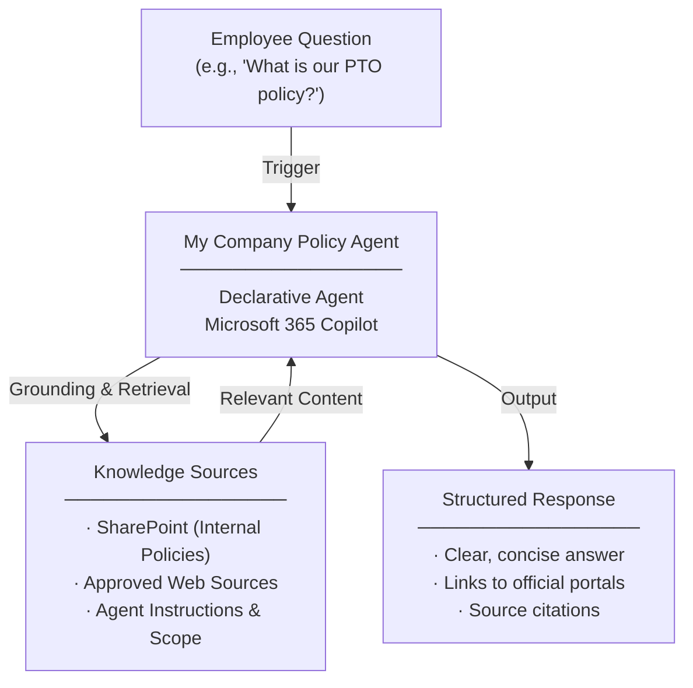

# My Company Policy Agent — Overview

## Scenario Overview

**Scenario Type**: Employee Self-Service (Policy & Benefits)  
**Agent Type**: Declarative Agent (Knowledge-grounded)  
**Primary Tools**: Microsoft 365 Copilot, SharePoint, Web Sources  
**Complexity**: Beginner  
**Status**: 📋 Overview Available

This document describes the **My Company Policy Agent** — a declarative Copilot agent that provides employees with a single, trusted conversational interface to access company policies, HR information, benefits, holidays, PTO, and general internal services — without searching across multiple portals.

---

## Problem Statement

Employees across organizations frequently struggle to locate relevant policy and benefits information. Without a centralized, intelligent access point, organizations experience:

- **Fragmented knowledge**: Company policies, benefits, and procedures are scattered across intranets, SharePoint sites, HR portals, and external websites
- **Time wasted on search**: Employees spend significant time navigating multiple portals to find basic policy or benefits information
- **Missed or misunderstood policies**: Critical policy information is overlooked or incorrectly interpreted due to outdated or inconsistent sources
- **HR team overload**: Business functions such as HR, IT, and Facilities are overwhelmed with repetitive, routine questions

---

## Solution Summary

The **My Company Policy Agent** helps employees quickly find what company policies or HR information apply to them, what they need to know, and where to go next.

Instead of manually searching across intranet sites, HR/IT portals, and internal documentation, employees can ask the agent to explain policies, review benefits information, or provide guidance on topics like PTO, holidays, and workplace programs.

The agent grounds responses in **authoritative internal documents and trusted company resources**, returning clear, consistent answers that improve employee self-service while reducing repetitive inquiries to HR teams.

### Key Capabilities

| Capability | Description |
|---|---|
| 💬 Conversational Access | Employees interact with the agent directly via Microsoft 365 Copilot |
| 📚 Knowledge Grounding | Responses are grounded in authoritative internal documents and trusted web sources |
| 📄 Policy & Benefits Retrieval | Retrieves and explains company policies, benefits, PTO, holidays, and internal services |
| 🔗 Portal Links | Provides direct links to official employee portals and resources |
| 🔒 Consistent Answers | Delivers trusted, consistent answers across the entire organization |

---

## How It Works

### User Journey

1. **Trigger** — Employee asks Copilot a question about company policies or benefits (e.g., *"What is our PTO policy?"* or *"How do I enrol in dental coverage?"*)
2. **Evaluation** — Agent evaluates the question, grounds the response in authoritative internal documents and trusted web sources, and selects the most relevant, up-to-date information
3. **Output** — Agent delivers a clear, concise answer with links to official portals or resources, reducing the need for follow-up questions or HR escalation

---

## Business Outcomes

- ✅ **Reduced ticket volume** for HR, IT, and support teams
- ⚡ **Faster employee access** to accurate, policy-aligned information
- 📈 **Improved benefits awareness** and utilisation across the organisation
- 🔒 **Consistent, trusted answers** regardless of who is asking or when

---

## Target Users

- **New Hires** — Recently joined employees who need fast answers on PTO, holidays, healthcare, and internal services during onboarding
- **Existing Employees** — Long-tenured employees with quick policy or benefits questions (e.g., *"What's covered under our dental plan?"*)
- **HR / People Ops Teams** — Benefit from reduced repetitive inquiry volume and improved employee self-service adoption

---

## Resources

The following resources are available for download:

| Resource | Description | Link |
|---|---|---|
| 📦 Agent Package | Importable agent solution package (.zip) for deployment | [MyCompanyPolicy_1_0_0_0.zip](https://raw.githubusercontent.com/microsoft/m365-agent-templates/main/My%20Company%20Policy/MyCompanyPolicy_1_0_0_0.zip) |
| 📖 Setup Guide | Step-by-step setup and configuration guide | [My Company Policy Agent — Setup Guide.pdf](https://raw.githubusercontent.com/microsoft/m365-agent-templates/main/My%20Company%20Policy/My%20Company%20Policy%20Agent%20-%20Setup%20Guide.pdf) |
| 📊 Overview Deck | Scenario overview presentation | [My Company Policy Agent — Overview Deck.pptx](https://raw.githubusercontent.com/microsoft/m365-agent-templates/main/My%20Company%20Policy/My%20Company%20Policy%20Agent%20-%20Overview%20Deck.pptx) |
| ✅ Evaluation Test Plan | Evaluation prompts and expected results | [My Company Policy Agent — Evaluation Test Plan.pdf](https://raw.githubusercontent.com/microsoft/m365-agent-templates/main/My%20Company%20Policy/My%20Company%20Policy%20Agent%20-%20Evaluation%20Test%20Plan.pdf) |

> 💡 **Explore more**: Browse the full [M365 Agent Templates repository](https://microsoft.github.io/m365-agent-templates/) for additional scenarios and resources.

---
