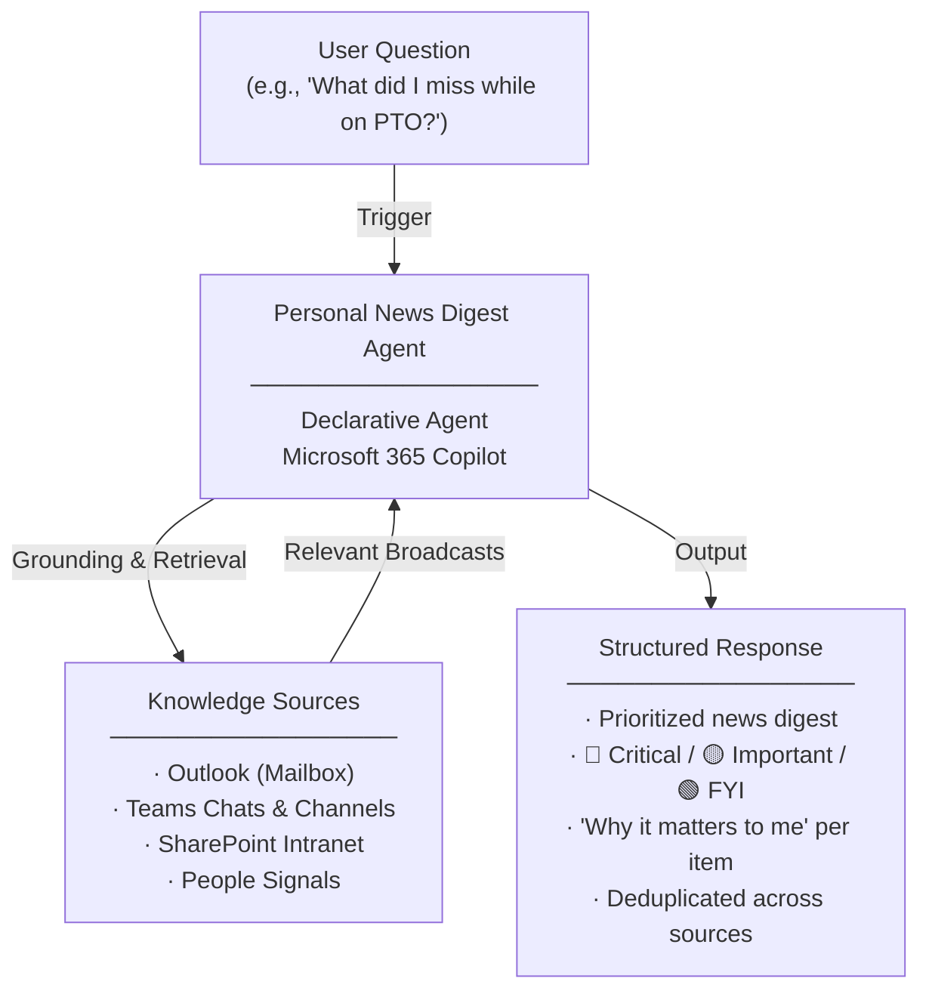

# Personal News Digest Agent — Overview

## Scenario Overview

**Scenario Type**: Internal Communications & Employee Awareness  
**Agent Type**: Declarative Agent (Knowledge-grounded)  
**Primary Tools**: Microsoft 365 Copilot, Outlook, Teams, SharePoint, People  
**Complexity**: Beginner  
**Status**: 📋 Overview Available

This document describes the **Personal News Digest Agent** — a declarative Copilot agent that filters high volumes of corporate broadcast communications across Outlook, Teams announcement channels, and SharePoint intranet into a personalized, role- and location-aware digest of what truly matters.

---

## Problem Statement

Employees across organizations are overwhelmed by the volume of broadcast communications flowing through multiple channels. Without an intelligent, personalized filter, organizations experience:

- **Overwhelmed by broadcasts**: Employees are flooded with communications across email, Teams channels, and intranet — making it impossible to keep up
- **Critical updates get lost in the noise**: Important org-wide announcements are buried under layers of routine messages and notifications
- **Mandatory policies, trainings, and deadlines are missed**: Employees fail to act on critical compliance requirements because they never saw the announcement
- **Engagement and awareness drop**: Information overload causes employees to disengage from internal communications entirely

---

## Solution Summary

The **Personal News Digest Agent** filters high volumes of corporate broadcast communications across Outlook, Teams announcement channels, and SharePoint intranet into a personalized, role- and location-aware digest of what truly matters.

Instead of scanning through hundreds of emails, Teams posts, and intranet updates, employees can ask the agent for a concise briefing. The agent intelligently surfaces only **high-impact, organization-wide broadcasts** from the last 15 days, deliberately excluding peer, manager, and project chatter so employees aren't drowning in noise.

Every item is tagged 🔴 **Critical** / 🟡 **Important** / 🟢 **FYI**, with sender attribution, date, and a one-line **"why it matters to me"** — personalized to the user's role, team, and region.

### Key Capabilities

| Capability | Description |
|---|---|
| 💬 Conversational Access | Users interact with the agent directly via Microsoft 365 Copilot |
| 📋 Activity Grounding | Responses are grounded in Outlook, Teams Chats, SharePoint, and People signals |
| 🔍 High-Impact Filtering | Filters to only high-impact, organization-wide broadcasts — excludes peer and project chatter |
| 🌍 Role- & Location-Aware | Personalizes the digest based on the user's role, department, and region |
| 🏷️ Priority Tagging | Tags every item as 🔴 Critical, 🟡 Important, or 🟢 FYI with sender and date |
| 🔄 Cross-Source Deduplication | Merges the same announcement across Outlook, Teams, and SharePoint into a single item |

---

## How It Works

### User Journey

1. **Trigger** — Employee asks the agent for a news digest (e.g., *"What did I miss this week?"* or *"Catch me up since I was on PTO"*)
2. **Evaluation** — Agent scans Outlook, Teams announcement channels, and SharePoint intranet, filtering out peer and project conversations to surface only high-impact org-wide broadcasts, deduplicating across sources and personalizing by role and location
3. **Output** — Agent delivers a concise, prioritized digest with each item tagged by severity (🔴 Critical / 🟡 Important / 🟢 FYI), sender attribution, date, and a personalized "why it matters to me" line

---

## Knowledge Sources

| Source | Description |
|---|---|
| 📧 Outlook | Org-wide emails, leadership communications, and broadcast messages |
| 💬 Teams | Announcement channels and org-wide posts |
| 📁 SharePoint | Intranet news pages and company-wide updates |
| 👥 People | Role, department, and location signals for personalization |

---

## Business Outcomes

- 🚀 **Accelerates strategic alignment** through faster access to critical org-wide updates
- ⚡ **Saves time** by replacing manual scanning with a curated, personalized digest
- 📈 **Boosts engagement** with personalized, relevant updates that cut through noise
- 🎯 **Sharpens responsiveness** with timely awareness of announcements, policies, and deadlines

---

## Target Users

- **All Employees** — Anyone who needs a fast, personalized summary of what matters most across the organization
- **Returning Employees** — Staff returning from PTO, sick leave, or travel who need to quickly catch up on what they missed
- **People Managers (Cascaders)** — Leaders who need to stay informed on org-wide announcements and cascade relevant updates to their teams

---

## Resources

The following resources are available for download from the [M365 Agent Templates](https://microsoft.github.io/m365-agent-templates/) repository:

| Resource | Description | Link |
|---|---|---|
| 📦 Agent Package | Importable agent solution package (.zip) for deployment | [Personal News Digest.zip](https://raw.githubusercontent.com/microsoft/m365-agent-templates/main/Personal%20News%20Digest/Personal%20News%20Digest.zip) |
| 📖 Setup Guide | Step-by-step setup and configuration guide | [Personal News Digest - Setup Guide.pdf](https://raw.githubusercontent.com/microsoft/m365-agent-templates/main/Personal%20News%20Digest/Personal%20News%20Digest%20-%20Setup%20Guide.pdf) |
| 📊 Overview Deck | Scenario overview presentation | [Personal News Digest Agent - Overview Deck.pptx](https://raw.githubusercontent.com/microsoft/m365-agent-templates/main/Personal%20News%20Digest/Personal%20News%20Digest%20Agent%20-%20Overview%20Deck.pptx) |
| ✅ Evaluation Test Plan | Evaluation prompts and expected results | [Personal News Digest - Evaluation Test Plan.pdf](https://raw.githubusercontent.com/microsoft/m365-agent-templates/main/Personal%20News%20Digest/Personal%20News%20Digest%20-%20Evaluation%20Test%20Plan.pdf) |

> 💡 **Explore more**: Browse the full [M365 Agent Templates](https://microsoft.github.io/m365-agent-templates/) repository to discover all available agent templates and resources.
