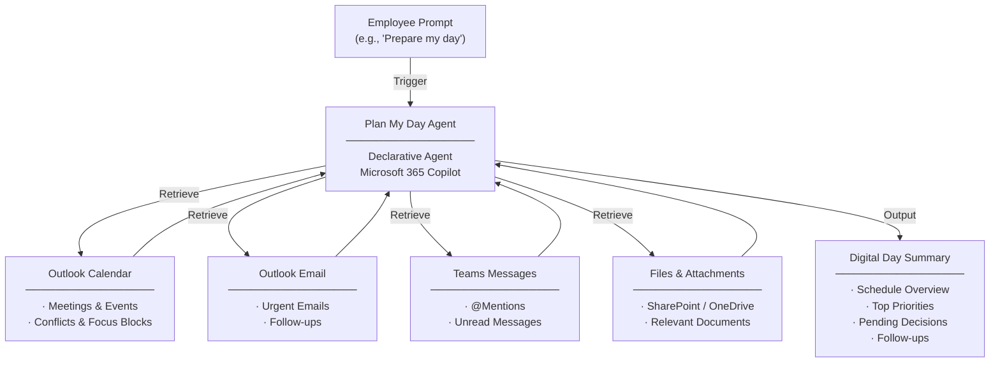

# Plan My Day Agent — Overview

## Scenario Overview

**Scenario Type**: Personal Productivity  
**Agent Type**: Declarative Agent (M365 Data Orchestration)  
**Primary Tools**: Microsoft 365 Copilot (Outlook Calendar, Email, Teams, Files)  
**Complexity**: Beginner  
**Status**: 📋 Overview Available

This document describes the **Plan My Day Agent** — a declarative Copilot agent that helps employees quickly understand what matters most each day by bringing together meetings, tasks, emails, and documents into a single, time-aware briefing.

---

## Problem Statement

Employees spend a significant portion of their mornings navigating between multiple tools to piece together their daily agenda. Without a unified daily preparation experience, organizations experience:

- **Fragmented daily planning**: Employees must manually check Outlook, Teams, tasks, and documents separately to understand their day
- **High cognitive load**: Key roles (managers, executive assistants, individual contributors) juggle too many information sources, leading to context-switching fatigue
- **Missing or overlooked signals**: Important tasks, emails, or chat messages are missed because they span multiple tools
- **No unified "digital day folder"**: There is no single view that consolidates meetings, priorities, follow-ups, and relevant documents for the day

---

## Solution Summary

The **Plan My Day Agent** orchestrates data across Microsoft 365 and generates a structured briefing ensuring every user begins the day prepared, aligned, and focused.

With one simple prompt, users start their day prepared, focused, and ready to act — without jumping between tools. The agent reviews the user's calendar, checks new emails and Teams messages, and surfaces anything that might affect today's preparation.

### Key Capabilities

| Capability | Description |
|---|---|
| 🗓️ Daily & Time-Aware Briefings | Generates a structured daily briefing based on the current time of day |
| 📅 Calendar & Meeting Intelligence | Reviews calendar events, identifies conflicts, and prepares meeting context |
| ✅ Task & Priority Management | Surfaces top priorities, pending decisions, and action items |
| 📊 Weekly Planning & Outlook | Provides a weekly look-ahead with milestones and key priorities |
| 📄 Document Awareness | Identifies documents that need review or are relevant to upcoming meetings |

---

## How It Works

### User Journey

1. **Trigger** — Employee asks *"Prepare my day."* The agent reviews the user's calendar, checks new emails and Teams messages, and looks for anything that might affect today's preparation.
2. **Evaluation** — Agent evaluates what is relevant, determines whether new information changes the shape of the day, summarizes the schedule, and compiles key meeting insights, documents, and follow-ups.
3. **Digital Day Summary** — Result delivered as an up-to-date briefing reflecting the latest meetings, priorities, and follow-ups — assembled from Outlook calendar, email, Teams messages, attachments, and existing notes.

---

## Business Outcomes

- ⏱️ **Reduced daily planning time** — from 30+ minutes of manual scanning to a single prompt
- 🎯 **Helps employees focus on what's important** — by surfacing priorities and filtering noise
- 😊 **Improved employee satisfaction** — less cognitive load and context-switching
- 🔄 **Better continuity across the day** — follow-ups and pending decisions are never missed

---

## Target Users

- **Executive Assistants** — Scan Outlook, Teams, and notes daily to piece together VP briefings; need a unified view of meetings, updates, documents, and critical follow-ups
- **Senior Managers** — Spend mornings in transit preparing between back-to-back meetings with fragmented context; need quick, structured preparation
- **Individual Contributors** — Want to understand their top priorities and pending items for the day without opening multiple tools

---

## Resources

The following resources are available for download from the [M365 Agent Templates](https://microsoft.github.io/m365-agent-templates/) repository:

| Resource | Description | Link |
|---|---|---|
| 📦 Agent Package | Importable agent solution package (.zip) for deployment to your Microsoft 365 environment | [PlanMyDay_v1.0.0.0.zip](https://raw.githubusercontent.com/microsoft/m365-agent-templates/main/Plan%20My%20Day/PlanMyDay_v1.0.0.0.zip) |
| 📖 Setup Guide | Step-by-step setup and configuration guide | [Plan My Day Agent — Setup Guide.pdf](https://raw.githubusercontent.com/microsoft/m365-agent-templates/main/Plan%20My%20Day/Plan%20My%20Day%20Agent%20-%20Setup%20Guide.pdf) |
| 📊 Overview Deck | Scenario overview presentation | [Plan My Day Agent — Overview Deck.pptx](https://raw.githubusercontent.com/microsoft/m365-agent-templates/main/Plan%20My%20Day/Plan%20My%20Day%20Agent%20-%20Overview%20Deck.pptx) |
| ✅ Evaluation Test Plan | Evaluation prompts and expected results for testing | [Plan My Day Agent — Evaluation Test Plan.pdf](https://raw.githubusercontent.com/microsoft/m365-agent-templates/main/Plan%20My%20Day/Plan%20My%20Day%20Agent%20-%20Evaluation%20Test%20Plan.pdf) |

> 💡 **Explore more**: Browse the full [M365 Agent Templates](https://microsoft.github.io/m365-agent-templates/) repository to discover all available agent templates and resources.

---
