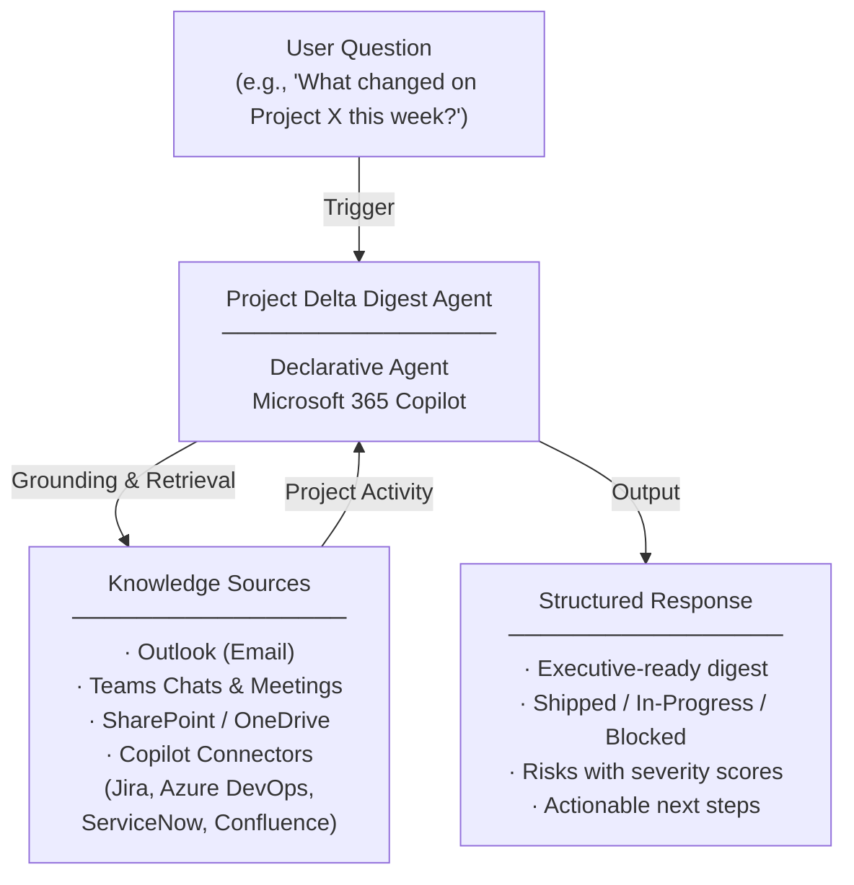

# Project Delta Digest Agent — Overview

## Scenario Overview

**Scenario Type**: Project Reporting & Executive Briefing  
**Agent Type**: Declarative Agent (Knowledge-grounded)  
**Primary Tools**: Microsoft 365 Copilot, Outlook, Teams, SharePoint, Copilot Connectors  
**Complexity**: Intermediate  
**Status**: 📋 Overview Available

This document describes the **Project Delta Digest Agent** — a declarative Copilot agent that generates structured, repeatable daily or weekly digests of project activity — shipped releases, current work, status changes, and risks — directly from your project management tools and Microsoft 365 data.

---

## Problem Statement

Project managers and engineering leads across organizations struggle to compile timely, accurate project status reports. Without an intelligent, automated reporting companion, organizations experience:

- **Inefficient reporting workflows**: Manual status report compilation erodes team productivity and delays critical business decisions
- **Limited visibility into project changes**: Stakeholders lack a reliable, up-to-date view of what changed across projects, increasing risk exposure
- **Late identification of risks and blockers**: Critical risks and blockers are identified too late, jeopardizing delivery timelines and revenue targets
- **Redundant backlog reviews**: Repetitive manual backlog reviews consume high-value engineering and leadership capacity

---

## Solution Summary

The **Project Delta Digest Agent** generates a structured, repeatable daily or weekly digest of project activity — shipped releases, current work, status changes, and risks — directly from your project management tool via a Copilot Connector.

Instead of manually trawling through Teams chats, Outlook threads, SharePoint files, and meeting notes to produce status reports, project managers can ask the agent to compile a comprehensive, executive-ready briefing in seconds.

The agent delivers structured digests covering **completed work, in-progress items, blockers, risks, team load, and delivery signals**, adapting its output for leadership (high-level milestones and risks) or participants (full tables with links and owners). It can also draft stakeholder updates, meeting agendas, and follow-up emails on demand.

### Key Capabilities

| Capability | Description |
|---|---|
| 💬 Conversational Access | Users interact with the agent directly via Microsoft 365 Copilot |
| 🔗 Copilot Connector Integration | Connects to project management tools (Jira, Azure DevOps, ServiceNow, Confluence) via Copilot Connectors |
| 📊 Structured Digests | Generates digests covering shipped items, in-progress work, status changes, and risks |
| ⚙️ Flexible Cadence | Supports daily or weekly cadence with executive-friendly formatting |
| 🎯 Audience Adaptation | Adjusts detail level for leadership, participants, or program managers |
| ⚠️ Risk Scoring | Assigns 1–5 risk scores and identifies escalation language in communications |

---

## How It Works

### User Journey

1. **Trigger** — User asks the agent for a project status update (e.g., *"What changed on Project X since Monday?"* or *"Give me a leadership-ready weekly recap"*)
2. **Evaluation** — Agent queries Microsoft 365 data (Outlook, Teams, SharePoint) and connected project management tools (via Copilot Connectors) to compile a comprehensive view of project activity, risks, and blockers
3. **Output** — Agent delivers a structured, executive-ready digest with TL;DR, shipped items, in-progress work, blockers, risks with severity scores, and offers to draft follow-up emails or meeting agendas

---

## Knowledge Sources

| Source | Description |
|---|---|
| 📧 Outlook | Email threads related to project communications |
| 💬 Teams | Chats, channel posts, and meeting discussions |
| 📁 SharePoint / OneDrive | Project documents, decision logs, and shared files |
| 🔌 Copilot Connectors | External project management tools — Jira, Azure DevOps, ServiceNow, Confluence |

---

## Business Outcomes

- ⚡ **Streamlined reporting workflows** that free up team productivity
- 👁️ **Increased visibility** into project changes for key stakeholders
- ⚠️ **Early identification** of risks and blockers before they jeopardize timelines
- 🔄 **Reduced redundant backlog reviews** that consume engineering and leadership capacity

---

## Target Users

- **Project Managers** — Need automated, repeatable status reports to replace manual compilation and keep stakeholders informed
- **Engineering Leads & Delivery Owners** — Benefit from structured digests that surface risks, blockers, and team load without manual backlog reviews
- **Executive Sponsors & Leadership** — Receive concise, executive-ready briefings focused on milestones, risks, and delivery signals

---

## Resources

The following resources are available for download from the [M365 Agent Templates](https://microsoft.github.io/m365-agent-templates/) repository:

| Resource | Description | Link |
|---|---|---|
| 📦 Agent Package | Importable agent solution package (.zip) for deployment | [Project Delta Digest.zip](https://raw.githubusercontent.com/microsoft/m365-agent-templates/main/Project%20Delta%20Digest/Project%20Delta%20Digest.zip) |
| 📖 Setup Guide | Step-by-step setup and configuration guide | [Project Delta Digest - Setup Guide.pdf](https://raw.githubusercontent.com/microsoft/m365-agent-templates/main/Project%20Delta%20Digest/Project%20Delta%20Digest%20-%20Setup%20Guide.pdf) |
| 📊 Overview Deck | Scenario overview presentation | [Project Delta Digest Agent - Overview Deck.pptx](https://raw.githubusercontent.com/microsoft/m365-agent-templates/main/Project%20Delta%20Digest/Project%20Delta%20Digest%20Agent%20-%20Overview%20Deck.pptx) |
| ✅ Evaluation Test Plan | Evaluation prompts and expected results | [Project Delta Digest - Evaluation Test Plan.pdf](https://raw.githubusercontent.com/microsoft/m365-agent-templates/main/Project%20Delta%20Digest/Project%20Delta%20Digest%20-%20Evaluation%20Test%20Plan.pdf) |

> 💡 **Explore more**: Browse the full [M365 Agent Templates](https://microsoft.github.io/m365-agent-templates/) repository to discover all available agent templates and resources.
