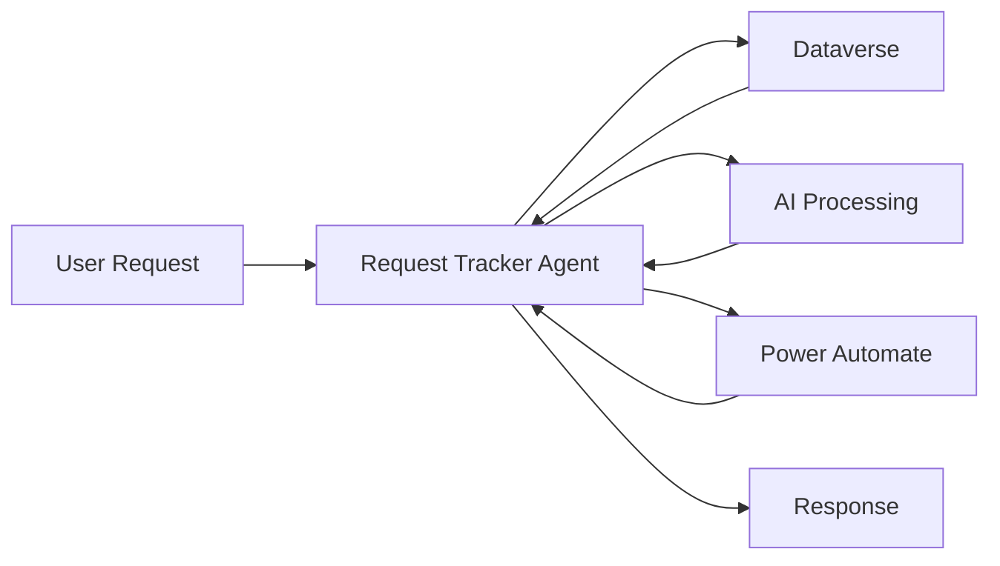

# Request Tracker Agent — Overview

## Scenario Overview

**Scenario Type**: Internal Operations (Request Management)  
**Agent Type**: Custom Agent (Conversational + Workflow Automation)  
**Primary Tools**: Microsoft Copilot Studio, Microsoft Teams, Dataverse, Power Automate  
**Complexity**: Intermediate  
**Status**: 📋 Overview Available

The **Request Tracker Agent** is a custom Copilot Studio agent that provides a single, intelligent conversational interface to submit, track, escalate, and resolve internal requests across departments.

---

## Problem Statement

Organizations face several key challenges:

- Fragmented request intake across inboxes, spreadsheets, and portals
- Duplicate tickets and repeated questions slow resolution
- Support teams lack context during escalation
- Managers have limited visibility into request volume and bottlenecks

---

## Solution Summary

The **Request Tracker Agent** provides a knowledge-driven conversational interface for full lifecycle request management.

Instead of manually navigating multiple systems, users can interact with the agent to:
- Search and query requests
- Create new requests with validation and duplicate detection
- Update existing requests
- Analyze and summarize request data

Before creating a new request, the agent proactively searches existing requests to prevent duplication. If no match is found, it guides users through structured request creation using adaptive forms.

---

## Key Capabilities

| Capability | Description |
|---|---|
| 💬 Conversational Access | Natural language interaction via Microsoft Teams and Copilot |
| 📋 System of Record | Dataverse used as centralized storage |
| 🤖 AI Categorization | Automatic categorization and priority suggestion |
| 🔍 Search & Query | Semantic search and filtering across requests |
| ⚙️ Workflow Automation | Power Automate workflows for approvals, notifications, digests |
| 🚫 Duplicate Detection | Prevents redundant request creation |

---

## How It Works

---

## User Journey

**1. Trigger**  
User interacts via Teams or Copilot: “I need a new monitor”

**2. Evaluation**  
Agent gathers details and searches for similar requests

**3. Output**  
- Existing request → surfaced
- New request → created if needed

---

## Architecture Overview

- User interface: Teams / M365 Copilot  
- Agent runtime: Copilot Studio (Custom Agent)  
- Data layer: Dataverse (_RequestTracker table_)  
- Automation: Power Automate workflows  

---

## Business Outcomes

- 📉 Fewer duplicate requests  
- 📉 Reduced manual triage effort  
- 📈 Faster resolution and improved SLA adherence  
- 📊 Improved visibility for managers  

---

## Target Users

**Employees (Requesters)**  
- Submit and track requests easily  

**Support Teams (Assignees)**  
- Manage, prioritize, and resolve requests efficiently  

---

## Resources

| Resource | Description | Link |
|---|---|---|
| 📦 Agent Package | Solution package (.zip) | https://raw.githubusercontent.com/microsoft/m365-agent-templates/main/Request%20Tracker/RequestTrackerAgent_1_0_0_0.zip |
| 📖 Setup Guide | Setup documentation | https://raw.githubusercontent.com/microsoft/m365-agent-templates/main/Request%20Tracker/Request%20Tracker%20Agent%20-%20Setup%20Guide.pdf |
| 📊 Overview Deck | Scenario deck | https://raw.githubusercontent.com/microsoft/m365-agent-templates/main/Request%20Tracker/Request%20Tracker%20Agent%20-%20Overview%20Deck.pptx |
| ✅ Evaluation Test Plan | Evaluation guide | https://raw.githubusercontent.com/microsoft/m365-agent-templates/main/Request%20Tracker/Request%20Tracker%20Agent%20-%20Evaluation%20Test%20Plan.pdf |
| ✅ Evaluation Test Set | CSV test set | https://raw.githubusercontent.com/microsoft/m365-agent-templates/main/Request%20Tracker/Request%20Tracker%20Agent%20-%20Evaluation%20Test%20Set.csv |
| 🔗 GitHub Repo | M365 Agent Templates | https://microsoft.github.io/m365-agent-templates/ |
