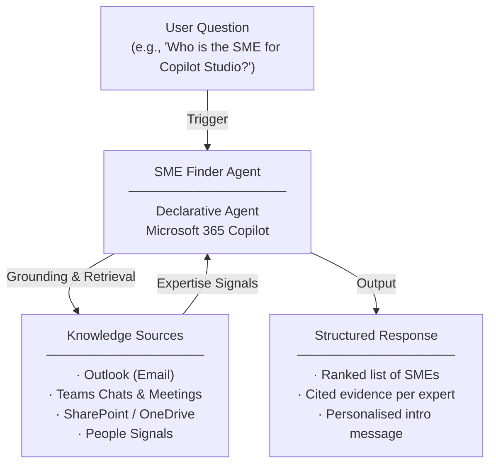

# SME Finder Agent — Overview

## Scenario Overview

**Scenario Type**: Expert Discovery & Collaboration  
**Agent Type**: Declarative Agent (Knowledge-grounded)  
**Primary Tools**: Microsoft 365 Copilot, Outlook, Teams, SharePoint, People  
**Complexity**: Beginner  
**Status**: 📋 Overview Available

This document describes the **SME Finder Agent** — a declarative Copilot agent that surfaces the most relevant subject matter experts for any topic using real Microsoft 365 work signals, ranked by demonstrated expertise, recency, and organisational relevance — with a ready-to-use introduction message.

---

## Problem Statement

Employees across organizations frequently struggle to identify the right expert for a given topic, product, process, or customer question. Without an intelligent, evidence-based way to discover subject matter experts, organizations experience:

- **Hours wasted on manual search**: Employees spend significant time browsing org charts, asking around on Teams, and relying on personal networks to find the right person
- **Reduced decision quality**: Reliance on personal networks rather than evidence-based expertise signals leads to suboptimal connections and decisions
- **Outreach delays and friction**: Repeated, poorly targeted outreach frustrates SMEs and delays project execution
- **No visibility into credible expertise**: There is no systemic way to identify who has genuine, demonstrated expertise on a given topic across the organisation

---

## Solution Summary

The **SME Finder Agent** helps employees discover the most credible subject matter experts inside their organisation for any topic, product, process, or customer question.

Instead of browsing org charts, asking around on Teams, or relying on personal networks, users simply ask the agent a question and receive a **ranked list of experts backed by cited evidence**. The agent searches across SharePoint, OneDrive, Teams chats and meetings, Outlook email, Calendar, and People signals to identify who has genuine, recent expertise on a given topic.

It then generates a **personalised, copy-paste-ready introduction message** tailored to the SME's seniority, role, and the user's context — accelerating effective collaboration from minutes to seconds.

### Key Capabilities

| Capability | Description |
|---|---|
| 💬 Conversational Access | Users interact with the agent directly via Microsoft 365 Copilot |
| 📋 Activity Grounding | Responses are grounded in Outlook, Teams Chats, SharePoint, and People signals |
| 🔍 Signal-Based SME Ranking | Ranks experts by demonstrated expertise, recency, and organisational relevance using real M365 work signals |
| ✍️ Personalised Introduction | Generates a copy-paste-ready introduction message tailored to the SME's seniority and role |
| 💎 Hidden Gem Discovery | Surfaces strong individual contributor experts who aren't in leadership roles |
| 🤝 Mentor Matching | Finds potential mentors with domain expertise and appropriate organisational distance |

---

## How It Works

### User Journey

1. **Trigger** — User asks the agent to find an expert on a specific topic (e.g., *"Who is the best person to talk to about Copilot Studio?"* or *"Find me a hidden gem expert on Power Automate"*)
2. **Evaluation** — Agent searches across Microsoft 365 work signals — authored documents, meeting participation, Teams channel activity, email threads, and People data — to identify and rank subject matter experts with cited evidence
3. **Output** — Agent delivers a ranked list of SMEs with evidence citations (documents authored, meetings attended, channel activity) and a personalised, copy-paste-ready introduction message tailored to the SME's seniority and role

---

## Knowledge Sources

| Source | Description |
|---|---|
| 📧 Outlook | Email threads and collaboration signals |
| 💬 Teams | Chats, channel posts, and meeting participation |
| 📁 SharePoint / OneDrive | Authored and contributed documents |
| 👥 People | Organisational data, role, seniority, and collaboration patterns |

---

## Business Outcomes

- ⚡ **Faster expert discovery** — find the right person in seconds, not hours
- 🎯 **Better decision quality** through evidence-based expert connections
- 🤝 **Reduced outreach friction** with ready-to-use personalised introductions
- 👁️ **Visible credible expertise** across the entire organisation

---

## Target Users

- **Knowledge Workers (Seekers)** — Employees who need to quickly find the right expert for a topic, product, or customer question
- **Subject Matter Experts (Connected Experts)** — Benefit from being discoverable based on real work signals rather than self-promotion
- **People Managers & Team Leads** — Use expert discovery to staff projects, build cross-functional teams, and identify mentors

---

## Resources

The following resources are available for download from the [M365 Agent Templates](https://microsoft.github.io/m365-agent-templates/) repository:

| Resource | Description | Link |
|---|---|---|
| 📦 Agent Package | Importable agent solution package (.zip) for deployment | [SME Finder.zip](https://raw.githubusercontent.com/microsoft/m365-agent-templates/main/SME%20Finder/SME%20Finder.zip) |
| 📖 Setup Guide | Step-by-step setup and configuration guide | [SME Finder - Setup Guide.pdf](https://raw.githubusercontent.com/microsoft/m365-agent-templates/main/SME%20Finder/SME%20Finder%20-%20Setup%20Guide.pdf) |
| 📊 Overview Deck | Scenario overview presentation | [SME Finder Agent - Overview Deck.pptx](https://raw.githubusercontent.com/microsoft/m365-agent-templates/main/SME%20Finder/SME%20Finder%20Agent%20-%20Overview%20Deck.pptx) |
| ✅ Evaluation Test Plan | Evaluation prompts and expected results | [SME Finder - Evaluation Test Plan.pdf](https://raw.githubusercontent.com/microsoft/m365-agent-templates/main/SME%20Finder/SME%20Finder%20-%20Evaluation%20Test%20Plan.pdf) |

> 💡 **Explore more**: Browse the full [M365 Agent Templates](https://microsoft.github.io/m365-agent-templates/) repository to discover all available agent templates and resources.
