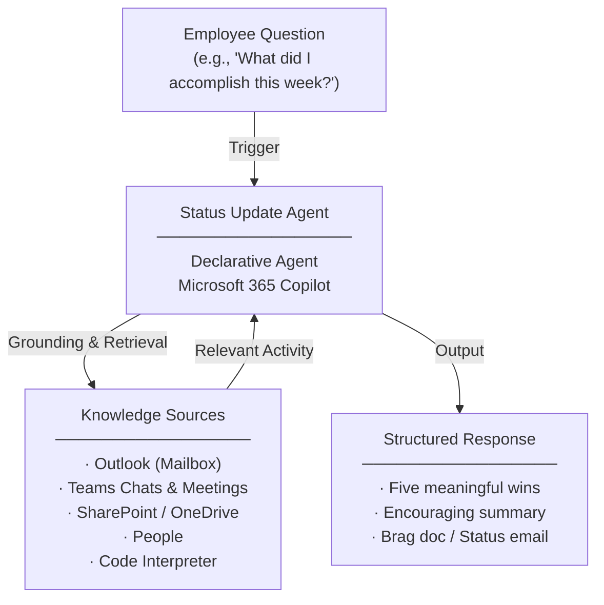

# Status Update Agent — Overview

## Scenario Overview

**Scenario Type**: Employee Productivity & Recognition  
**Agent Type**: Declarative Agent (Knowledge-grounded)  
**Primary Tools**: Microsoft 365 Copilot, Outlook, Teams, SharePoint, OneDrive, People  
**Complexity**: Beginner  
**Status**: 📋 Overview Available

This document describes the **Status Update Agent** — a declarative Copilot agent that highlights meaningful weekly accomplishments from a user's recent Microsoft 365 activity, reinforcing progress, consistency, and impact without manual effort.

---

## Problem Statement

Employees across organizations frequently overlook their own meaningful progress amid the demands of daily work. Without an intelligent, automated way to surface and celebrate accomplishments, organizations experience:

- **Overlooked progress**: Employees fail to recognize meaningful accomplishments amid their daily workload
- **Scattered accomplishments**: Work achievements are distributed across emails, Teams chats, meetings, and files with no single view
- **Under-recognition weakens motivation**: Lack of visible progress erodes employee motivation, retention, and team momentum
- **Manual self-tracking is inconsistent**: Writing status updates and tracking accomplishments manually is time-consuming and often abandoned

---

## Solution Summary

The **Status Update Agent** surfaces a user's five most meaningful accomplishments from recent Microsoft 365 activity, delivered weekly or on demand to reinforce progress, momentum, and impact.

Instead of manually compiling status reports or tracking accomplishments across tools, employees can ask the agent to summarize their recent work into polished, audience-ready outputs — daily recaps, weekly status reports, manager emails, brag docs, and team wins summaries.

The agent grounds every claim in **observable Microsoft 365 activity** — Outlook emails, Teams chats and meetings, SharePoint/OneDrive files, and Calendar events — and never fabricates, compares colleagues, or rates performance.

### Key Capabilities

| Capability | Description |
|---|---|
| 💬 Conversational Access | Users interact with the agent directly via Microsoft 365 Copilot |
| 📋 Activity Grounding | Responses are grounded in Outlook, Teams Chats, SharePoint/OneDrive, and People signals |
| 🤖 AI Summarisation | Automatically synthesizes recent work into five meaningful wins |
| ⚙️ Flexible Cadence | Supports weekly Friday summaries, daily reflections, and on-demand motivation prompts |
| 📄 Brag Doc Generation | Creates and updates structured accomplishment documents via Code Interpreter |
| 📧 Manager Email Drafts | Produces ready-to-send status emails organized into Highlights, In-Progress, Blockers, and Looking Ahead |

---

## How It Works

### User Journey

1. **Trigger** — Employee asks the agent to summarize recent accomplishments (e.g., *"What did I accomplish this week?"* or *"Create a brag doc for my review"*)
2. **Evaluation** — Agent reviews the user's Microsoft 365 activity across Outlook, Teams, SharePoint, and Calendar, identifying meaningful work signals and accomplishments
3. **Output** — Agent delivers an encouraging summary of five meaningful accomplishments with outcomes and impact, or generates a structured brag doc / manager status email ready for review

---

## Knowledge Sources

| Source | Description |
|---|---|
| 📧 Outlook | Email threads, sent items, and mailbox activity |
| 💬 Teams | Chats, channel posts, and meeting participation |
| 📁 SharePoint / OneDrive | Documents authored, edited, or collaborated on |
| 👥 People | Organizational signals and collaboration patterns |
| 🖥️ Code Interpreter | Generates structured Brag Doc (.docx) files on demand |

---

## Business Outcomes

- 💰 **Lower turnover costs** via better recognition and visibility of progress
- ⚡ **Save time** by eliminating manual self-reporting and status compilation
- 📈 **Boost productivity** through higher engagement and reinforced momentum
- 🚀 **Speed up performance reviews** with automated accomplishment tracking

---

## Target Users

- **Individual Contributors** — Employees who want to track their own progress, build brag docs, and stay motivated with weekly reflections
- **People Managers** — Leaders who benefit from automated team status summaries, recognition prompts, and streamlined performance review inputs
- **HR / People Ops Teams** — Benefit from improved employee engagement, reduced turnover, and stronger recognition culture

---

## Resources

The following resources are available for download from the [M365 Agent Templates](https://microsoft.github.io/m365-agent-templates/) repository:

| Resource | Description | Link |
|---|---|---|
| 📦 Agent Package | Importable agent solution package (.zip) for deployment | [Status Update Agent.zip](https://raw.githubusercontent.com/microsoft/m365-agent-templates/main/Status%20Update%20Agent/Status%20Update%20Agent.zip) |
| 📖 Setup Guide | Step-by-step setup and configuration guide | [Status Update Agent - Setup Guide.pdf](https://raw.githubusercontent.com/microsoft/m365-agent-templates/main/Status%20Update%20Agent/Status%20Update%20Agent%20-%20Setup%20Guide.pdf) |
| 📊 Overview Deck | Scenario overview presentation | [Status Update Agent - Overview Deck.pptx](https://raw.githubusercontent.com/microsoft/m365-agent-templates/main/Status%20Update%20Agent/Status%20Update%20Agent%20-%20Overview%20Deck.pptx) |
| ✅ Evaluation Test Plan | Evaluation prompts and expected results | [Status Update Agent - Evaluation Test Plan.pdf](https://raw.githubusercontent.com/microsoft/m365-agent-templates/main/Status%20Update%20Agent/Status%20Update%20Agent%20-%20Evaluation%20Test%20Plan.pdf) |

> 💡 **Explore more**: Browse the full [M365 Agent Templates](https://microsoft.github.io/m365-agent-templates/) repository to discover all available agent templates and resources.
